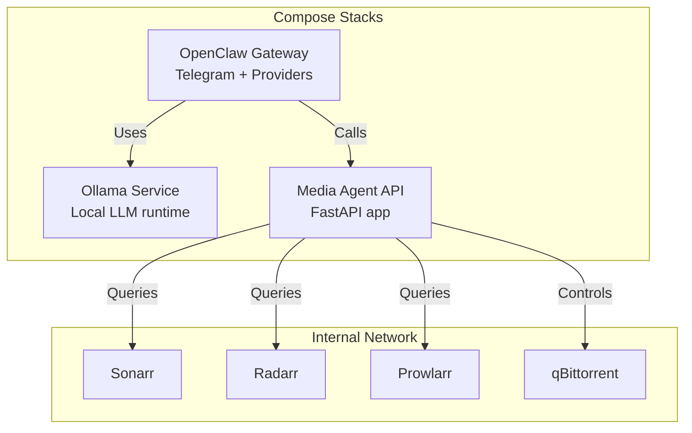
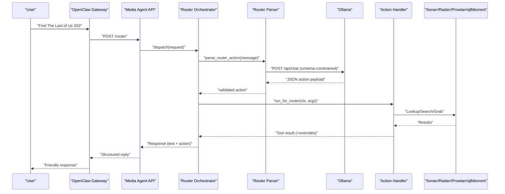
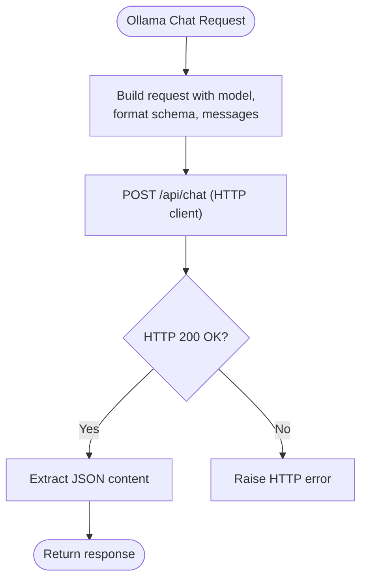
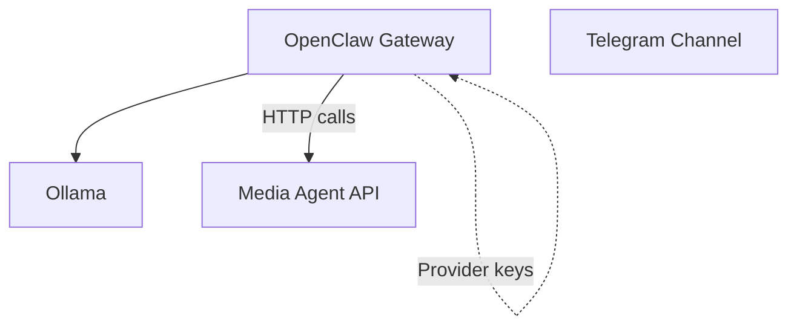
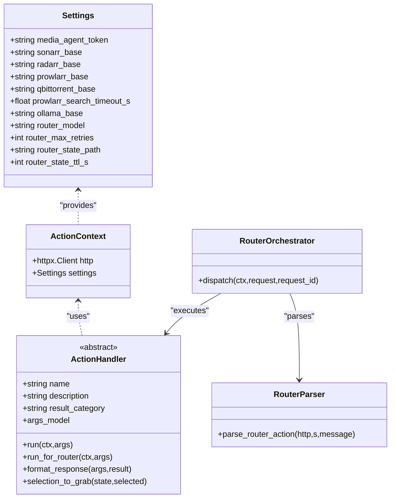
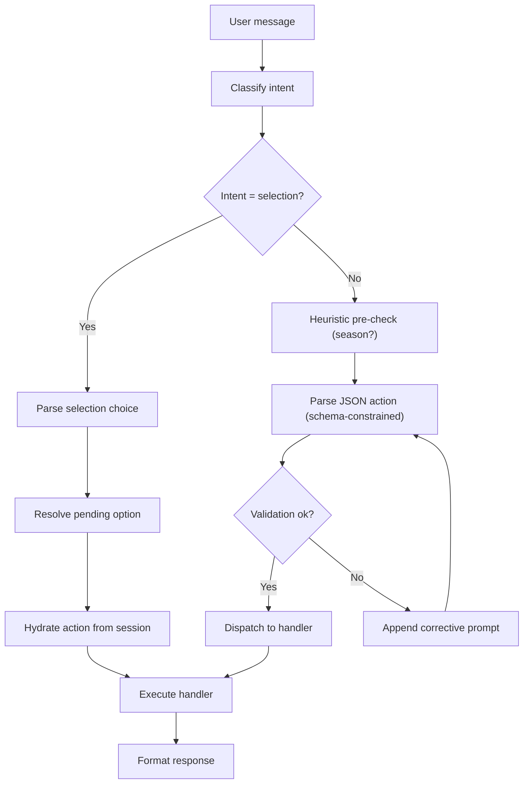
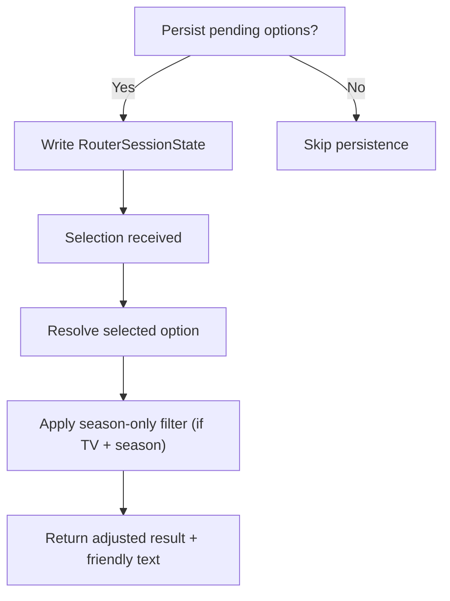
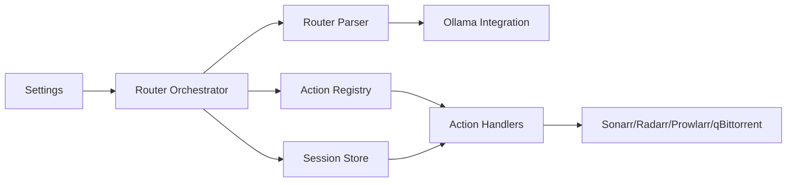

# AI and LLM Services

<cite>
**Referenced Files in This Document**
- [docker-compose.llm.yml](file://compose/docker-compose.llm.yml)
- [docker-compose.media.yml](file://compose/docker-compose.media.yml)
- [ollama.py](file://media-agent/app/integrations/ollama.py)
- [parser.py](file://media-agent/app/router/parser.py)
- [orchestrator.py](file://media-agent/app/router/orchestrator.py)
- [action_service.py](file://media-agent/app/actions/action_service.py)
- [config.py](file://media-agent/app/config.py)
- [session.py](file://media-agent/app/router/session.py)
- [post_grab.py](file://media-agent/app/router/post_grab.py)
- [router.py (FastAPI)](file://media-agent/app/api/routes/router.py)
- [main.py](file://media-agent/app/main.py)
- [registry.py](file://media-agent/app/actions/registry.py)
- [router.py (models)](file://media-agent/app/models/router.py)
</cite>

## Table of Contents
1. [Introduction](#introduction)
2. [Project Structure](#project-structure)
3. [Core Components](#core-components)
4. [Architecture Overview](#architecture-overview)
5. [Detailed Component Analysis](#detailed-component-analysis)
6. [Dependency Analysis](#dependency-analysis)
7. [Performance Considerations](#performance-considerations)
8. [Troubleshooting Guide](#troubleshooting-guide)
9. [Conclusion](#conclusion)
10. [Appendices](#appendices)

## Introduction
This document explains the AI and LLM services integrated into the homelab infrastructure, focusing on three pillars:
- Ollama: a local, GPU-accelerated LLM runtime for conversational parsing and router decisions.
- OpenClaw gateway: a personal AI assistant that orchestrates media operations using the Media Agent API and integrates with Telegram and external providers.
- Media Agent API: a FastAPI application implementing an action handler architecture to translate natural language into media operations across Sonarr, Radarr, Prowlarr, and qBittorrent.

The guide offers both beginner-friendly overviews and developer-focused technical details, including router policies, action handler extensibility, and integration patterns.

## Project Structure
The AI/LLM services span container orchestration and a Python FastAPI application:
- Compose stacks define Ollama, OpenClaw gateway, and Media Agent behind internal networks and optional Caddy exposure.
- Media Agent exposes a stable JSON API for media lookup and operations, backed by a router that parses natural language into structured action calls.

**Diagram sources**
- [docker-compose.llm.yml:10-35](file://compose/docker-compose.llm.yml#L10-L35)
- [docker-compose.llm.yml:59-132](file://compose/docker-compose.llm.yml#L59-L132)
- [docker-compose.media.yml:277-317](file://compose/docker-compose.media.yml#L277-L317)

**Section sources**
- [docker-compose.llm.yml:10-35](file://compose/docker-compose.llm.yml#L10-L35)
- [docker-compose.llm.yml:59-132](file://compose/docker-compose.llm.yml#L59-L132)
- [docker-compose.media.yml:277-317](file://compose/docker-compose.media.yml#L277-L317)

## Core Components
- Ollama service: GPU-enabled local LLM runtime bound internally, providing chat completions for router parsing with configurable model and timeouts.
- OpenClaw gateway: Node-based assistant exposing a gateway and bridge, integrating Telegram and optional provider credentials, delegating media queries to Media Agent.
- Media Agent API: FastAPI app with a strict action handler registry, router orchestration, and session state management for multi-turn media workflows.

Key implementation highlights:
- Router LLM parsing uses a schema-derived action grammar and retries with corrective prompting.
- Orchestrator coordinates intent classification, session hydration, handler execution, and post-grab refinement.
- Action handlers encapsulate deterministic workflows and conversational policies.

**Section sources**
- [ollama.py:10-31](file://media-agent/app/integrations/ollama.py#L10-L31)
- [parser.py:145-192](file://media-agent/app/router/parser.py#L145-L192)
- [orchestrator.py:121-285](file://media-agent/app/router/orchestrator.py#L121-L285)
- [registry.py:48-88](file://media-agent/app/actions/registry.py#L48-L88)

## Architecture Overview
The AI-assisted media pipeline connects user input to downstream media systems via a router and action handlers.

**Diagram sources**
- [router.py (FastAPI)](file://media-agent/app/api/routes/router.py)
- [orchestrator.py:121-285](file://media-agent/app/router/orchestrator.py#L121-L285)
- [parser.py:145-192](file://media-agent/app/router/parser.py#L145-L192)
- [ollama.py:10-31](file://media-agent/app/integrations/ollama.py#L10-L31)
- [registry.py:138-155](file://media-agent/app/actions/registry.py#L138-L155)

## Detailed Component Analysis

### Ollama: Local LLM Inference and GPU Acceleration
Ollama runs as a dedicated service with GPU visibility and memory limits, exposing a constrained port for internal use. The Media Agent integrates with Ollama via a typed HTTP client and a strict schema for router actions.

Implementation details:
- Service binding: loopback-only port and internal network attachment.
- GPU acceleration: NVIDIA_VISIBLE_DEVICES and gpus: all.
- Model selection and temperature: configured via environment variables.
- Timeout alignment: router parser respects upstream search timeouts to preserve long-poll behavior for slower local models.

**Diagram sources**
- [ollama.py:10-31](file://media-agent/app/integrations/ollama.py#L10-L31)

**Section sources**
- [docker-compose.llm.yml:10-35](file://compose/docker-compose.llm.yml#L10-L35)
- [docker-compose.llm.yml:76-82](file://compose/docker-compose.llm.yml#L76-L82)
- [ollama.py:10-31](file://media-agent/app/integrations/ollama.py#L10-L31)
- [config.py:64-78](file://media-agent/app/config.py#L64-L78)

### OpenClaw Gateway: Telegram Integration and Provider Keys
OpenClaw provides a gateway and bridge with optional Telegram channel support and environment-driven provider credentials. It depends on Ollama and integrates with Media Agent for media operations.

Key points:
- Dependencies: waits for Ollama to start.
- Binding: loopback-only ports with optional Caddy hostname exposure.
- Environment: provider tokens, gateway tokens, and Media Agent connectivity.
- Media Agent integration: stable JSON endpoints for media lookup and operations.

**Diagram sources**
- [docker-compose.llm.yml:59-132](file://compose/docker-compose.llm.yml#L59-L132)

**Section sources**
- [docker-compose.llm.yml:59-132](file://compose/docker-compose.llm.yml#L59-L132)

### Media Agent API: FastAPI Application and Action Handler Architecture
The Media Agent is a FastAPI application with:
- Strict configuration via environment variables.
- Router orchestration that classifies intent, parses actions, executes handlers, persists session state, and formats responses.
- An action handler registry enabling extensible capabilities.

**Diagram sources**
- [config.py:7-106](file://media-agent/app/config.py#L7-L106)
- [registry.py:40-88](file://media-agent/app/actions/registry.py#L40-L88)
- [orchestrator.py:56-68](file://media-agent/app/router/orchestrator.py#L56-L68)
- [parser.py:145-192](file://media-agent/app/router/parser.py#L145-L192)

**Section sources**
- [main.py:21-30](file://media-agent/app/main.py#L21-L30)
- [config.py:7-106](file://media-agent/app/config.py#L7-L106)
- [registry.py:48-88](file://media-agent/app/actions/registry.py#L48-L88)
- [orchestrator.py:121-285](file://media-agent/app/router/orchestrator.py#L121-L285)
- [parser.py:145-192](file://media-agent/app/router/parser.py#L145-L192)

### Router Parsing and Intent Classification
The router parser enforces a strict JSON schema derived from registered actions, normalizes aliases, and retries with corrective prompts. Intent classification determines whether the request is a selection-follow-up or a new download request.

**Diagram sources**
- [parser.py:123-192](file://media-agent/app/router/parser.py#L123-L192)
- [orchestrator.py:121-285](file://media-agent/app/router/orchestrator.py#L121-L285)
- [router.py (models):15-29](file://media-agent/app/models/router.py#L15-L29)

**Section sources**
- [parser.py:26-105](file://media-agent/app/router/parser.py#L26-L105)
- [parser.py:145-192](file://media-agent/app/router/parser.py#L145-L192)
- [router.py (models):15-29](file://media-agent/app/models/router.py#L15-L29)

### Session State and Post-Grab Season Filtering
Session state enables multi-turn conversations by persisting ranked options and resolving selections back to grab actions. Post-grab filtering ensures only requested seasons download when applicable.

**Diagram sources**
- [session.py:90-145](file://media-agent/app/router/session.py#L90-L145)
- [post_grab.py:35-92](file://media-agent/app/router/post_grab.py#L35-L92)

**Section sources**
- [session.py:21-72](file://media-agent/app/router/session.py#L21-L72)
- [session.py:90-145](file://media-agent/app/router/session.py#L90-L145)
- [post_grab.py:35-92](file://media-agent/app/router/post_grab.py#L35-L92)

### Practical Examples and Workflows
Beginner-friendly scenarios:
- “Find The Last of Us S02” → Router detects download intent → Parses action → Handler searches indexers → Options persisted in session → User selects “first option” → Grab action executed with season-only filtering.
- “Download The Batman” → Router detects download intent → Parses movie action → Handler triggers Radarr → Friendly confirmation.

Developer extensibility:
- Add a new action by creating a handler module and importing it into the actions package; the router schema and allowed fields auto-update from the handler’s args model.
- Override conversational policies in run_for_router to add qB reuse detection, indexer fallbacks, or custom response text via router-specific result keys.

**Section sources**
- [registry.py:94-101](file://media-agent/app/actions/registry.py#L94-L101)
- [registry.py:138-155](file://media-agent/app/actions/registry.py#L138-L155)
- [action_service.py:29-82](file://media-agent/app/actions/action_service.py#L29-L82)

## Dependency Analysis
The Media Agent composes several subsystems: configuration, router orchestration, parser, session store, and action handlers. External dependencies include Sonarr, Radarr, Prowlarr, and qBittorrent.

**Diagram sources**
- [config.py:7-106](file://media-agent/app/config.py#L7-L106)
- [orchestrator.py:36-53](file://media-agent/app/router/orchestrator.py#L36-L53)
- [parser.py:17-23](file://media-agent/app/router/parser.py#L17-L23)
- [registry.py:90-101](file://media-agent/app/actions/registry.py#L90-L101)
- [session.py:21-72](file://media-agent/app/router/session.py#L21-L72)

**Section sources**
- [config.py:7-106](file://media-agent/app/config.py#L7-L106)
- [orchestrator.py:36-53](file://media-agent/app/router/orchestrator.py#L36-L53)
- [parser.py:17-23](file://media-agent/app/router/parser.py#L17-L23)
- [registry.py:90-101](file://media-agent/app/actions/registry.py#L90-L101)
- [session.py:21-72](file://media-agent/app/router/session.py#L21-L72)

## Performance Considerations
- Router retries: The parser retries up to a configured maximum with corrective prompts, aligning timeouts with upstream search durations to avoid premature cancellation.
- GPU acceleration: Ollama leverages GPU resources; ensure adequate VRAM and memory limits for your chosen model.
- Session TTL: Router session state is short-lived to prevent stale selections; tune TTL for your workflow.
- Upstream timeouts: Configure timeouts for Prowlarr and other services to balance responsiveness and reliability.

[No sources needed since this section provides general guidance]

## Troubleshooting Guide
Common issues and remedies:
- Router parser fails: Inspect the last error and raw content preview; ensure the model supports JSON output and the schema matches registered actions.
- Session resolution errors: Verify session_key validity and that pending options are present and not expired.
- Post-grab season-only filter not applied: Confirm the action was indexer_grab, session media type is TV, and a season was specified.
- OpenClaw gateway connectivity: Validate environment variables for provider keys and Media Agent URL/token; confirm Ollama availability.

**Section sources**
- [parser.py:187-192](file://media-agent/app/router/parser.py#L187-L192)
- [session.py:47-60](file://media-agent/app/router/session.py#L47-L60)
- [post_grab.py:53-64](file://media-agent/app/router/post_grab.py#L53-L64)
- [docker-compose.llm.yml:76-101](file://compose/docker-compose.llm.yml#L76-L101)

## Conclusion
The homelab AI/LLM services combine a GPU-accelerated local LLM, a robust router and action handler architecture, and a stable API for media operations. OpenClaw ties these together with Telegram and provider integrations, while Media Agent ensures predictable, extensible workflows for TV and movie downloads.

[No sources needed since this section summarizes without analyzing specific files]

## Appendices

### API Integration Patterns
- Media Agent token-authenticated endpoints enable secure access from OpenClaw and other clients.
- Stable JSON contracts for media lookup and router actions simplify integration and reduce brittle parsing.

**Section sources**
- [docker-compose.media.yml:286-316](file://compose/docker-compose.media.yml#L286-L316)
- [router.py (FastAPI)](file://media-agent/app/api/routes/router.py)