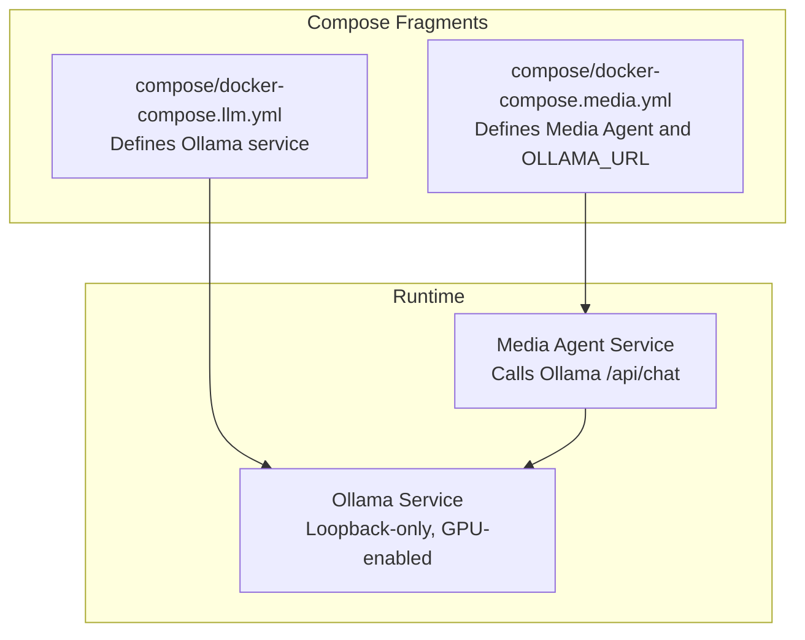
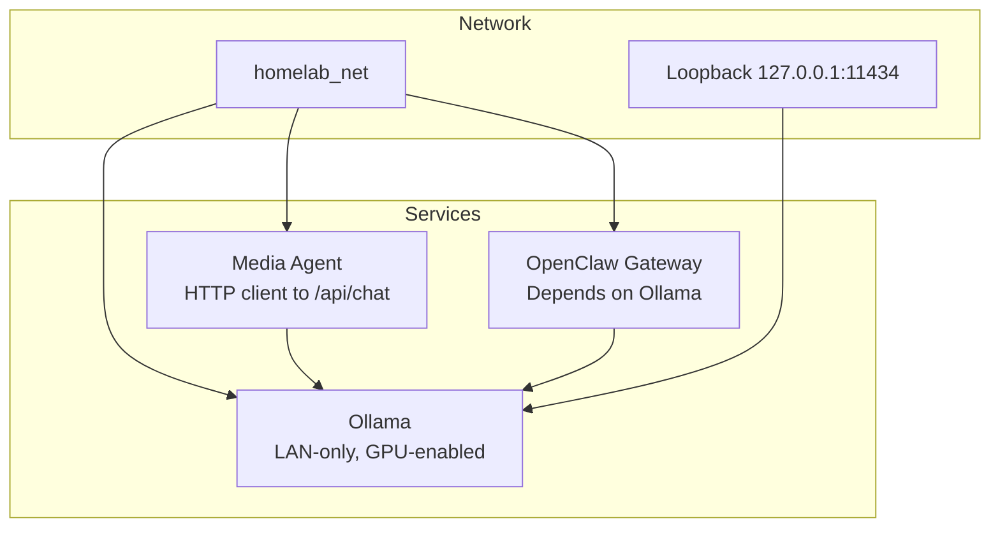
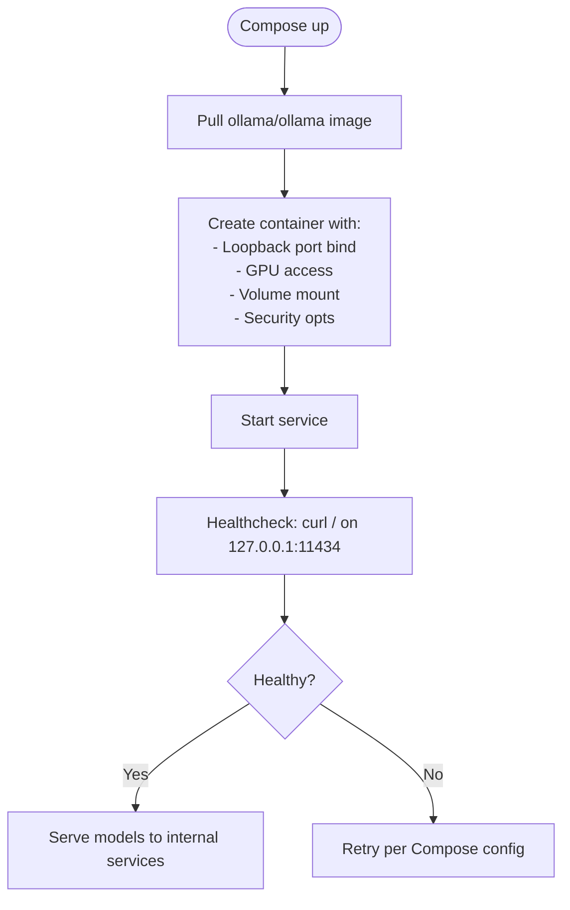
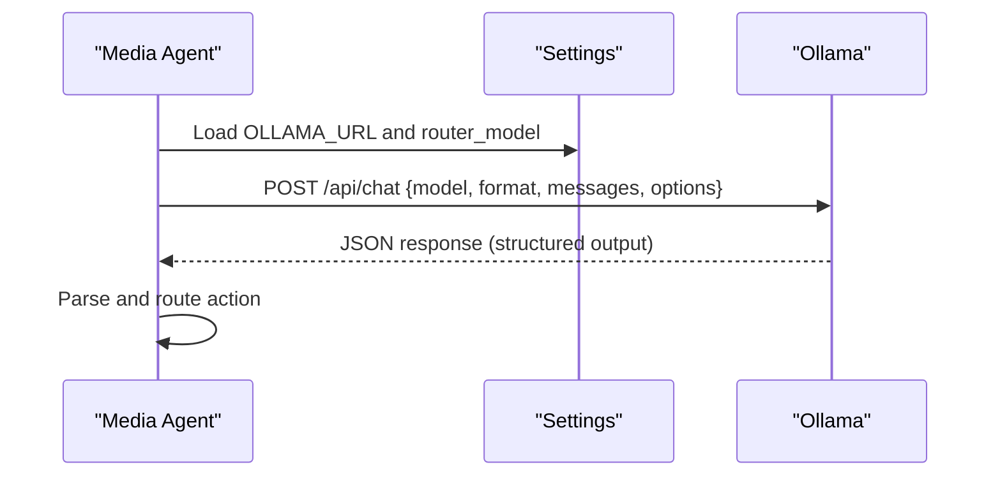
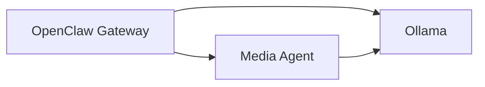
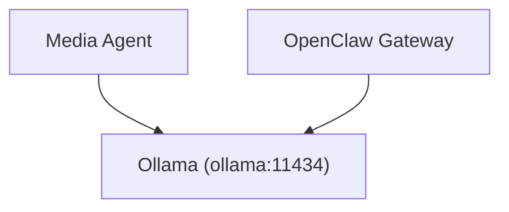

# Ollama Local LLM

<cite>
**Referenced Files in This Document**
- [docker-compose.llm.yml](file://compose/docker-compose.llm.yml)
- [docker-compose.media.yml](file://compose/docker-compose.media.yml)
- [ollama.py](file://media-agent/app/integrations/ollama.py)
- [config.py](file://media-agent/app/core/config.py)
- [README.md](file://README.md)
- [service-troubleshooting.md](file://docs/service-troubleshooting.md)
- [docker-compose.gpu.yml](file://config/gpu/docker-compose.gpu.yml)
</cite>

## Table of Contents
1. [Introduction](#introduction)
2. [Project Structure](#project-structure)
3. [Core Components](#core-components)
4. [Architecture Overview](#architecture-overview)
5. [Detailed Component Analysis](#detailed-component-analysis)
6. [Dependency Analysis](#dependency-analysis)
7. [Performance Considerations](#performance-considerations)
8. [Troubleshooting Guide](#troubleshooting-guide)
9. [Conclusion](#conclusion)

## Introduction
Ollama is a local Large Language Model runtime service designed to run models on your homelab hardware with optional GPU acceleration. In this stack, Ollama is configured to run entirely on the LAN, bound to loopback for security, and reachable by other services via internal DNS on the homelab_net network. It is not exposed to the public internet through Caddy ingress. The service is hardened with least-privilege defaults, GPU support is enabled by default, and persistent model storage is mounted under the data/llm/ollama directory.

## Project Structure
Ollama is defined as a service in the LLM compose fragment and integrated with other components:
- Ollama service definition and GPU configuration are in compose/docker-compose.llm.yml.
- Media Agent integrates with Ollama via HTTP calls to the /api/chat endpoint.
- Media Agent configuration exposes environment variables to control the Ollama base URL and router model.
- The README documents the LAN-only binding and security posture of Ollama.

**Diagram sources**
- [docker-compose.llm.yml:10-35](file://compose/docker-compose.llm.yml#L10-L35)
- [docker-compose.media.yml:277-317](file://compose/docker-compose.media.yml#L277-L317)

**Section sources**
- [docker-compose.llm.yml:10-35](file://compose/docker-compose.llm.yml#L10-L35)
- [docker-compose.media.yml:277-317](file://compose/docker-compose.media.yml#L277-L317)
- [README.md:535-538](file://README.md#L535-L538)

## Core Components
- Ollama service
  - Image: ollama/ollama with pinned digest
  - Port binding: loopback-only 127.0.0.1:11434:11434
  - GPU: gpus: all and NVIDIA_VISIBLE_DEVICES=all
  - Persistent storage: volume mounted to /root/.ollama under data/llm/ollama
  - Security: no-new-privileges, cap_drop: [ALL], user: 1000:1000
  - Resource limits: mem_limit: 32g, pids_limit: 500
  - Healthcheck: CMD-SHELL curl to / on localhost:11434
  - Environment: OLLAMA_KEEP_ALIVE=-1
- Media Agent integration
  - Calls Ollama’s /api/chat endpoint with a configured model and format schema
  - Timeout policy aligns with upstream search timeouts
- Media Agent configuration
  - OLLAMA_URL defaults to http://ollama:11434
  - Router model defaults to a quantized coder model suitable for structured outputs

**Section sources**
- [docker-compose.llm.yml:10-35](file://compose/docker-compose.llm.yml#L10-L35)
- [ollama.py:10-31](file://media-agent/app/integrations/ollama.py#L10-L31)
- [config.py:30-34](file://media-agent/app/core/config.py#L30-L34)
- [config.py:101-105](file://media-agent/app/core/config.py#L101-L105)

## Architecture Overview
Ollama is a LAN-only service that:
- Binds to loopback (127.0.0.1) on host port 11434
- Is reachable internally via the docker network hostname ollama:11434
- Does not receive Caddy ingress labels, ensuring no public exposure
- Integrates with Media Agent and OpenClaw gateway for downstream LLM tasks

**Diagram sources**
- [docker-compose.llm.yml:16-25](file://compose/docker-compose.llm.yml#L16-L25)
- [docker-compose.llm.yml:65-67](file://compose/docker-compose.llm.yml#L65-L67)
- [docker-compose.media.yml:293-293](file://compose/docker-compose.media.yml#L293-L293)

**Section sources**
- [README.md:535-538](file://README.md#L535-L538)
- [docker-compose.llm.yml:16-25](file://compose/docker-compose.llm.yml#L16-L25)
- [docker-compose.llm.yml:65-67](file://compose/docker-compose.llm.yml#L65-L67)

## Detailed Component Analysis

### Ollama Service Definition and GPU Support
- Service definition and port binding
  - The service publishes 127.0.0.1:11434:11434, enforcing loopback-only access.
  - The container listens on port 11434 internally.
- GPU acceleration
  - gpus: all enables device access.
  - NVIDIA_VISIBLE_DEVICES=all ensures the container sees all visible GPUs.
  - The README confirms GPU support is enabled by default and expects NVIDIA Container Toolkit on the host.
- Persistent storage
  - Volume mounts ../data/llm/ollama to /root/.ollama, preserving models and metadata across restarts.
- Security hardening
  - security_opt: ["no-new-privileges:true"] and cap_drop: [ALL] minimize privileges.
  - user: "1000:1000" sets non-root operation.
- Resource constraints
  - mem_limit: 32g and pids_limit: 500 cap resource usage.
- Healthcheck
  - CMD-SHELL curl to localhost:11434; note: the troubleshooting guide documents that the Ollama image lacks curl/wget, so adjust healthcheck accordingly if needed.

**Diagram sources**
- [docker-compose.llm.yml:10-35](file://compose/docker-compose.llm.yml#L10-L35)

**Section sources**
- [docker-compose.llm.yml:10-35](file://compose/docker-compose.llm.yml#L10-L35)
- [README.md:385-387](file://README.md#L385-L387)

### Media Agent Integration with Ollama
- Endpoint and payload
  - POSTs to {OLLAMA_URL}/api/chat with model, format schema, messages, and options.
  - Temperature is set to zero for deterministic outputs.
- Timeout behavior
  - Timeout is set to max(10, prowlarr_search_timeout) to preserve long-poll behavior for slow local models.
- Configuration
  - OLLAMA_URL defaults to http://ollama:11434 and can be overridden via environment.
  - Router model defaults to a quantized coder model suitable for structured JSON outputs.

**Diagram sources**
- [ollama.py:10-31](file://media-agent/app/integrations/ollama.py#L10-L31)
- [config.py:30-34](file://media-agent/app/core/config.py#L30-L34)
- [config.py:101-105](file://media-agent/app/core/config.py#L101-L105)

**Section sources**
- [ollama.py:10-31](file://media-agent/app/integrations/ollama.py#L10-L31)
- [config.py:30-34](file://media-agent/app/core/config.py#L30-L34)
- [config.py:101-105](file://media-agent/app/core/config.py#L101-L105)

### OpenClaw Gateway Relationship
- OpenClaw gateway depends on Ollama and communicates with it over the internal network.
- Environment variables include OLLAMA_API_KEY and other provider credentials.
- The gateway is loopback-only published for LAN access via Caddy subdomains.

**Diagram sources**
- [docker-compose.llm.yml:65-67](file://compose/docker-compose.llm.yml#L65-L67)
- [docker-compose.llm.yml:79-80](file://compose/docker-compose.llm.yml#L79-L80)

**Section sources**
- [docker-compose.llm.yml:59-101](file://compose/docker-compose.llm.yml#L59-L101)

## Dependency Analysis
- Internal network dependency
  - Ollama is on homelab_net and is referenced by other services using the container hostname ollama:11434.
- Media Agent dependency
  - Media Agent consumes OLLAMA_URL and router_model from environment.
- GPU toolkit dependency
  - GPU acceleration requires NVIDIA Container Toolkit on the host; the README confirms this expectation.

**Diagram sources**
- [docker-compose.llm.yml:24-25](file://compose/docker-compose.llm.yml#L24-L25)
- [docker-compose.media.yml:293-293](file://compose/docker-compose.media.yml#L293-L293)

**Section sources**
- [docker-compose.llm.yml:24-25](file://compose/docker-compose.llm.yml#L24-L25)
- [docker-compose.media.yml:293-293](file://compose/docker-compose.media.yml#L293-L293)
- [README.md:385-387](file://README.md#L385-L387)

## Performance Considerations
- Memory and PID limits
  - mem_limit: 32g and pids_limit: 500 constrain resource usage for stability.
- GPU utilization
  - gpus: all and NVIDIA_VISIBLE_DEVICES=all enable GPU acceleration when available.
- Model selection
  - Choose smaller, quantized models for constrained environments; larger models may require more memory and time to load.
- Network locality
  - Keeping Ollama internal reduces latency for services on the same docker network.

**Section sources**
- [docker-compose.llm.yml:33-34](file://compose/docker-compose.llm.yml#L33-L34)
- [docker-compose.llm.yml:21-23](file://compose/docker-compose.llm.yml#L21-L23)
- [config.py:31-31](file://media-agent/app/core/config.py#L31-L31)

## Troubleshooting Guide
- Healthcheck failures on Ollama
  - Symptom: Healthcheck fails immediately.
  - Cause: The ollama/ollama image lacks curl and wget.
  - Fix: Use a bash TCP probe or adjust healthcheck to match the working pattern documented in the troubleshooting guide.
- GPU visibility issues
  - Symptom: Services using GPU fail to initialize.
  - Cause: Missing NVIDIA Container Toolkit or driver issues.
  - Fix: Ensure NVIDIA drivers and toolkit are installed and functional on the host; verify with nvidia-smi.
- Model loading failures
  - Symptom: Models fail to load or take excessive time.
  - Cause: Insufficient memory or disk space; mismatched model architecture.
  - Fix: Confirm mem_limit is adequate; ensure volume mount under data/llm/ollama has sufficient disk space; choose compatible models for your GPU.
- Performance optimization
  - Reduce model size or quantization level for faster inference on constrained GPUs.
  - Increase mem_limit if models require more RAM.
  - Monitor healthcheck and logs to detect stalls or repeated restarts.

**Section sources**
- [service-troubleshooting.md:21-29](file://docs/service-troubleshooting.md#L21-L29)
- [README.md:130-137](file://README.md#L130-L137)
- [docker-compose.llm.yml:33-34](file://compose/docker-compose.llm.yml#L33-L34)

## Conclusion
Ollama is configured as a secure, LAN-only, GPU-accelerated local LLM runtime in this stack. Its loopback-only binding, hardened security defaults, and persistent storage make it suitable for reliable local inference. Integration with Media Agent and OpenClaw demonstrates a clean separation of concerns: Ollama handles model serving, while higher-level services manage orchestration and structured outputs. For production use, validate GPU availability, monitor resource usage, and tune model selection to balance performance and accuracy.