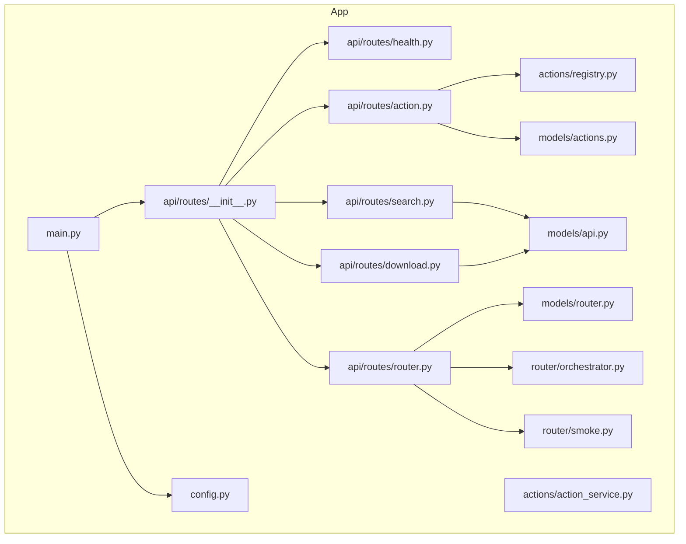
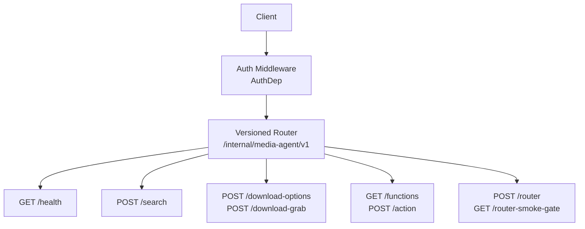
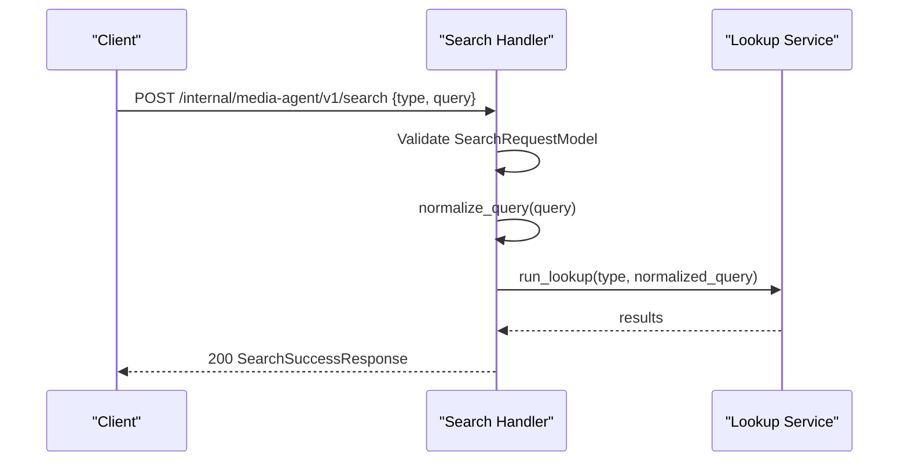
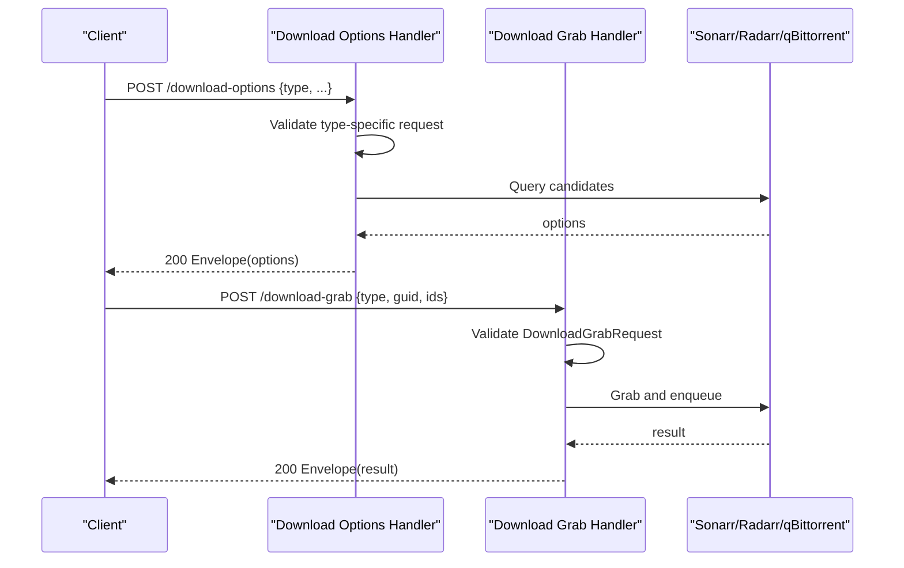
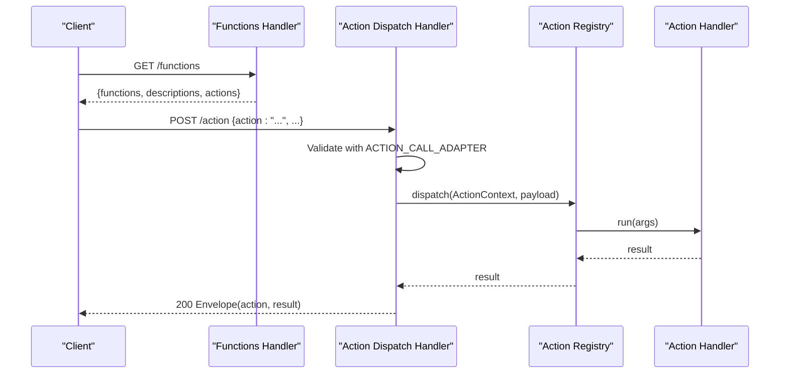
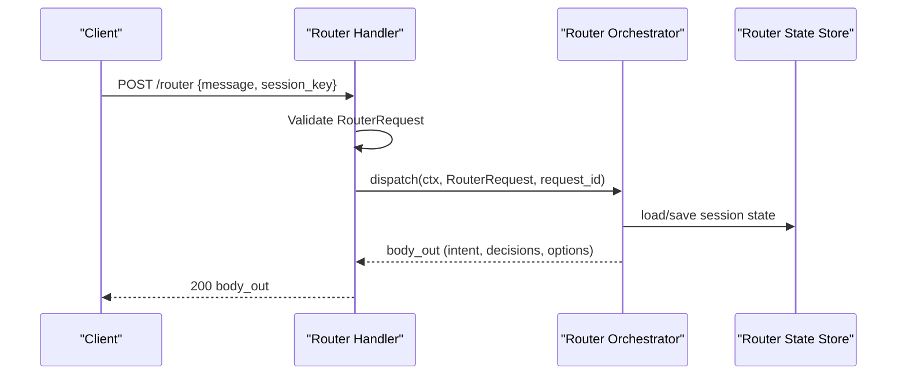
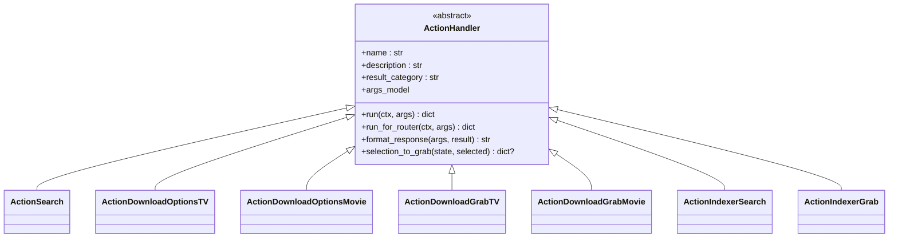
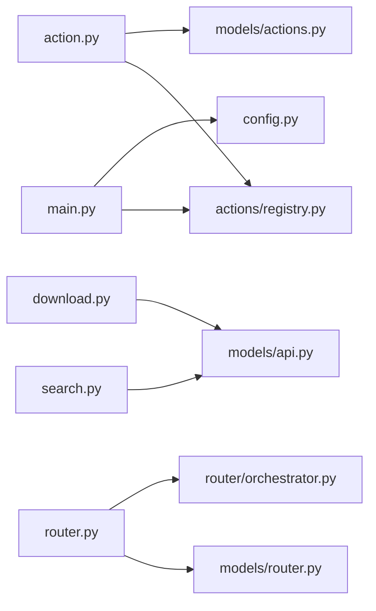

# API Reference

<cite>
**Referenced Files in This Document**
- [main.py](file://media-agent/app/main.py)
- [routes/__init__.py](file://media-agent/app/api/routes/__init__.py)
- [health.py](file://media-agent/app/api/routes/health.py)
- [search.py](file://media-agent/app/api/routes/search.py)
- [download.py](file://media-agent/app/api/routes/download.py)
- [action.py](file://media-agent/app/api/routes/action.py)
- [router.py](file://media-agent/app/api/routes/router.py)
- [auth.py](file://media-agent/app/api/auth.py)
- [dependencies.py](file://media-agent/app/api/dependencies.py)
- [errors.py](file://media-agent/app/api/errors.py)
- [responses.py](file://media-agent/app/api/responses.py)
- [config.py](file://media-agent/app/config.py)
- [models/api.py](file://media-agent/app/models/api.py)
- [models/actions.py](file://media-agent/app/models/actions.py)
- [models/router.py](file://media-agent/app/models/router.py)
- [actions/registry.py](file://media-agent/app/actions/registry.py)
- [actions/action_service.py](file://media-agent/app/actions/action_service.py)
- [router/orchestrator.py](file://media-agent/app/router/orchestrator.py)
- [router/smoke.py](file://media-agent/app/router/smoke.py)
- [pyproject.toml](file://media-agent/pyproject.toml)
</cite>

## Table of Contents
1. [Introduction](#introduction)
2. [Project Structure](#project-structure)
3. [Core Components](#core-components)
4. [Architecture Overview](#architecture-overview)
5. [Detailed Component Analysis](#detailed-component-analysis)
6. [Dependency Analysis](#dependency-analysis)
7. [Performance Considerations](#performance-considerations)
8. [Troubleshooting Guide](#troubleshooting-guide)
9. [Conclusion](#conclusion)
10. [Appendices](#appendices)

## Introduction
This document describes the Media-Agent API, a FastAPI-based service that powers media search, download orchestration, and conversational parsing for a homelab stack. It covers:
- REST endpoints for health checks, search, downloads, and action dispatch
- The action handler system with the ActionCall union and payload schemas
- Authentication via a media-agent token
- Request/response schemas using Pydantic models
- Error handling and response formatting patterns
- Router conversational parsing and smoke-gate verification
- Practical usage examples, client guidelines, and integration approaches
- Versioning, rate limiting considerations, and production optimization tips

## Project Structure
The API is organized under a modular FastAPI application with route groups, models, actions, router orchestration, and integrations.

**Diagram sources**
- [main.py:1-34](file://media-agent/app/main.py#L1-L34)
- [routes/__init__.py:1-20](file://media-agent/app/api/routes/__init__.py#L1-L20)
- [health.py:1-59](file://media-agent/app/api/routes/health.py#L1-L59)
- [search.py:1-45](file://media-agent/app/api/routes/search.py#L1-L45)
- [download.py:1-83](file://media-agent/app/api/routes/download.py#L1-L83)
- [action.py:1-53](file://media-agent/app/api/routes/action.py#L1-L53)
- [router.py:1-77](file://media-agent/app/api/routes/router.py#L1-L77)
- [config.py:1-155](file://media-agent/app/config.py#L1-L155)
- [models/api.py:1-159](file://media-agent/app/models/api.py#L1-L159)
- [models/actions.py:1-102](file://media-agent/app/models/actions.py#L1-L102)
- [models/router.py:1-66](file://media-agent/app/models/router.py#L1-L66)
- [actions/registry.py:1-171](file://media-agent/app/actions/registry.py#L1-L171)
- [actions/action_service.py:1-83](file://media-agent/app/actions/action_service.py#L1-L83)
- [router/orchestrator.py](file://media-agent/app/router/orchestrator.py)
- [router/smoke.py](file://media-agent/app/router/smoke.py)

**Section sources**
- [main.py:1-34](file://media-agent/app/main.py#L1-L34)
- [routes/__init__.py:1-20](file://media-agent/app/api/routes/__init__.py#L1-L20)

## Core Components
- Application lifecycle and router mounting:
  - The FastAPI app defines service metadata and mounts the versioned route group under /internal/media-agent/v1.
  - Global lifespan initializes logging and an HTTP client, then tears it down.
- Route groups:
  - Health, Search, Download, Action, and Router endpoints grouped under a single router with a versioned prefix.
- Configuration:
  - Strongly typed settings via Pydantic settings with environment variable aliases and validation.
- Authentication:
  - Token-based authentication enforced via dependency injection and error responses.
- Error handling:
  - Centralized exception registration and upstream error translation with structured error envelopes.

**Section sources**
- [main.py:13-30](file://media-agent/app/main.py#L13-L30)
- [routes/__init__.py:14-16](file://media-agent/app/api/routes/__init__.py#L14-L16)
- [config.py:22-106](file://media-agent/app/config.py#L22-L106)
- [auth.py](file://media-agent/app/api/auth.py)
- [errors.py](file://media-agent/app/api/errors.py)

## Architecture Overview
The API exposes a versioned REST surface and a conversational router. Requests flow through authentication and validation layers, then to either:
- Strict action execution (/action)
- Conversational parsing (/router)
- Orchestration of downstream services (Sonarr, Radarr, Prowlarr, qBittorrent)

**Diagram sources**
- [main.py:21-30](file://media-agent/app/main.py#L21-L30)
- [routes/__init__.py:14-16](file://media-agent/app/api/routes/__init__.py#L14-L16)
- [health.py:15-58](file://media-agent/app/api/routes/health.py#L15-L58)
- [search.py:18-44](file://media-agent/app/api/routes/search.py#L18-L44)
- [download.py:24-82](file://media-agent/app/api/routes/download.py#L24-L82)
- [action.py:20-52](file://media-agent/app/api/routes/action.py#L20-L52)
- [router.py:28-76](file://media-agent/app/api/routes/router.py#L28-L76)

## Detailed Component Analysis

### Authentication and Authorization
- Authentication method:
  - Token-based via a dedicated media-agent token validated by the AuthDep dependency.
- Error response pattern:
  - Structured error envelopes for validation and upstream failures.
- Usage:
  - All endpoints require a valid token; unauthorized requests receive a 401-style error envelope.

**Section sources**
- [auth.py](file://media-agent/app/api/auth.py)
- [dependencies.py](file://media-agent/app/api/dependencies.py)
- [errors.py](file://media-agent/app/api/errors.py)

### Health Endpoint
- Method and URL: GET /internal/media-agent/v1/health
- Purpose: Report service health against configured upstreams (Sonarr, Radarr, optional Prowlarr).
- Response schema: HealthResponse
- Behavior:
  - Probes system status endpoints of Sonarr and Radarr using configured base URLs and API keys.
  - Optionally probes Prowlarr if configured.
  - Returns aggregated status and service identity.

```mermaid
sequenceDiagram
participant C as "Client"
participant H as "Health Handler"
participant S as "Sonarr"
participant R as "Radarr"
participant P as "Prowlarr (optional)"
C->>H : GET /internal/media-agent/v1/health
H->>S : GET /api/v3/system/status (with X-Api-Key)
alt Sonarr OK
H-->>H : sonarr=ok
else Sonarr failure
H-->>H : sonarr=degraded/down
end
H->>R : GET /api/v3/system/status (with X-Api-Key)
alt Radarr OK
H-->>H : radarr=ok
else Radarr failure
H-->>H : radarr=degraded/down
end
opt Prowlarr configured
H->>P : GET /api/v1/system/status (with X-Api-Key)
alt Prowlarr OK
H-->>H : prowlarr=ok
else Prowlarr failure
H-->>H : prowlarr=degraded/down
end
end
H-->>C : 200 HealthResponse
```

**Diagram sources**
- [health.py:15-58](file://media-agent/app/api/routes/health.py#L15-L58)

**Section sources**
- [health.py:15-58](file://media-agent/app/api/routes/health.py#L15-L58)
- [models/api.py:74-82](file://media-agent/app/models/api.py#L74-L82)

### Search Endpoint
- Method and URL: POST /internal/media-agent/v1/search
- Purpose: Normalize and execute a media search across configured libraries.
- Request schema: SearchRequestModel
- Response schema: SearchSuccessResponse
- Validation:
  - Validates query length and normalizes whitespace.
- Processing:
  - Normalizes query, runs lookup, and returns results with metadata and library presence.

**Diagram sources**
- [search.py:18-44](file://media-agent/app/api/routes/search.py#L18-L44)
- [models/api.py:14-27](file://media-agent/app/models/api.py#L14-L27)
- [models/api.py:48-57](file://media-agent/app/models/api.py#L48-L57)

**Section sources**
- [search.py:18-44](file://media-agent/app/api/routes/search.py#L18-L44)
- [models/api.py:14-27](file://media-agent/app/models/api.py#L14-L27)
- [models/api.py:48-57](file://media-agent/app/models/api.py#L48-L57)

### Download Management Endpoints
- POST /internal/media-agent/v1/download-options
  - Purpose: Retrieve candidate releases for TV or Movie.
  - Request schemas: DownloadOptionsTVRequest or DownloadOptionsMovieRequest
  - Response: Envelope with options and metadata.
- POST /internal/media-agent/v1/download-grab
  - Purpose: Commit to a specific release (guid) and trigger download.
  - Request schema: DownloadGrabRequest
  - Response: Envelope with operation outcome.

**Diagram sources**
- [download.py:24-82](file://media-agent/app/api/routes/download.py#L24-L82)
- [models/api.py:84-129](file://media-agent/app/models/api.py#L84-L129)
- [responses.py](file://media-agent/app/api/responses.py)

**Section sources**
- [download.py:24-82](file://media-agent/app/api/routes/download.py#L24-L82)
- [models/api.py:84-129](file://media-agent/app/models/api.py#L84-L129)

### Action Dispatch Endpoint
- GET /internal/media-agent/v1/functions
  - Purpose: Enumerate available actions, descriptions, and argument models.
- POST /internal/media-agent/v1/action
  - Purpose: Strictly execute a single action by name with validated payload.
  - Payload: Discriminated union ActionCall
  - Response: Envelope with action name, result, and request_id.

**Diagram sources**
- [action.py:20-52](file://media-agent/app/api/routes/action.py#L20-L52)
- [models/actions.py:74-88](file://media-agent/app/models/actions.py#L74-L88)
- [actions/registry.py:138-145](file://media-agent/app/actions/registry.py#L138-L145)

**Section sources**
- [action.py:20-52](file://media-agent/app/api/routes/action.py#L20-L52)
- [models/actions.py:74-88](file://media-agent/app/models/actions.py#L74-L88)
- [actions/registry.py:138-145](file://media-agent/app/actions/registry.py#L138-L145)

### Router Conversational Parsing API
- POST /internal/media-agent/v1/router
  - Purpose: Parse natural language messages into structured intents and decisions.
  - Request schema: RouterRequest
  - Response: Orchestrator output (intent, extracted fields, session state, options).
- GET /internal/media-agent/v1/router-smoke-gate
  - Purpose: Smoke-test payload builder and verification hints for router flows.

**Diagram sources**
- [router.py:28-56](file://media-agent/app/api/routes/router.py#L28-L56)
- [models/router.py:8-57](file://media-agent/app/models/router.py#L8-L57)
- [router/orchestrator.py](file://media-agent/app/router/orchestrator.py)
- [router/smoke.py](file://media-agent/app/router/smoke.py)

**Section sources**
- [router.py:28-76](file://media-agent/app/api/routes/router.py#L28-L76)
- [models/router.py:8-57](file://media-agent/app/models/router.py#L8-L57)

### Action Handler System
- ActionCall union:
  - Discriminated union covering search, download options (TV/Movie), download grab (TV/Movie), indexer search, and indexer grab.
- Handler contract:
  - Each handler defines name, description, result category, args_model, and implements run/run_for_router/format_response/selection_to_grab.
- Execution paths:
  - Strict execution via /action
  - Conversational execution via /router with optional reuse/fallback policies

**Diagram sources**
- [actions/registry.py:48-88](file://media-agent/app/actions/registry.py#L48-L88)
- [models/actions.py:8-88](file://media-agent/app/models/actions.py#L8-L88)

**Section sources**
- [models/actions.py:74-88](file://media-agent/app/models/actions.py#L74-L88)
- [actions/registry.py:48-88](file://media-agent/app/actions/registry.py#L48-L88)

### Request/Response Schemas (Pydantic)
- Search
  - Request: SearchRequestModel
  - Response: SearchSuccessResponse
- Download Options
  - Request: DownloadOptionsTVRequest or DownloadOptionsMovieRequest
  - Response: Envelope via envelope_download
- Download Grab
  - Request: DownloadGrabRequest
  - Response: Envelope via envelope_grab
- Router
  - Request: RouterRequest
  - Decisions and session state models: RouterIntentDecision, RouterExtractDecision, RouterPendingOption, RouterSessionState
- Health
  - Response: HealthResponse
- Errors
  - ErrorBody and ErrorResponse for standardized error envelopes

**Section sources**
- [models/api.py:14-27](file://media-agent/app/models/api.py#L14-L27)
- [models/api.py:48-72](file://media-agent/app/models/api.py#L48-L72)
- [models/api.py:84-129](file://media-agent/app/models/api.py#L84-L129)
- [models/router.py:8-57](file://media-agent/app/models/router.py#L8-L57)
- [models/api.py:74-82](file://media-agent/app/models/api.py#L74-L82)
- [errors.py](file://media-agent/app/api/errors.py)

### Webhook Integration Points
- Router smoke-gate verification:
  - GET /internal/media-agent/v1/router-smoke-gate returns a smoke gate payload and helper verification hints for testing router decisions and session state transitions.
- No explicit inbound webhooks are exposed by the documented routes; integration with external systems occurs via downstream service calls (e.g., Sonarr, Radarr, Prowlarr) initiated by actions.

**Section sources**
- [router.py:59-76](file://media-agent/app/api/routes/router.py#L59-L76)

## Dependency Analysis
- Internal dependencies:
  - Routes depend on models, registry, and services.
  - Registry depends on models and router session/state models.
  - Router orchestrator integrates with state store and downstream services.
- External dependencies:
  - HTTP client for upstream service calls.
  - Settings for base URLs, API keys, timeouts, and limits.

**Diagram sources**
- [action.py:9-15](file://media-agent/app/api/routes/action.py#L9-L15)
- [search.py:9-13](file://media-agent/app/api/routes/search.py#L9-L13)
- [download.py:9-19](file://media-agent/app/api/routes/download.py#L9-L19)
- [router.py:11-21](file://media-agent/app/api/routes/router.py#L11-L21)
- [main.py:7-9](file://media-agent/app/main.py#L7-L9)
- [config.py](file://media-agent/app/config.py)

**Section sources**
- [action.py:9-15](file://media-agent/app/api/routes/action.py#L9-L15)
- [search.py:9-13](file://media-agent/app/api/routes/search.py#L9-L13)
- [download.py:9-19](file://media-agent/app/api/routes/download.py#L9-L19)
- [router.py:11-21](file://media-agent/app/api/routes/router.py#L11-L21)
- [main.py:7-9](file://media-agent/app/main.py#L7-L9)

## Performance Considerations
- Timeout configuration:
  - Upstream timeouts configurable via settings; health probes honor the upstream timeout.
- Result limits:
  - Global result limit and per-request limits for indexer operations.
- Polling and wait windows:
  - Download search wait and poll intervals are configurable to balance responsiveness and resource usage.
- Caching:
  - Library cache TTL is configurable to reduce repeated lookups.
- Recommendations:
  - Tune MEDIA_AGENT_PROWLARR_TIMEOUT_S, MEDIA_AGENT_DOWNLOAD_WAIT_S, and MEDIA_AGENT_DOWNLOAD_POLL_S for your environment.
  - Monitor upstream service latency and adjust timeouts accordingly.
  - Use pagination and result limits to constrain payload sizes.

**Section sources**
- [config.py:43-78](file://media-agent/app/config.py#L43-L78)
- [health.py:20-47](file://media-agent/app/api/routes/health.py#L20-L47)

## Troubleshooting Guide
- Authentication failures:
  - Ensure the media-agent token is set and passed correctly; invalid or missing tokens produce structured error responses.
- Validation errors:
  - Requests failing schema validation return a VALIDATION_ERROR with summarized field-level messages.
- Upstream errors:
  - Upstream HTTP errors are translated into structured error envelopes with contextual labels.
- Health degraded status:
  - Downstream services may report degraded when reachable but returning non-success status codes.

**Section sources**
- [auth.py](file://media-agent/app/api/auth.py)
- [errors.py](file://media-agent/app/api/errors.py)
- [action.py:42-44](file://media-agent/app/api/routes/action.py#L42-L44)
- [search.py:25-28](file://media-agent/app/api/routes/search.py#L25-L28)
- [download.py:36-38](file://media-agent/app/api/routes/download.py#L36-L38)
- [health.py:18-47](file://media-agent/app/api/routes/health.py#L18-L47)

## Conclusion
The Media-Agent API provides a cohesive REST interface for media search and download orchestration, with a robust action handler system and conversational router. Its design emphasizes strong typing via Pydantic, centralized authentication, and structured error handling, enabling reliable integration with Sonarr, Radarr, Prowlarr, and qBittorrent.

## Appendices

### API Endpoints Summary
- GET /internal/media-agent/v1/health
  - Response: HealthResponse
- POST /internal/media-agent/v1/search
  - Request: SearchRequestModel
  - Response: SearchSuccessResponse
- POST /internal/media-agent/v1/download-options
  - Request: DownloadOptionsTVRequest or DownloadOptionsMovieRequest
  - Response: Envelope via envelope_download
- POST /internal/media-agent/v1/download-grab
  - Request: DownloadGrabRequest
  - Response: Envelope via envelope_grab
- GET /internal/media-agent/v1/functions
  - Response: {functions, descriptions, actions}
- POST /internal/media-agent/v1/action
  - Request: ActionCall (discriminated union)
  - Response: Envelope with action result
- POST /internal/media-agent/v1/router
  - Request: RouterRequest
  - Response: Orchestrator output (intent, decisions, options)
- GET /internal/media-agent/v1/router-smoke-gate
  - Response: Smoke gate payload and verification hints

**Section sources**
- [health.py:15-58](file://media-agent/app/api/routes/health.py#L15-L58)
- [search.py:18-44](file://media-agent/app/api/routes/search.py#L18-L44)
- [download.py:24-82](file://media-agent/app/api/routes/download.py#L24-L82)
- [action.py:20-52](file://media-agent/app/api/routes/action.py#L20-L52)
- [router.py:28-76](file://media-agent/app/api/routes/router.py#L28-L76)

### Authentication Requirements
- Header: Authorization: Bearer <media-agent-token>
- Token sourced from MEDIA_AGENT_TOKEN environment variable.

**Section sources**
- [config.py:22](file://media-agent/app/config.py#L22)
- [dependencies.py](file://media-agent/app/api/dependencies.py)

### API Versioning
- All endpoints are mounted under /internal/media-agent/v1, indicating a versioned API surface.

**Section sources**
- [routes/__init__.py:14](file://media-agent/app/api/routes/__init__.py#L14)

### Rate Limiting Considerations
- No built-in rate limiting is present in the documented routes.
- Recommendation: Apply rate limiting at the ingress (e.g., reverse proxy) or integrate a middleware to protect upstream services.

[No sources needed since this section provides general guidance]

### Production Deployment Tips
- Configure timeouts and limits per environment using settings.
- Monitor health endpoints and upstream service availability.
- Use the router smoke-gate endpoint to validate conversational flows before production rollout.
- Secure the media-agent token and restrict exposure.

**Section sources**
- [config.py:43-78](file://media-agent/app/config.py#L43-L78)
- [router.py:59-76](file://media-agent/app/api/routes/router.py#L59-L76)