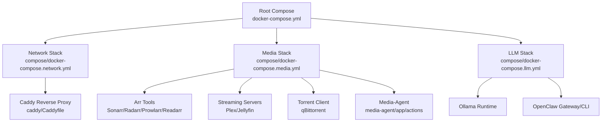
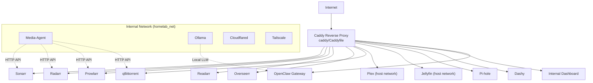
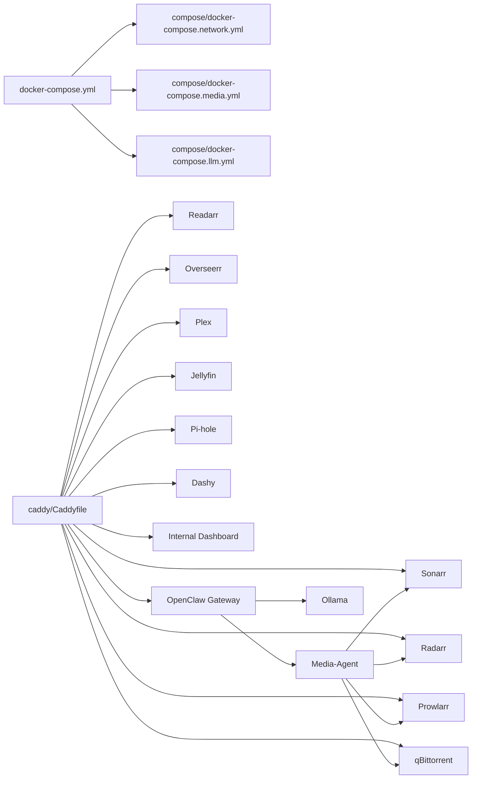

# Advanced Configuration and Customization

<cite>
**Referenced Files in This Document**
- [docker-compose.yml](file://docker-compose.yml)
- [compose/docker-compose.network.yml](file://compose/docker-compose.network.yml)
- [compose/docker-compose.media.yml](file://compose/docker-compose.media.yml)
- [compose/docker-compose.llm.yml](file://compose/docker-compose.llm.yml)
- [config/gpu/docker-compose.gpu.yml](file://config/gpu/docker-compose.gpu.yml)
- [caddy/Caddyfile](file://caddy/Caddyfile)
- [caddy/Dockerfile](file://caddy/Dockerfile)
- [media-agent/app/actions/README.md](file://media-agent/app/actions/README.md)
- [docs/caddy-guide.md](file://docs/caddy-guide.md)
- [docs/network-access.md](file://docs/network-access.md)
- [docs/prowlarr-caddy-routing.md](file://docs/prowlarr-caddy-routing.md)
- [docs/service-troubleshooting.md](file://docs/service-troubleshooting.md)
- [scripts/media_action_router.py](file://scripts/media_action_router.py)
- [tests/compose/test_network_definitions.sh](file://tests/compose/test_network_definitions.sh)
- [tests/integration/router-smoke-p0.sh](file://tests/integration/router-smoke-p0.sh)
- [tests/workers/test_media_action_router.py](file://tests/workers/test_media_action_router.py)
</cite>

## Table of Contents
1. [Introduction](#introduction)
2. [Project Structure](#project-structure)
3. [Core Components](#core-components)
4. [Architecture Overview](#architecture-overview)
5. [Detailed Component Analysis](#detailed-component-analysis)
6. [Dependency Analysis](#dependency-analysis)
7. [Performance Considerations](#performance-considerations)
8. [Troubleshooting Guide](#troubleshooting-guide)
9. [Conclusion](#conclusion)
10. [Appendices](#appendices)

## Introduction
This guide explains how to extend and customize the homelab infrastructure beyond the default setup. It covers adding new services to existing Compose files, customizing Caddy routing rules, modifying network configurations, extending the Media-Agent action system, configuring advanced Arr stack features, and optimizing performance through resource allocation and GPU acceleration. Both beginners and experienced developers will find practical steps and conceptual overviews aligned with the repository’s terminology and patterns.

## Project Structure
The orchestration is driven by a root Compose file that includes modular stacks:
- Network stack: Caddy, Pi-hole, Dashy, Cloudflared, Tailscale
- Media stack: Arr tools, Plex, Jellyfin, qBittorrent, Media-Agent
- LLM stack: Ollama, internal dashboard, OpenClaw gateway and CLI

**Diagram sources**
- [docker-compose.yml:1-13](file://docker-compose.yml#L1-L13)
- [compose/docker-compose.network.yml:1-122](file://compose/docker-compose.network.yml#L1-L122)
- [compose/docker-compose.media.yml:1-317](file://compose/docker-compose.media.yml#L1-L317)
- [compose/docker-compose.llm.yml:1-169](file://compose/docker-compose.llm.yml#L1-L169)
- [caddy/Caddyfile:1-225](file://caddy/Caddyfile#L1-L225)

**Section sources**
- [docker-compose.yml:1-13](file://docker-compose.yml#L1-L13)

## Core Components
- Root Compose orchestrates modular stacks and defines the shared external network used by most services.
- Network stack exposes services via Caddy with domain-based routing and TLS via Cloudflare DNS.
- Media stack integrates Arr tools, streaming servers, and Media-Agent for metadata and download orchestration.
- LLM stack provides local LLM inference with GPU support and an OpenClaw control plane.

Key configuration touchpoints:
- Environment variables drive service behavior and inter-service URLs.
- Volume mounts define persistent storage and media library access.
- Healthchecks and resource limits ensure reliability and performance.

**Section sources**
- [compose/docker-compose.network.yml:1-122](file://compose/docker-compose.network.yml#L1-L122)
- [compose/docker-compose.media.yml:1-317](file://compose/docker-compose.media.yml#L1-L317)
- [compose/docker-compose.llm.yml:1-169](file://compose/docker-compose.llm.yml#L1-L169)

## Architecture Overview
The system routes external traffic through Caddy to internal services. Services communicate over a shared Docker network, while some require host networking for device passthrough or discovery. GPU-accelerated services leverage device visibility and container GPU allocation.

**Diagram sources**
- [caddy/Caddyfile:1-225](file://caddy/Caddyfile#L1-L225)
- [compose/docker-compose.network.yml:1-122](file://compose/docker-compose.network.yml#L1-L122)
- [compose/docker-compose.media.yml:1-317](file://compose/docker-compose.media.yml#L1-L317)
- [compose/docker-compose.llm.yml:1-169](file://compose/docker-compose.llm.yml#L1-L169)

## Detailed Component Analysis

### Adding New Services to Existing Compose Files
Approach:
- Add the service definition under the appropriate stack file (network, media, or LLM).
- Attach to the shared external network or use host networking when required.
- Define environment variables, volumes, and healthchecks.
- Expose ports only when necessary; prefer internal-only bindings for LAN-only services.

Practical steps:
- Choose the target stack file:
  - Network services: [compose/docker-compose.network.yml](file://compose/docker-compose.network.yml)
  - Media services: [compose/docker-compose.media.yml](file://compose/docker-compose.media.yml)
  - LLM services: [compose/docker-compose.llm.yml](file://compose/docker-compose.llm.yml)
- Reference environment variables used across the stack (e.g., BASE_DOMAIN, TZ, GPU-related variables).
- Use the shared network name defined in the root Compose file.

Integration testing:
- Validate network reachability and routing using smoke tests in the repository.

**Section sources**
- [compose/docker-compose.network.yml:1-122](file://compose/docker-compose.network.yml#L1-L122)
- [compose/docker-compose.media.yml:1-317](file://compose/docker-compose.media.yml#L1-L317)
- [compose/docker-compose.llm.yml:1-169](file://compose/docker-compose.llm.yml#L1-L169)
- [docker-compose.yml:7-13](file://docker-compose.yml#L7-L13)

### Customizing Caddy Routing Rules
Approach:
- Modify the consolidated Caddyfile to add new routes, adjust reverse proxy targets, or change TLS settings.
- Use domain-based or path-based routing depending on service needs.
- Preserve existing Arr stack routing patterns and header handling.

Routing patterns to emulate:
- Path-preserving routes for services with UrlBase configured (e.g., Arr stack).
- Path-stripping routes for services without UrlBase.
- Subdomain routes for host-bound services (e.g., Plex, Jellyfin, Pi-hole, OpenClaw).

Examples to reference:
- Path-preserving Arr routes: [caddy/Caddyfile:18-35](file://caddy/Caddyfile#L18-L35)
- Subdomain routes: [caddy/Caddyfile:91-121](file://caddy/Caddyfile#L91-L121)
- LAN HTTP catch-all: [caddy/Caddyfile:127-224](file://caddy/Caddyfile#L127-L224)

Validation:
- Use integration tests to verify routing behavior.

**Section sources**
- [caddy/Caddyfile:1-225](file://caddy/Caddyfile#L1-L225)
- [docs/caddy-guide.md](file://docs/caddy-guide.md)
- [tests/integration/router-smoke-p0.sh](file://tests/integration/router-smoke-p0.sh)

### Modifying Network Configurations
Approach:
- Define the shared external network in the root Compose file and attach services to it.
- Use host networking for services requiring device passthrough or broadcast discovery.
- Keep sensitive services bound to loopback or internal-only ports when applicable.

Reference:
- External network definition: [docker-compose.yml:9-13](file://docker-compose.yml#L9-L13)
- Host networking examples: [compose/docker-compose.media.yml:174-204](file://compose/docker-compose.media.yml#L174-L204), [compose/docker-compose.network.yml:37](file://compose/docker-compose.network.yml#L37)
- Internal-only ports: [compose/docker-compose.llm.yml:68-71](file://compose/docker-compose.llm.yml#L68-L71), [compose/docker-compose.media.yml:158-159](file://compose/docker-compose.media.yml#L158-L159)

Testing:
- Validate network definitions and host-mode whitelists with repository tests.

**Section sources**
- [docker-compose.yml:9-13](file://docker-compose.yml#L9-L13)
- [compose/docker-compose.media.yml:174-204](file://compose/docker-compose.media.yml#L174-L204)
- [compose/docker-compose.llm.yml:68-71](file://compose/docker-compose.llm.yml#L68-L71)
- [tests/compose/test_network_definitions.sh](file://tests/compose/test_network_definitions.sh)

### Extending the Media-Agent Action System
Approach:
- Add new action modules under the actions package with deterministic behavior.
- Register actions and integrate them into the action service pipeline.
- Keep route handlers and conversational parsing outside the actions module.

Reference:
- Actions overview and responsibilities: [media-agent/app/actions/README.md:1-11](file://media-agent/app/actions/README.md#L1-L11)
- Example action modules: [media-agent/app/actions/download_movie.py](file://media-agent/app/actions/download_movie.py), [media-agent/app/actions/grab_tv.py](file://media-agent/app/actions/grab_tv.py), [media-agent/app/actions/prowlarr_flow.py](file://media-agent/app/actions/prowlarr_flow.py)

Integration testing:
- Use worker tests to validate action router behavior.

**Section sources**
- [media-agent/app/actions/README.md:1-11](file://media-agent/app/actions/README.md#L1-L11)
- [tests/workers/test_media_action_router.py](file://tests/workers/test_media_action_router.py)

### Advanced Arr Stack Configuration
Approach:
- Configure Arr tools via environment variables and persistent volumes.
- Use internal URLs and API keys for inter-service communication.
- Leverage Media-Agent for metadata lookup and release selection.

Reference:
- Arr stack services and environment variables: [compose/docker-compose.media.yml:57-145](file://compose/docker-compose.media.yml#L57-L145)
- Media-Agent integration and environment variables: [compose/docker-compose.media.yml:277-317](file://compose/docker-compose.media.yml#L277-L317)
- Prowlarr routing specifics: [docs/prowlarr-caddy-routing.md](file://docs/prowlarr-caddy-routing.md)

**Section sources**
- [compose/docker-compose.media.yml:57-145](file://compose/docker-compose.media.yml#L57-L145)
- [compose/docker-compose.media.yml:277-317](file://compose/docker-compose.media.yml#L277-L317)
- [docs/prowlarr-caddy-routing.md](file://docs/prowlarr-caddy-routing.md)

### Optimizing Performance Through Resource Allocation and GPU Acceleration
Approach:
- Set memory limits and PID limits for stability.
- Enable GPU acceleration for streaming servers and LLM runtime.
- Use device visibility and GPU allocation in Compose.

Reference:
- GPU override composition: [config/gpu/docker-compose.gpu.yml:1-11](file://config/gpu/docker-compose.gpu.yml#L1-L11)
- GPU-enabled services: [compose/docker-compose.media.yml:182-183](file://compose/docker-compose.media.yml#L182-L183), [compose/docker-compose.media.yml:216-217](file://compose/docker-compose.media.yml#L216-L217), [compose/docker-compose.llm.yml:21-23](file://compose/docker-compose.llm.yml#L21-L23)
- Resource limits: [compose/docker-compose.media.yml:26](file://compose/docker-compose.media.yml#L26), [compose/docker-compose.media.yml:203](file://compose/docker-compose.media.yml#L203), [compose/docker-compose.llm.yml:33](file://compose/docker-compose.llm.yml#L33)

**Section sources**
- [config/gpu/docker-compose.gpu.yml:1-11](file://config/gpu/docker-compose.gpu.yml#L1-L11)
- [compose/docker-compose.media.yml:182-183](file://compose/docker-compose.media.yml#L182-L183)
- [compose/docker-compose.media.yml:216-217](file://compose/docker-compose.media.yml#L216-L217)
- [compose/docker-compose.llm.yml:21-23](file://compose/docker-compose.llm.yml#L21-L23)
- [compose/docker-compose.media.yml:26](file://compose/docker-compose.media.yml#L26)
- [compose/docker-compose.media.yml:203](file://compose/docker-compose.media.yml#L203)
- [compose/docker-compose.llm.yml:33](file://compose/docker-compose.llm.yml#L33)

### Compose Override Techniques and Environment Variable Management
Approach:
- Use Compose profiles and override files to enable optional services (e.g., OpenClaw CLI).
- Manage environment variables centrally and pass them into services.
- Mount volumes for persistent data and media library access.

Reference:
- Profiles and CLI override: [compose/docker-compose.llm.yml:135-169](file://compose/docker-compose.llm.yml#L135-L169)
- Environment variables for inter-service URLs: [compose/docker-compose.llm.yml:89-101](file://compose/docker-compose.llm.yml#L89-L101), [compose/docker-compose.media.yml:286-303](file://compose/docker-compose.media.yml#L286-L303)
- Volume mounting strategies: [compose/docker-compose.media.yml:184-191](file://compose/docker-compose.media.yml#L184-L191), [compose/docker-compose.llm.yml:102-107](file://compose/docker-compose.llm.yml#L102-L107)

**Section sources**
- [compose/docker-compose.llm.yml:135-169](file://compose/docker-compose.llm.yml#L135-L169)
- [compose/docker-compose.llm.yml:89-101](file://compose/docker-compose.llm.yml#L89-L101)
- [compose/docker-compose.media.yml:286-303](file://compose/docker-compose.media.yml#L286-L303)
- [compose/docker-compose.media.yml:184-191](file://compose/docker-compose.media.yml#L184-L191)
- [compose/docker-compose.llm.yml:102-107](file://compose/docker-compose.llm.yml#L102-L107)

### Practical Examples: Service Addition, Configuration Customization, and Integration Testing
- Service addition:
  - Add a new service to the media stack and expose it via Caddy using a path-preserving or subdomain route.
  - Reference: [compose/docker-compose.media.yml:1-317](file://compose/docker-compose.media.yml#L1-L317), [caddy/Caddyfile:18-35](file://caddy/Caddyfile#L18-L35), [caddy/Caddyfile:91-121](file://caddy/Caddyfile#L91-L121)
- Configuration customization:
  - Adjust environment variables for internal URLs and API keys.
  - Reference: [compose/docker-compose.llm.yml:89-101](file://compose/docker-compose.llm.yml#L89-L101), [compose/docker-compose.media.yml:286-303](file://compose/docker-compose.media.yml#L286-L303)
- Integration testing:
  - Run router smoke tests and network definition tests to validate routing and connectivity.
  - References: [tests/integration/router-smoke-p0.sh](file://tests/integration/router-smoke-p0.sh), [tests/compose/test_network_definitions.sh](file://tests/compose/test_network_definitions.sh)

**Section sources**
- [compose/docker-compose.media.yml:1-317](file://compose/docker-compose.media.yml#L1-L317)
- [caddy/Caddyfile:18-35](file://caddy/Caddyfile#L18-L35)
- [caddy/Caddyfile:91-121](file://caddy/Caddyfile#L91-L121)
- [compose/docker-compose.llm.yml:89-101](file://compose/docker-compose.llm.yml#L89-L101)
- [compose/docker-compose.media.yml:286-303](file://compose/docker-compose.media.yml#L286-L303)
- [tests/integration/router-smoke-p0.sh](file://tests/integration/router-smoke-p0.sh)
- [tests/compose/test_network_definitions.sh](file://tests/compose/test_network_definitions.sh)

## Dependency Analysis
The system exhibits clear dependency relationships:
- Root Compose depends on modular stack files.
- Caddy depends on environment variables and routes to internal services.
- Media-Agent depends on Arr services and qBittorrent for downloads.
- OpenClaw depends on Ollama and Media-Agent for LLM-driven workflows.

**Diagram sources**
- [docker-compose.yml:1-13](file://docker-compose.yml#L1-L13)
- [compose/docker-compose.network.yml:1-122](file://compose/docker-compose.network.yml#L1-L122)
- [compose/docker-compose.media.yml:1-317](file://compose/docker-compose.media.yml#L1-L317)
- [compose/docker-compose.llm.yml:1-169](file://compose/docker-compose.llm.yml#L1-L169)
- [caddy/Caddyfile:1-225](file://caddy/Caddyfile#L1-L225)

**Section sources**
- [docker-compose.yml:1-13](file://docker-compose.yml#L1-L13)
- [compose/docker-compose.network.yml:1-122](file://compose/docker-compose.network.yml#L1-L122)
- [compose/docker-compose.media.yml:1-317](file://compose/docker-compose.media.yml#L1-L317)
- [compose/docker-compose.llm.yml:1-169](file://compose/docker-compose.llm.yml#L1-L169)
- [caddy/Caddyfile:1-225](file://caddy/Caddyfile#L1-L225)

## Performance Considerations
- Resource limits: Apply memory and PID limits to prevent runaway containers.
- GPU acceleration: Enable device visibility and GPU allocation for streaming servers and LLM runtime.
- Healthchecks: Use healthchecks to detect degraded services quickly.
- Logging: Configure JSON logging with rotation for observability.

[No sources needed since this section provides general guidance]

## Troubleshooting Guide
Common areas to inspect:
- Caddy routing and TLS configuration.
- Service healthchecks and logs.
- Network reachability and host-mode restrictions.
- Environment variable completeness and correctness.

References:
- Caddy troubleshooting guide: [docs/caddy-guide.md](file://docs/caddy-guide.md)
- Network access guidance: [docs/network-access.md](file://docs/network-access.md)
- Service troubleshooting guide: [docs/service-troubleshooting.md](file://docs/service-troubleshooting.md)
- Compose tests for environment and network validation: [tests/compose/test_env_completeness.sh](file://tests/compose/test_env_completeness.sh), [tests/compose/test_network_definitions.sh](file://tests/compose/test_network_definitions.sh)

**Section sources**
- [docs/caddy-guide.md](file://docs/caddy-guide.md)
- [docs/network-access.md](file://docs/network-access.md)
- [docs/service-troubleshooting.md](file://docs/service-troubleshooting.md)
- [tests/compose/test_env_completeness.sh](file://tests/compose/test_env_completeness.sh)
- [tests/compose/test_network_definitions.sh](file://tests/compose/test_network_definitions.sh)

## Conclusion
By leveraging modular Compose stacks, a centralized Caddy configuration, and well-defined environment variables and volumes, you can reliably extend the homelab infrastructure. Use GPU overrides for acceleration, maintain strict resource limits, and validate changes with existing integration and compose tests to ensure smooth operation.

[No sources needed since this section summarizes without analyzing specific files]

## Appendices

### Appendix A: Caddyfile Routing Patterns
- Path-preserving routes for Arr stack: [caddy/Caddyfile:18-35](file://caddy/Caddyfile#L18-L35)
- Path-stripping routes for internal services: [caddy/Caddyfile:32-46](file://caddy/Caddyfile#L32-L46)
- Subdomain routes for host-bound services: [caddy/Caddyfile:91-121](file://caddy/Caddyfile#L91-L121)
- LAN HTTP catch-all: [caddy/Caddyfile:127-224](file://caddy/Caddyfile#L127-L224)

**Section sources**
- [caddy/Caddyfile:18-35](file://caddy/Caddyfile#L18-L35)
- [caddy/Caddyfile:32-46](file://caddy/Caddyfile#L32-L46)
- [caddy/Caddyfile:91-121](file://caddy/Caddyfile#L91-L121)
- [caddy/Caddyfile:127-224](file://caddy/Caddyfile#L127-L224)

### Appendix B: Media-Agent Action System Overview
- Actions package responsibilities and registration: [media-agent/app/actions/README.md:1-11](file://media-agent/app/actions/README.md#L1-L11)
- Example action modules: [media-agent/app/actions/download_movie.py](file://media-agent/app/actions/download_movie.py), [media-agent/app/actions/grab_tv.py](file://media-agent/app/actions/grab_tv.py), [media-agent/app/actions/prowlarr_flow.py](file://media-agent/app/actions/prowlarr_flow.py)

**Section sources**
- [media-agent/app/actions/README.md:1-11](file://media-agent/app/actions/README.md#L1-L11)
- [media-agent/app/actions/download_movie.py](file://media-agent/app/actions/download_movie.py)
- [media-agent/app/actions/grab_tv.py](file://media-agent/app/actions/grab_tv.py)
- [media-agent/app/actions/prowlarr_flow.py](file://media-agent/app/actions/prowlarr_flow.py)

### Appendix C: GPU Acceleration Configuration
- GPU override composition: [config/gpu/docker-compose.gpu.yml:1-11](file://config/gpu/docker-compose.gpu.yml#L1-L11)
- GPU-enabled services: [compose/docker-compose.media.yml:182-183](file://compose/docker-compose.media.yml#L182-L183), [compose/docker-compose.media.yml:216-217](file://compose/docker-compose.media.yml#L216-L217), [compose/docker-compose.llm.yml:21-23](file://compose/docker-compose.llm.yml#L21-L23)

**Section sources**
- [config/gpu/docker-compose.gpu.yml:1-11](file://config/gpu/docker-compose.gpu.yml#L1-L11)
- [compose/docker-compose.media.yml:182-183](file://compose/docker-compose.media.yml#L182-L183)
- [compose/docker-compose.media.yml:216-217](file://compose/docker-compose.media.yml#L216-L217)
- [compose/docker-compose.llm.yml:21-23](file://compose/docker-compose.llm.yml#L21-L23)