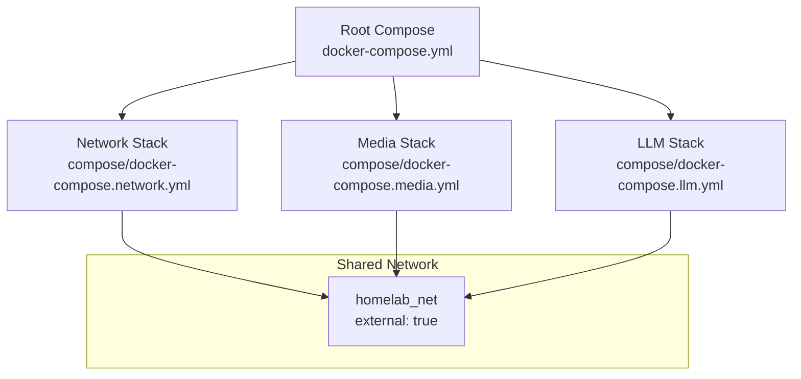
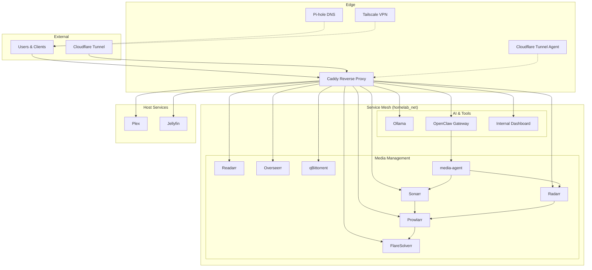
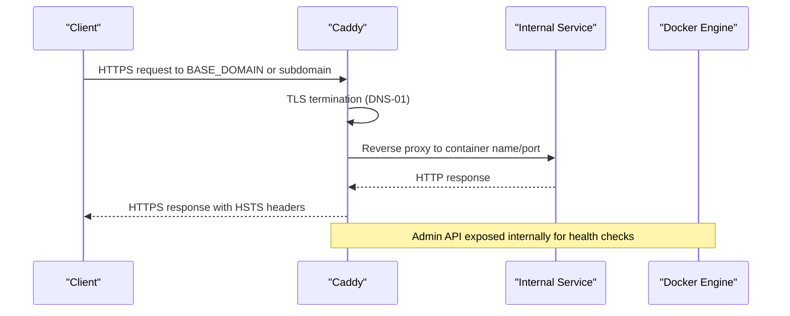
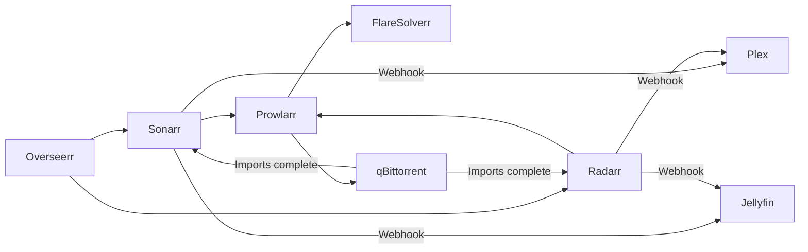
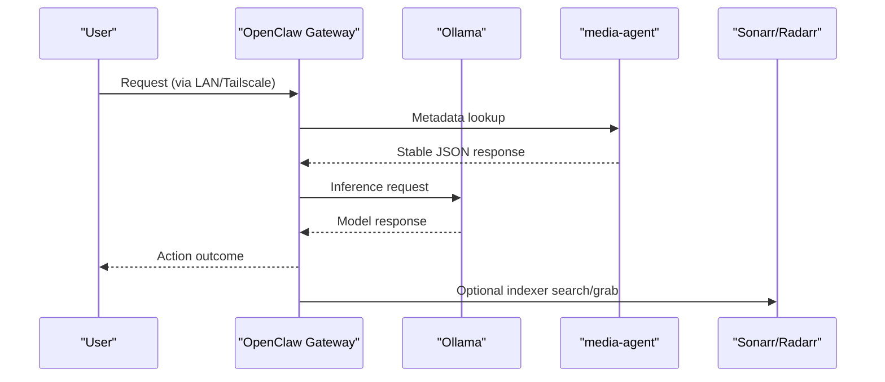
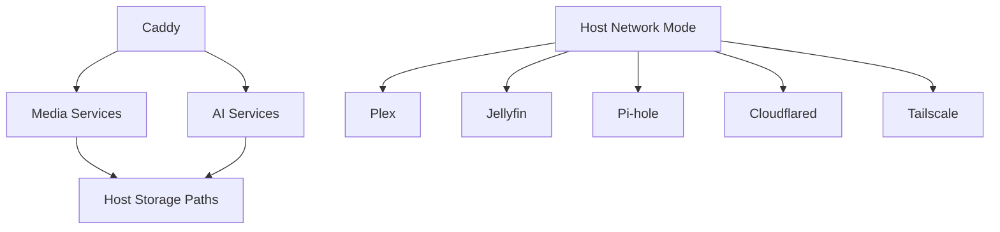

# Architecture and Design

<cite>
**Referenced Files in This Document**
- [docker-compose.yml](file://docker-compose.yml)
- [compose/docker-compose.network.yml](file://compose/docker-compose.network.yml)
- [compose/docker-compose.media.yml](file://compose/docker-compose.media.yml)
- [compose/docker-compose.llm.yml](file://compose/docker-compose.llm.yml)
- [docs/caddy-guide.md](file://docs/caddy-guide.md)
- [docs/network-access.md](file://docs/network-access.md)
- [README.md](file://README.md)
- [scripts/hardening/nftables-arr-stack.nft](file://scripts/hardening/nftables-arr-stack.nft)
- [scripts/backup-data.sh](file://scripts/backup-data.sh)
- [scripts/setup.sh](file://scripts/setup.sh)
- [tests/compose/test_network_definitions.sh](file://tests/compose/test_network_definitions.sh)
- [tests/runtime/run_tests.sh](file://tests/runtime/run_tests.sh)
- [config/cloudflared/config.yml.example](file://config/cloudflared/config.yml.example)
- [config/dashy/conf.yml.example](file://config/dashy/conf.yml.example)
- [media-agent/Dockerfile](file://media-agent/Dockerfile)
</cite>

## Table of Contents
1. [Introduction](#introduction)
2. [Project Structure](#project-structure)
3. [Core Components](#core-components)
4. [Architecture Overview](#architecture-overview)
5. [Detailed Component Analysis](#detailed-component-analysis)
6. [Dependency Analysis](#dependency-analysis)
7. [Performance Considerations](#performance-considerations)
8. [Troubleshooting Guide](#troubleshooting-guide)
9. [Conclusion](#conclusion)
10. [Appendices](#appendices)

## Introduction
This document describes the Homelab system architecture and design patterns. It explains the microservices architecture orchestrated with Docker Compose, the service mesh pattern using a shared Docker bridge network, and the edge routing strategy through Caddy. It documents the media management stack (Arr suite), AI services (Ollama, OpenClaw), and media servers (Plex, Jellyfin), along with security controls (nftables firewall, container hardening), monitoring via health checks, and disaster recovery through automated backups. The document also covers infrastructure requirements, scalability considerations, and deployment topology.

## Project Structure
The repository organizes services across three Compose fragments:
- Root orchestration: docker-compose.yml includes the network, media, and LLM stacks and defines the shared external Docker network homelab_net.
- Edge services: compose/docker-compose.network.yml covers Caddy, Pi-hole, Cloudflare Tunnel, and Tailscale.
- Media stack: compose/docker-compose.media.yml covers Arr applications, Overseerr, Plex, Jellyfin, qBittorrent, and the media-agent.
- AI and tooling: compose/docker-compose.llm.yml covers Ollama, internal dashboard, and OpenClaw gateway.

**Diagram sources**
- [docker-compose.yml:1-13](file://docker-compose.yml#L1-L13)
- [compose/docker-compose.network.yml:7-122](file://compose/docker-compose.network.yml#L7-L122)
- [compose/docker-compose.media.yml:1-317](file://compose/docker-compose.media.yml#L1-L317)
- [compose/docker-compose.llm.yml:1-169](file://compose/docker-compose.llm.yml#L1-L169)

**Section sources**
- [docker-compose.yml:1-13](file://docker-compose.yml#L1-L13)
- [compose/docker-compose.network.yml:7-122](file://compose/docker-compose.network.yml#L7-L122)
- [compose/docker-compose.media.yml:1-317](file://compose/docker-compose.media.yml#L1-L317)
- [compose/docker-compose.llm.yml:1-169](file://compose/docker-compose.llm.yml#L1-L169)

## Core Components
- Edge services
  - Caddy: HTTPS reverse proxy with Cloudflare DNS-01 TLS, subpath and subdomain routing, and admin API.
  - Pi-hole: DNS sinkhole and web UI, host-network mode for direct UDP/TCP/53.
  - Cloudflare Tunnel: outbound tunnel agent for selected services, host-network mode.
  - Tailscale: mesh VPN with host-network mode and elevated capabilities.
- Media management
  - Arr suite: Prowlarr, Sonarr, Radarr, Readarr with LinuxServer.io images and host path mappings.
  - Overseerr: request approval and discovery portal.
  - qBittorrent: BitTorrent client with host path mappings and optional VPN sidecar.
  - FlareSolverr: CAPTCHA solving service for indexers.
  - media-agent: thin API for metadata lookups and stable JSON contract.
- Media servers
  - Plex and Jellyfin: host-network mode for discovery and casting compatibility.
- AI and tooling
  - Ollama: local LLM runtime bound to loopback on the host; reachable via homelab_net.
  - OpenClaw gateway: personal AI assistant control plane with optional Telegram integration.
  - Internal dashboard: Nginx-based internal-only UI.

**Section sources**
- [compose/docker-compose.network.yml:7-122](file://compose/docker-compose.network.yml#L7-L122)
- [compose/docker-compose.media.yml:7-317](file://compose/docker-compose.media.yml#L7-L317)
- [compose/docker-compose.llm.yml:7-169](file://compose/docker-compose.llm.yml#L7-L169)
- [docs/caddy-guide.md:10-133](file://docs/caddy-guide.md#L10-L133)

## Architecture Overview
The system follows a service mesh pattern:
- All containers except those with protocol-specific requirements run on a shared Docker bridge network named homelab_net.
- Caddy acts as the single ingress point, terminating TLS and routing to internal services.
- Host-network mode is used only for services requiring direct host port exposure or protocol behavior (Pi-hole, Cloudflare Tunnel, Tailscale, Plex, Jellyfin).
- Reverse proxy configuration is centralized in Caddyfile with subpath and subdomain routing.

**Diagram sources**
- [README.md:43-167](file://README.md#L43-L167)
- [docs/caddy-guide.md:10-133](file://docs/caddy-guide.md#L10-L133)
- [compose/docker-compose.network.yml:7-122](file://compose/docker-compose.network.yml#L7-L122)
- [compose/docker-compose.media.yml:7-317](file://compose/docker-compose.media.yml#L7-L317)
- [compose/docker-compose.llm.yml:7-169](file://compose/docker-compose.llm.yml#L7-L169)

## Detailed Component Analysis

### Edge Services: Caddy, Pi-hole, Cloudflare Tunnel, Tailscale
- Caddy
  - Single source of truth routing in caddy/Caddyfile with subpath and subdomain blocks.
  - Health-checked via admin API endpoint.
  - Uses Cloudflare DNS-01 for automatic certificate management.
- Pi-hole
  - Host-network mode for direct DNS/53 and admin UI.
  - Security posture includes elevated capabilities; recommended to add no-new-privileges.
- Cloudflare Tunnel
  - Host-network mode; tunnels selected services to the public internet.
  - Tunnel configuration example provided; avoid tunneling media-heavy paths.
- Tailscale
  - Host-network mode with elevated capabilities for VPN operation.

**Diagram sources**
- [docs/caddy-guide.md:10-133](file://docs/caddy-guide.md#L10-L133)
- [compose/docker-compose.network.yml:27-33](file://compose/docker-compose.network.yml#L27-L33)

**Section sources**
- [docs/caddy-guide.md:10-133](file://docs/caddy-guide.md#L10-L133)
- [compose/docker-compose.network.yml:7-122](file://compose/docker-compose.network.yml#L7-L122)

### Media Management Stack: Arr Suite, Overseerr, qBittorrent, FlareSolverr, media-agent
- Arr applications (Prowlarr, Sonarr, Radarr, Readarr) run on homelab_net with LinuxServer.io images.
- Overseerr provides a unified request portal and integrates with Arr apps.
- qBittorrent uses host path mappings for downloads and libraries; consider adding a VPN sidecar for privacy.
- FlareSolverr is used by Prowlarr for CAPTCHA solving; consider restricting exposure.
- media-agent exposes a stable JSON API for metadata lookups and is consumed by OpenClaw.

**Diagram sources**
- [compose/docker-compose.media.yml:29-317](file://compose/docker-compose.media.yml#L29-L317)
- [README.md:402-461](file://README.md#L402-L461)

**Section sources**
- [compose/docker-compose.media.yml:29-317](file://compose/docker-compose.media.yml#L29-L317)
- [README.md:402-461](file://README.md#L402-L461)

### AI Services: Ollama, OpenClaw, Internal Dashboard
- Ollama is LAN-only by design, bound to 127.0.0.1:11434 and reachable via homelab_net internal DNS.
- OpenClaw gateway consumes Ollama and integrates with Arr apps and media-agent.
- Internal dashboard provides an internal-only UI.

**Diagram sources**
- [compose/docker-compose.llm.yml:56-169](file://compose/docker-compose.llm.yml#L56-L169)
- [compose/docker-compose.media.yml:276-317](file://compose/docker-compose.media.yml#L276-L317)

**Section sources**
- [compose/docker-compose.llm.yml:7-169](file://compose/docker-compose.llm.yml#L7-L169)
- [media-agent/Dockerfile:1-15](file://media-agent/Dockerfile#L1-L15)

### Media Servers: Plex and Jellyfin
- Both run in host-network mode to improve LAN discovery and client compatibility.
- Health checks target their respective internal health endpoints.
- Media libraries are mounted read-only from host paths.

**Section sources**
- [compose/docker-compose.media.yml:172-237](file://compose/docker-compose.media.yml#L172-L237)

### Reverse Proxy Configuration and Routing
- Caddyfile defines three top-level blocks: HTTPS primary domain with subpath routes, HTTPS subdomains for host-network services, and HTTP :80 LAN mirror.
- Routing directives use handle vs handle_path depending on service UrlBase settings.
- Host-network services are proxied via host.docker.internal with extra_hosts mapping.

**Section sources**
- [docs/caddy-guide.md:10-133](file://docs/caddy-guide.md#L10-L133)
- [docs/network-access.md:75-121](file://docs/network-access.md#L75-L121)

### Infrastructure Requirements and Deployment Topology
- Docker Compose v2+ and Ubuntu 22.04+ recommended.
- NVIDIA GPU with NVIDIA Container Toolkit for media and AI acceleration.
- External Docker network homelab_net must be created on the host prior to deployment.
- Optional: Cloudflare API token for DNS-01 and tunnel credentials for Cloudflare Tunnel.

**Section sources**
- [README.md:179-184](file://README.md#L179-L184)
- [docker-compose.yml:7-13](file://docker-compose.yml#L7-L13)
- [scripts/setup.sh:139-150](file://scripts/setup.sh#L139-L150)

## Dependency Analysis
The system exhibits a layered dependency graph:
- Edge layer depends on internal services via Caddy.
- Media management layer depends on indexers and download clients.
- AI layer depends on Ollama and media-agent.
- Host services depend on persistent storage mounts.

**Diagram sources**
- [compose/docker-compose.network.yml:7-122](file://compose/docker-compose.network.yml#L7-L122)
- [compose/docker-compose.media.yml:172-237](file://compose/docker-compose.media.yml#L172-L237)
- [compose/docker-compose.llm.yml:56-169](file://compose/docker-compose.llm.yml#L56-L169)

**Section sources**
- [compose/docker-compose.network.yml:7-122](file://compose/docker-compose.network.yml#L7-L122)
- [compose/docker-compose.media.yml:172-237](file://compose/docker-compose.media.yml#L172-L237)
- [compose/docker-compose.llm.yml:56-169](file://compose/docker-compose.llm.yml#L56-L169)

## Performance Considerations
- GPU acceleration is enabled by default for Plex, Jellyfin, and Ollama; ensure adequate VRAM and cooling.
- Memory and PID limits are applied selectively; consider adding limits to Ollama, Plex, and FlareSolverr for stability.
- Bridge networking reduces exposure and improves service DNS stability; host networking is reserved for protocol requirements.
- BitTorrent peer port 51423 is intentionally open; consider VPN routing for privacy.

[No sources needed since this section provides general guidance]

## Troubleshooting Guide
Common issues and resolutions:
- 404 on subpath routes: ensure handle vs handle_path matches service UrlBase.
- SPA asset failures: switch to handle with matching UrlBase.
- Host-network 502 errors: allow Docker bridge subnet to host ports via firewall.
- TLS errors: verify Cloudflare token and DNS propagation.
- Weak qBittorrent password: rotate to a strong password.
- Ollama API exposure: restrict via Caddy auth or remove public label.
- Cloudflare tunnel media streaming: remove tunnel routes for media-heavy paths.

**Section sources**
- [docs/caddy-guide.md:94-117](file://docs/caddy-guide.md#L94-L117)
- [scripts/hardening/nftables-arr-stack.nft:1-37](file://scripts/hardening/nftables-arr-stack.nft#L1-L37)
- [README.md:505-570](file://README.md#L505-L570)

## Conclusion
The Homelab employs a robust microservices architecture with Docker Compose, a shared service mesh network, and centralized edge routing via Caddy. Security is enforced through network segmentation, container hardening, and host firewall rules. Monitoring is achieved via health checks, and disaster recovery is supported by automated snapshot backups. The design balances security, performance, and operational simplicity while maintaining flexibility for future extensions.

[No sources needed since this section summarizes without analyzing specific files]

## Appendices

### Security Controls
- Host firewall: nftables rules restrict management ports to trusted ranges.
- Container hardening: broad application of no-new-privileges and capability drops.
- Secrets management: .env with restrictive permissions; hardening script secures sensitive files.
- Authentication: service-specific auth; planned global forward-auth middleware.

**Section sources**
- [scripts/hardening/nftables-arr-stack.nft:1-37](file://scripts/hardening/nftables-arr-stack.nft#L1-L37)
- [README.md:505-570](file://README.md#L505-L570)

### Disaster Recovery
- Automated pre-flight backup of ./data to a timestamped archive on the media drive.
- Retention policy prunes archives older than 14 days.
- Nightly deploy workflow validates, snapshots, deploys, and runs E2E tests.

**Section sources**
- [scripts/backup-data.sh:1-50](file://scripts/backup-data.sh#L1-L50)
- [README.md:307-321](file://README.md#L307-L321)

### Network Segmentation and Bridge vs Host Modes
- Bridge mode: default for internal services to minimize exposure and maintain stable DNS.
- Host mode: used for DNS, tunnel/VPN, and media discovery to satisfy protocol requirements.
- Pi-hole, Cloudflare Tunnel, Tailscale, Plex, and Jellyfin use host networking.

**Section sources**
- [README.md:389-401](file://README.md#L389-L401)
- [compose/docker-compose.network.yml:37-121](file://compose/docker-compose.network.yml#L37-L121)
- [compose/docker-compose.media.yml:175-204](file://compose/docker-compose.media.yml#L175-L204)

### Monitoring and Health Checks
- Caddy, Pi-hole, Dashy, Cloudflare Tunnel, Tailscale, FlareSolverr, Sonarr, Radarr, Readarr, Overseerr, Plex, Jellyfin, media-agent, Ollama, and OpenClaw define health checks.
- Nightly deploy waits for all health checks to pass before declaring live.

**Section sources**
- [compose/docker-compose.network.yml:27-121](file://compose/docker-compose.network.yml#L27-L121)
- [compose/docker-compose.media.yml:18-317](file://compose/docker-compose.media.yml#L18-L317)
- [compose/docker-compose.llm.yml:26-169](file://compose/docker-compose.llm.yml#L26-L169)
- [README.md:307-321](file://README.md#L307-L321)

### CI/CD and Validation
- Compose validation across all stacks.
- Build and test for local images and workers.
- Runtime smoke tests for selected services on the runtime network.

**Section sources**
- [scripts/setup.sh:152-175](file://scripts/setup.sh#L152-L175)
- [tests/compose/test_network_definitions.sh:1-69](file://tests/compose/test_network_definitions.sh#L1-L69)
- [tests/runtime/run_tests.sh:1-218](file://tests/runtime/run_tests.sh#L1-L218)

### Example Configurations
- Cloudflare Tunnel configuration template for selected services.
- Dashy dashboard configuration example.

**Section sources**
- [config/cloudflared/config.yml.example:1-15](file://config/cloudflared/config.yml.example#L1-L15)
- [config/dashy/conf.yml.example:1-35](file://config/dashy/conf.yml.example#L1-L35)