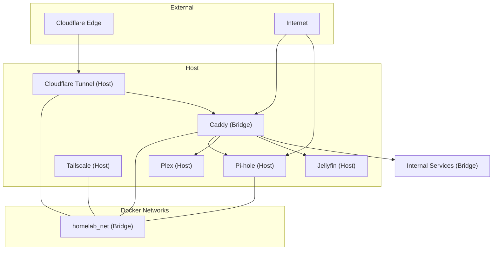
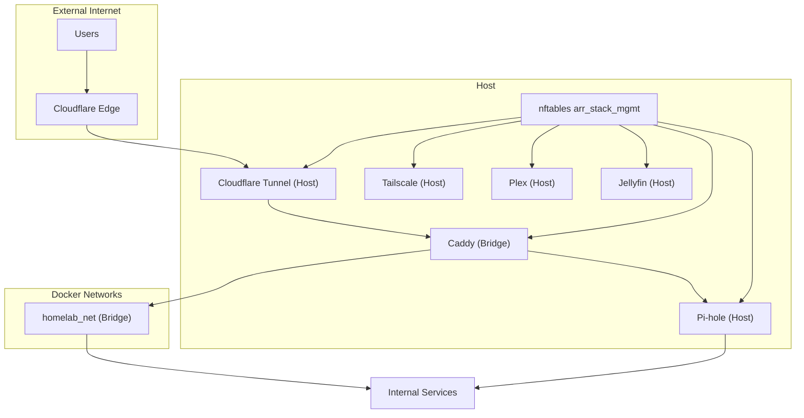
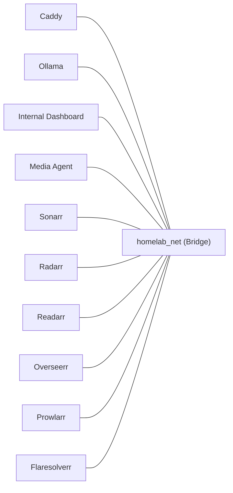
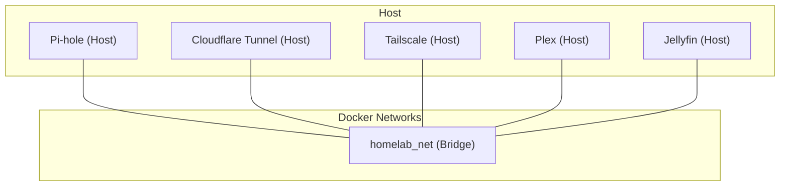
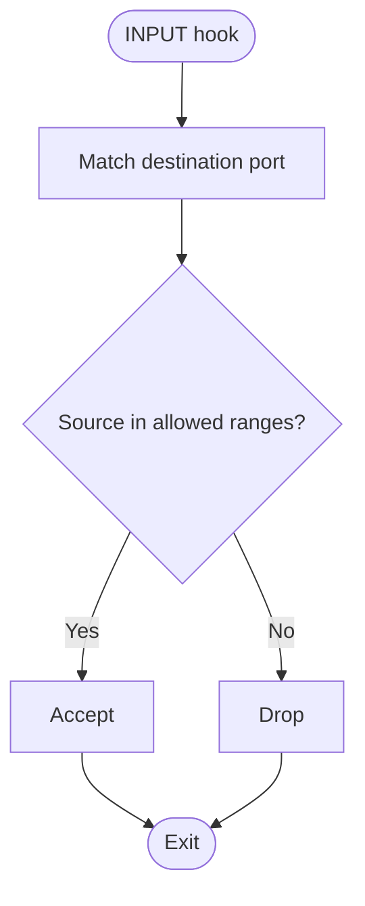
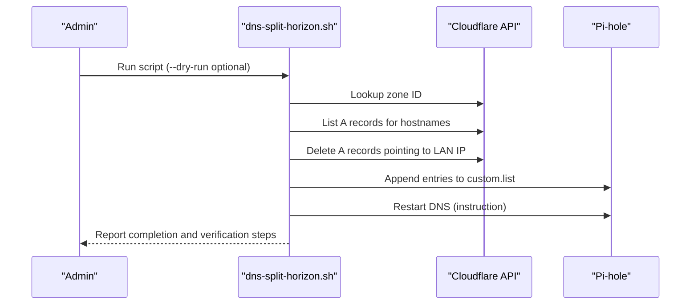
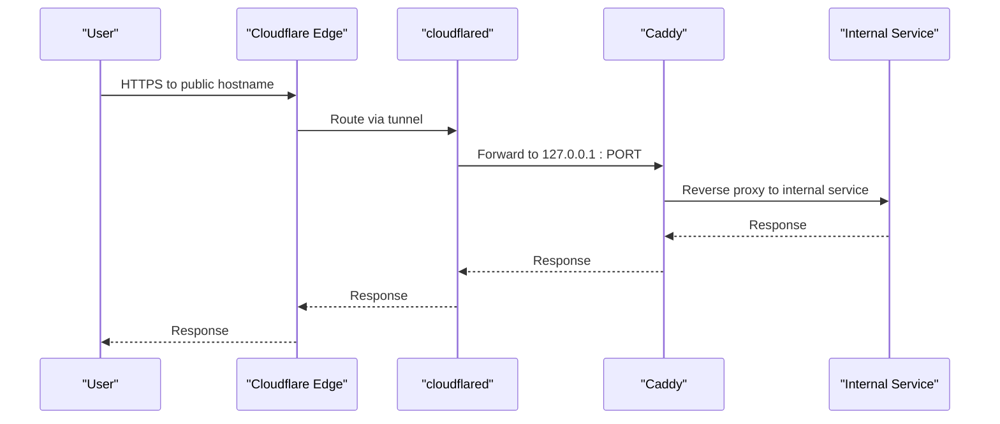
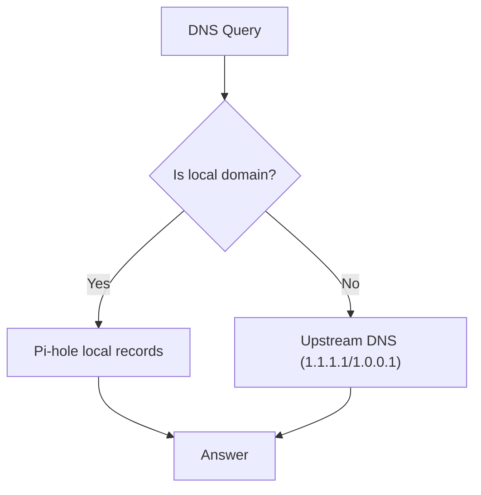
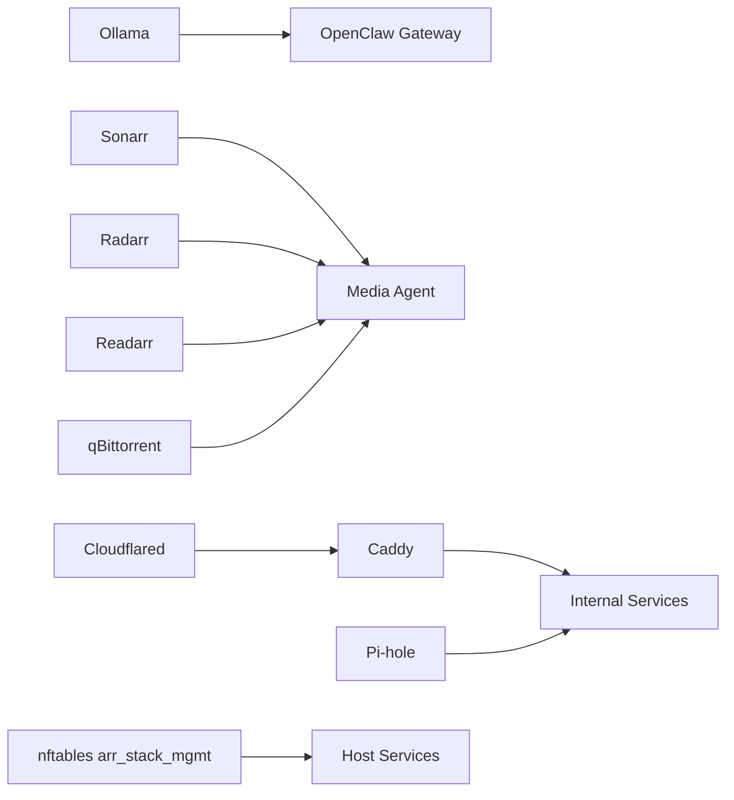

# Network Architecture and Segmentation

<cite>
**Referenced Files in This Document**
- [docker-compose.network.yml](file://compose/docker-compose.network.yml)
- [nftables-arr-stack.nft](file://scripts/hardening/nftables-arr-stack.nft)
- [dns-split-horizon.sh](file://scripts/dns-split-horizon.sh)
- [config.yml](file://data/cloudflared/config.yml)
- [pihole.toml](file://data/pihole/etc-pihole/pihole.toml)
- [dnsmasq.conf](file://data/pihole/etc-pihole/dnsmasq.conf)
- [docker-compose.llm.yml](file://compose/docker-compose.llm.yml)
- [docker-compose.media.yml](file://compose/docker-compose.media.yml)
</cite>

## Table of Contents
1. [Introduction](#introduction)
2. [Project Structure](#project-structure)
3. [Core Components](#core-components)
4. [Architecture Overview](#architecture-overview)
5. [Detailed Component Analysis](#detailed-component-analysis)
6. [Dependency Analysis](#dependency-analysis)
7. [Performance Considerations](#performance-considerations)
8. [Troubleshooting Guide](#troubleshooting-guide)
9. [Conclusion](#conclusion)
10. [Appendices](#appendices)

## Introduction
This document describes the Homelab network architecture and segmentation strategy. It explains how services are logically grouped and isolated, the networking modes used (bridge vs host), the nftables firewall configuration, DNS split horizon implementation, and operational procedures for subnet planning, troubleshooting, and monitoring. The goal is to provide a clear understanding of traffic flows, security boundaries, and performance characteristics across the system.

## Project Structure
The network configuration spans Compose stacks, firewall scripts, and DNS configuration files:
- Bridge networking is used for most services via a single user-defined network named homelab_net.
- Host networking is used for services requiring native host capabilities (Pi-hole, Cloudflare Tunnel, Tailscale, and media servers for discovery/casting).
- nftables defines a dedicated management firewall table to filter inbound traffic to host-bound services.
- DNS split horizon moves internal hostnames from public Cloudflare DNS to Pi-hole local DNS, ensuring internal-only resolution.

**Diagram sources**
- [docker-compose.network.yml:7-122](file://compose/docker-compose.network.yml#L7-L122)
- [docker-compose.media.yml:172-237](file://compose/docker-compose.media.yml#L172-L237)
- [config.yml:13-21](file://data/cloudflared/config.yml#L13-L21)

**Section sources**
- [docker-compose.network.yml:7-122](file://compose/docker-compose.network.yml#L7-L122)
- [docker-compose.media.yml:172-237](file://compose/docker-compose.media.yml#L172-L237)
- [config.yml:13-21](file://data/cloudflared/config.yml#L13-L21)

## Core Components
- homelab_net: A user-defined Docker bridge network used by most services for logical grouping and internal DNS resolution.
- Host-mode services:
  - Pi-hole: Runs in host networking to bind privileged ports (DNS/UI) and integrate with host network stack.
  - Cloudflare Tunnel: Runs in host networking to establish outbound tunnel connectivity and manage ingress.
  - Tailscale: Runs in host networking with elevated privileges for TUN device and routing.
  - Plex and Jellyfin: Run in host networking for device discovery and casting compatibility.
- nftables management firewall: A dedicated table arr_stack_mgmt filters inbound traffic to host-bound services, permitting trusted ranges and dropping WAN exposure of management ports.
- DNS split horizon: Removes internal A records from Cloudflare and adds them to Pi-hole local DNS, enabling internal-only resolution.

**Section sources**
- [docker-compose.network.yml:7-122](file://compose/docker-compose.network.yml#L7-L122)
- [docker-compose.media.yml:172-237](file://compose/docker-compose.media.yml#L172-L237)
- [nftables-arr-stack.nft:16-36](file://scripts/hardening/nftables-arr-stack.nft#L16-L36)
- [pihole.toml:181-214](file://data/pihole/etc-pihole/pihole.toml#L181-L214)
- [dnsmasq.conf:66-88](file://data/pihole/etc-pihole/dnsmasq.conf#L66-L88)
- [dns-split-horizon.sh:36-47](file://scripts/dns-split-horizon.sh#L36-L47)

## Architecture Overview
The system employs a hybrid networking model:
- Bridge networking for isolation and internal service communication.
- Host networking for services requiring privileged ports, TUN devices, or OS-level integration.
- nftables firewall isolates management surfaces and restricts WAN exposure.
- DNS split horizon centralizes internal resolution via Pi-hole, while Cloudflare handles external traffic.

**Diagram sources**
- [nftables-arr-stack.nft:16-36](file://scripts/hardening/nftables-arr-stack.nft#L16-L36)
- [docker-compose.network.yml:7-122](file://compose/docker-compose.network.yml#L7-L122)
- [docker-compose.media.yml:172-237](file://compose/docker-compose.media.yml#L172-L237)
- [config.yml:13-21](file://data/cloudflared/config.yml#L13-L21)

## Detailed Component Analysis

### Bridge Networking Mode (homelab_net)
- Most services join homelab_net, enabling:
  - Internal DNS resolution by Docker’s embedded DNS.
  - Service-to-service communication without exposing ports externally.
  - Network isolation from host’s privileged services.
- Services on this network include Caddy, internal dashboard, LLM stack, media agent, and ARR stack services.

**Diagram sources**
- [docker-compose.network.yml:7-33](file://compose/docker-compose.network.yml#L7-L33)
- [docker-compose.llm.yml:7-35](file://compose/docker-compose.llm.yml#L7-L35)
- [docker-compose.media.yml:7-27](file://compose/docker-compose.media.yml#L7-L27)

**Section sources**
- [docker-compose.network.yml:7-33](file://compose/docker-compose.network.yml#L7-L33)
- [docker-compose.llm.yml:7-35](file://compose/docker-compose.llm.yml#L7-L35)
- [docker-compose.media.yml:7-27](file://compose/docker-compose.media.yml#L7-L27)

### Host Networking Mode
- Pi-hole, Cloudflare Tunnel, and Tailscale run in host networking to:
  - Bind privileged ports (DNS/UI) and manage TUN devices.
  - Integrate with host routing and firewall.
- Plex and Jellyfin use host networking for device discovery and casting compatibility.

**Diagram sources**
- [docker-compose.network.yml:35-62](file://compose/docker-compose.network.yml#L35-L62)
- [docker-compose.network.yml:85-101](file://compose/docker-compose.network.yml#L85-L101)
- [docker-compose.network.yml:103-122](file://compose/docker-compose.network.yml#L103-L122)
- [docker-compose.media.yml:172-237](file://compose/docker-compose.media.yml#L172-L237)

**Section sources**
- [docker-compose.network.yml:35-62](file://compose/docker-compose.network.yml#L35-L62)
- [docker-compose.network.yml:85-101](file://compose/docker-compose.network.yml#L85-L101)
- [docker-compose.network.yml:103-122](file://compose/docker-compose.network.yml#L103-L122)
- [docker-compose.media.yml:172-237](file://compose/docker-compose.media.yml#L172-L237)

### nftables Management Firewall (arr_stack_mgmt)
- Purpose: Filter inbound traffic destined to host-bound services.
- Trusted source ranges: Loopback, private RFC1918, and Tailscale CGNAT.
- Permitted ports:
  - DNS (TCP/UDP 53)
  - HTTP/HTTPS (80/443)
  - Pi-hole UI (8083)
  - Media servers (e.g., 32400)
  - BitTorrent peer port (51423) TCP/UDP
  - Optional direct listeners (e.g., 5055, 8096)
- Policy: Drop all other inbound traffic to these ports from non-whitelisted sources.

**Diagram sources**
- [nftables-arr-stack.nft:16-36](file://scripts/hardening/nftables-arr-stack.nft#L16-L36)

**Section sources**
- [nftables-arr-stack.nft:16-36](file://scripts/hardening/nftables-arr-stack.nft#L16-L36)

### DNS Split Horizon Implementation
- Goal: Ensure internal hostnames resolve to internal IPs only, preventing leakage to the public Internet.
- Steps:
  - Remove A records pointing to LAN IPs from Cloudflare.
  - Add local DNS entries to Pi-hole custom list.
  - Restart Pi-hole DNS to apply changes.
- Hostnames migrated include internal services under the base domain.

**Diagram sources**
- [dns-split-horizon.sh:49-109](file://scripts/dns-split-horizon.sh#L49-L109)

**Section sources**
- [dns-split-horizon.sh:36-109](file://scripts/dns-split-horizon.sh#L36-L109)
- [pihole.toml:181-214](file://data/pihole/etc-pihole/pihole.toml#L181-L214)
- [dnsmasq.conf:66-88](file://data/pihole/etc-pihole/dnsmasq.conf#L66-L88)

### Cloudflare Tunnel Ingress
- Tunnel configuration defines hostname-to-service mappings for public ingress.
- Edge preference set to IPv4 to avoid QUIC network unreachable scenarios.
- Public hostnames mapped to internal services reachable via host loopback.

**Diagram sources**
- [config.yml:13-21](file://data/cloudflared/config.yml#L13-L21)
- [docker-compose.network.yml:85-101](file://compose/docker-compose.network.yml#L85-L101)

**Section sources**
- [config.yml:13-21](file://data/cloudflared/config.yml#L13-L21)
- [docker-compose.network.yml:85-101](file://compose/docker-compose.network.yml#L85-L101)

### Internal DNS Behavior (Pi-hole)
- Listening mode configured to accept queries from all interfaces.
- Local domain configured for internal resolution.
- Cache tuning and query logging enabled for performance and observability.
- Special handling for RFC6761 domains and local PTR responses.

**Diagram sources**
- [pihole.toml:181-214](file://data/pihole/etc-pihole/pihole.toml#L181-L214)
- [dnsmasq.conf:66-88](file://data/pihole/etc-pihole/dnsmasq.conf#L66-L88)

**Section sources**
- [pihole.toml:181-214](file://data/pihole/etc-pihole/pihole.toml#L181-L214)
- [dnsmasq.conf:66-88](file://data/pihole/etc-pihole/dnsmasq.conf#L66-L88)

## Dependency Analysis
- Service dependencies:
  - OpenClaw gateway depends on Ollama (LAN-only).
  - Media agent depends on ARR stack services and qBittorrent.
  - Cloudflare Tunnel routes public hostnames to internal services bound to 127.0.0.1.
- Network dependencies:
  - homelab_net provides internal DNS and service isolation.
  - nftables arr_stack_mgmt protects host-bound services from WAN exposure.
  - Pi-hole centralizes internal DNS and blocks public resolution of internal hostnames.

**Diagram sources**
- [docker-compose.llm.yml:65-101](file://compose/docker-compose.llm.yml#L65-L101)
- [docker-compose.media.yml:276-303](file://compose/docker-compose.media.yml#L276-L303)
- [docker-compose.network.yml:85-101](file://compose/docker-compose.network.yml#L85-L101)

**Section sources**
- [docker-compose.llm.yml:65-101](file://compose/docker-compose.llm.yml#L65-L101)
- [docker-compose.media.yml:276-303](file://compose/docker-compose.media.yml#L276-L303)
- [docker-compose.network.yml:85-101](file://compose/docker-compose.network.yml#L85-L101)

## Performance Considerations
- Bridge networking reduces overhead compared to host networking for most services.
- Pi-hole cache tuning and query logging help maintain responsiveness under load.
- Cloudflare Tunnel edge preference set to IPv4 avoids QUIC connectivity issues.
- Media services (Plex/Jellyfin) benefit from host networking for discovery and casting; isolate media traffic via firewall rules and VLANs if needed.
- Monitor DNS latency and cache hit rates; adjust cache size and TTLs as appropriate.

[No sources needed since this section provides general guidance]

## Troubleshooting Guide
- DNS resolution issues:
  - Verify Pi-hole local domain configuration and custom entries.
  - Confirm split horizon migration completed and Pi-hole restarted.
  - Test internal resolution using dig against the host’s loopback address.
- Cloudflare Tunnel connectivity:
  - Check tunnel status and credentials file path.
  - Validate hostname-to-service mappings in tunnel config.
- Host firewall restrictions:
  - Confirm nftables arr_stack_mgmt allows trusted source ranges.
  - Ensure permitted ports are open for internal services.
- Service reachability:
  - Validate service health checks and port bindings.
  - For host-mode services, confirm no conflicting applications bind the same ports.

**Section sources**
- [dns-split-horizon.sh:104-109](file://scripts/dns-split-horizon.sh#L104-L109)
- [config.yml:1-21](file://data/cloudflared/config.yml#L1-L21)
- [nftables-arr-stack.nft:16-36](file://scripts/hardening/nftables-arr-stack.nft#L16-L36)
- [pihole.toml:181-214](file://data/pihole/etc-pihole/pihole.toml#L181-L214)

## Conclusion
The Homelab network leverages a hybrid Docker networking model: bridge networking for isolation and internal service communication, and host networking for privileged services requiring OS-level integration. The nftables arr_stack_mgmt firewall secures host-bound management surfaces, while DNS split horizon ensures internal-only resolution via Pi-hole. Together, these components deliver a secure, observable, and performant network architecture suitable for a modern homelab.

[No sources needed since this section summarizes without analyzing specific files]

## Appendices

### Subnet Planning and IP Allocation
- Internal domain: lan (Pi-hole local domain).
- LAN IP: 192.168.1.184 (used for split horizon migration).
- Trusted source ranges for management firewall:
  - Loopback: 127.0.0.0/8
  - Private RFC1918: 10.0.0.0/8, 172.16.0.0/12, 192.168.0.0/16
  - Tailscale CGNAT: 100.64.0.0/10

**Section sources**
- [dnsmasq.conf:75-88](file://data/pihole/etc-pihole/dnsmasq.conf#L75-L88)
- [nftables-arr-stack.nft:17-22](file://scripts/hardening/nftables-arr-stack.nft#L17-L22)
- [dns-split-horizon.sh:37-37](file://scripts/dns-split-horizon.sh#L37-L37)

### Port Forwarding Policies
- Public ingress via Cloudflare Tunnel:
  - get.ashorkqueen.xyz -> Overseerr (5055)
  - stream.ashorkqueen.xyz -> Plex (32400)
  - jf.ashorkqueen.xyz -> Jellyfin (8096)
- BitTorrent peer port:
  - TCP/UDP 51423 exposed for qBittorrent.
- Management ports:
  - DNS/UI and media server ports permitted only from trusted ranges.

**Section sources**
- [config.yml:13-21](file://data/cloudflared/config.yml#L13-L21)
- [nftables-arr-stack.nft:29-34](file://scripts/hardening/nftables-arr-stack.nft#L29-L34)

### VLAN Considerations
- Current configuration uses a single bridged network for simplicity.
- For multi-tenant or security isolation, consider:
  - Creating separate user-defined bridge networks per functional group.
  - Using VLAN-aware bridges or tagged subnets at the switch level.
  - Enforcing stricter firewall rules between VLANs.

[No sources needed since this section provides general guidance]

### Monitoring Approaches
- DNS:
  - Enable query logging and review logs for anomalies.
  - Monitor cache hit ratio and tune cache size accordingly.
- Firewall:
  - Track dropped packets to non-whitelisted sources.
  - Periodically audit allowed source ranges.
- Services:
  - Monitor health checks and uptime.
  - Observe service logs for errors and performance bottlenecks.

**Section sources**
- [pihole.toml:216-221](file://data/pihole/etc-pihole/pihole.toml#L216-L221)
- [nftables-arr-stack.nft:16-36](file://scripts/hardening/nftables-arr-stack.nft#L16-L36)