# CI/CD Pipeline and Automation

<cite>
**Referenced Files in This Document**
- [ci.yml](file://.github/workflows/ci.yml)
- [nightly-deploy.yml](file://.github/workflows/nightly-deploy.yml)
- [render-md-mermaid.yml](file://.github/workflows/render-md-mermaid.yml)
- [ci-local.sh](file://scripts/ci-local.sh)
- [gh-actions-local.sh](file://scripts/gh-actions-local.sh)
- [backup-data.sh](file://scripts/backup-data.sh)
- [run_tests.sh](file://tests/compose/run_tests.sh)
- [test_yaml_syntax.sh](file://tests/compose/test_yaml_syntax.sh)
- [test_env_completeness.sh](file://tests/compose/test_env_completeness.sh)
- [router-smoke-p0.sh](file://tests/integration/router-smoke-p0.sh)
- [media-pipeline-e2e.sh](file://tests/integration/media-pipeline-e2e.sh)
- [llm-pipeline-e2e.sh](file://tests/integration/llm-pipeline-e2e.sh)
- [docker-compose.yml](file://docker-compose.yml)
- [docker-compose.network.yml](file://compose/docker-compose.network.yml)
- [docker-compose.media.yml](file://compose/docker-compose.media.yml)
- [docker-compose.llm.yml](file://compose/docker-compose.llm.yml)
- [README.md](file://README.md)
</cite>

## Table of Contents
1. [Introduction](#introduction)
2. [Project Structure](#project-structure)
3. [Core Components](#core-components)
4. [Architecture Overview](#architecture-overview)
5. [Detailed Component Analysis](#detailed-component-analysis)
6. [Dependency Analysis](#dependency-analysis)
7. [Performance Considerations](#performance-considerations)
8. [Troubleshooting Guide](#troubleshooting-guide)
9. [Conclusion](#conclusion)
10. [Appendices](#appendices)

## Introduction
This document explains the CI/CD Pipeline and Automation for the homelab project, focusing on continuous integration and deployment processes that ensure reliable infrastructure updates. It covers:
- The validation pipeline triggered on every push to the dev branch
- The nightly deployment process that fast-forwards changes to main and performs automated health checks and E2E tests
- Implementation details for compose validation, Docker build processes, pytest execution, and automated backup and rollback procedures
- Practical guidance for local reproduction, customization, and troubleshooting

The goal is to help both beginners and experienced developers understand how changes move from development to production safely and reliably.

## Project Structure
The CI/CD system is implemented with GitHub Actions workflows and supporting scripts and tests:
- Workflows: validation on dev and nightly promotion to main
- Scripts: local CI mirror, GitHub Actions runner emulation, and pre-deploy backup
- Tests: compose configuration validation, environment completeness, and integration tests for router and media/LLM pipelines

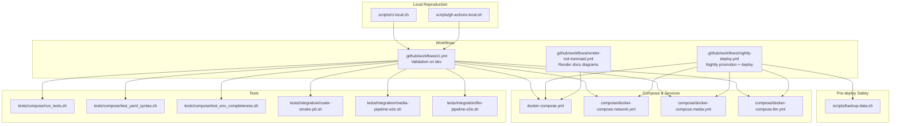

**Diagram sources**
- [ci.yml:1-117](file://.github/workflows/ci.yml#L1-L117)
- [nightly-deploy.yml:1-232](file://.github/workflows/nightly-deploy.yml#L1-L232)
- [render-md-mermaid.yml:1-30](file://.github/workflows/render-md-mermaid.yml#L1-L30)
- [ci-local.sh:1-222](file://scripts/ci-local.sh#L1-L222)
- [gh-actions-local.sh:1-38](file://scripts/gh-actions-local.sh#L1-L38)
- [backup-data.sh:1-50](file://scripts/backup-data.sh#L1-L50)
- [run_tests.sh:1-38](file://tests/compose/run_tests.sh#L1-L38)
- [test_yaml_syntax.sh:1-40](file://tests/compose/test_yaml_syntax.sh#L1-L40)
- [test_env_completeness.sh:1-65](file://tests/compose/test_env_completeness.sh#L1-L65)
- [router-smoke-p0.sh:1-92](file://tests/integration/router-smoke-p0.sh#L1-L92)
- [media-pipeline-e2e.sh:1-307](file://tests/integration/media-pipeline-e2e.sh#L1-L307)
- [llm-pipeline-e2e.sh:1-235](file://tests/integration/llm-pipeline-e2e.sh#L1-L235)
- [docker-compose.yml:1-13](file://docker-compose.yml#L1-L13)
- [docker-compose.network.yml:1-122](file://compose/docker-compose.network.yml#L1-L122)
- [docker-compose.media.yml:1-317](file://compose/docker-compose.media.yml#L1-L317)
- [docker-compose.llm.yml:1-169](file://compose/docker-compose.llm.yml#L1-L169)

**Section sources**
- [README.md: CI/CD section:232-321](file://README.md#L232-L321)
- [.github/workflows/ci.yml:1-117](file://.github/workflows/ci.yml#L1-L117)
- [.github/workflows/nightly-deploy.yml:1-232](file://.github/workflows/nightly-deploy.yml#L1-L232)
- [scripts/ci-local.sh:1-222](file://scripts/ci-local.sh#L1-L222)
- [scripts/gh-actions-local.sh:1-38](file://scripts/gh-actions-local.sh#L1-L38)
- [scripts/backup-data.sh:1-50](file://scripts/backup-data.sh#L1-L50)
- [tests/compose/run_tests.sh:1-38](file://tests/compose/run_tests.sh#L1-L38)
- [tests/compose/test_yaml_syntax.sh:1-40](file://tests/compose/test_yaml_syntax.sh#L1-L40)
- [tests/compose/test_env_completeness.sh:1-65](file://tests/compose/test_env_completeness.sh#L1-L65)
- [tests/integration/router-smoke-p0.sh:1-92](file://tests/integration/router-smoke-p0.sh#L1-L92)
- [tests/integration/media-pipeline-e2e.sh:1-307](file://tests/integration/media-pipeline-e2e.sh#L1-L307)
- [tests/integration/llm-pipeline-e2e.sh:1-235](file://tests/integration/llm-pipeline-e2e.sh#L1-L235)
- [docker-compose.yml:1-13](file://docker-compose.yml#L1-L13)
- [compose/docker-compose.network.yml:1-122](file://compose/docker-compose.network.yml#L1-L122)
- [compose/docker-compose.media.yml:1-317](file://compose/docker-compose.media.yml#L1-L317)
- [compose/docker-compose.llm.yml:1-169](file://compose/docker-compose.llm.yml#L1-L169)

## Core Components
- Validation pipeline (dev branch)
  - Compose configuration validation across included stacks
  - Shell tests for compose correctness
  - Python virtual environment creation and dependency installation
  - pytest execution for workers and media-agent packages
  - Ruff linting for both packages
  - Local Docker image builds
  - Bash syntax checks across scripts
  - README Mermaid block verification
- Nightly deployment (main branch)
  - Conditional execution based on new commits and CI status
  - Fast-forward or merge-when-diverged strategy for dev → main promotion
  - Production directory sync and pre-flight backup of ./data/
  - Pull and deploy with compose up -d --build
  - Healthcheck gating (up to 300s)
  - Integration E2E tests
  - Automatic rollback on failure with issue creation
- Local automation
  - scripts/ci-local.sh mirrors the CI workflow and supports scoped runs
  - scripts/gh-actions-local.sh runs a selected job locally via act

**Section sources**
- [.github/workflows/ci.yml:1-117](file://.github/workflows/ci.yml#L1-L117)
- [.github/workflows/nightly-deploy.yml:1-232](file://.github/workflows/nightly-deploy.yml#L1-L232)
- [scripts/ci-local.sh:1-222](file://scripts/ci-local.sh#L1-L222)
- [scripts/gh-actions-local.sh:1-38](file://scripts/gh-actions-local.sh#L1-L38)
- [scripts/backup-data.sh:1-50](file://scripts/backup-data.sh#L1-L50)

## Architecture Overview
The CI/CD flow connects development, validation, promotion, and deployment with safety gates and rollback.

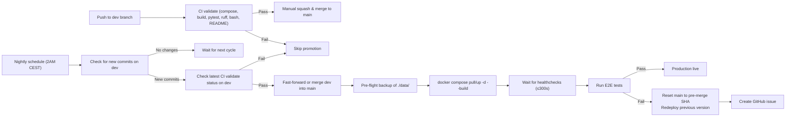

**Diagram sources**
- [.github/workflows/ci.yml:1-117](file://.github/workflows/ci.yml#L1-L117)
- [.github/workflows/nightly-deploy.yml:1-232](file://.github/workflows/nightly-deploy.yml#L1-L232)
- [scripts/backup-data.sh:1-50](file://scripts/backup-data.sh#L1-L50)

**Section sources**
- [README.md: CI/CD flow:232-321](file://README.md#L232-L321)
- [.github/workflows/ci.yml:1-117](file://.github/workflows/ci.yml#L1-L117)
- [.github/workflows/nightly-deploy.yml:1-232](file://.github/workflows/nightly-deploy.yml#L1-L232)

## Detailed Component Analysis

### Validation Pipeline (.github/workflows/ci.yml)
- Triggers: push to dev and pull requests
- Steps:
  - Compose config validation across root and included stacks
  - Compose shell tests
  - Python venv creation and dependency installs for workers and media-agent
  - pytest runs for workers, media-agent, and package tests
  - Ruff linting for both packages
  - Local Docker image builds
  - Bash syntax checks for scripts and tests
  - README Mermaid block presence check

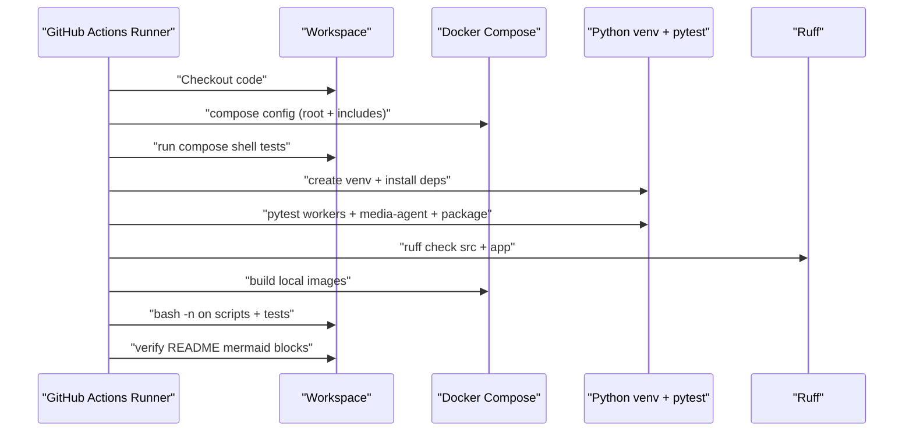

**Diagram sources**
- [.github/workflows/ci.yml:1-117](file://.github/workflows/ci.yml#L1-L117)

**Section sources**
- [.github/workflows/ci.yml:1-117](file://.github/workflows/ci.yml#L1-L117)

### Nightly Deployment Workflow (.github/workflows/nightly-deploy.yml)
- Triggers: schedule at midnight UTC (2 AM CEST) and workflow_dispatch
- Safety checks:
  - Compare dev and main SHAs to skip if unchanged
  - Verify latest CI validate on dev succeeded
- Promotion:
  - Fast-forward merge if dev is strictly ahead; otherwise merge with a merge commit
- Post-merge actions:
  - Sync production directory to main
  - Pre-flight backup of ./data/ to MEDIA_HDD_PATH/backups
  - Pull images and deploy with compose up -d --build
  - Healthcheck gating (polling for healthy/unhealthy/none)
  - Run E2E tests
  - Rollback on failure: reset main to pre-merge SHA, redeploy previous version, create issue

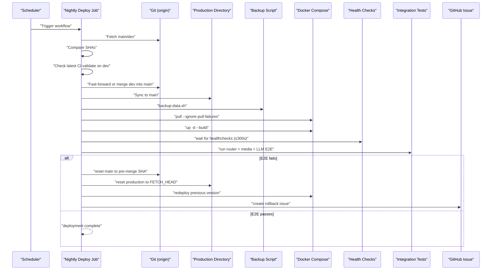

**Diagram sources**
- [.github/workflows/nightly-deploy.yml:1-232](file://.github/workflows/nightly-deploy.yml#L1-L232)
- [scripts/backup-data.sh:1-50](file://scripts/backup-data.sh#L1-L50)

**Section sources**
- [.github/workflows/nightly-deploy.yml:1-232](file://.github/workflows/nightly-deploy.yml#L1-L232)
- [scripts/backup-data.sh:1-50](file://scripts/backup-data.sh#L1-L50)

### Compose Validation and Environment Completeness
- tests/compose/run_tests.sh orchestrates a suite of shell-based checks
- tests/compose/test_yaml_syntax.sh validates compose config across included files
- tests/compose/test_env_completeness.sh ensures all referenced variables are defined in .env.example or have inline defaults

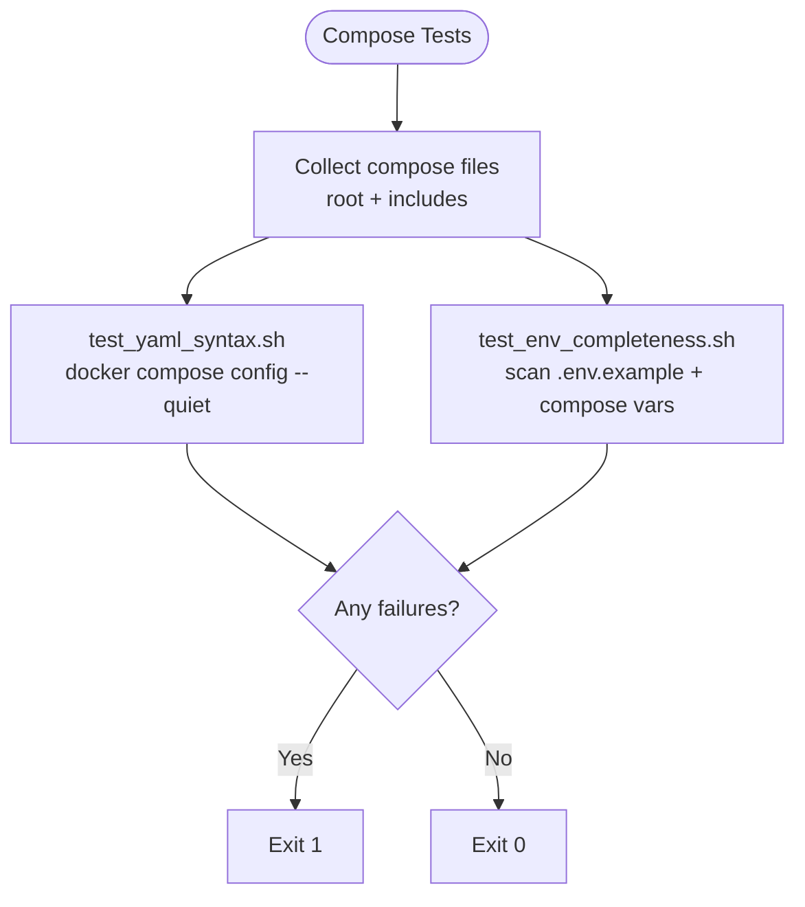

**Diagram sources**
- [tests/compose/run_tests.sh:1-38](file://tests/compose/run_tests.sh#L1-L38)
- [tests/compose/test_yaml_syntax.sh:1-40](file://tests/compose/test_yaml_syntax.sh#L1-L40)
- [tests/compose/test_env_completeness.sh:1-65](file://tests/compose/test_env_completeness.sh#L1-L65)

**Section sources**
- [tests/compose/run_tests.sh:1-38](file://tests/compose/run_tests.sh#L1-L38)
- [tests/compose/test_yaml_syntax.sh:1-40](file://tests/compose/test_yaml_syntax.sh#L1-L40)
- [tests/compose/test_env_completeness.sh:1-65](file://tests/compose/test_env_completeness.sh#L1-L65)

### Docker Build Processes
- CI validates local image builds for all services
- Nightly deploys with compose pull (ignoring failures for local images) followed by compose up -d --build
- Root compose file includes network, media, and LLM stacks

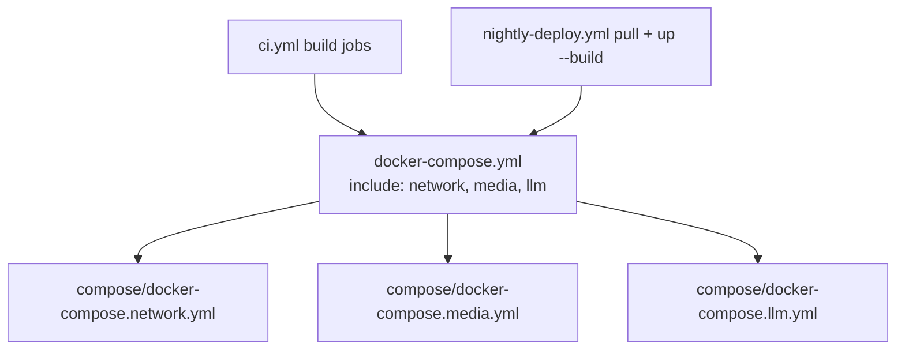

**Diagram sources**
- [docker-compose.yml:1-13](file://docker-compose.yml#L1-L13)
- [docker-compose.network.yml:1-122](file://compose/docker-compose.network.yml#L1-L122)
- [docker-compose.media.yml:1-317](file://compose/docker-compose.media.yml#L1-L317)
- [docker-compose.llm.yml:1-169](file://compose/docker-compose.llm.yml#L1-L169)
- [.github/workflows/ci.yml:76-79](file://.github/workflows/ci.yml#L76-L79)
- [.github/workflows/nightly-deploy.yml:140-141](file://.github/workflows/nightly-deploy.yml#L140-L141)

**Section sources**
- [.github/workflows/ci.yml:76-79](file://.github/workflows/ci.yml#L76-L79)
- [.github/workflows/nightly-deploy.yml:140-141](file://.github/workflows/nightly-deploy.yml#L140-L141)
- [docker-compose.yml:1-13](file://docker-compose.yml#L1-L13)

### pytest Execution and Linting
- CI runs pytest for workers, media-agent, and package tests
- Ruff checks source directories for both packages
- Local mirror supports scoped runs for tests and linting

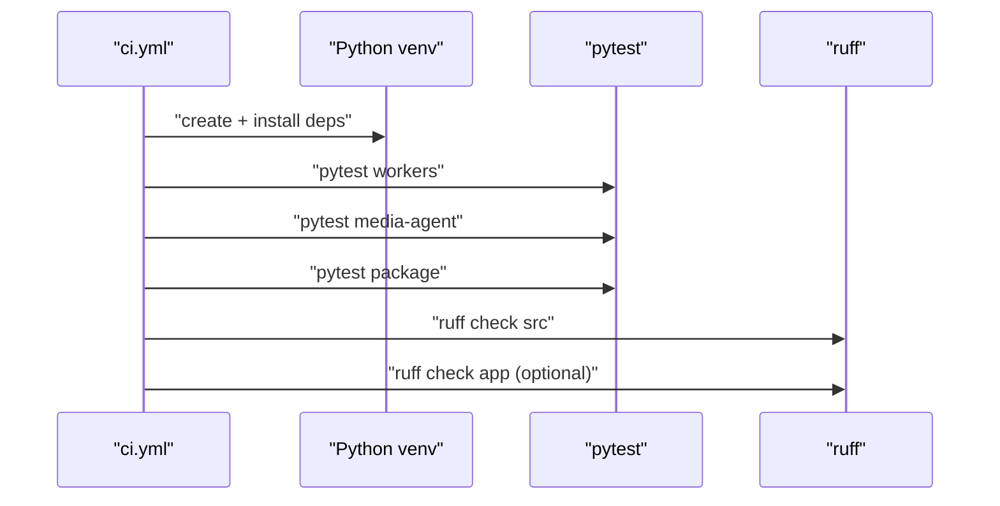

**Diagram sources**
- [.github/workflows/ci.yml:48-74](file://.github/workflows/ci.yml#L48-L74)
- [scripts/ci-local.sh:74-91](file://scripts/ci-local.sh#L74-L91)

**Section sources**
- [.github/workflows/ci.yml:48-74](file://.github/workflows/ci.yml#L48-L74)
- [scripts/ci-local.sh:54-91](file://scripts/ci-local.sh#L54-L91)

### Automated Backup and Rollback Procedures
- Pre-flight backup archives ./data/ to MEDIA_HDD_PATH/backups with retention pruning
- Rollback resets main to pre-merge SHA, updates production directory, and redeployed previous version
- Creates a GitHub issue summarizing the failure and rollback

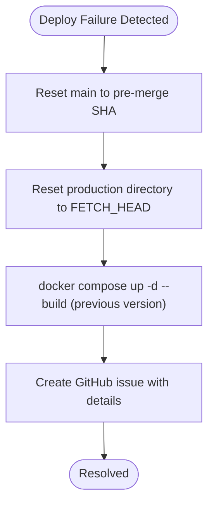

**Diagram sources**
- [.github/workflows/nightly-deploy.yml:187-210](file://.github/workflows/nightly-deploy.yml#L187-L210)
- [scripts/backup-data.sh:1-50](file://scripts/backup-data.sh#L1-L50)

**Section sources**
- [.github/workflows/nightly-deploy.yml:105-141](file://.github/workflows/nightly-deploy.yml#L105-L141)
- [scripts/backup-data.sh:1-50](file://scripts/backup-data.sh#L1-L50)

### Integration Between Local Development and Production Deployment
- Local CI mirror (scripts/ci-local.sh) supports:
  - compose, tests, build, e2e, and nightly scopes
  - healthcheck gating and E2E suites
- GitHub Actions runner emulation (scripts/gh-actions-local.sh) runs a selected job locally via act

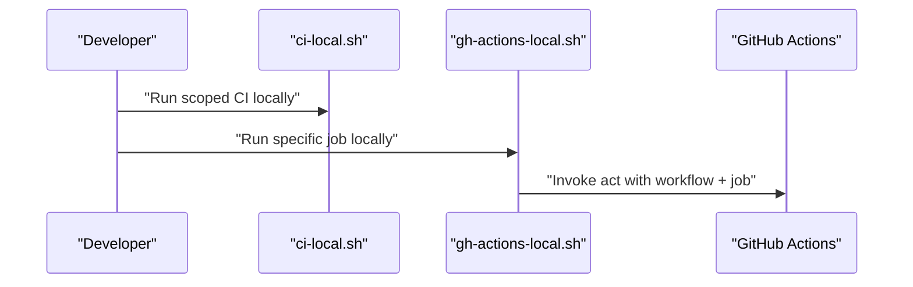

**Diagram sources**
- [scripts/ci-local.sh:1-222](file://scripts/ci-local.sh#L1-L222)
- [scripts/gh-actions-local.sh:1-38](file://scripts/gh-actions-local.sh#L1-L38)

**Section sources**
- [scripts/ci-local.sh:1-222](file://scripts/ci-local.sh#L1-L222)
- [scripts/gh-actions-local.sh:1-38](file://scripts/gh-actions-local.sh#L1-L38)

### E2E Testing Strategies
- Router smoke gate validates media-agent router behavior
- Media pipeline E2E requests content through Overseerr → Sonarr/Radarr → qBittorrent
- LLM pipeline E2E sends natural language requests through OpenClaw gateway → media-agent → Prowlarr → qBittorrent

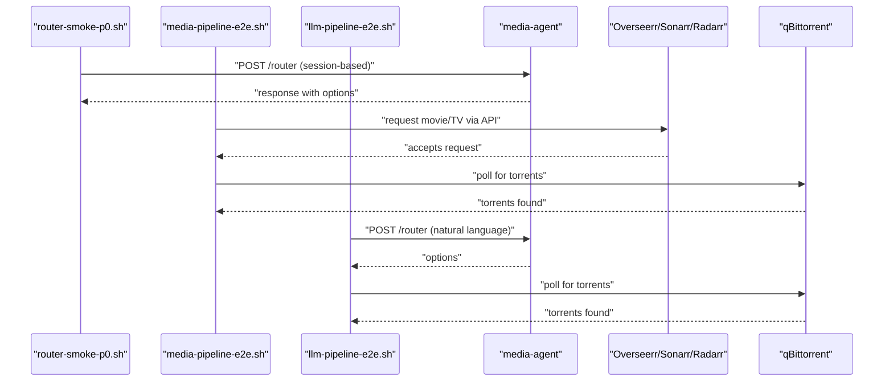

**Diagram sources**
- [tests/integration/router-smoke-p0.sh:1-92](file://tests/integration/router-smoke-p0.sh#L1-L92)
- [tests/integration/media-pipeline-e2e.sh:1-307](file://tests/integration/media-pipeline-e2e.sh#L1-L307)
- [tests/integration/llm-pipeline-e2e.sh:1-235](file://tests/integration/llm-pipeline-e2e.sh#L1-L235)

**Section sources**
- [tests/integration/router-smoke-p0.sh:1-92](file://tests/integration/router-smoke-p0.sh#L1-L92)
- [tests/integration/media-pipeline-e2e.sh:1-307](file://tests/integration/media-pipeline-e2e.sh#L1-L307)
- [tests/integration/llm-pipeline-e2e.sh:1-235](file://tests/integration/llm-pipeline-e2e.sh#L1-L235)

## Dependency Analysis
- Workflow dependencies
  - nightly-deploy.yml depends on ci.yml status and git history
  - All workflows depend on compose files and environment variables
- Compose stack dependencies
  - Root compose includes network, media, and LLM stacks
  - Services define healthchecks and interdependencies (e.g., OpenClaw gateway depends on Ollama)

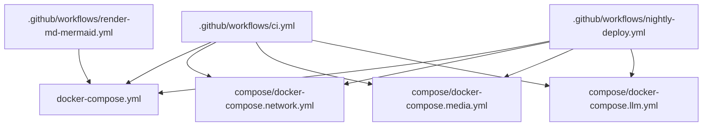

**Diagram sources**
- [.github/workflows/ci.yml:1-117](file://.github/workflows/ci.yml#L1-L117)
- [.github/workflows/nightly-deploy.yml:1-232](file://.github/workflows/nightly-deploy.yml#L1-L232)
- [.github/workflows/render-md-mermaid.yml:1-30](file://.github/workflows/render-md-mermaid.yml#L1-L30)
- [docker-compose.yml:1-13](file://docker-compose.yml#L1-L13)
- [compose/docker-compose.network.yml:1-122](file://compose/docker-compose.network.yml#L1-L122)
- [compose/docker-compose.media.yml:1-317](file://compose/docker-compose.media.yml#L1-L317)
- [compose/docker-compose.llm.yml:1-169](file://compose/docker-compose.llm.yml#L1-L169)

**Section sources**
- [.github/workflows/ci.yml:1-117](file://.github/workflows/ci.yml#L1-L117)
- [.github/workflows/nightly-deploy.yml:1-232](file://.github/workflows/nightly-deploy.yml#L1-L232)
- [.github/workflows/render-md-mermaid.yml:1-30](file://.github/workflows/render-md-mermaid.yml#L1-L30)
- [docker-compose.yml:1-13](file://docker-compose.yml#L1-L13)

## Performance Considerations
- Compose validation and build steps are lightweight and fast; keep them minimal to reduce CI duration
- Healthcheck polling waits up to 300s; ensure services are optimized for quick startup
- Backup compression excludes large model blobs to reduce backup time and disk usage
- Prefer fast-forward merges when possible to minimize merge conflicts and redeploys

## Troubleshooting Guide
Common issues and remedies:
- CI validation failures
  - Review compose config and environment variable completeness
  - Ensure local Python dependencies are installed and pytest passes
- Nightly deploy skips
  - Verify dev has new commits and latest CI validate on dev is success
- Backup failures
  - Confirm MEDIA_HDD_PATH/backups is writable and accessible
- Healthcheck timeouts
  - Check service logs and resource limits; adjust mem_limit/pids_limit if needed
- Rollback behavior
  - Nightly deploy resets main to pre-merge SHA and redeploys previous version
  - A GitHub issue is created with failure details

**Section sources**
- [.github/workflows/nightly-deploy.yml:38-67](file://.github/workflows/nightly-deploy.yml#L38-L67)
- [scripts/backup-data.sh:117-129](file://scripts/backup-data.sh#L117-L129)
- [tests/integration/router-smoke-p0.sh:1-92](file://tests/integration/router-smoke-p0.sh#L1-L92)
- [tests/integration/media-pipeline-e2e.sh:1-307](file://tests/integration/media-pipeline-e2e.sh#L1-L307)
- [tests/integration/llm-pipeline-e2e.sh:1-235](file://tests/integration/llm-pipeline-e2e.sh#L1-L235)

## Conclusion
The CI/CD pipeline establishes a robust cadence for validating changes on dev and promoting them to production nightly with strong safety nets. Compose validation, Docker builds, pytest, and linting occur in CI; nightly deployment adds pre-flight backup, healthcheck gating, and E2E tests with automatic rollback and issue creation. The local automation tools enable contributors to reproduce and debug workflows efficiently.

## Appendices

### Practical Examples and Customization
- Customize CI scope locally
  - Run compose-only checks, tests-only, build-only, or full nightly simulation
- Emulate GitHub Actions locally
  - Select a job and run it with act using the workflow file and event type
- Modify environment variables
  - Ensure .env.example reflects all compose variables; tests/compose/test_env_completeness.sh enforces this

**Section sources**
- [scripts/ci-local.sh:1-222](file://scripts/ci-local.sh#L1-L222)
- [scripts/gh-actions-local.sh:1-38](file://scripts/gh-actions-local.sh#L1-L38)
- [tests/compose/test_env_completeness.sh:1-65](file://tests/compose/test_env_completeness.sh#L1-L65)