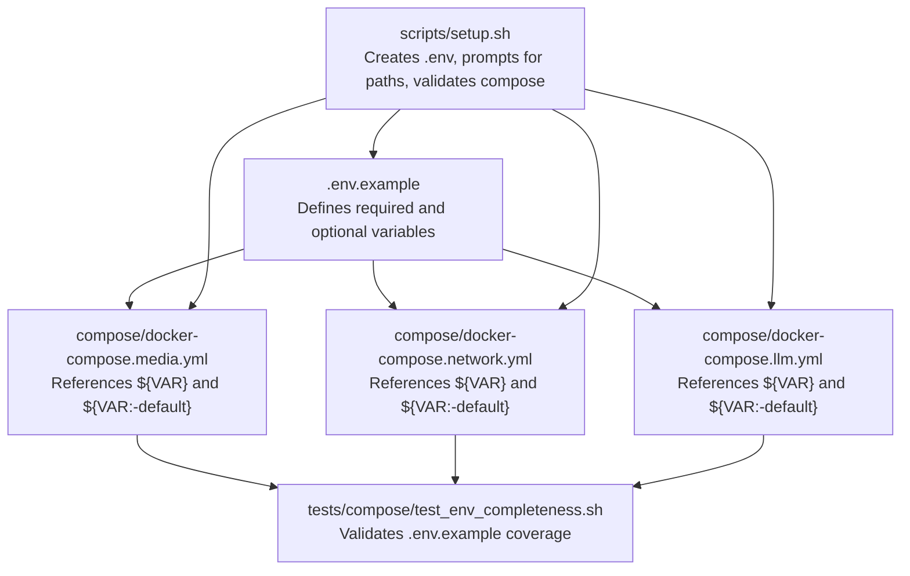
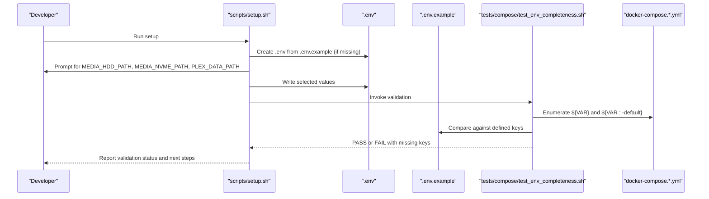
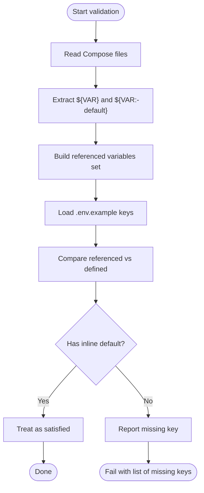
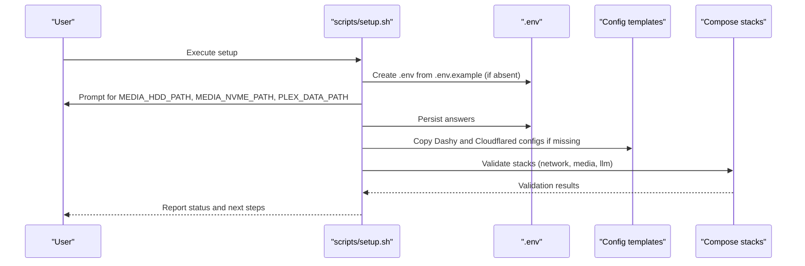
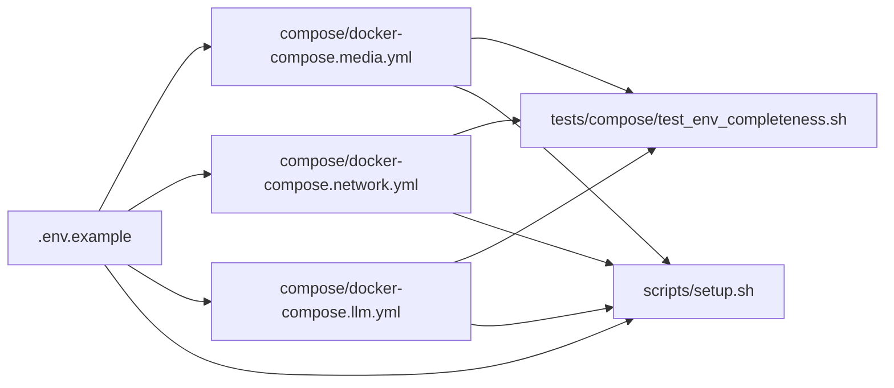

# Configuration and Environment Management

<cite>
**Referenced Files in This Document**
- [docker-compose.media.yml](file://compose/docker-compose.media.yml)
- [docker-compose.network.yml](file://compose/docker-compose.network.yml)
- [docker-compose.llm.yml](file://compose/docker-compose.llm.yml)
- [test_env_completeness.sh](file://tests/compose/test_env_completeness.sh)
- [setup.sh](file://scripts/setup.sh)
- [dotenv.py](file://src/homelab_workers/src/homelab_workers/shared/dotenv.py)
- [SECURITY_AUDIT.md](file://scripts/hardening/SECURITY_AUDIT.md)
- [config.yml.example](file://config/cloudflared/config.yml.example)
- [conf.yml.example](file://config/dashy/conf.yml.example)
</cite>

## Table of Contents
1. [Introduction](#introduction)
2. [Project Structure](#project-structure)
3. [Core Components](#core-components)
4. [Architecture Overview](#architecture-overview)
5. [Detailed Component Analysis](#detailed-component-analysis)
6. [Dependency Analysis](#dependency-analysis)
7. [Performance Considerations](#performance-considerations)
8. [Troubleshooting Guide](#troubleshooting-guide)
9. [Conclusion](#conclusion)

## Introduction
This document explains how the homelab manages configuration and environment variables across services. It covers the core environment contract defined in .env.example, required and optional variables, configuration inheritance via Compose variable substitution, and security considerations for secrets. It also provides practical examples for customizing the environment, validating completeness, and following best practices for managing sensitive values.

## Project Structure
The environment system spans three primary areas:
- Environment contract definition: .env.example
- Runtime composition: docker-compose.*.yml files that reference variables
- Tooling: tests and scripts that validate and scaffold environment usage

**Diagram sources**
- [docker-compose.media.yml:1-317](file://compose/docker-compose.media.yml#L1-L317)
- [docker-compose.network.yml:1-122](file://compose/docker-compose.network.yml#L1-L122)
- [docker-compose.llm.yml:1-169](file://compose/docker-compose.llm.yml#L1-L169)
- [test_env_completeness.sh:1-65](file://tests/compose/test_env_completeness.sh#L1-L65)
- [setup.sh:1-234](file://scripts/setup.sh#L1-L234)

**Section sources**
- [docker-compose.media.yml:1-317](file://compose/docker-compose.media.yml#L1-L317)
- [docker-compose.network.yml:1-122](file://compose/docker-compose.network.yml#L1-L122)
- [docker-compose.llm.yml:1-169](file://compose/docker-compose.llm.yml#L1-L169)
- [test_env_completeness.sh:1-65](file://tests/compose/test_env_completeness.sh#L1-L65)
- [setup.sh:1-234](file://scripts/setup.sh#L1-L234)

## Core Components
- Environment contract (.env.example): Lists required and optional variables with inline defaults where applicable. It serves as the single source of truth for configuration.
- Compose variable substitution: Services reference variables using ${VAR} for required values and ${VAR:-default} for optional values. This enables flexible overrides while preserving safe defaults.
- Validation pipeline: A test script enumerates all variables referenced in Compose files and ensures they are present in .env.example or have inline defaults.
- Scaffolding and setup: A script initializes .env from .env.example, prompts for host paths, copies configuration templates, and validates Compose stacks.

Key environment categories:
- Required identity and timezone: PUID, PGID, TZ
- Domain and routing: BASE_DOMAIN
- Media storage paths: MEDIA_HDD_PATH, MEDIA_NVME_PATH, PLEX_DATA_PATH
- Optional service credentials and tokens: Arr API keys, qBittorrent credentials, OpenClaw tokens, media-agent tokens, provider API keys
- Optional service configuration: CADDY_IMAGE, DASHY_CONFIG_PATH, CLOUDFLARED_CONFIG_PATH, etc.

Practical usage examples:
- Customize media paths: Set MEDIA_HDD_PATH and MEDIA_NVME_PATH to match your host storage layout.
- Enable optional services: Provide TELEGRAM_BOT_TOKEN or GEMINI_API_KEY only when integrating OpenClaw with those providers.
- Secure tokens: Supply MEDIA_AGENT_TOKEN and QBITTORRENT_* credentials only when needed by your workflow.

**Section sources**
- [docker-compose.media.yml:15-317](file://compose/docker-compose.media.yml#L15-L317)
- [docker-compose.network.yml:20-122](file://compose/docker-compose.network.yml#L20-L122)
- [docker-compose.llm.yml:72-169](file://compose/docker-compose.llm.yml#L72-L169)
- [test_env_completeness.sh:23-64](file://tests/compose/test_env_completeness.sh#L23-L64)
- [setup.sh:87-92](file://scripts/setup.sh#L87-L92)

## Architecture Overview
The environment architecture centers on a layered approach:
- Contract layer: .env.example defines the canonical set of variables.
- Composition layer: Compose files reference variables with optional defaults.
- Validation layer: A test ensures no Compose variable is missing from .env.example unless it has an inline default.
- Operational layer: A setup script creates .env, prompts for required paths, and validates stacks.

**Diagram sources**
- [setup.sh:87-92](file://scripts/setup.sh#L87-L92)
- [setup.sh:219-223](file://scripts/setup.sh#L219-L223)
- [test_env_completeness.sh:27-64](file://tests/compose/test_env_completeness.sh#L27-L64)
- [docker-compose.media.yml:75-76](file://compose/docker-compose.media.yml#L75-L76)
- [docker-compose.llm.yml:106-107](file://compose/docker-compose.llm.yml#L106-L107)

## Detailed Component Analysis

### Environment Contract Definition
- Purpose: Define the canonical set of variables consumed by Compose stacks.
- Required identity/timezone: PUID, PGID, TZ
- Domain and routing: BASE_DOMAIN
- Media storage: MEDIA_HDD_PATH, MEDIA_NVME_PATH, PLEX_DATA_PATH
- Optional service credentials and tokens: Arr API keys, qBittorrent credentials, OpenClaw tokens, media-agent tokens, provider API keys
- Optional service configuration: CADDY_IMAGE, DASHY_CONFIG_PATH, CLOUDFLARED_CONFIG_PATH, etc.

Validation behavior:
- The test enumerates all variables referenced in Compose files and compares them to keys defined in .env.example.
- Variables with inline defaults (${VAR:-default}) are treated as satisfied even if not present in .env.example.

Security note:
- The security audit highlights gaps between .env and .env.example, including undocumented secrets in .env. Keep .env.example synchronized to avoid drift.

**Section sources**
- [SECURITY_AUDIT.md:115-138](file://scripts/hardening/SECURITY_AUDIT.md#L115-L138)
- [test_env_completeness.sh:27-64](file://tests/compose/test_env_completeness.sh#L27-L64)

### Compose Variable Substitution and Inheritance
Compose supports two forms:
- Required substitution: ${VAR} — fails if unset
- Optional substitution: ${VAR:-default} — uses default if unset

Examples across stacks:
- Media stack: ${MEDIA_HDD_PATH:-/mnt/media-hdd}, ${MEDIA_NVME_PATH:-/mnt/media-nvme}, ${PLEX_DATA_PATH:-/srv/plex}
- Network stack: ${BASE_DOMAIN}, ${CADDY_IMAGE:-local/caddy-cf:latest}, ${CLOUDFLARE_TOKEN}
- LLM stack: ${OPENCLAW_GATEWAY_PORT:-18789}, ${OPENCLAW_BRIDGE_PORT:-18790}, ${OLLAMA_API_KEY:-ollama-local}

Compose inheritance:
- Variables can be overridden per stack by setting them in .env or passing them at runtime.
- Inline defaults in Compose provide sensible fallbacks when .env lacks a value.

**Section sources**
- [docker-compose.media.yml:75-76](file://compose/docker-compose.media.yml#L75-L76)
- [docker-compose.media.yml:186-191](file://compose/docker-compose.media.yml#L186-L191)
- [docker-compose.network.yml:21-22](file://compose/docker-compose.network.yml#L21-L22)
- [docker-compose.network.yml:92-93](file://compose/docker-compose.network.yml#L92-L93)
- [docker-compose.llm.yml:70-71](file://compose/docker-compose.llm.yml#L70-L71)
- [docker-compose.llm.yml:106-107](file://compose/docker-compose.llm.yml#L106-L107)

### Configuration Validation Pipeline
The validation pipeline:
- Scans docker-compose.yml and supporting stacks for ${VAR} and ${VAR:-default}
- Compiles a set of referenced variables
- Compares against keys defined in .env.example
- Flags missing keys unless they have inline defaults

**Diagram sources**
- [test_env_completeness.sh:27-64](file://tests/compose/test_env_completeness.sh#L27-L64)

**Section sources**
- [test_env_completeness.sh:1-65](file://tests/compose/test_env_completeness.sh#L1-L65)

### Scaffolding and Environment Initialization
The setup script:
- Creates .env from .env.example if missing
- Prompts for MEDIA_HDD_PATH, MEDIA_NVME_PATH, PLEX_DATA_PATH
- Copies configuration templates for services (Dashy, Cloudflared)
- Validates Compose stacks across multiple profiles

**Diagram sources**
- [setup.sh:87-92](file://scripts/setup.sh#L87-L92)
- [setup.sh:110-127](file://scripts/setup.sh#L110-L127)
- [setup.sh:152-175](file://scripts/setup.sh#L152-L175)

**Section sources**
- [setup.sh:87-92](file://scripts/setup.sh#L87-L92)
- [setup.sh:110-127](file://scripts/setup.sh#L110-L127)
- [setup.sh:152-175](file://scripts/setup.sh#L152-L175)

### Optional Variables for Service-Specific Configurations
Optional variables commonly used across stacks:
- Arr API keys: SONARR_API_KEY, RADARR_API_KEY, READARR_API_KEY, PROWLARR_API_KEY
- qBittorrent credentials: QBITTORRENT_USERNAME, QBITTORRENT_PASSWORD, QBITTORRENT_INTERNAL_URL
- OpenClaw tokens and providers: OPENCLAW_GATEWAY_TOKEN, TELEGRAM_BOT_TOKEN, GEMINI_API_KEY, GOOGLE_API_KEY, CLAUDE_* cookies/session keys
- media-agent tokens: MEDIA_AGENT_TOKEN, MEDIA_AGENT_URL
- Provider-specific URLs: SONARR_URL, RADARR_URL, READARR_URL, PROWLARR_URL

Best practices:
- Only define variables you actually use to reduce risk.
- Prefer inline defaults for optional variables to maintain stack operability.
- Store sensitive values in .env and protect them with appropriate file permissions.

**Section sources**
- [docker-compose.media.yml:286-303](file://compose/docker-compose.media.yml#L286-L303)
- [docker-compose.llm.yml:89-101](file://compose/docker-compose.llm.yml#L89-L101)
- [docker-compose.llm.yml:142-157](file://compose/docker-compose.llm.yml#L142-L157)
- [SECURITY_AUDIT.md:115-138](file://scripts/hardening/SECURITY_AUDIT.md#L115-L138)

### Practical Examples
- Customizing media storage:
  - Set MEDIA_HDD_PATH and MEDIA_NVME_PATH to your host paths.
  - Confirm mounts in services like Plex, Sonarr, Radarr, Readarr, and qBittorrent.
- Enabling OpenClaw with Telegram:
  - Provide TELEGRAM_BOT_TOKEN and optionally GEMINI_API_KEY.
  - Ensure MEDIA_AGENT_URL and MEDIA_AGENT_TOKEN are configured if using media-agent.
- Securing qBittorrent:
  - Set QBITTORRENT_USERNAME and QBITTORRENT_PASSWORD.
  - Optionally override QBITTORRENT_INTERNAL_URL if using a proxy.

**Section sources**
- [docker-compose.media.yml:75-76](file://compose/docker-compose.media.yml#L75-L76)
- [docker-compose.media.yml:186-191](file://compose/docker-compose.media.yml#L186-L191)
- [docker-compose.llm.yml:89-101](file://compose/docker-compose.llm.yml#L89-L101)

## Dependency Analysis
Environment variables propagate across layers:
- Compose files depend on .env.example for authoritative keys.
- Validation depends on Compose parsing to enumerate referenced variables.
- Setup depends on .env.example to scaffold .env and on Compose to validate stacks.

**Diagram sources**
- [docker-compose.media.yml:1-317](file://compose/docker-compose.media.yml#L1-L317)
- [docker-compose.network.yml:1-122](file://compose/docker-compose.network.yml#L1-L122)
- [docker-compose.llm.yml:1-169](file://compose/docker-compose.llm.yml#L1-L169)
- [test_env_completeness.sh:1-65](file://tests/compose/test_env_completeness.sh#L1-L65)
- [setup.sh:1-234](file://scripts/setup.sh#L1-L234)

**Section sources**
- [docker-compose.media.yml:1-317](file://compose/docker-compose.media.yml#L1-L317)
- [docker-compose.network.yml:1-122](file://compose/docker-compose.network.yml#L1-L122)
- [docker-compose.llm.yml:1-169](file://compose/docker-compose.llm.yml#L1-L169)
- [test_env_completeness.sh:1-65](file://tests/compose/test_env_completeness.sh#L1-L65)
- [setup.sh:1-234](file://scripts/setup.sh#L1-L234)

## Performance Considerations
- Prefer inline defaults for optional variables to avoid repeated environment lookups.
- Limit the number of optional variables in .env to reduce startup overhead and potential misconfiguration.
- Use targeted Compose profiles to minimize the number of services started during development.

## Troubleshooting Guide
Common issues and resolutions:
- Missing variable in .env.example:
  - Cause: A Compose file references ${VAR} without a corresponding key in .env.example.
  - Resolution: Add the key to .env.example with a blank default or remove the reference.
- Inline default not applied:
  - Cause: The variable is referenced as ${VAR} without a default.
  - Resolution: Provide a value in .env or add ${VAR:-default} in Compose.
- Drift between .env and .env.example:
  - Symptom: Security audit reports undocumented keys in .env.
  - Resolution: Align .env.example with actual .env and remove undocumented secrets.
- Template configuration not found:
  - Cause: Missing Dashy or Cloudflared config files.
  - Resolution: Use setup script to copy templates or place them under the expected paths.

Operational checks:
- Run the validation script to detect missing keys.
- Use setup script to initialize .env and validate Compose stacks.
- Verify service logs for environment-related startup failures.

**Section sources**
- [test_env_completeness.sh:56-64](file://tests/compose/test_env_completeness.sh#L56-L64)
- [SECURITY_AUDIT.md:115-138](file://scripts/hardening/SECURITY_AUDIT.md#L115-L138)
- [setup.sh:152-175](file://scripts/setup.sh#L152-L175)
- [config.yml.example:1-15](file://config/cloudflared/config.yml.example#L1-L15)
- [conf.yml.example:1-35](file://config/dashy/conf.yml.example#L1-L35)

## Conclusion
The homelab’s environment management relies on a clear contract in .env.example, robust Compose variable substitution, and automated validation. By following the outlined practices—keeping .env.example synchronized, using inline defaults for optionals, and limiting exposed secrets—you can maintain a secure, predictable, and extensible configuration system across your media, networking, and LLM stacks.