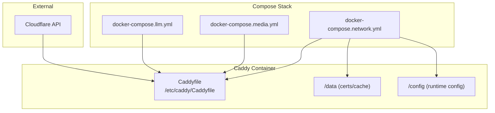
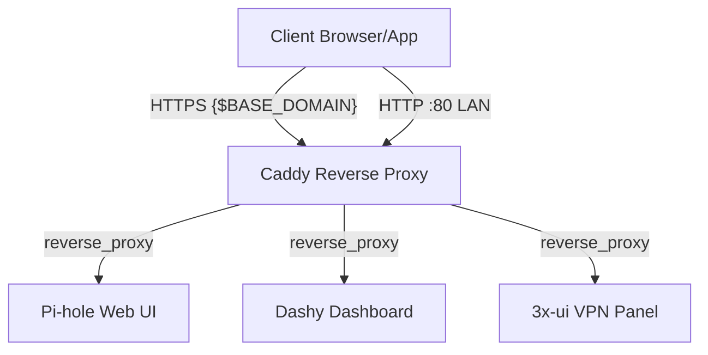
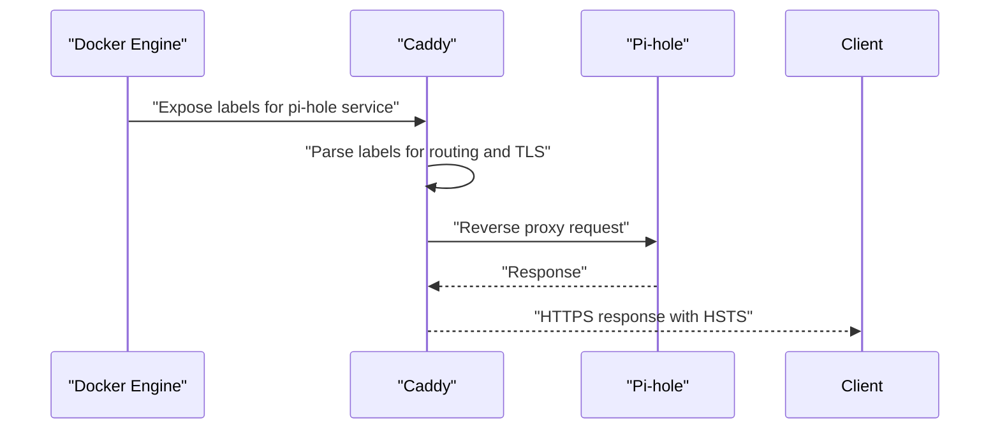
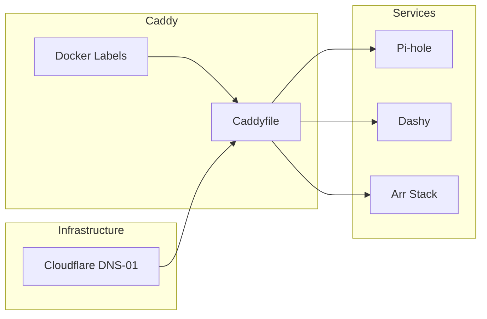

# Caddy Reverse Proxy

<cite>
**Referenced Files in This Document**
- [caddy/Caddyfile](file://caddy/Caddyfile)
- [compose/docker-compose.network.yml](file://compose/docker-compose.network.yml)
- [compose/docker-compose.media.yml](file://compose/docker-compose.media.yml)
- [compose/docker-compose.llm.yml](file://compose/docker-compose.llm.yml)
- [docs/caddy-guide.md](file://docs/caddy-guide.md)
- [docs/prowlarr-caddy-routing.md](file://docs/prowlarr-caddy-routing.md)
- [caddy/Dockerfile](file://caddy/Dockerfile)
</cite>

## Table of Contents
1. [Introduction](#introduction)
2. [Project Structure](#project-structure)
3. [Core Components](#core-components)
4. [Architecture Overview](#architecture-overview)
5. [Detailed Component Analysis](#detailed-component-analysis)
6. [Dependency Analysis](#dependency-analysis)
7. [Performance Considerations](#performance-considerations)
8. [Troubleshooting Guide](#troubleshooting-guide)
9. [Conclusion](#conclusion)

## Introduction
This document explains how the Caddy reverse proxy serves as the single source of truth for routing, TLS, and access control in the homelab. It covers:
- How Caddy terminates HTTPS and routes traffic to internal services
- How Docker-based services are exposed and discovered via Docker labels
- How TLS certificates are managed using Cloudflare DNS-01 challenges
- Security hardening via capability drops and privilege reduction
- Practical patterns for routing, service exposure, and troubleshooting

It targets both beginners who want a conceptual understanding of reverse proxies and experienced operators who need precise details about Caddyfile syntax, label-based routing, certificate management, and performance tuning.

## Project Structure
Caddy’s configuration is centralized in a single Caddyfile and orchestrated by Docker Compose. Supporting documentation explains the routing model, adding new services, and troubleshooting.

**Diagram sources**
- [compose/docker-compose.network.yml:8-33](file://compose/docker-compose.network.yml#L8-L33)
- [caddy/Caddyfile:1-225](file://caddy/Caddyfile#L1-L225)
- [docs/caddy-guide.md:1-133](file://docs/caddy-guide.md#L1-L133)

**Section sources**
- [compose/docker-compose.network.yml:8-33](file://compose/docker-compose.network.yml#L8-L33)
- [docs/caddy-guide.md:1-133](file://docs/caddy-guide.md#L1-L133)

## Core Components
- Caddy reverse proxy container with:
  - Read-only mount of the Caddyfile
  - Persistent storage for certificates and runtime config
  - Health checks against the admin API
  - Minimal privileges (capability drop, no-new-privileges)
- Compose services that expose themselves to Caddy via Docker labels:
  - Pi-hole, Dashy, and others define routing and TLS via labels
- Documentation that codifies routing rules, URL base handling, and troubleshooting

Key implementation details:
- Admin API enabled on port 2019 for live config inspection
- TLS managed by Cloudflare DNS-01 challenge using an environment variable token
- HSTS header applied globally on HTTPS blocks
- Compression enabled on primary domain and HTTP LAN block

**Section sources**
- [compose/docker-compose.network.yml:8-33](file://compose/docker-compose.network.yml#L8-L33)
- [caddy/Caddyfile:5-16](file://caddy/Caddyfile#L5-L16)
- [docs/caddy-guide.md:77-83](file://docs/caddy-guide.md#L77-L83)
- [docs/caddy-guide.md:126-133](file://docs/caddy-guide.md#L126-L133)

## Architecture Overview
Caddy acts as the front door for external and LAN traffic:
- HTTPS primary domain routes subpaths to media and utility services
- Dedicated subdomains route to host-network services (Plex, Jellyfin, Pi-hole)
- HTTP :80 routes mirror HTTPS subpath routes for LAN/Tailscale/IP access
- Services declare routing and TLS via Docker labels; Caddy reads them automatically

**Diagram sources**
- [compose/docker-compose.network.yml:56-61](file://compose/docker-compose.network.yml#L56-L61)
- [caddy/Caddyfile:11-87](file://caddy/Caddyfile#L11-L87)
- [caddy/Caddyfile:127-224](file://caddy/Caddyfile#L127-L224)

## Detailed Component Analysis

### Caddyfile: Single Source of Truth
- Global options enable the admin API and TLS with Cloudflare DNS-01
- Three top-level site blocks:
  - HTTPS primary domain with subpath routes for the Arr stack and utilities
  - HTTPS subdomains for host-network services
  - HTTP :80 LAN block mirroring subpath routes plus LAN-only extras
- Path-preserving vs path-stripping:
  - Use path-preserving directives for services with a configured URL base
  - Use path-stripping directives for services without URL base
- Header and compression policies applied consistently across HTTPS blocks

Practical patterns:
- Subpath routes for services with URL base (e.g., Sonarr/Radarr/Prowlarr/Readarr)
- Path-stripping routes for services without URL base (e.g., Overseerr, qBittorrent, Dashboard)
- Catch-all routes for dashboards and fallbacks

**Section sources**
- [caddy/Caddyfile:1-225](file://caddy/Caddyfile#L1-L225)
- [docs/caddy-guide.md:20-72](file://docs/caddy-guide.md#L20-L72)

### Label-Based Routing and Service Exposure
Caddy reads routing and TLS configuration from Docker labels:
- Example labels for Pi-hole:
  - Routing: a domain and path mapping to the service
  - Reverse proxy target: the service endpoint
  - TLS via DNS-01 with Cloudflare token
  - Security headers: HSTS enforcement

These labels allow services to self-declare their ingress without manual Caddyfile updates.

**Diagram sources**
- [compose/docker-compose.network.yml:56-61](file://compose/docker-compose.network.yml#L56-L61)
- [compose/docker-compose.network.yml:103-101](file://compose/docker-compose.network.yml#L103-L101)

**Section sources**
- [compose/docker-compose.network.yml:56-61](file://compose/docker-compose.network.yml#L56-L61)
- [docs/caddy-guide.md:7-8](file://docs/caddy-guide.md#L7-L8)

### TLS Certificate Management with Cloudflare
- DNS-01 challenge via Cloudflare DNS plugin
- Token supplied via environment variable mounted into the container
- Certificates stored persistently on disk for reuse and reduced issuance churn
- HSTS enforced on all HTTPS blocks

Operational notes:
- Ensure the Cloudflare token has appropriate permissions for DNS-01
- Persisted storage prevents rate limits and improves startup times

**Section sources**
- [caddy/Caddyfile:12-15](file://caddy/Caddyfile#L12-L15)
- [caddy/Caddyfile:92-95](file://caddy/Caddyfile#L92-L95)
- [docs/caddy-guide.md:77-83](file://docs/caddy-guide.md#L77-L83)

### Access Control and Security Hardening
- Caddy container:
  - Capability drop and no-new-privileges for minimal attack surface
  - Read-only Caddyfile mount
  - Health checks against admin API
- Services:
  - Many services apply capability drops and no-new-privileges
  - Some require specific capabilities for filesystem ownership or device access
  - Host-network services use explicit host networking for compatibility

Best practices:
- Prefer capability drops and least privilege
- Use persistent mounts for caches and certificates
- Enforce HSTS and compression for performance and security

**Section sources**
- [compose/docker-compose.network.yml:10-12](file://compose/docker-compose.network.yml#L10-L12)
- [compose/docker-compose.network.yml:68-69](file://compose/docker-compose.network.yml#L68-L69)
- [compose/docker-compose.media.yml:12-13](file://compose/docker-compose.media.yml#L12-L13)
- [docs/caddy-guide.md:126-133](file://docs/caddy-guide.md#L126-L133)

### Health Checks and Observability
- Caddy health check probes the admin API endpoint
- Services define their own health checks for readiness
- Live configuration inspection via the admin API for debugging

Operational tips:
- Validate Caddyfile syntax before restart
- Inspect live config to confirm effective routing
- Monitor service health checks to detect backend issues

**Section sources**
- [compose/docker-compose.network.yml:27-32](file://compose/docker-compose.network.yml#L27-L32)
- [docs/caddy-guide.md:94-107](file://docs/caddy-guide.md#L94-L107)

### URL Base Alignment: A Critical Routing Rule
- Services with a URL base expect the path prefix to be preserved
- Using a path-stripping directive with a URL base breaks asset loading and API sync
- The Prowlarr case demonstrates how misalignment affects downstream services

Fix checklist:
- Match directive type to service URL base
- Verify backend service configuration aligns with Caddy routing
- Confirm indexer sync after changes

**Section sources**
- [docs/prowlarr-caddy-routing.md:24-51](file://docs/prowlarr-caddy-routing.md#L24-L51)
- [docs/caddy-guide.md:22-27](file://docs/caddy-guide.md#L22-L27)

## Dependency Analysis
Caddy orchestrates traffic across multiple services. The following diagram shows how labels and routing interplay with service exposure and TLS.

**Diagram sources**
- [compose/docker-compose.network.yml:56-61](file://compose/docker-compose.network.yml#L56-L61)
- [caddy/Caddyfile:11-87](file://caddy/Caddyfile#L11-L87)

**Section sources**
- [compose/docker-compose.network.yml:56-61](file://compose/docker-compose.network.yml#L56-L61)
- [caddy/Caddyfile:11-87](file://caddy/Caddyfile#L11-L87)

## Performance Considerations
- Enable compression on high-traffic domains to reduce bandwidth
- Persist certificates and runtime config to avoid repeated issuance and reload overhead
- Prefer path-preserving routes for SPAs and services with URL base to minimize upstream path rewriting
- Keep admin API internal-only and restrict access to trusted networks

[No sources needed since this section provides general guidance]

## Troubleshooting Guide
Common symptoms and resolutions:
- 404 on subpath: verify directive matches service URL base
- Broken SPA assets: switch from path-stripping to path-preserving for services with URL base
- Service unreachable: confirm container name resolves and backend is healthy
- Host-network 502: allow Docker bridge subnet to host ports
- TLS errors: confirm Cloudflare token is present and correct

Operational commands:
- Validate Caddyfile syntax
- Inspect live configuration via admin API
- Review service health checks for backend failures

**Section sources**
- [docs/caddy-guide.md:94-117](file://docs/caddy-guide.md#L94-L117)

## Conclusion
Caddy centralizes routing, TLS, and access control for the homelab. By combining a single Caddyfile with label-driven service exposure, it achieves simplicity, reliability, and strong security defaults. Following the documented patterns—especially around URL base alignment and path-preserving routing—ensures smooth operation for both human users and automated integrations like indexer sync.