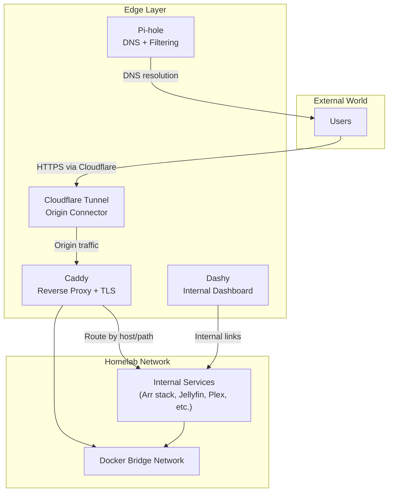
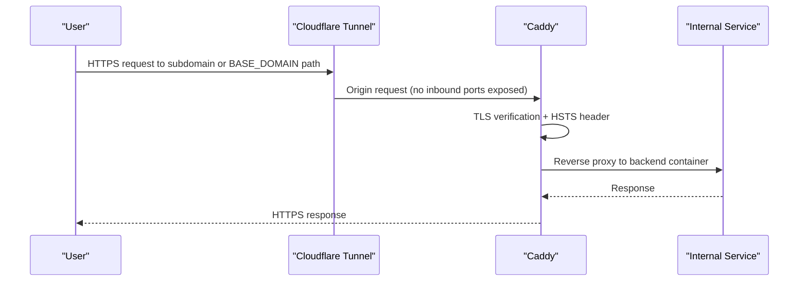
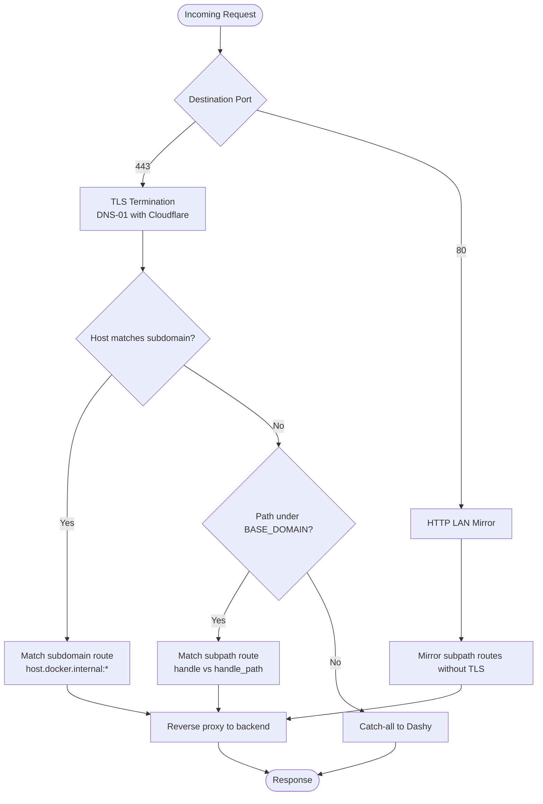
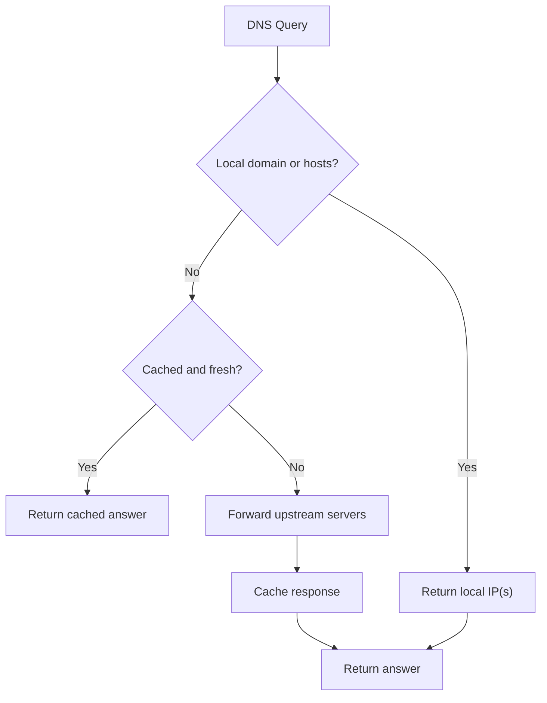
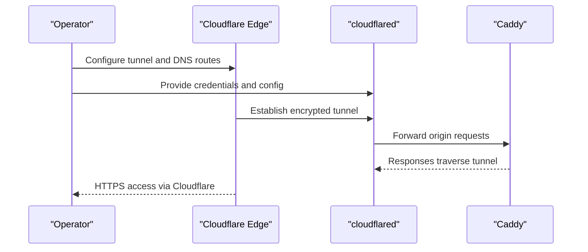
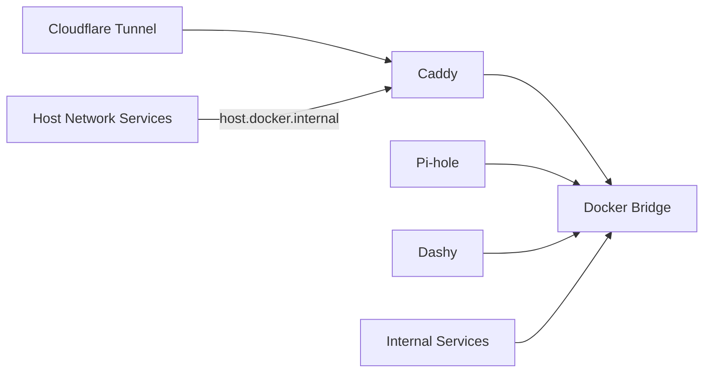

# Edge Services

<cite>
**Referenced Files in This Document**
- [docker-compose.network.yml](file://compose/docker-compose.network.yml)
- [Caddyfile](file://data/caddy/Caddyfile)
- [caddy-guide.md](file://docs/caddy-guide.md)
- [network-access.md](file://docs/network-access.md)
- [prowlarr-caddy-routing.md](file://docs/prowlarr-caddy-routing.md)
- [config.yml.example](file://config/cloudflared/config.yml.example)
- [README.md](file://data/cloudflared/README.md)
- [conf.yml.example](file://config/dashy/conf.yml.example)
- [conf.yml](file://data/dashy/conf.yml)
- [dnsmasq.conf](file://data/pihole/etc-pihole/dnsmasq.conf)
- [pihole.toml](file://data/pihole/etc-pihole/pihole.toml)
- [05-homelab-local.conf](file://data/pihole/etc-dnsmasq.d/05-homelab-local.conf)
</cite>

## Table of Contents
1. [Introduction](#introduction)
2. [Project Structure](#project-structure)
3. [Core Components](#core-components)
4. [Architecture Overview](#architecture-overview)
5. [Detailed Component Analysis](#detailed-component-analysis)
6. [Dependency Analysis](#dependency-analysis)
7. [Performance Considerations](#performance-considerations)
8. [Troubleshooting Guide](#troubleshooting-guide)
9. [Conclusion](#conclusion)
10. [Appendices](#appendices)

## Introduction
This document explains the Edge Services that form the perimeter of the homelab infrastructure. These services control external and internal access, enforce security policies, and provide a unified entry point for all applications:
- Caddy: reverse proxy, HTTPS termination, routing, and admin API
- Pi-hole: DNS filtering, ad blocking, and split-horizon DNS
- Cloudflare Tunnel: secure remote access without exposing inbound ports
- Dashy: internal dashboard for service monitoring and quick links

The guide balances beginner-friendly overviews with technical details for developers, including configuration options, security implications, and troubleshooting.

## Project Structure
Edge services are orchestrated via Docker Compose and documented in dedicated guides:
- Compose defines service placement, networking, and runtime constraints
- Caddy’s routing is centralized in a single Caddyfile
- Pi-hole’s DNS behavior is tuned via dnsmasq and pihole.toml
- Cloudflare Tunnel ingresses traffic securely using origin certificates
- Dashy presents a curated view of internal and external services

**Diagram sources**
- [docker-compose.network.yml](file://compose/docker-compose.network.yml)
- [caddy-guide.md](file://docs/caddy-guide.md)
- [README.md](file://data/cloudflared/README.md)
- [network-access.md](file://docs/network-access.md)

**Section sources**
- [docker-compose.network.yml](file://compose/docker-compose.network.yml)
- [network-access.md](file://docs/network-access.md)

## Core Components
- Caddy: Single-source-of-truth routing, HTTPS termination with Cloudflare DNS-01, admin API, and HSTS enforcement
- Pi-hole: Centralized DNS filtering, split-horizon DNS, and performance tuning via cache and logging
- Cloudflare Tunnel: Secure origin connector with ingress rules and origin certificate management
- Dashy: Internal dashboard with configurable sections and links to internal and external services

**Section sources**
- [caddy-guide.md](file://docs/caddy-guide.md)
- [network-access.md](file://docs/network-access.md)
- [README.md](file://data/cloudflared/README.md)
- [conf.yml.example](file://config/dashy/conf.yml.example)
- [conf.yml](file://data/dashy/conf.yml)

## Architecture Overview
The edge layer establishes a strict ingress perimeter:
- All external traffic enters via Cloudflare Tunnel and reaches Caddy
- Caddy terminates TLS, applies HSTS, and routes to internal services
- Pi-hole provides DNS filtering and split-horizon resolution for internal domains
- Dashy aggregates internal links and optionally mirrors public URLs

**Diagram sources**
- [README.md](file://data/cloudflared/README.md)
- [caddy-guide.md](file://docs/caddy-guide.md)
- [network-access.md](file://docs/network-access.md)

## Detailed Component Analysis

### Caddy Reverse Proxy and Routing
Caddy centralizes routing in a single Caddyfile, enabling:
- HTTPS primary domain with subpath routes for the Arr stack and utilities
- Dedicated subdomains for services requiring unique hostnames
- HTTP :80 LAN mirror for local access without TLS
- Admin API on :2019 for live configuration inspection
- Global HSTS and compression for performance and security

Key behaviors:
- Path-preserving vs path-stripping directives align with service UrlBase settings
- Host-network services (Plex, Jellyfin, Pi-hole) are proxied via host.docker.internal
- UFW must allow Docker bridge subnet to reach host-network ports

**Diagram sources**
- [caddy-guide.md](file://docs/caddy-guide.md)
- [network-access.md](file://docs/network-access.md)

**Section sources**
- [caddy-guide.md](file://docs/caddy-guide.md)
- [network-access.md](file://docs/network-access.md)
- [docker-compose.network.yml](file://compose/docker-compose.network.yml)

### Pi-hole DNS Filtering and Split-Horizon DNS
Pi-hole provides:
- DNS filtering and ad blocking via dnsmasq and gravity lists
- Split-horizon DNS: internal domains resolve to LAN IPs for local clients
- Tunable cache size, logging, and performance via pihole.toml and dnsmasq.conf
- Optional host-specific records for local resolution

Operational highlights:
- Cache size and stale cache optimization balance memory and freshness
- Logging enabled for diagnostics; log facility configured for visibility
- Special handling for RFC6761 domains and local domains to prevent leaks
- Local domain and host records ensure internal-only resolution

**Diagram sources**
- [dnsmasq.conf](file://data/pihole/etc-pihole/dnsmasq.conf)
- [pihole.toml](file://data/pihole/etc-pihole/pihole.toml)
- [05-homelab-local.conf](file://data/pihole/etc-dnsmasq.d/05-homelab-local.conf)

**Section sources**
- [dnsmasq.conf](file://data/pihole/etc-pihole/dnsmasq.conf)
- [pihole.toml](file://data/pihole/etc-pihole/pihole.toml)
- [05-homelab-local.conf](file://data/pihole/etc-dnsmasq.d/05-homelab-local.conf)

### Cloudflare Tunnel for Secure Remote Access
Cloudflare Tunnel eliminates inbound port exposure by connecting a lightweight origin connector to Cloudflare’s edge:
- Origin certificate and credentials managed under data/cloudflared
- Ingress rules define hostname-to-backend mappings
- Recommended permissions and ownership for credentials directory and files
- Troubleshooting guidance for 502/connection refused and UI rendering issues

**Diagram sources**
- [README.md](file://data/cloudflared/README.md)
- [config.yml.example](file://config/cloudflared/config.yml.example)

**Section sources**
- [README.md](file://data/cloudflared/README.md)
- [config.yml.example](file://config/cloudflared/config.yml.example)

### Dashy Dashboard Configuration and Customization
Dashy provides an internal dashboard with:
- Page metadata and app configuration (theme, layout, status checks)
- Sections for internal services reachable via Caddy paths
- Optional “Public” section for externally accessible URLs via Cloudflare
- Configurable icons and item ordering

Customization tips:
- Use absolute paths for internal links and HTTPS URLs for public services
- Disable write-to-disk and configuration editing for locked-down deployments
- Keep sections organized and icons consistent for usability

**Section sources**
- [conf.yml.example](file://config/dashy/conf.yml.example)
- [conf.yml](file://data/dashy/conf.yml)

## Dependency Analysis
Edge services interact through Docker networking and explicit runtime constraints:
- All services share a Docker bridge network except host-mode services
- Host-network services are proxied via host.docker.internal with explicit firewall allowances
- Caddy depends on Cloudflare credentials for DNS-01 challenges and stores certificates on persistent storage
- Pi-hole relies on dnsmasq and pihole.toml for behavior and cache tuning
- Dashy consumes Caddy routes for internal navigation

**Diagram sources**
- [docker-compose.network.yml](file://compose/docker-compose.network.yml)
- [network-access.md](file://docs/network-access.md)

**Section sources**
- [docker-compose.network.yml](file://compose/docker-compose.network.yml)
- [network-access.md](file://docs/network-access.md)

## Performance Considerations
- Caddy: Enable compression on primary domain and :80 blocks; leverage admin API for live config inspection
- Pi-hole: Tune cache size and stale cache optimization; enable query logging for diagnostics; avoid overly large cache sizes that degrade lookup performance
- Cloudflare Tunnel: Keep origin connector healthy with health checks; ensure credentials directory permissions are correct to avoid restart failures
- Dashy: Disable status checks if not needed; prefer minimal-dark theme for reduced overhead

[No sources needed since this section provides general guidance]

## Troubleshooting Guide
Common symptoms and resolutions:
- 404 on subpath routes: Ensure Caddyfile uses handle for services with UrlBase; align directive with service UrlBase
- SPA assets broken: Switch from handle_path to handle for services with UrlBase; set matching UrlBase in service config
- Host-network 502: Confirm UFW allows Docker bridge subnet to host ports; verify host.docker.internal mapping
- TLS errors: Validate Cloudflare token environment variable and DNS-01 challenge configuration
- Cloudflare 502/connection refused: Verify local backend availability on 127.0.0.1:<port>; ensure credentials permissions are correct
- Broken UI through Cloudflare: Disable browser optimizations (e.g., Rocket Loader) for affected hostnames

Operational commands:
- Validate Caddyfile syntax and inspect live config via admin API
- Inspect Docker network topology and service access patterns
- Review ingress rules and origin certificate setup for Cloudflare Tunnel

**Section sources**
- [caddy-guide.md](file://docs/caddy-guide.md)
- [prowlarr-caddy-routing.md](file://docs/prowlarr-caddy-routing.md)
- [network-access.md](file://docs/network-access.md)
- [README.md](file://data/cloudflared/README.md)

## Conclusion
The Edge Services layer creates a secure, centralized ingress perimeter:
- Caddy provides single-source-of-truth routing, TLS termination, and admin visibility
- Pi-hole enforces DNS filtering and split-horizon resolution for internal domains
- Cloudflare Tunnel removes inbound port exposure while enabling secure remote access
- Dashy consolidates internal navigation and optionally mirrors public URLs

Adhering to the documented configuration patterns ensures reliable routing, strong security, and maintainable operations.

[No sources needed since this section summarizes without analyzing specific files]

## Appendices

### Practical Configuration Scenarios
- Adding a new subpath service: Define handle/handle_path in Caddyfile, set matching UrlBase for services with UrlBase, mirror the route in the :80 block, and restart Caddy
- Adding a new subdomain service: Create a dedicated site block in Caddyfile and ensure host.docker.internal mapping is available
- Exposing a host-network service remotely: Configure Cloudflare Tunnel ingress to forward to host.docker.internal:<port> and allow Docker bridge subnet through the host firewall
- Tuning Pi-hole performance: Adjust cache size and stale cache optimization in pihole.toml; enable query logging in dnsmasq.conf for diagnostics

**Section sources**
- [caddy-guide.md](file://docs/caddy-guide.md)
- [network-access.md](file://docs/network-access.md)
- [README.md](file://data/cloudflared/README.md)
- [pihole.toml](file://data/pihole/etc-pihole/pihole.toml)
- [dnsmasq.conf](file://data/pihole/etc-pihole/dnsmasq.conf)