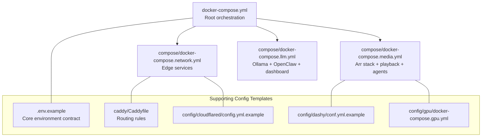
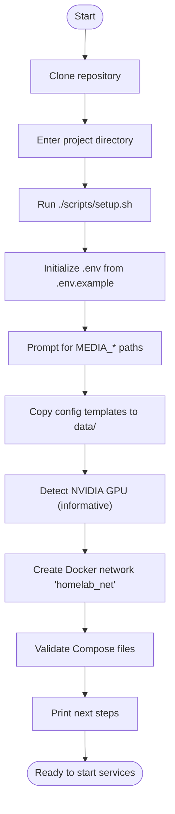
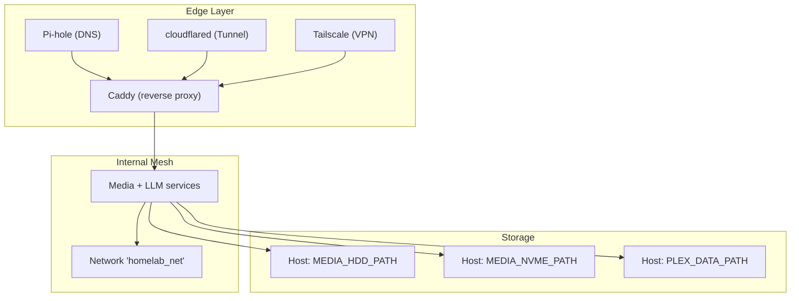
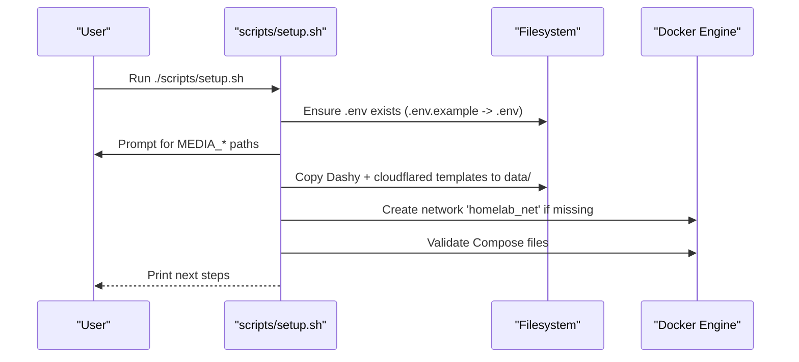
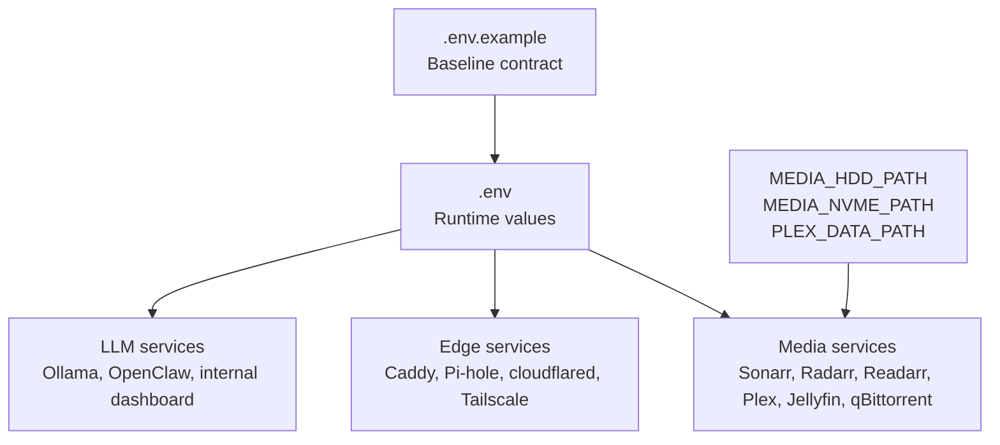
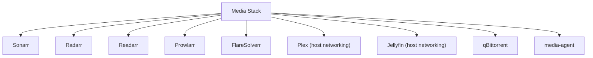
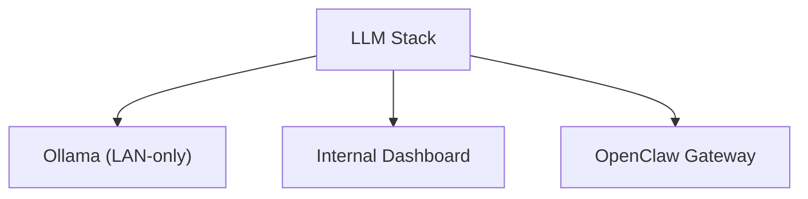
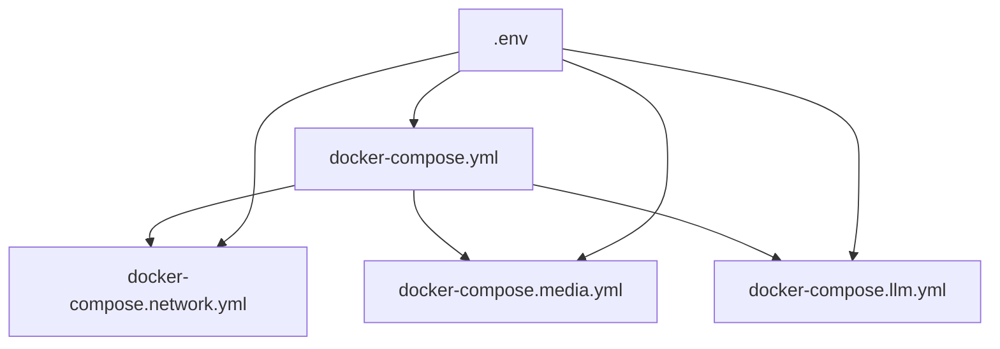

# Getting Started

<cite>
**Referenced Files in This Document**
- [README.md](file://README.md)
- [scripts/setup.sh](file://scripts/setup.sh)
- [.env.example](file://.env.example)
- [compose/docker-compose.network.yml](file://compose/docker-compose.network.yml)
- [compose/docker-compose.media.yml](file://compose/docker-compose.media.yml)
- [compose/docker-compose.llm.yml](file://compose/docker-compose.llm.yml)
- [docker-compose.yml](file://docker-compose.yml)
- [docs/service-troubleshooting.md](file://docs/service-troubleshooting.md)
- [scripts/fix-media-permissions.sh](file://scripts/fix-media-permissions.sh)
- [config/cloudflared/config.yml.example](file://config/cloudflared/config.yml.example)
- [config/dashy/conf.yml.example](file://config/dashy/conf.yml.example)
- [config/gpu/docker-compose.gpu.yml](file://config/gpu/docker-compose.gpu.yml)
</cite>

## Table of Contents
1. [Introduction](#introduction)
2. [Project Structure](#project-structure)
3. [Prerequisites](#prerequisites)
4. [Installation Steps](#installation-steps)
5. [Environment Variables and Paths](#environment-variables-and-paths)
6. [First-Time Service Startup](#first-time-service-startup)
7. [Common Setup Scenarios](#common-setup-scenarios)
8. [Architecture Overview](#architecture-overview)
9. [Detailed Component Analysis](#detailed-component-analysis)
10. [Dependency Analysis](#dependency-analysis)
11. [Performance Considerations](#performance-considerations)
12. [Troubleshooting Guide](#troubleshooting-guide)
13. [Conclusion](#conclusion)

## Introduction
This Getting Started guide helps you quickly set up and deploy the homelab infrastructure using Docker Compose. It covers prerequisites, automated setup via the provided script, environment configuration, path customization for media storage, and first-time service startup. It also includes practical examples, troubleshooting tips, and an overview of the underlying orchestration.

## Project Structure
At a high level, the repository organizes services across multiple Compose fragments and a central orchestration file. The root orchestration file includes network, media, and LLM stacks. Supporting scripts automate first-run setup, and example configuration templates are provided for optional services.

**Diagram sources**
- [docker-compose.yml](file://docker-compose.yml)
- [compose/docker-compose.network.yml](file://compose/docker-compose.network.yml)
- [compose/docker-compose.media.yml](file://compose/docker-compose.media.yml)
- [compose/docker-compose.llm.yml](file://compose/docker-compose.llm.yml)
- [.env.example](file://.env.example)
- [config/cloudflared/config.yml.example](file://config/cloudflared/config.yml.example)
- [config/dashy/conf.yml.example](file://config/dashy/conf.yml.example)
- [config/gpu/docker-compose.gpu.yml](file://config/gpu/docker-compose.gpu.yml)

**Section sources**
- [README.md:207-230](file://README.md#L207-L230)

## Prerequisites
- Docker Engine and Docker Compose v2+ installed on a Linux host (Ubuntu 22.04+ recommended).
- Optional: NVIDIA GPU with drivers and the NVIDIA Container Toolkit for hardware-accelerated playback and local LLM inference.
- Basic familiarity with Docker and terminal commands.

**Section sources**
- [README.md:179-184](file://README.md#L179-L184)

## Installation Steps
Follow these steps to clone the repository, run the automated setup, and validate the configuration.

1. Clone the repository and enter the project directory.
2. Run the automated setup script to initialize environment variables, configuration templates, Docker network, and Compose validation.
3. Review the next steps printed by the script and start the services.

**Diagram sources**
- [scripts/setup.sh:209-231](file://scripts/setup.sh#L209-L231)
- [scripts/setup.sh:74-92](file://scripts/setup.sh#L74-L92)
- [scripts/setup.sh:110-127](file://scripts/setup.sh#L110-L127)
- [scripts/setup.sh:129-137](file://scripts/setup.sh#L129-L137)
- [scripts/setup.sh:139-150](file://scripts/setup.sh#L139-L150)
- [scripts/setup.sh:152-175](file://scripts/setup.sh#L152-L175)

**Section sources**
- [README.md:177-206](file://README.md#L177-L206)
- [scripts/setup.sh:177-183](file://scripts/setup.sh#L177-L183)

## Environment Variables and Paths
The Compose stack reads variables from `.env`. The automated setup script initializes `.env` from `.env.example` and prompts for critical paths used by media services.

Key variables and their purpose:
- Identity and timezone: PUID, PGID, TZ
- Routing: BASE_DOMAIN, CADDY_IMAGE
- Config paths: DASHY_CONFIG_PATH, DASHY_CONFIG_TEMPLATE, CLOUDFLARED_CONFIG_PATH, CLOUDFLARED_CONFIG_TEMPLATE
- Media storage: MEDIA_HDD_PATH, MEDIA_NVME_PATH, PLEX_DATA_PATH
- Optional integrations: API keys for Arr apps, qBittorrent credentials, VPN settings, OpenClaw tokens, external provider keys, and Cloudflare tunnel token

Path customization:
- Set MEDIA_HDD_PATH, MEDIA_NVME_PATH, and PLEX_DATA_PATH to real host mount points before first start. These paths are used by media services for library imports and downloads.

Optional GPU configuration:
- GPU acceleration is enabled by default in the media stack. If you have an NVIDIA GPU, ensure drivers and the NVIDIA Container Toolkit are installed. The stack sets GPU visibility and exposes GPUs to supported services.

**Section sources**
- [README.md:322-352](file://README.md#L322-L352)
- [.env.example:1-57](file://.env.example#L1-L57)
- [compose/docker-compose.media.yml:172-204](file://compose/docker-compose.media.yml#L172-L204)
- [compose/docker-compose.media.yml:206-237](file://compose/docker-compose.media.yml#L206-L237)
- [config/gpu/docker-compose.gpu.yml:1-11](file://config/gpu/docker-compose.gpu.yml#L1-L11)

## First-Time Service Startup
After running the setup script, bring up the services using the root orchestration file. This includes the network, media, and LLM stacks by default.

- Bring up the default stack (edge + media + LLM):
  - docker compose up -d

- To run without the LLM stack, edit the root orchestration file to comment out the LLM include, or override with a local Compose override file.

Validation:
- The setup script validates Compose files for the root orchestration and included fragments. You can also validate manually:
  - docker compose config --quiet
  - docker compose up -d

**Section sources**
- [README.md:195-206](file://README.md#L195-L206)
- [scripts/setup.sh:152-175](file://scripts/setup.sh#L152-L175)

## Common Setup Scenarios
Below are practical scenarios you may encounter during initial deployment.

Scenario A: Default edge + media + LLM stack
- Use the root orchestration file as-is. The LLM stack includes Ollama, the internal dashboard, and the OpenClaw gateway.

Scenario B: Edge + media only (no LLM)
- Edit the root orchestration file to comment out the LLM include. Alternatively, create a Compose override that excludes the LLM fragment.

Scenario C: Custom media paths
- Set MEDIA_HDD_PATH, MEDIA_NVME_PATH, and PLEX_DATA_PATH to your host mount points before first start. These paths are consumed by media services to ensure consistent imports and downloads.

Scenario D: Cloudflare Tunnel and DNS
- Provide a Cloudflare API token for automatic DNS challenges and tunnel authentication. Configure the tunnel credentials and ingress rules in the cloudflared template, then copy it to the runtime path.

Scenario E: Hardening and host firewall
- Optionally run the hardening steps to tighten secret file permissions and load nftables rules. These steps require appropriate host privileges.

**Section sources**
- [README.md:169-171](file://README.md#L169-L171)
- [README.md:509-526](file://README.md#L509-L526)
- [config/cloudflared/config.yml.example:1-15](file://config/cloudflared/config.yml.example#L1-15)

## Architecture Overview
The system uses a shared Docker network for service communication and Caddy for reverse proxying. Edge services (Caddy, DNS, tunnel/VPN) are separated from internal services. Media services include the Arr stack, playback servers, and supporting agents. An optional LLM stack provides local inference and an AI control plane.

**Diagram sources**
- [compose/docker-compose.network.yml](file://compose/docker-compose.network.yml)
- [compose/docker-compose.media.yml](file://compose/docker-compose.media.yml)
- [compose/docker-compose.llm.yml](file://compose/docker-compose.llm.yml)
- [docker-compose.yml](file://docker-compose.yml)

**Section sources**
- [README.md:43-167](file://README.md#L43-L167)

## Detailed Component Analysis

### Automated Setup Script Workflow
The setup script performs the following tasks:
- Ensures `.env` exists by copying from `.env.example` if missing.
- Prompts for MEDIA_HDD_PATH, MEDIA_NVME_PATH, and PLEX_DATA_PATH.
- Copies configuration templates for Dashy and cloudflared into the runtime data directories.
- Detects NVIDIA GPU presence (informative).
- Creates the shared Docker network if it does not exist.
- Validates Compose files for the root orchestration and included fragments.
- Optionally runs hardening steps to tighten secret file permissions and load nftables rules.

**Diagram sources**
- [scripts/setup.sh:74-92](file://scripts/setup.sh#L74-L92)
- [scripts/setup.sh:110-127](file://scripts/setup.sh#L110-L127)
- [scripts/setup.sh:129-137](file://scripts/setup.sh#L129-L137)
- [scripts/setup.sh:139-150](file://scripts/setup.sh#L139-L150)
- [scripts/setup.sh:152-175](file://scripts/setup.sh#L152-L175)

**Section sources**
- [scripts/setup.sh:1-234](file://scripts/setup.sh#L1-L234)

### Environment Contract and Path Mapping
The environment contract defines required and optional variables. Path customization is critical for media services to consistently map host volumes to container paths.

**Diagram sources**
- [.env.example](file://.env.example)
- [compose/docker-compose.media.yml](file://compose/docker-compose.media.yml)
- [compose/docker-compose.network.yml](file://compose/docker-compose.network.yml)
- [compose/docker-compose.llm.yml](file://compose/docker-compose.llm.yml)

**Section sources**
- [README.md:322-352](file://README.md#L322-L352)
- [.env.example:17-21](file://.env.example#L17-L21)

### Media Stack Composition
The media stack orchestrates the Arr suite, playback servers, and supporting agents. It mounts media libraries and downloads directories from host paths and exposes playback services via host networking for discovery and casting.

**Diagram sources**
- [compose/docker-compose.media.yml](file://compose/docker-compose.media.yml)

**Section sources**
- [compose/docker-compose.media.yml:7-317](file://compose/docker-compose.media.yml#L7-L317)

### LLM Stack Composition
The LLM stack provides local inference and an AI control plane. It binds Ollama to loopback and exposes the OpenClaw gateway and internal dashboard on loopback ports.

**Diagram sources**
- [compose/docker-compose.llm.yml](file://compose/docker-compose.llm.yml)

**Section sources**
- [compose/docker-compose.llm.yml:1-169](file://compose/docker-compose.llm.yml#L1-L169)

## Dependency Analysis
The root orchestration file includes the network, media, and LLM stacks. Services depend on the shared Docker network and on environment variables defined in `.env`.

**Diagram sources**
- [docker-compose.yml](file://docker-compose.yml)
- [compose/docker-compose.network.yml](file://compose/docker-compose.network.yml)
- [compose/docker-compose.media.yml](file://compose/docker-compose.media.yml)
- [compose/docker-compose.llm.yml](file://compose/docker-compose.llm.yml)
- [.env.example](file://.env.example)

**Section sources**
- [README.md:169-171](file://README.md#L169-L171)

## Performance Considerations
- Use fast NVMe storage for downloads and frequently accessed media to improve import and transcoding performance.
- Ensure adequate memory allocation for media services and the LLM runtime.
- Keep the number of concurrent downloads reasonable to avoid saturating disk I/O.
- Monitor GPU utilization if using hardware-accelerated playback or local LLM inference.

## Troubleshooting Guide
Common issues and resolutions during initial deployment:

- cloudflared healthcheck failures
  - Cause: The cloudflared image is minimal and lacks shell and HTTP clients.
  - Fix: Use the native binary in CMD form and pin the metrics port for readiness checks.

- Ollama healthcheck failures
  - Cause: The Ollama image lacks curl and wget.
  - Fix: Use a TCP socket check in healthchecks.

- Dashy healthcheck failures
  - Cause: Alpine-based images resolve localhost to IPv6 by default.
  - Fix: Use 127.0.0.1 explicitly in healthchecks.

- qBittorrent healthcheck returning 403
  - Cause: The API requires authentication.
  - Fix: Probe the root path which serves the login page without authentication.

- Linuxserver.io containers failing ownership changes
  - Cause: Security hardening blocks s6-overlay initialization.
  - Fix: Adjust capabilities to allow required operations while retaining broad capability drops.

- Caddy TLS certificate permission errors
  - Cause: Insufficient permissions to access certificate files.
  - Fix: Ensure proper ownership or grant the necessary capability.

- Prowlarr asset 404 errors
  - Cause: handle_path strips prefixes, but Prowlarr generates URLs based on UrlBase.
  - Fix: Set UrlBase in Prowlarr’s configuration and align routing directives.

- Gluetun VPN profile gating
  - Cause: Missing VPN provider credentials.
  - Fix: Provide required VPN credentials or keep the VPN profile gated until configured.

Additional quick-reference healthcheck commands are available for each service.

**Section sources**
- [docs/service-troubleshooting.md:1-137](file://docs/service-troubleshooting.md#L1-L137)

## Conclusion
You now have the essentials to clone the repository, run the automated setup, configure environment variables and media paths, and start the services. Use the troubleshooting guide to address common issues, and refer to the architecture and component analyses for deeper understanding of the orchestration and service roles.