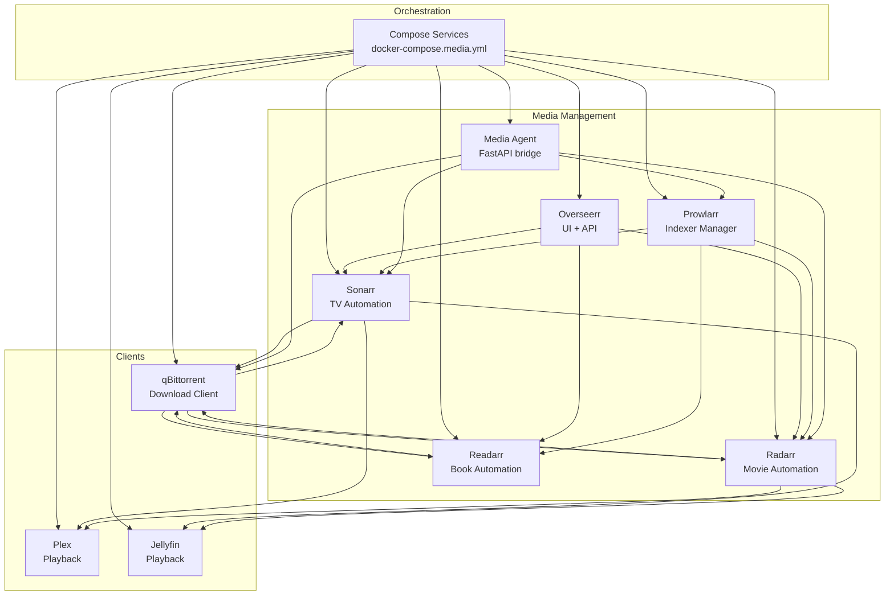
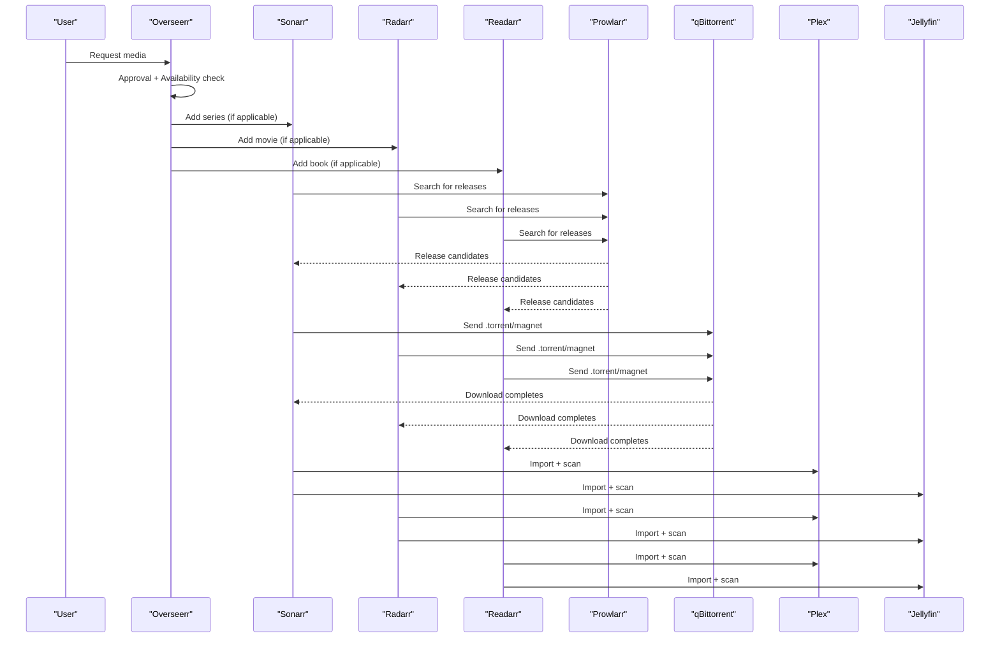
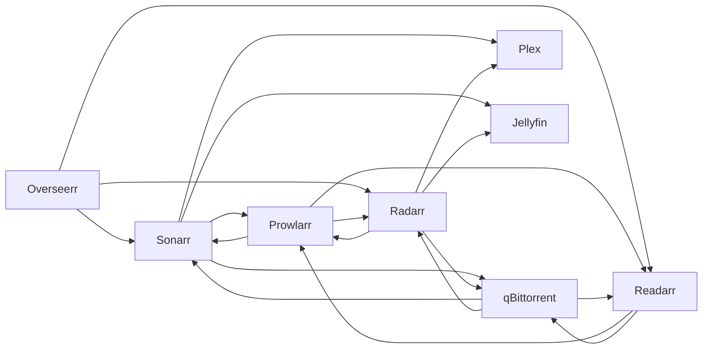

# Media Management Stack

<cite>
**Referenced Files in This Document**
- [docker-compose.media.yml](file://compose/docker-compose.media.yml)
- [settings.json](file://data/overseerr/settings.json)
- [config.xml (Sonarr)](file://data/sonarr/config.xml)
- [config.xml (Radarr)](file://data/radarr/config.xml)
- [config.xml (Readarr)](file://data/readarr/config.xml)
- [config.xml (Prowlarr)](file://data/prowlarr/config.xml)
- [qBittorrent.conf](file://data/qbittorrent/config/qBittorrent/qBittorrent.conf)
- [1337x.yml](file://data/prowlarr/Definitions/1337x.yml)
- [yts.yml](file://data/prowlarr/Definitions/yts.yml)
- [config.py](file://media-agent/app/config.py)
- [pyproject.toml](file://media-agent/pyproject.toml)
</cite>

## Table of Contents
1. [Introduction](#introduction)
2. [Project Structure](#project-structure)
3. [Core Components](#core-components)
4. [Architecture Overview](#architecture-overview)
5. [Detailed Component Analysis](#detailed-component-analysis)
6. [Dependency Analysis](#dependency-analysis)
7. [Performance Considerations](#performance-considerations)
8. [Troubleshooting Guide](#troubleshooting-guide)
9. [Conclusion](#conclusion)
10. [Appendices](#appendices)

## Introduction
This document explains the Media Management Stack built around the Arr suite of applications. It covers the complete workflow from user requests and approvals in Overseerr, through automated acquisition via Sonarr/Radarr/Readarr, indexing with Prowlarr, downloading with qBittorrent, and playback on Plex/Jellyfin. It provides both a conceptual overview for beginners and technical details for developers, including API integrations, webhook configurations, quality profiles, and operational tuning.

## Project Structure
The stack is orchestrated via Docker Compose with dedicated volumes for persistent data and media libraries. Each Arr application exposes a Web UI/API, while Prowlarr indexes public/private trackers and feeds results back to the Arr clients. A thin internal media-agent service bridges higher-level orchestration with the Arr APIs and optionally interacts with Prowlarr and qBittorrent.

**Diagram sources**
- [docker-compose.media.yml:7-317](file://compose/docker-compose.media.yml#L7-L317)

**Section sources**
- [docker-compose.media.yml:1-317](file://compose/docker-compose.media.yml#L1-L317)

## Core Components
- Overseerr: Central request hub that integrates with Plex/Jellyfin and coordinates with Sonarr/Radarr/Readarr for acquisition and availability sync.
- Sonarr: Series monitoring, season folders, quality profiles, and automation rules for TV shows.
- Radarr: Movie collection management, quality profiles, root folder configuration, and automation rules.
- Readarr: Book automation and library management.
- Prowlarr: Unified indexer manager supporting Torznab/RSS/JSON APIs; ships with hundreds of pre-defined definitions.
- qBittorrent: BitTorrent client with Web UI, session configuration, and integration with Arr clients.
- Media Agent: Internal FastAPI service that normalizes metadata, optionally triggers Prowlarr searches, and manages downloads.

**Section sources**
- [settings.json:127-129](file://data/overseerr/settings.json#L127-L129)
- [config.xml (Sonarr):1-17](file://data/sonarr/config.xml#L1-L17)
- [config.xml (Radarr):1-17](file://data/radarr/config.xml#L1-L17)
- [config.xml (Readarr):1-17](file://data/readarr/config.xml#L1-L17)
- [config.xml (Prowlarr):1-17](file://data/prowlarr/config.xml#L1-L17)
- [qBittorrent.conf:1-63](file://data/qbittorrent/config/qBittorrent/qBittorrent.conf#L1-L63)
- [config.py:7-155](file://media-agent/app/config.py#L7-L155)

## Architecture Overview
The system is a pipeline: Overseerr receives requests and tracks availability; Sonarr/Radarr/Readarr monitor libraries and trigger downloads; Prowlarr aggregates indexers and returns releases; qBittorrent executes downloads; media servers serve content.

**Diagram sources**
- [docker-compose.media.yml:147-317](file://compose/docker-compose.media.yml#L147-L317)
- [settings.json:80-126](file://data/overseerr/settings.json#L80-L126)
- [config.xml (Sonarr):1-17](file://data/sonarr/config.xml#L1-L17)
- [config.xml (Radarr):1-17](file://data/radarr/config.xml#L1-L17)
- [config.xml (Readarr):1-17](file://data/readarr/config.xml#L1-L17)
- [config.xml (Prowlarr):1-17](file://data/prowlarr/config.xml#L1-L17)
- [qBittorrent.conf:1-63](file://data/qbittorrent/config/qBittorrent/qBittorrent.conf#L1-L63)

## Detailed Component Analysis

### Overseerr: Approval Workflow and User Management
- Overseerr integrates with Plex and Jellyfin libraries and maintains sync jobs for recently added items and availability.
- It stores API keys and base URLs for Sonarr and Radarr, enabling automatic addition and tagging of requested items.
- Authentication and permissions are configurable; the UI supports local and media server logins.

Practical configuration highlights:
- Application title, URL, locale, and streaming region are set centrally.
- Plex libraries are configured with enabled/disabled flags and types.
- Sonarr and Radarr entries include hostname, port, base URL, API key, and automation flags (sync enabled, prevent search, tag requests).
- Jobs define schedules for scans and refresh tasks.

Operational tips:
- Keep sync intervals reasonable to balance freshness and resource usage.
- Enable “prevent search” to avoid duplicate searches when manually adding items.
- Tag requests to segment downloads and apply downstream automation.

**Section sources**
- [settings.json:6-33](file://data/overseerr/settings.json#L6-L33)
- [settings.json:34-74](file://data/overseerr/settings.json#L34-L74)
- [settings.json:80-126](file://data/overseerr/settings.json#L80-L126)
- [settings.json:230-270](file://data/overseerr/settings.json#L230-L270)

### Sonarr: Series Monitoring and Quality Settings
- Sonarr’s Web UI/API is exposed with a URL base and API key configured in its XML settings.
- It monitors TV libraries, applies quality profiles, and organizes episodes into season folders.
- Overseerr can add series and set monitoring behavior and tags.

Key configuration references:
- Bind address, port, SSL, authentication, log level, URL base, and update mechanism.
- Overseerr integration includes active profile, directory, and monitoring preferences.

Quality and automation:
- Use quality profiles to define preferred codecs, resolutions, and bitrate thresholds.
- Enable season folders for better organization and selective downloads.
- Configure import paths to align with Plex/Jellyfin library locations.

**Section sources**
- [config.xml (Sonarr):1-17](file://data/sonarr/config.xml#L1-L17)
- [settings.json:102-126](file://data/overseerr/settings.json#L102-L126)

### Radarr: Movie Collection Management
- Radarr’s Web UI/API is similarly configured with bind address, port, SSL, authentication, log level, URL base, and update mechanism.
- Overseerr integration includes active profile, directory, minimum availability, and automation flags.

Collection management:
- Define root folders mapped to storage paths.
- Set quality profiles and upgrade rules.
- Control minimum availability (e.g., inCinemas) to delay import until desired release stage.

**Section sources**
- [config.xml (Radarr):1-17](file://data/radarr/config.xml#L1-L17)
- [settings.json:80-101](file://data/overseerr/settings.json#L80-L101)

### Readarr: Book Management
- Readarr’s configuration mirrors the Arr pattern with bind address, port, SSL, authentication, log level, URL base, and update mechanism.
- Overseerr integration supports adding books and applying tags and automation.

Library hygiene:
- Configure root folders for books and import paths aligned with media servers.
- Use quality profiles suited to audiobooks and ebooks.

**Section sources**
- [config.xml (Readarr):1-17](file://data/readarr/config.xml#L1-L17)
- [settings.json:102-126](file://data/overseerr/settings.json#L102-L126)

### Prowlarr: Indexer Configuration and Search Optimization
- Prowlarr aggregates indexers and exposes a unified API for the Arr clients.
- Hundreds of pre-defined definitions are included under Definitions, covering public and private trackers.
- Example definitions illustrate category mappings, search paths, selectors, and filters.

Common indexer patterns:
- Category mappings translate tracker categories to Arr categories.
- Search paths and selectors target release listings; filters normalize titles and dates.
- Some indexers support JSON APIs or require request delays and anti-bot measures.

Optimization tips:
- Use requestDelay to respect rate limits and reduce timeouts.
- Apply keywords filters and title normalization to improve match quality.
- Prefer definitions with robust selectors and accurate date parsing.

**Section sources**
- [config.xml (Prowlarr):1-17](file://data/prowlarr/config.xml#L1-L17)
- [1337x.yml:1-296](file://data/prowlarr/Definitions/1337x.yml#L1-L296)
- [yts.yml:1-141](file://data/prowlarr/Definitions/yts.yml#L1-L141)

### qBittorrent: Download Client Setup with VPN Integration
- qBittorrent exposes a Web UI and runs on a fixed port, with session and proxy settings in its configuration.
- Downloads are routed to media storage paths and monitored by Arr clients.
- Optional VPN integration can be achieved by routing traffic through a VPN container or host-level routing.

Key settings:
- Session save path, temp path, and port range.
- Queueing disabled by default; adjust Max Active Downloads/Torrents for throughput.
- WebUI credentials and domain restrictions.

**Section sources**
- [qBittorrent.conf:1-63](file://data/qbittorrent/config/qBittorrent/qBittorrent.conf#L1-L63)
- [docker-compose.media.yml:239-275](file://compose/docker-compose.media.yml#L239-L275)

### Media Agent: Internal Bridge and Orchestration
- The media-agent is a FastAPI service that validates environment-driven settings and exposes health checks.
- It integrates with Sonarr, Radarr, Prowlarr, and qBittorrent using base URLs and API keys.
- It supports configurable timeouts, result limits, and router model selection for metadata routing.

Operational controls:
- Environment variables define base URLs, API keys, and qBittorrent credentials.
- Validation ensures required tokens and endpoints are present.
- Optional Prowlarr and qBittorrent integrations are gated by presence of credentials.

**Section sources**
- [config.py:7-155](file://media-agent/app/config.py#L7-L155)
- [pyproject.toml:1-50](file://media-agent/pyproject.toml#L1-L50)
- [docker-compose.media.yml:277-317](file://compose/docker-compose.media.yml#L277-L317)

## Dependency Analysis
The stack exhibits clear dependency edges: Overseerr depends on Plex/Jellyfin and the Arr clients; the Arr clients depend on Prowlarr for releases and on qBittorrent for downloads; media servers consume imported content.

**Diagram sources**
- [docker-compose.media.yml:147-317](file://compose/docker-compose.media.yml#L147-L317)
- [settings.json:80-126](file://data/overseerr/settings.json#L80-L126)

**Section sources**
- [docker-compose.media.yml:147-317](file://compose/docker-compose.media.yml#L147-L317)
- [settings.json:80-126](file://data/overseerr/settings.json#L80-L126)

## Performance Considerations
- Rate limiting and request delays: Configure requestDelay in Prowlarr definitions to avoid bans and timeouts.
- Queue tuning: Adjust qBittorrent Max Active Downloads/Torrents and queueing settings to match disk and CPU capacity.
- Sync intervals: Tune Overseerr job schedules to balance freshness and overhead.
- Storage I/O: Place downloads on fast NVMe and final media on HDD; ensure import paths are mounted read-only for media servers to prevent write conflicts.
- Network: Use host networking for Plex/Jellyfin discovery, but isolate internal services on a dedicated network.

[No sources needed since this section provides general guidance]

## Troubleshooting Guide
Common issues and remedies:
- Overseerr cannot reach Arr: Verify base URLs, API keys, and external URLs in Overseerr settings; confirm container network connectivity.
- Arr cannot reach Prowlarr: Confirm Prowlarr URL base and API key; check firewall and DNS resolution.
- Prowlarr search returns no results: Review definition settings (requestDelay, sort, disablesort); enable fallback download links; verify keywords filters.
- qBittorrent fails to import: Check WebUI credentials and port forwarding; ensure save paths are writable and mounted correctly.
- Media servers not seeing files: Confirm read-only mounts for media servers; verify import paths and library scanning schedules.

**Section sources**
- [settings.json:80-126](file://data/overseerr/settings.json#L80-L126)
- [config.xml (Prowlarr):1-17](file://data/prowlarr/config.xml#L1-L17)
- [qBittorrent.conf:40-63](file://data/qbittorrent/config/qBittorrent/qBittorrent.conf#L40-L63)
- [docker-compose.media.yml:239-275](file://compose/docker-compose.media.yml#L239-L275)

## Conclusion
The Media Management Stack integrates Overseerr, Sonarr, Radarr, Readarr, Prowlarr, qBittorrent, and media servers into a cohesive pipeline. By aligning configuration, tuning performance knobs, and leveraging the internal media-agent for advanced orchestration, you can achieve reliable, scalable media automation.

[No sources needed since this section summarizes without analyzing specific files]

## Appendices

### Practical Configuration Scenarios
- Adding a public tracker: Copy and customize an existing definition under Prowlarr Definitions; adjust caps, search paths, and selectors; reload definitions in Prowlarr.
- Enforcing quality upgrades: Set Radarr/Sonarr quality profiles with upgrade rules; enable “upgrade until” thresholds.
- Tagging requests: Use Overseerr tags to route downloads to specific categories or qBittorrent categories.
- Health checks: Use the media-agent health endpoint with a bearer token to validate internal integrations.

**Section sources**
- [1337x.yml:1-296](file://data/prowlarr/Definitions/1337x.yml#L1-L296)
- [yts.yml:1-141](file://data/prowlarr/Definitions/yts.yml#L1-L141)
- [config.py:7-155](file://media-agent/app/config.py#L7-L155)