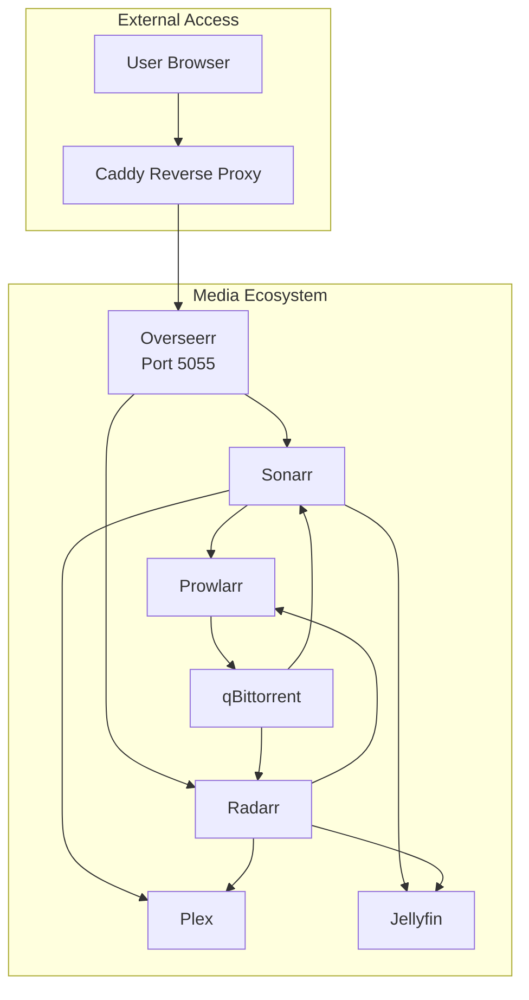
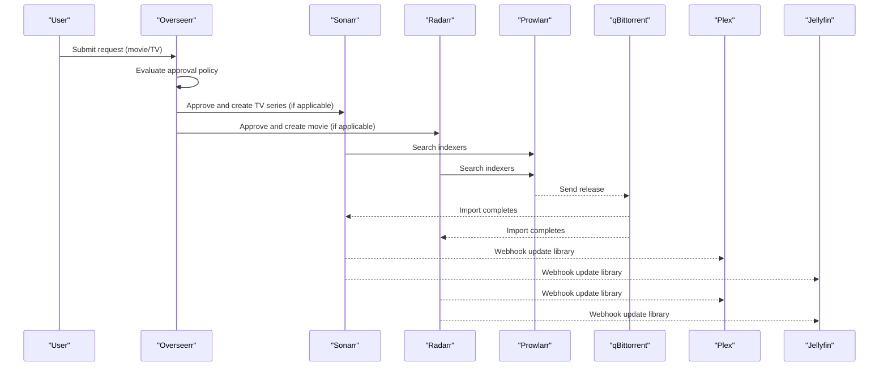
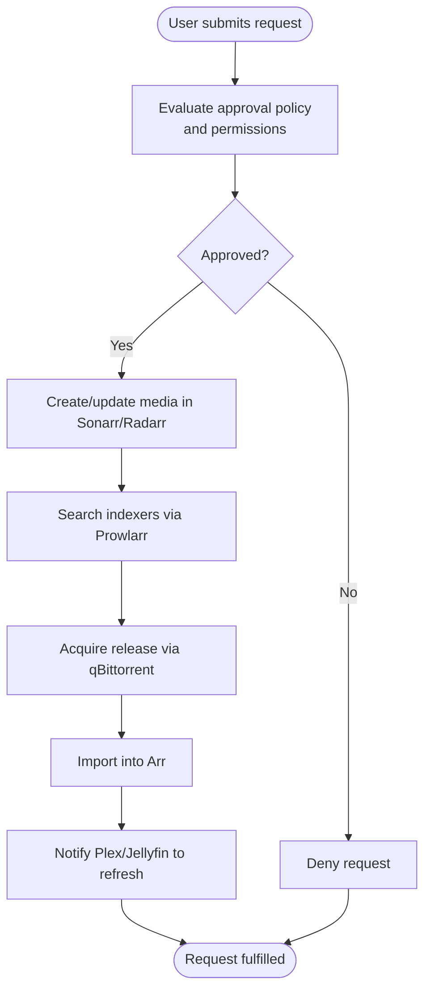
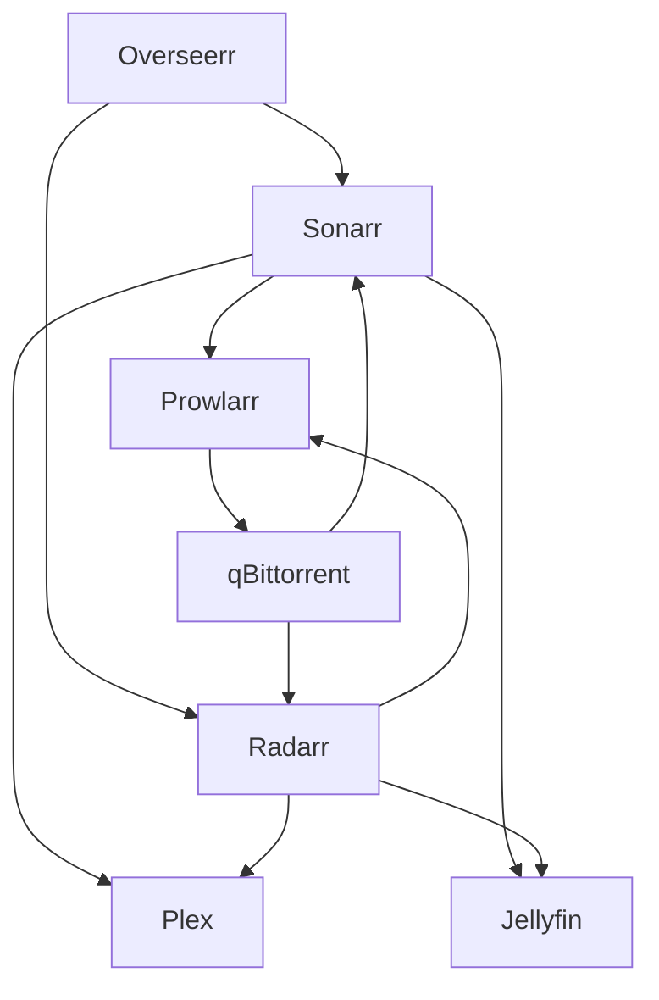

# Overseerr Approval System

<cite>
**Referenced Files in This Document**
- [settings.json](file://data/overseerr/settings.json)
- [docker-compose.media.yml](file://compose/docker-compose.media.yml)
- [docker-compose.yml](file://docker-compose.yml)
- [media-pipeline-e2e.sh](file://tests/integration/media-pipeline-e2e.sh)
- [README.md](file://README.md)
- [backup-data.sh](file://scripts/backup-data.sh)
- [secure-secret-file-permissions.sh](file://scripts/hardening/secure-secret-file-permissions.sh)
</cite>

## Table of Contents
1. [Introduction](#introduction)
2. [Project Structure](#project-structure)
3. [Core Components](#core-components)
4. [Architecture Overview](#architecture-overview)
5. [Detailed Component Analysis](#detailed-component-analysis)
6. [Dependency Analysis](#dependency-analysis)
7. [Performance Considerations](#performance-considerations)
8. [Troubleshooting Guide](#troubleshooting-guide)
9. [Conclusion](#conclusion)
10. [Appendices](#appendices)

## Introduction
Overseerr (Seerr) acts as the centralized request management platform for the media ecosystem in this homelab. Users submit requests for movies and TV shows, which are reviewed and approved before being fulfilled by the Arr suite (Sonarr for TV and Radarr for movies). Overseerr integrates with Plex and Jellyfin for media server connectivity, coordinates with Prowlarr for indexers and qBittorrent for downloads, and emits notifications through multiple channels. This document explains how the approval workflow operates, how to configure policies and integrations, and how to manage users, permissions, and notifications.

## Project Structure
The media stack is orchestrated with Docker Compose, with Overseerr running on a loopback-bound port and proxied via Caddy. The Arr suite (Sonarr, Radarr, Prowlarr, Readarr) and media servers (Plex, Jellyfin) are connected on a shared external network. Overseerr stores its configuration in a JSON settings file persisted to disk.

**Diagram sources**
- [docker-compose.media.yml:147-170](file://compose/docker-compose.media.yml#L147-L170)
- [README.md:409-459](file://README.md#L409-L459)

**Section sources**
- [docker-compose.yml:1-13](file://docker-compose.yml#L1-L13)
- [docker-compose.media.yml:147-170](file://compose/docker-compose.media.yml#L147-L170)
- [README.md:353-377](file://README.md#L353-L377)

## Core Components
- Overseerr configuration and integrations:
  - Application settings, API keys, and URLs
  - Plex and Jellyfin media server connections
  - Sonarr and Radarr integrations
  - Notification agents and schedules
- Arr suite services:
  - Sonarr (TV shows)
  - Radarr (movies)
  - Prowlarr (indexers)
  - qBittorrent (downloads)
- Media servers:
  - Plex and Jellyfin for playback and library refresh

Key configuration areas in Overseerr’s settings include:
- Application identity and permissions
- Media server libraries and sync
- Arr integrations (Sonarr/Radarr) with profiles, tags, and availability
- Notifications (email, Discord, Slack, Telegram, Pushbullet, Pushover, Webhook, WebPush, Gotify, Ntfy)
- Job schedules for scans and syncs

**Section sources**
- [settings.json:1-296](file://data/overseerr/settings.json#L1-L296)
- [docker-compose.media.yml:57-116](file://compose/docker-compose.media.yml#L57-L116)

## Architecture Overview
Overseerr orchestrates the request lifecycle: discovery, approval, acquisition, and feedback. Users request content via Overseerr, which approves and forwards requests to Sonarr or Radarr. These services search indexers via Prowlarr, acquire releases through qBittorrent, and import into the Arr stacks. Upon import completion, Arr services notify Plex and Jellyfin to refresh libraries.

**Diagram sources**
- [README.md:409-459](file://README.md#L409-L459)
- [media-pipeline-e2e.sh:140-146](file://tests/integration/media-pipeline-e2e.sh#L140-L146)

## Detailed Component Analysis

### Approval Workflow
The approval workflow begins when a user submits a request. Overseerr evaluates the request against configured policies and permissions, then creates or updates media entries in Sonarr/Radarr accordingly. The Arr services handle search, acquisition, and import, after which media servers refresh their libraries.

**Diagram sources**
- [README.md:409-459](file://README.md#L409-L459)
- [media-pipeline-e2e.sh:148-166](file://tests/integration/media-pipeline-e2e.sh#L148-L166)

**Section sources**
- [media-pipeline-e2e.sh:40-63](file://tests/integration/media-pipeline-e2e.sh#L40-L63)
- [README.md:409-459](file://README.md#L409-L459)

### User Management and Permissions
- Default permissions and quotas are defined in Overseerr settings.
- Local login, media server login, and new Plex login options are configurable.
- Permission flags control whether users can request, auto-approve, or require admin review.

Practical configuration pointers:
- Adjust default permissions to tighten or loosen who can request.
- Enable or disable local and media server login modes depending on your environment.
- Configure quotas per media type if needed.

**Section sources**
- [settings.json:11-33](file://data/overseerr/settings.json#L11-L33)

### Media Server Connections (Plex and Jellyfin)
- Plex connection includes server name, host/port, SSL flag, and library mappings.
- Jellyfin connection includes server details, API key, and library configuration.

Integration highlights:
- Overseerr scans recently added items and performs full library scans on schedules.
- Libraries are mapped by ID/name/type and can be toggled enabled/disabled.

**Section sources**
- [settings.json:34-74](file://data/overseerr/settings.json#L34-L74)
- [settings.json:230-270](file://data/overseerr/settings.json#L230-L270)

### Arr Suite Integrations (Sonarr and Radarr)
- Sonarr integration includes host, port, API key, base URL, profiles, language profile, season folders, and tags.
- Radarr integration includes host, port, API key, base URL, quality profile, minimum availability, and tags.
- Both services support tagging requests and preventing immediate search.

Operational notes:
- External URLs are used for public access.
- Sync and tag-request behaviors are configurable.

**Section sources**
- [settings.json:80-126](file://data/overseerr/settings.json#L80-L126)

### Notifications
Overseerr supports multiple notification agents:
- Email SMTP
- Discord Webhooks
- Slack Webhooks
- Telegram Bot
- Pushbullet
- Pushover
- Generic Webhook
- WebPush
- Gotify
- Ntfy

Each agent has an enabled flag, embed poster option, and agent-specific options. Payload templates can be customized.

**Section sources**
- [settings.json:130-229](file://data/overseerr/settings.json#L130-L229)

### API Keys and Security
- Overseerr exposes an API key used for administrative operations and integration scripts.
- Secret file permissions are enforced by a dedicated hardening script.

Guidance:
- Store API keys securely and restrict file permissions.
- Rotate keys periodically and update configurations accordingly.

**Section sources**
- [settings.json](file://data/overseerr/settings.json#L7)
- [secure-secret-file-permissions.sh:1-37](file://scripts/hardening/secure-secret-file-permissions.sh#L1-L37)

### Backup and Restore Procedures
- The repository includes a backup script that archives the data directory to a destination drive with retention.
- Secrets and sensitive files are included in backups; ensure proper permissions are restored afterward.

Backup steps:
- Run the backup script from the repository root.
- Verify archived files and retention policy.
- Restore by extracting the archive to the data directory and re-applying permissions.

**Section sources**
- [backup-data.sh:1-50](file://scripts/backup-data.sh#L1-L50)
- [secure-secret-file-permissions.sh:17-25](file://scripts/hardening/secure-secret-file-permissions.sh#L17-L25)

## Dependency Analysis
Overseerr depends on:
- Internal network connectivity to Sonarr, Radarr, Prowlarr, and qBittorrent
- Media server connectivity for library refresh and availability sync
- Notification endpoints for alert delivery

**Diagram sources**
- [docker-compose.media.yml:57-116](file://compose/docker-compose.media.yml#L57-L116)
- [README.md:409-459](file://README.md#L409-L459)

**Section sources**
- [docker-compose.media.yml:147-170](file://compose/docker-compose.media.yml#L147-L170)
- [README.md:409-459](file://README.md#L409-L459)

## Performance Considerations
- Overseerr runs on localhost with a dedicated port and is fronted by Caddy for TLS and routing.
- Jobs are scheduled for periodic scans and syncs; adjust schedules to balance responsiveness and resource usage.
- Ensure adequate memory and CPU allocation for the Arr suite and media servers.

[No sources needed since this section provides general guidance]

## Troubleshooting Guide
Common issues and resolutions:
- Service reachability: Verify Overseerr, Sonarr, and Radarr are healthy and reachable.
- API connectivity: Confirm API keys and base URLs for Sonarr/Radarr are correct.
- Media server refresh: Ensure webhooks are configured and media servers are reachable.
- Notifications: Validate agent settings and payload templates.
- Secrets and permissions: Re-apply secret file permissions after restores.

Validation helpers:
- Use the integration test script to pre-flight service connectivity and perform end-to-end request flows.

**Section sources**
- [media-pipeline-e2e.sh:140-146](file://tests/integration/media-pipeline-e2e.sh#L140-L146)
- [secure-secret-file-permissions.sh:17-25](file://scripts/hardening/secure-secret-file-permissions.sh#L17-L25)

## Conclusion
Overseerr centralizes request management and approval for the media ecosystem, integrating tightly with the Arr suite and media servers. By configuring approval policies, permissions, media server connections, and notifications, administrators can automate acquisition workflows while maintaining control over what gets requested and imported. Robust backup and permission management further strengthen operational reliability.

[No sources needed since this section summarizes without analyzing specific files]

## Appendices

### Practical Configuration Examples
- Configure approval policies:
  - Adjust default permissions and quotas in Overseerr settings.
  - Enable/disable local and media server login modes.
- Manage user roles:
  - Use permission flags to control who can request and auto-approve.
- Set up Plex/Jellyfin:
  - Define server details, API keys, and library mappings.
- Configure notifications:
  - Enable desired agents and supply required credentials or webhook URLs.
- Webhook integration:
  - Use generic webhook agent to integrate with external services.
- API key management:
  - Secure API keys and enforce file permissions.
- Backup/restore:
  - Use the provided backup script and restore procedure; re-apply permissions after restore.

**Section sources**
- [settings.json:11-33](file://data/overseerr/settings.json#L11-L33)
- [settings.json:34-74](file://data/overseerr/settings.json#L34-L74)
- [settings.json:80-126](file://data/overseerr/settings.json#L80-L126)
- [settings.json:130-229](file://data/overseerr/settings.json#L130-L229)
- [backup-data.sh:1-50](file://scripts/backup-data.sh#L1-L50)
- [secure-secret-file-permissions.sh:17-25](file://scripts/hardening/secure-secret-file-permissions.sh#L17-L25)