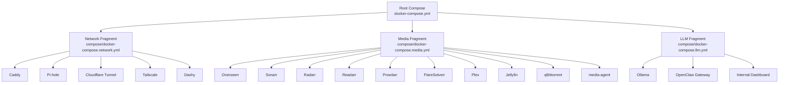
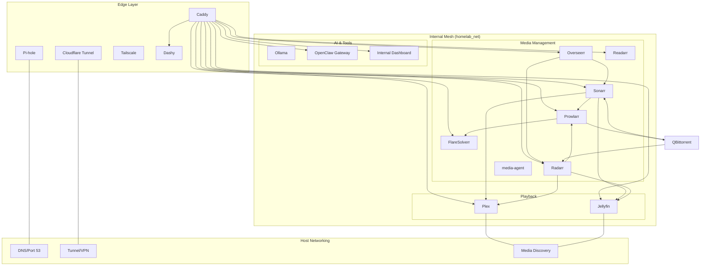
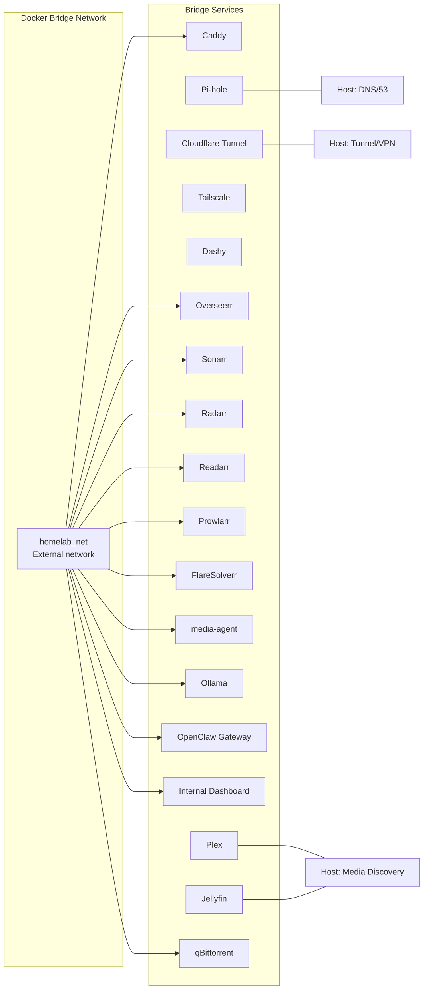
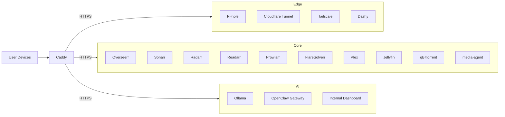
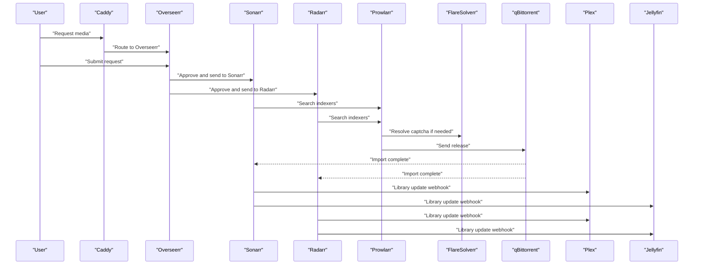
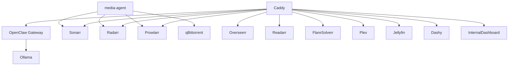

# Architecture Overview

<cite>
**Referenced Files in This Document**
- [docker-compose.yml](file://docker-compose.yml)
- [compose/docker-compose.network.yml](file://compose/docker-compose.network.yml)
- [compose/docker-compose.media.yml](file://compose/docker-compose.media.yml)
- [compose/docker-compose.llm.yml](file://compose/docker-compose.llm.yml)
- [caddy/Caddyfile](file://caddy/Caddyfile)
- [docs/caddy-guide.md](file://docs/caddy-guide.md)
- [docs/network-access.md](file://docs/network-access.md)
- [docs/prowlarr-caddy-routing.md](file://docs/prowlarr-caddy-routing.md)
- [README.md](file://README.md)
</cite>

## Table of Contents
1. [Introduction](#introduction)
2. [Project Structure](#project-structure)
3. [Core Components](#core-components)
4. [Architecture Overview](#architecture-overview)
5. [Detailed Component Analysis](#detailed-component-analysis)
6. [Dependency Analysis](#dependency-analysis)
7. [Performance Considerations](#performance-considerations)
8. [Troubleshooting Guide](#troubleshooting-guide)
9. [Conclusion](#conclusion)

## Introduction
This document explains the Homelab system’s high-level architecture and component relationships. It focuses on the microservices pattern implemented via Docker Compose, the Compose include mechanism that modularly assembles edge services, media services, and AI services, and the shared network topology centered on the Docker bridge network homelab_net. It also documents the three-tier routing model (edge services, core services, AI services), the host networking strategy for services requiring direct system access, and the data flow from user requests through Overseerr approval to media acquisition and playback.

## Project Structure
The root orchestration file declares Compose include directives that pull in modular service definitions:
- Edge services (Caddy, Pi-hole, Cloudflare Tunnel, Tailscale, Dashy) are defined in compose/docker-compose.network.yml.
- Core media services (Arr stack, Plex, Jellyfin, qBittorrent, media-agent) are defined in compose/docker-compose.media.yml.
- AI services (Ollama, OpenClaw, internal dashboard) are defined in compose/docker-compose.llm.yml.

A shared external Docker network named homelab_net is declared at the root level and reused across all included services.

**Diagram sources**
- [docker-compose.yml:1-13](file://docker-compose.yml#L1-L13)
- [compose/docker-compose.network.yml:7-122](file://compose/docker-compose.network.yml#L7-L122)
- [compose/docker-compose.media.yml:7-317](file://compose/docker-compose.media.yml#L7-L317)
- [compose/docker-compose.llm.yml:7-169](file://compose/docker-compose.llm.yml#L7-L169)

**Section sources**
- [docker-compose.yml:1-13](file://docker-compose.yml#L1-L13)
- [README.md:168-176](file://README.md#L168-L176)

## Core Components
- Edge services: Caddy (reverse proxy and TLS termination), Pi-hole (DNS and ad blocking), Cloudflare Tunnel (public HTTPS ingress), Tailscale (mesh VPN), Dashy (internal dashboard).
- Core media services: Overseerr (request management), Sonarr/Radarr/Readarr (media automation), Prowlarr (indexer aggregation), FlareSolverr (captcha bypass), Plex/Jellyfin (media playback), qBittorrent (torrent client), media-agent (metadata and orchestration helper).
- AI services: Ollama (local LLM runtime), OpenClaw (control plane), internal dashboard (LAN-only UI).

**Section sources**
- [README.md:7-22](file://README.md#L7-L22)
- [compose/docker-compose.network.yml:7-122](file://compose/docker-compose.network.yml#L7-L122)
- [compose/docker-compose.media.yml:7-317](file://compose/docker-compose.media.yml#L7-L317)
- [compose/docker-compose.llm.yml:7-169](file://compose/docker-compose.llm.yml#L7-L169)

## Architecture Overview
The system follows a microservices architecture pattern:
- Modular Compose include: Root docker-compose.yml includes three fragments that define edge, media, and AI services respectively.
- Shared network: All services connect to the external Docker network homelab_net, enabling internal DNS-based communication.
- Three-tier routing model:
  - Edge services: Caddy, Pi-hole, Cloudflare Tunnel, Tailscale, Dashy.
  - Core services: Arr stack, Plex/Jellyfin, qBittorrent, media-agent.
  - AI services: Ollama, OpenClaw, internal dashboard.
- Host networking strategy: Services requiring direct system access (DNS, tunnel/VPN, media discovery) use host networking; most internal services use bridge networking on homelab_net.
- Data flow: Requests flow from users to Caddy, then to internal services, and finally to media servers for playback.

**Diagram sources**
- [docker-compose.yml:1-13](file://docker-compose.yml#L1-L13)
- [compose/docker-compose.network.yml:7-122](file://compose/docker-compose.network.yml#L7-L122)
- [compose/docker-compose.media.yml:7-317](file://compose/docker-compose.media.yml#L7-L317)
- [compose/docker-compose.llm.yml:7-169](file://compose/docker-compose.llm.yml#L7-L169)
- [caddy/Caddyfile:11-225](file://caddy/Caddyfile#L11-L225)

## Detailed Component Analysis

### Microservices Pattern and Compose Include
- Root orchestration uses Compose include to assemble edge, media, and LLM stacks from separate fragments.
- Each fragment defines its own services and attaches them to the shared homelab_net network.
- The root compose file also declares the external network homelab_net, ensuring consistent inter-service DNS and routing.

**Section sources**
- [docker-compose.yml:1-13](file://docker-compose.yml#L1-L13)
- [compose/docker-compose.network.yml:23-24](file://compose/docker-compose.network.yml#L23-L24)
- [compose/docker-compose.media.yml:10, 31, 59, 89, 119, 150, 175, 209, 241, 282](file://compose/docker-compose.media.yml#L10-L11, L31-L32, L59-L60, L89-L90, L119-L120, L150-L151, L175-L175, L209-L209, L241-L242, L282-L283)
- [compose/docker-compose.llm.yml:24, 130](file://compose/docker-compose.llm.yml#L24-L25, L130-L131)

### Shared Network Architecture (homelab_net)
- All services in the media and LLM fragments connect to homelab_net, enabling internal-only communication via container DNS names.
- The root compose file declares homelab_net as an external network, ensuring it exists prior to deployment.
- Host networking is reserved for services that require direct system access (DNS, VPN, media discovery).

**Diagram sources**
- [docker-compose.yml:9-12](file://docker-compose.yml#L9-L12)
- [compose/docker-compose.network.yml:37, 87, 106](file://compose/docker-compose.network.yml#L37-L37, L87-L87, L106-L106)
- [compose/docker-compose.media.yml:175, 209](file://compose/docker-compose.media.yml#L175-L175, L209-L209)
- [docs/network-access.md:7-18](file://docs/network-access.md#L7-L18)

**Section sources**
- [docker-compose.yml:9-12](file://docker-compose.yml#L9-L12)
- [docs/network-access.md:7-18](file://docs/network-access.md#L7-L18)

### Three-Tier Routing Model
- Edge services: Caddy (reverse proxy and TLS), Pi-hole (DNS), Cloudflare Tunnel (public HTTPS), Tailscale (mesh VPN), Dashy (internal dashboard).
- Core services: Arr stack (Overseerr, Sonarr, Radarr, Readarr, Prowlarr, FlareSolverr), Plex/Jellyfin (playback), qBittorrent (downloads), media-agent (orchestration).
- AI services: Ollama (local LLM), OpenClaw (control plane), internal dashboard (LAN-only UI).

Routing is centralized in Caddy via a single Caddyfile that defines subpath and subdomain routes, plus a LAN HTTP block for direct access.

**Diagram sources**
- [caddy/Caddyfile:11-225](file://caddy/Caddyfile#L11-L225)
- [docs/caddy-guide.md:10-18](file://docs/caddy-guide.md#L10-L18)

**Section sources**
- [docs/caddy-guide.md:10-18](file://docs/caddy-guide.md#L10-L18)
- [caddy/Caddyfile:11-225](file://caddy/Caddyfile#L11-L225)

### Host Networking Strategy
- Host networking is used only for services that require direct system access:
  - Pi-hole (DNS on ports 53/udp and 53/tcp).
  - Cloudflare Tunnel (agent on host ingress/egress boundary).
  - Tailscale (requires /dev/net/tun and elevated networking capabilities).
  - Plex and Jellyfin (host networking improves LAN discovery and client compatibility).
- Other services (Caddy, Arr stack, media-agent, Ollama, OpenClaw, Dashy) use bridge networking on homelab_net, exposing no host ports by default.

**Section sources**
- [compose/docker-compose.network.yml:37, 87, 106](file://compose/docker-compose.network.yml#L37-L37, L87-L87, L106-L106)
- [compose/docker-compose.media.yml:175, 209](file://compose/docker-compose.media.yml#L175-L175, L209-L209)
- [README.md:393-401](file://README.md#L393-L401)

### Data Flow: From Request to Playback
The end-to-end flow from user request to media playback:
1. Discovery and approval: User requests media via Overseerr.
2. Automation: Overseerr approves and triggers Sonarr/Radarr.
3. Indexing: Sonarr/Radarr query Prowlarr for releases.
4. Acquisition: Prowlarr invokes FlareSolverr when needed and sends releases to qBittorrent.
5. Import and refresh: Upon import completion, qBittorrent notifies Sonarr/Radarr, which update Plex/Jellyfin libraries.

**Diagram sources**
- [caddy/Caddyfile:11-225](file://caddy/Caddyfile#L11-L225)
- [compose/docker-compose.media.yml:147-171, 276-317](file://compose/docker-compose.media.yml#L147-L171, L276-L317)
- [docs/network-access.md:41-72](file://docs/network-access.md#L41-L72)

**Section sources**
- [README.md:402-461](file://README.md#L402-L461)
- [compose/docker-compose.media.yml:147-171, 276-317](file://compose/docker-compose.media.yml#L147-L171, L276-L317)

## Dependency Analysis
- Service dependencies:
  - OpenClaw gateway depends on Ollama being started.
  - media-agent integrates with Sonarr/Radarr and optionally Prowlarr and qBittorrent.
  - Caddy depends on internal service DNS names resolving within homelab_net.
- Network dependencies:
  - All bridge services depend on the external homelab_net network.
  - Host services (Pi-hole, Cloudflare Tunnel, Tailscale, Plex, Jellyfin) depend on host networking and proper firewall configuration.

**Diagram sources**
- [compose/docker-compose.llm.yml:65-67, 130](file://compose/docker-compose.llm.yml#L65-L67, L130-L131)
- [compose/docker-compose.media.yml:276-317](file://compose/docker-compose.media.yml#L276-L317)
- [caddy/Caddyfile:11-225](file://caddy/Caddyfile#L11-L225)

**Section sources**
- [compose/docker-compose.llm.yml:65-67, 130](file://compose/docker-compose.llm.yml#L65-L67, L130-L131)
- [compose/docker-compose.media.yml:276-317](file://compose/docker-compose.media.yml#L276-L317)
- [caddy/Caddyfile:11-225](file://caddy/Caddyfile#L11-L225)

## Performance Considerations
- GPU acceleration is enabled by default for Plex, Jellyfin, and Ollama, leveraging NVIDIA Container Toolkit.
- Memory and PID limits are set on selected services to constrain resource usage.
- Bridge networking reduces exposure and simplifies routing; host networking is minimized to essential services only.

**Section sources**
- [README.md:385-388](file://README.md#L385-L388)
- [compose/docker-compose.media.yml:203, 237](file://compose/docker-compose.media.yml#L203-L203, L237-L237)
- [compose/docker-compose.llm.yml:33, 23](file://compose/docker-compose.llm.yml#L33-L33, L23-L23)

## Troubleshooting Guide
Common issues and resolutions:
- Prowlarr indexer sync failures: Ensure Caddyfile uses handle (not handle_path) for Prowlarr to preserve UrlBase.
- Healthcheck constraints: Use appropriate probes for stripped-base images (e.g., cloudflared, Ollama, Alpine-based services).
- Host networking reachability: Confirm firewall allows Docker bridge subnet to host ports for services using host networking.

**Section sources**
- [docs/prowlarr-caddy-routing.md:24-53](file://docs/prowlarr-caddy-routing.md#L24-L53)
- [docs/service-troubleshooting.md:7-50](file://docs/service-troubleshooting.md#L7-L50)
- [docs/network-access.md:75-90](file://docs/network-access.md#L75-L90)

## Conclusion
The Homelab system employs a clean microservices architecture orchestrated via Docker Compose include. Edge services (Caddy, Pi-hole, Cloudflare Tunnel, Tailscale, Dashy) manage ingress and DNS. Core media services (Arr stack, Plex/Jellyfin, qBittorrent, media-agent) handle automation and playback. AI services (Ollama, OpenClaw, internal dashboard) provide local LLM and control-plane capabilities. A shared Docker bridge network (homelab_net) enables internal-only communication, while host networking is reserved for services requiring direct system access. Caddy centralizes routing with a single Caddyfile, and the data flow from request to playback is streamlined through the Arr stack and media servers.