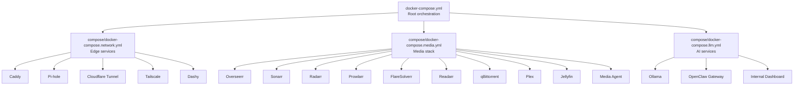
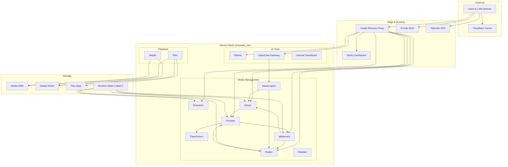
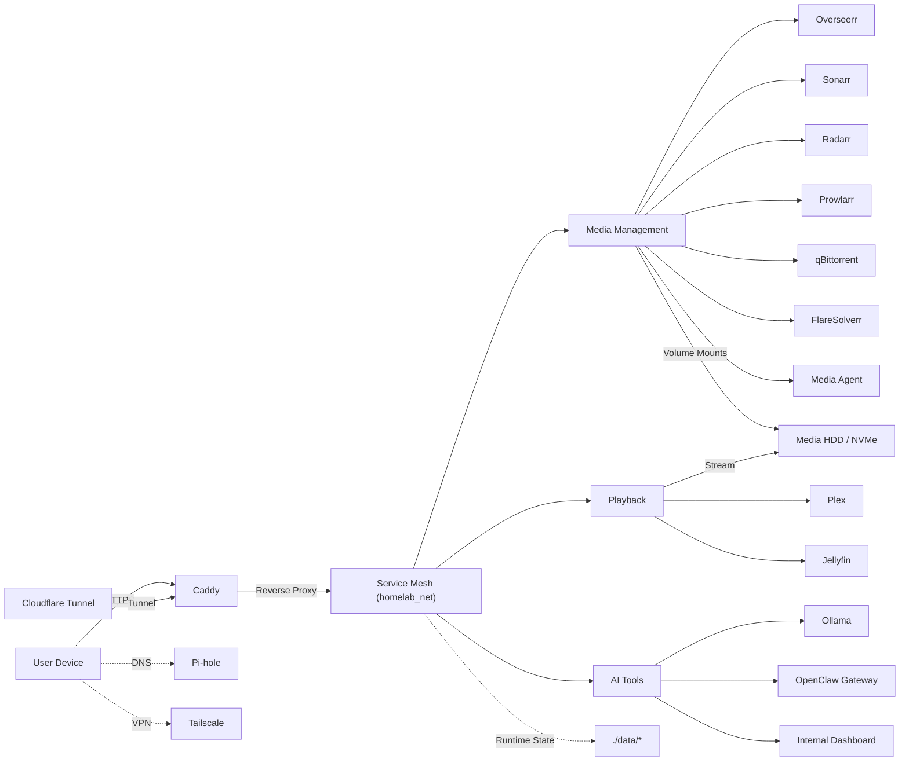
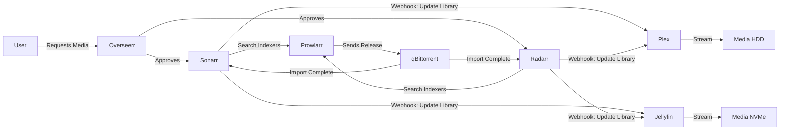
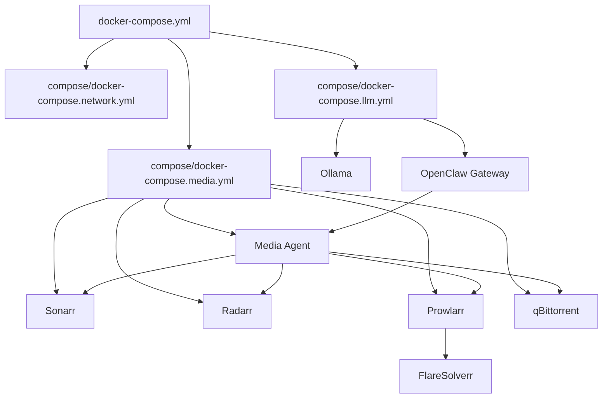

# Project Overview

<cite>
**Referenced Files in This Document**
- [README.md](file://README.md)
- [docker-compose.yml](file://docker-compose.yml)
- [compose/docker-compose.network.yml](file://compose/docker-compose.network.yml)
- [compose/docker-compose.media.yml](file://compose/docker-compose.media.yml)
- [compose/docker-compose.llm.yml](file://compose/docker-compose.llm.yml)
- [docs/caddy-guide.md](file://docs/caddy-guide.md)
- [docs/network-access.md](file://docs/network-access.md)
- [docs/prowlarr-caddy-routing.md](file://docs/prowlarr-caddy-routing.md)
- [config/cloudflared/config.yml.example](file://config/cloudflared/config.yml.example)
- [config/dashy/conf.yml.example](file://config/dashy/conf.yml.example)
- [scripts/setup.sh](file://scripts/setup.sh)
- [media-agent/Dockerfile](file://media-agent/Dockerfile)
- [src/homelab_workers/Dockerfile](file://src/homelab_workers/Dockerfile)
</cite>

## Table of Contents
1. [Introduction](#introduction)
2. [Project Structure](#project-structure)
3. [Core Components](#core-components)
4. [Architecture Overview](#architecture-overview)
5. [Detailed Component Analysis](#detailed-component-analysis)
6. [Dependency Analysis](#dependency-analysis)
7. [Performance Considerations](#performance-considerations)
8. [Troubleshooting Guide](#troubleshooting-guide)
9. [Conclusion](#conclusion)

## Introduction
This Homelab project is a Docker-based media management ecosystem designed to automate acquisition, organization, and playback of open-source and public-domain media. It blends a traditional Arr stack (Overseerr, Sonarr, Radarr, Prowlarr, qBittorrent) with modern AI/LLM capabilities (Ollama, OpenClaw, Media Agent). The setup emphasizes legal acquisition, privacy, and education, offering a practical foundation for learning systems design, microservices orchestration, and CI/CD workflows.

Key goals:
- Legal, open-source/public domain media acquisition
- Centralized ingress and routing via Caddy
- Secure, segmented Docker networking with a shared external network
- Practical automation from request to playback
- Educational value for both beginners and experienced developers

## Project Structure
The repository organizes services into modular Compose fragments orchestrated by a root compose file. This “Compose include” pattern cleanly separates concerns:
- Edge services (Caddy, Pi-hole, Cloudflare Tunnel, Tailscale, Dashy)
- Media management stack (Overseerr, Sonarr, Radarr, Prowlarr, qBittorrent, FlareSolverr, Media Agent)
- AI services (Ollama, OpenClaw gateway, internal dashboard)

**Diagram sources**
- [docker-compose.yml:1-13](file://docker-compose.yml#L1-L13)
- [compose/docker-compose.network.yml:1-122](file://compose/docker-compose.network.yml#L1-L122)
- [compose/docker-compose.media.yml:1-317](file://compose/docker-compose.media.yml#L1-L317)
- [compose/docker-compose.llm.yml:1-169](file://compose/docker-compose.llm.yml#L1-L169)

**Section sources**
- [README.md:168-176](file://README.md#L168-L176)
- [docker-compose.yml:1-13](file://docker-compose.yml#L1-L13)

## Core Components
- Edge services (edge services)
  - Caddy: HTTPS reverse proxy with subpath and subdomain routing, DNS-01 TLS via Cloudflare, and HSTS enforcement.
  - Pi-hole: LAN DNS filtering and blocking.
  - Cloudflare Tunnel: Public HTTPS ingress without opening inbound ports.
  - Tailscale: Remote mesh VPN for secure access.
  - Dashy: Centralized dashboard linking to managed services.
- Media management stack (media services)
  - Overseerr: Media request hub with approvals.
  - Sonarr/Radarr/Prowlarr/Readarr: Automated series/movie/book discovery and management.
  - qBittorrent: BitTorrent client for downloads.
  - FlareSolverr: Headless browser helper for indexers.
  - Media Agent: Stable JSON interface for metadata and actions.
- Media servers (playback)
  - Plex and Jellyfin: Media servers with GPU acceleration.
- AI services (LLM/AI tools)
  - Ollama: Local LLM runtime (LAN-only).
  - OpenClaw: Personal AI assistant gateway.
  - Internal Dashboard: Unprivileged UI for internal tools.

**Section sources**
- [README.md:7-22](file://README.md#L7-L22)
- [compose/docker-compose.network.yml:7-122](file://compose/docker-compose.network.yml#L7-L122)
- [compose/docker-compose.media.yml:7-317](file://compose/docker-compose.media.yml#L7-L317)
- [compose/docker-compose.llm.yml:7-169](file://compose/docker-compose.llm.yml#L7-L169)

## Architecture Overview
At a high level, the system routes external and LAN traffic through Caddy, which proxies to internal services on a shared Docker bridge network. Media acquisition flows from discovery to import and finally to playback. AI services integrate via Media Agent and OpenClaw.

**Diagram sources**
- [README.md:43-167](file://README.md#L43-L167)
- [docs/network-access.md:7-172](file://docs/network-access.md#L7-L172)
- [docs/caddy-guide.md:10-133](file://docs/caddy-guide.md#L10-L133)

## Detailed Component Analysis

### Edge Services (Caddy, Pi-hole, Cloudflare Tunnel, Tailscale, Dashy)
- Caddy
  - Single source of truth routing in a hand-authored Caddyfile.
  - Subpath routes for Arr stack and utilities; subdomain routes for Plex, Jellyfin, Pi-hole, and OpenClaw.
  - DNS-01 ACME challenge via Cloudflare; HSTS enforced; admin API on :2019.
- Pi-hole
  - LAN DNS filtering; exposed via Caddy subdomain route.
- Cloudflare Tunnel
  - Provides public HTTPS ingress without exposing host ports; configured via cloudflared.
- Tailscale
  - Mesh VPN for remote access; host networking required.
- Dashy
  - Centralized dashboard linked to Caddy routes.

Practical example: A user accesses Overseerr at https://{BASE_DOMAIN}/overseerr. Caddy routes the request to the Overseerr container on port 5055. The :80 block mirrors this for LAN access.

**Section sources**
- [docs/caddy-guide.md:10-133](file://docs/caddy-guide.md#L10-L133)
- [compose/docker-compose.network.yml:7-122](file://compose/docker-compose.network.yml#L7-L122)
- [config/cloudflared/config.yml.example:1-15](file://config/cloudflared/config.yml.example#L1-L15)
- [config/dashy/conf.yml.example:1-35](file://config/dashy/conf.yml.example#L1-L35)

### Media Management Stack (Overseerr, Sonarr, Radarr, Prowlarr, qBittorrent, FlareSolverr, Media Agent)
- Overseerr
  - Manages media requests and approvals; listens on loopback-only port 5055.
- Sonarr/Radarr/Prowlarr/Readarr
  - Arr stack services with UrlBase settings; use path-preserving routing in Caddy.
  - Volume-mounted media and downloads directories; GPU acceleration optional.
- qBittorrent
  - BitTorrent client with port 51423 open for peers; downloads staged in NVMe.
- FlareSolverr
  - Headless browser for dynamic indexers; shared memory and PID limits.
- Media Agent
  - Internal API for metadata and actions; stable JSON contract; built from media-agent app.

Practical example: A user requests a movie via Overseerr. Overseerr approves the request, which triggers Sonarr to search indexers via Prowlarr. Prowlarr uses FlareSolverr when needed, retrieves releases, and forwards them to qBittorrent. Upon completion, qBittorrent notifies Sonarr/Radarr, which refresh libraries and notify Plex/Jellyfin.

**Section sources**
- [compose/docker-compose.media.yml:7-317](file://compose/docker-compose.media.yml#L7-L317)
- [docs/prowlarr-caddy-routing.md:1-107](file://docs/prowlarr-caddy-routing.md#L1-L107)
- [docs/network-access.md:21-172](file://docs/network-access.md#L21-L172)

### Media Servers (Plex, Jellyfin)
- Both services use host networking for improved LAN discovery and casting compatibility.
- GPU acceleration enabled by default (NVIDIA Container Toolkit).
- Media libraries mounted read-only; Plex data persisted separately.

Practical example: After import, Sonarr/Radarr send webhook notifications to update libraries. Plex and Jellyfin refresh their metadata and serve content to clients.

**Section sources**
- [compose/docker-compose.media.yml:172-237](file://compose/docker-compose.media.yml#L172-L237)
- [docs/network-access.md:21-37](file://docs/network-access.md#L21-L37)

### AI Services (Ollama, OpenClaw, Media Agent)
- Ollama
  - LAN-only binding on 127.0.0.1:11434; reachable via Docker DNS on homelab_net.
  - GPU enabled by default; persistent models stored under ./data/llm/ollama.
- OpenClaw
  - Gateway service for AI-assisted control; exposes loopback-only ports.
  - Integrates with Arr stack and Media Agent; optional Telegram channel.
- Media Agent
  - Internal API for metadata and actions; stable JSON contract; built from media-agent app.

Practical example: OpenClaw uses Ollama for LLM tasks and orchestrates actions via Media Agent. Media Agent interacts with Sonarr/Radarr and qBittorrent to fulfill requests.

**Section sources**
- [compose/docker-compose.llm.yml:7-169](file://compose/docker-compose.llm.yml#L7-L169)
- [media-agent/Dockerfile:1-15](file://media-agent/Dockerfile#L1-L15)

## Architecture Overview

**Diagram sources**
- [README.md:43-167](file://README.md#L43-L167)
- [compose/docker-compose.network.yml:7-122](file://compose/docker-compose.network.yml#L7-L122)
- [compose/docker-compose.media.yml:7-317](file://compose/docker-compose.media.yml#L7-L317)
- [compose/docker-compose.llm.yml:7-169](file://compose/docker-compose.llm.yml#L7-L169)

## Detailed Component Analysis

### Media Data Flow (Discovery to Playback)
This flow illustrates the end-to-end journey from user request to media playback.

**Diagram sources**
- [README.md:402-461](file://README.md#L402-L461)
- [docs/network-access.md:21-172](file://docs/network-access.md#L21-L172)

### Caddy Routing Model
Caddy centralizes routing with three top-level blocks:
- HTTPS primary domain with subpath routes for Arr stack and utilities.
- HTTPS subdomains for services requiring dedicated hostnames.
- HTTP :80 LAN routes mirroring subpath routes without TLS.

Routing rules:
- Use handle for services with UrlBase (Sonarr, Radarr, Prowlarr, Readarr).
- Use handle_path for services without UrlBase (Overseerr, qBittorrent, Dashboard).

**Section sources**
- [docs/caddy-guide.md:10-133](file://docs/caddy-guide.md#L10-L133)
- [docs/prowlarr-caddy-routing.md:79-82](file://docs/prowlarr-caddy-routing.md#L79-L82)

### Network Architecture and Security
- Shared external bridge network: homelab_net
- Host networking used only for services requiring it (Pi-hole, Tailscale, Cloudflare Tunnel, Plex, Jellyfin).
- Security posture:
  - Minimal privileges and capability drops for containers.
  - No host port exposure except where protocol behavior requires it.
  - Ollama restricted to loopback-only binding.
  - HSTS and DNS-01 TLS via Cloudflare.

**Section sources**
- [README.md:389-401](file://README.md#L389-L401)
- [compose/docker-compose.llm.yml:9-35](file://compose/docker-compose.llm.yml#L9-L35)
- [docs/network-access.md:7-172](file://docs/network-access.md#L7-L172)

## Dependency Analysis

**Diagram sources**
- [docker-compose.yml:1-13](file://docker-compose.yml#L1-L13)
- [compose/docker-compose.media.yml:7-317](file://compose/docker-compose.media.yml#L7-L317)
- [compose/docker-compose.llm.yml:7-169](file://compose/docker-compose.llm.yml#L7-L169)

**Section sources**
- [docker-compose.yml:1-13](file://docker-compose.yml#L1-L13)
- [compose/docker-compose.media.yml:276-317](file://compose/docker-compose.media.yml#L276-L317)
- [compose/docker-compose.llm.yml:56-133](file://compose/docker-compose.llm.yml#L56-L133)

## Performance Considerations
- GPU acceleration is enabled by default for media servers and Ollama; ensure NVIDIA Container Toolkit is installed on the host.
- Shared external network reduces overhead while maintaining service isolation.
- FlareSolverr and Media Agent are constrained by memory and PID limits to prevent resource contention.
- Persistent storage on NVMe for fast downloads and HDD for long-term library improves throughput.

[No sources needed since this section provides general guidance]

## Troubleshooting Guide
Common issues and resolutions:
- 404 on subpath routes
  - Ensure Caddyfile uses handle for services with UrlBase and handle_path for services without UrlBase.
- Zero active indexers
  - Confirm Prowlarr UrlBase matches Caddyfile routing; reload Caddy after changes.
- Host-network 502 errors
  - Allow Docker bridge subnet to reach host ports (e.g., Plex 32400, Jellyfin 8096).
- TLS certificate failures
  - Verify Cloudflare token is set and DNS-01 challenge succeeds.
- API authentication
  - Use X-Api-Key for Arr services; qBittorrent requires session cookies.

Operational commands:
- Validate Caddyfile syntax and check live config via admin API.
- Restart Caddy after updating routes.
- Use Docker network inspection to verify container IPs and connectivity.

**Section sources**
- [docs/caddy-guide.md:94-133](file://docs/caddy-guide.md#L94-L133)
- [docs/prowlarr-caddy-routing.md:1-107](file://docs/prowlarr-caddy-routing.md#L1-L107)
- [docs/network-access.md:144-172](file://docs/network-access.md#L144-L172)

## Conclusion
This Homelab template demonstrates a practical, legal, and educational approach to building a modern media ecosystem. By combining a robust Arr stack with AI/LLM capabilities and a secure, centralized ingress layer, it offers a scalable foundation for learning systems design, microservices orchestration, and automated media workflows. The modular Compose include pattern, explicit routing model, and strong security posture make it suitable for both beginners and advanced users.