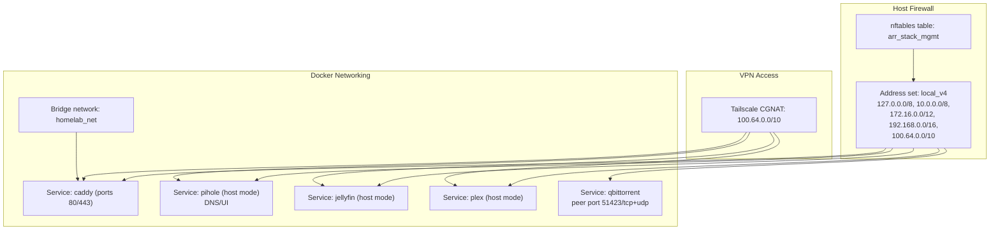
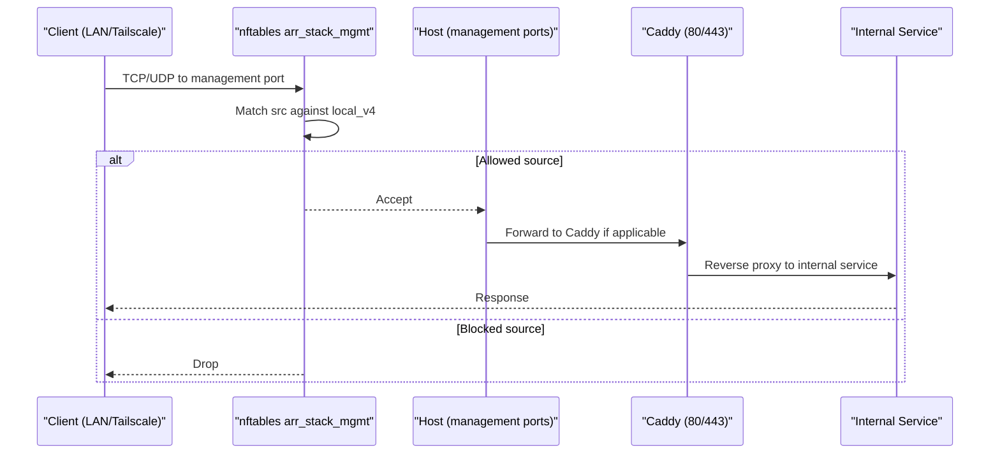
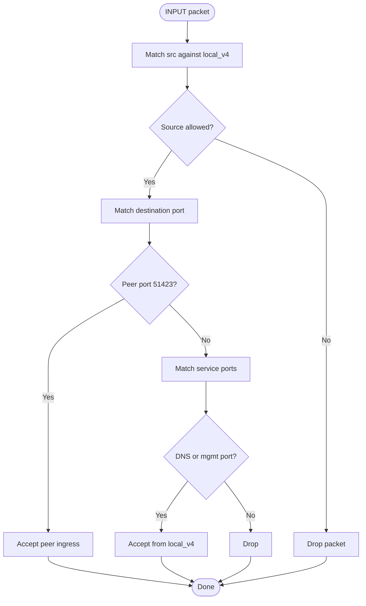
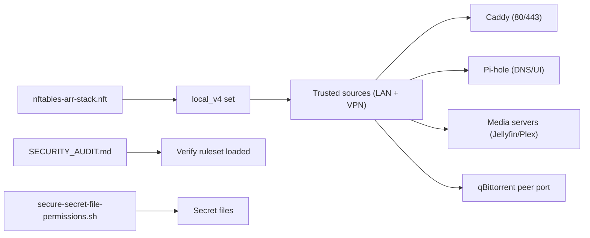

# Network Security

<cite>
**Referenced Files in This Document**
- [nftables-arr-stack.nft](file://scripts/hardening/nftables-arr-stack.nft)
- [SECURITY_AUDIT.md](file://scripts/hardening/SECURITY_AUDIT.md)
- [docker-compose.network.yml](file://compose/docker-compose.network.yml)
- [docker-compose.media.yml](file://compose/docker-compose.media.yml)
- [docker-compose.llm.yml](file://compose/docker-compose.llm.yml)
- [network-access.md](file://docs/network-access.md)
- [README.md](file://README.md)
- [secure-secret-file-permissions.sh](file://scripts/hardening/secure-secret-file-permissions.sh)
</cite>

## Table of Contents
1. [Introduction](#introduction)
2. [Project Structure](#project-structure)
3. [Core Components](#core-components)
4. [Architecture Overview](#architecture-overview)
5. [Detailed Component Analysis](#detailed-component-analysis)
6. [Dependency Analysis](#dependency-analysis)
7. [Performance Considerations](#performance-considerations)
8. [Troubleshooting Guide](#troubleshooting-guide)
9. [Conclusion](#conclusion)

## Introduction
This document details the network security posture of the homelab with a focus on the nftables-based host-level firewall and network segmentation strategy. It explains how the arr_stack_mgmt table restricts management ingress to trusted RFC1918 ranges plus Tailscale CGNAT, documents port filtering for Caddy, Pi-hole, and media servers, and covers BitTorrent peer ingress handling. It also clarifies the distinction between host-level filtering and Docker’s FORWARD rules, outlines security implications of port forwarding, and describes integration with VPN access via Tailscale. Practical guidance is included for loading the ruleset, listing current configuration, and adjusting allowed address ranges, along with troubleshooting and security audit procedures.

## Project Structure
The network security implementation centers on:
- A host-level nftables table (arr_stack_mgmt) that filters incoming traffic to management ports
- Docker Compose configurations that define service exposure and host-mode exceptions
- Documentation and scripts that enforce secret permissions and describe operational hardening steps

**Diagram sources**
- [nftables-arr-stack.nft:16-36](file://scripts/hardening/nftables-arr-stack.nft#L16-L36)
- [docker-compose.network.yml:8-62](file://compose/docker-compose.network.yml#L8-L62)
- [docker-compose.media.yml:239-275](file://compose/docker-compose.media.yml#L239-L275)

**Section sources**
- [nftables-arr-stack.nft:1-37](file://scripts/hardening/nftables-arr-stack.nft#L1-L37)
- [docker-compose.network.yml:7-122](file://compose/docker-compose.network.yml#L7-L122)
- [docker-compose.media.yml:1-317](file://compose/docker-compose.media.yml#L1-L317)
- [README.md:389-401](file://README.md#L389-L401)

## Core Components
- Host-level nftables table (arr_stack_mgmt)
  - Purpose: Filter inbound traffic to management ports on the host
  - Scope: Only affects traffic destined to the host; does not alter Docker’s FORWARD chain
  - Address set local_v4: Includes loopback, private IPv4 ranges, and Tailscale CGNAT to allow management access from LAN and VPN
  - Rules:
    - Accept BitTorrent peer ingress on the qBittorrent listen port (TCP/UDP)
    - Accept DNS (53) and selected management ports (Caddy, Pi-hole admin, media UIs) only from local_v4
    - Drop remaining traffic to those ports from other sources
- Docker Compose network segmentation
  - Default: All services on a shared bridge network (homelab_net)
  - Exceptions: Pi-hole, Jellyfin, Plex, and cloudflared run in host mode for protocol requirements
  - Caddy exposes ports 80/443 to the host and routes to internal services
- VPN integration
  - Tailscale CGNAT range is whitelisted in local_v4 to allow remote management via VPN

Practical commands:
- Load ruleset: sudo nft -f ./scripts/hardening/nftables-arr-stack.nft
- List current table: sudo nft list table inet arr_stack_mgmt
- List all rulesets: sudo nft list ruleset

**Section sources**
- [nftables-arr-stack.nft:16-36](file://scripts/hardening/nftables-arr-stack.nft#L16-L36)
- [docker-compose.network.yml:35-62](file://compose/docker-compose.network.yml#L35-L62)
- [docker-compose.media.yml:239-275](file://compose/docker-compose.media.yml#L239-L275)
- [SECURITY_AUDIT.md:75-78](file://scripts/hardening/SECURITY_AUDIT.md#L75-L78)

## Architecture Overview
The security architecture separates concerns:
- Host-level filtering (nftables) controls who can reach management ports from the outside
- Docker networking confines inter-service communication to the bridge network
- Caddy centralizes ingress and TLS termination, while most services remain internal-only
- VPN access is explicitly permitted via Tailscale CGNAT

**Diagram sources**
- [nftables-arr-stack.nft:24-35](file://scripts/hardening/nftables-arr-stack.nft#L24-L35)
- [docker-compose.network.yml:8-33](file://compose/docker-compose.network.yml#L8-L33)

**Section sources**
- [nftables-arr-stack.nft:16-36](file://scripts/hardening/nftables-arr-stack.nft#L16-L36)
- [docker-compose.network.yml:8-33](file://compose/docker-compose.network.yml#L8-L33)

## Detailed Component Analysis

### nftables arr_stack_mgmt table
- Address set local_v4
  - Purpose: Define trusted source prefixes for management access
  - Elements include loopback, private IPv4 ranges, and Tailscale CGNAT
  - Editable: Adjust elements if you need to allow management access from other ranges
- Input chain rules
  - BitTorrent peer ingress: Accept TCP/UDP on the qBittorrent peer port
  - DNS and management ports: Accept only from local_v4
  - Remaining traffic to those ports: Dropped
- Idempotent reload
  - Deletes existing table before redefining to avoid duplicates

**Diagram sources**
- [nftables-arr-stack.nft:24-35](file://scripts/hardening/nftables-arr-stack.nft#L24-L35)

**Section sources**
- [nftables-arr-stack.nft:16-36](file://scripts/hardening/nftables-arr-stack.nft#L16-L36)

### Port filtering rules summary
- Caddy (80/443): Allowed from local_v4; managed by nftables host filter
- Pi-hole DNS/UI (53/tcp, 53/udp, 8083/tcp): Allowed from local_v4; note: Pi-hole admin UI binds to host in this stack
- Media servers (Jellyfin 8096/tcp, Plex 32400/tcp): Allowed from local_v4; both run in host mode
- BitTorrent peer ingress (qBittorrent 51423/tcp+udp): Explicitly accepted regardless of source

Note: The host firewall does not alter Docker’s FORWARD chain; services exposed via host mode remain reachable from the host network.

**Section sources**
- [nftables-arr-stack.nft:29-34](file://scripts/hardening/nftables-arr-stack.nft#L29-L34)
- [docker-compose.network.yml:35-62](file://compose/docker-compose.network.yml#L35-L62)
- [docker-compose.media.yml:172-205](file://compose/docker-compose.media.yml#L172-L205)
- [docker-compose.media.yml:239-275](file://compose/docker-compose.media.yml#L239-L275)

### Local_v4 address set
- Ranges included:
  - Loopback: 127.0.0.0/8
  - Private IPv4: 10.0.0.0/8, 172.16.0.0/12, 192.168.0.0/16
  - Tailscale CGNAT: 100.64.0.0/10
- Purpose: Allow management access from trusted LAN and VPN networks
- Modification: Edit the elements in the set to expand or restrict allowed ranges

**Section sources**
- [nftables-arr-stack.nft:17-22](file://scripts/hardening/nftables-arr-stack.nft#L17-L22)

### Host-level filtering vs Docker FORWARD rules
- Host filter (nftables): Applies to traffic destined to the host; does not touch Docker’s FORWARD chain
- Docker FORWARD: Controls traffic between containers and the host; managed by Docker’s default policies and any custom rules
- Implication: Services exposed via host mode (Pi-hole, Plex, Jellyfin) remain reachable from the host network; nftables only gates management ports

**Section sources**
- [nftables-arr-stack.nft:9](file://scripts/hardening/nftables-arr-stack.nft#L9)
- [docker-compose.network.yml:35-62](file://compose/docker-compose.network.yml#L35-L62)
- [docker-compose.media.yml:172-205](file://compose/docker-compose.media.yml#L172-L205)

### VPN access via Tailscale
- Tailscale CGNAT range (100.64.0.0/10) is included in local_v4
- Effect: Remote management via Tailscale is permitted for Caddy, Pi-hole, and media UIs
- Recommendation: Combine with strong authentication and least privilege access

**Section sources**
- [nftables-arr-stack.nft:21](file://scripts/hardening/nftables-arr-stack.nft#L21)
- [docker-compose.network.yml:103-122](file://compose/docker-compose.network.yml#L103-L122)

### Practical administration
- Load the ruleset
  - Command: sudo nft -f ./scripts/hardening/nftables-arr-stack.nft
- List current configuration
  - Command: sudo nft list table inet arr_stack_mgmt
  - List all rulesets: sudo nft list ruleset
- Modify allowed address ranges
  - Edit the elements in set local_v4 in the nftables file and reload

**Section sources**
- [nftables-arr-stack.nft:5-6](file://scripts/hardening/nftables-arr-stack.nft#L5-L6)
- [SECURITY_AUDIT.md:75-78](file://scripts/hardening/SECURITY_AUDIT.md#L75-L78)

## Dependency Analysis
- nftables table depends on:
  - Correctly configured local_v4 elements
  - Host network interfaces and routing
- Docker Compose dependencies:
  - Caddy depends on correct labels and routing in the Caddyfile
  - Host-mode services depend on host network availability and proper firewall allowances
- Security audit dependencies:
  - Manual verification of loaded rulesets and service exposure
  - Secret file permissions enforced by the permission script

**Diagram sources**
- [nftables-arr-stack.nft:16-36](file://scripts/hardening/nftables-arr-stack.nft#L16-L36)
- [SECURITY_AUDIT.md:75-78](file://scripts/hardening/SECURITY_AUDIT.md#L75-L78)
- [secure-secret-file-permissions.sh:7-25](file://scripts/hardening/secure-secret-file-permissions.sh#L7-L25)

**Section sources**
- [nftables-arr-stack.nft:16-36](file://scripts/hardening/nftables-arr-stack.nft#L16-L36)
- [SECURITY_AUDIT.md:75-78](file://scripts/hardening/SECURITY_AUDIT.md#L75-L78)
- [secure-secret-file-permissions.sh:7-25](file://scripts/hardening/secure-secret-file-permissions.sh#L7-L25)

## Performance Considerations
- nftables evaluation order: Early accept rules for peer port minimize overhead for BitTorrent traffic
- Address set membership: Interval flags optimize matching across contiguous ranges
- Host filter scope: Only impacts management ports; normal Docker traffic unaffected

[No sources needed since this section provides general guidance]

## Troubleshooting Guide
Common connectivity issues and resolutions:
- Port 443 unreachable from WAN
  - Expected: Not forwarded at router; only LAN/Tailscale reachable
  - Verify: Confirm router NAT rules and firewall status
- Management UIs not reachable from LAN/Tailscale
  - Check: nftables table loaded and local_v4 includes your source range
  - Commands: sudo nft list table inet arr_stack_mgmt; sudo nft -f ./scripts/hardening/nftables-arr-stack.nft
- Pi-hole admin UI accessibility
  - Current setup: Host mode exposes admin UI on host; ensure local_v4 allows access
  - Recommendation: Bind to loopback or rely on Caddy routing for stronger isolation
- qBittorrent peer connectivity
  - Ensure host firewall accepts TCP/UDP 51423 and that the service publishes the port
- VPN access blocked
  - Confirm Tailscale is running and 100.64.0.0/10 is included in local_v4
- Host firewall not applied
  - The setup script does not auto-load nftables; apply manually and verify

Operational checks:
- Verify ruleset loaded: sudo nft list ruleset
- List arr_stack_mgmt table: sudo nft list table inet arr_stack_mgmt
- Rotate qBittorrent password and tighten permissions as recommended in the security audit

**Section sources**
- [SECURITY_AUDIT.md:75-78](file://scripts/hardening/SECURITY_AUDIT.md#L75-L78)
- [docker-compose.network.yml:35-62](file://compose/docker-compose.network.yml#L35-L62)
- [docker-compose.media.yml:239-275](file://compose/docker-compose.media.yml#L239-L275)
- [nftables-arr-stack.nft:29-34](file://scripts/hardening/nftables-arr-stack.nft#L29-L34)

## Conclusion
The homelab employs a layered security model: Docker bridge segmentation for internal service isolation, Caddy as the centralized ingress and TLS terminator, and nftables host-level filtering to restrict management access to trusted LAN and VPN ranges. The arr_stack_mgmt table provides a safe, idempotent mechanism to gate sensitive ports while allowing necessary services like BitTorrent peer ingress. Administrators should regularly verify the loaded ruleset, maintain strong authentication, and apply the recommended hardening steps to further reduce risk.