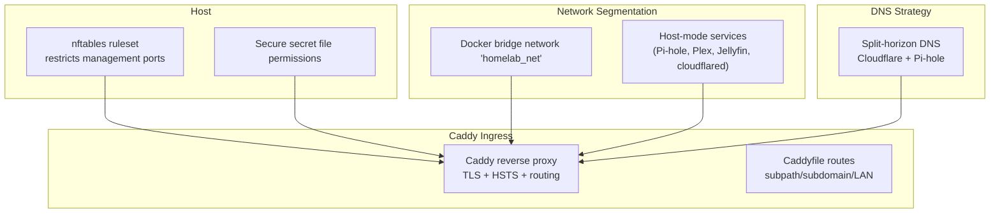
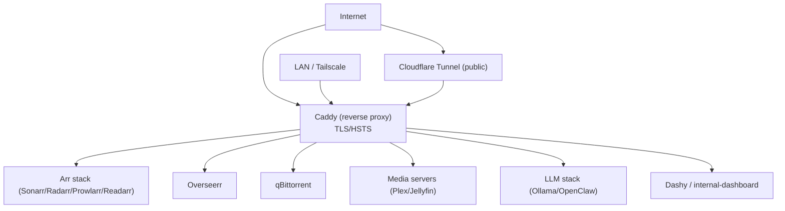
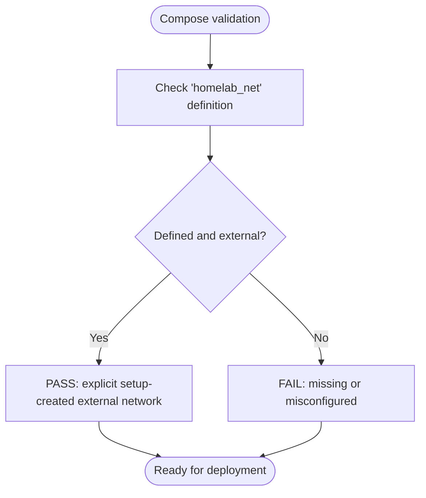
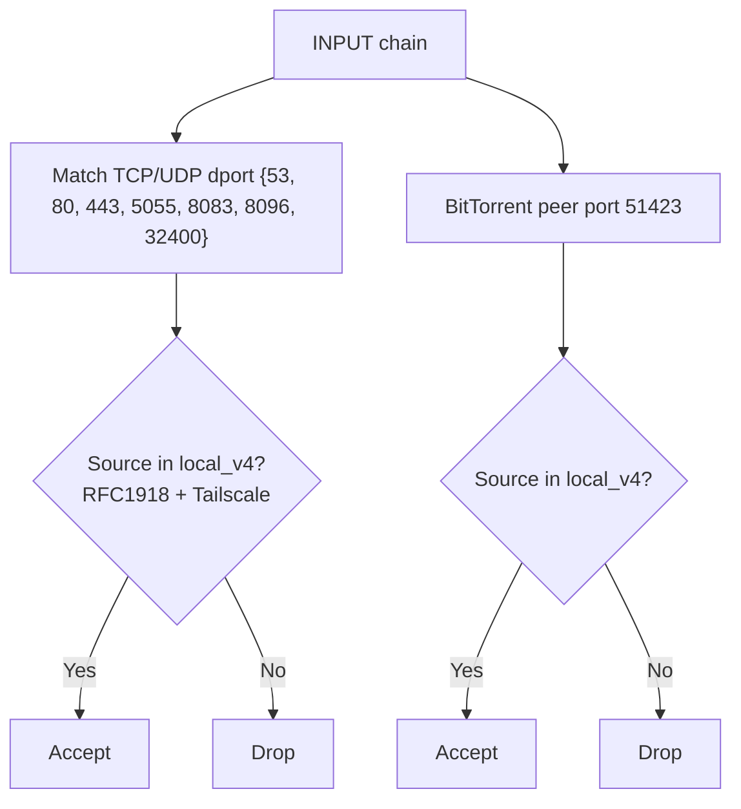
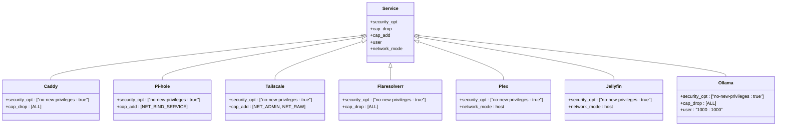
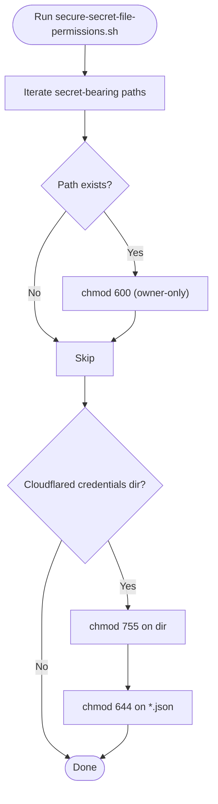
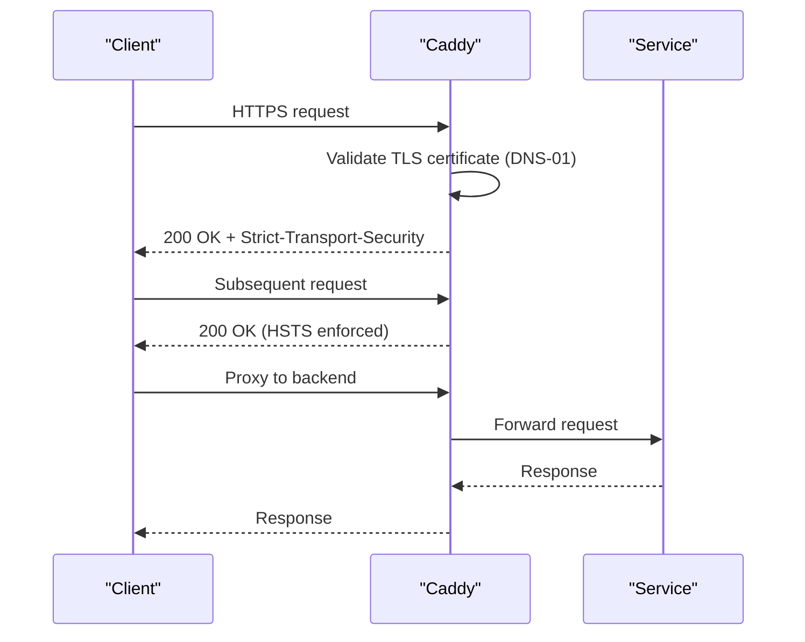
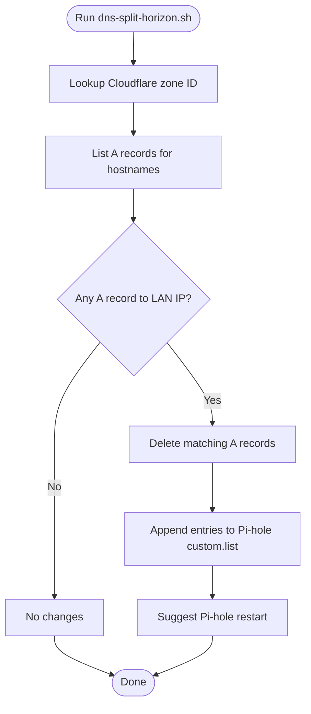
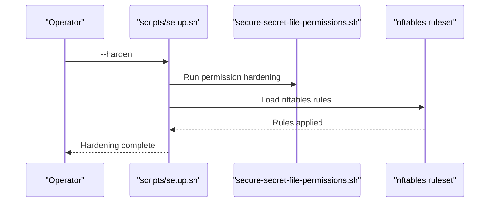
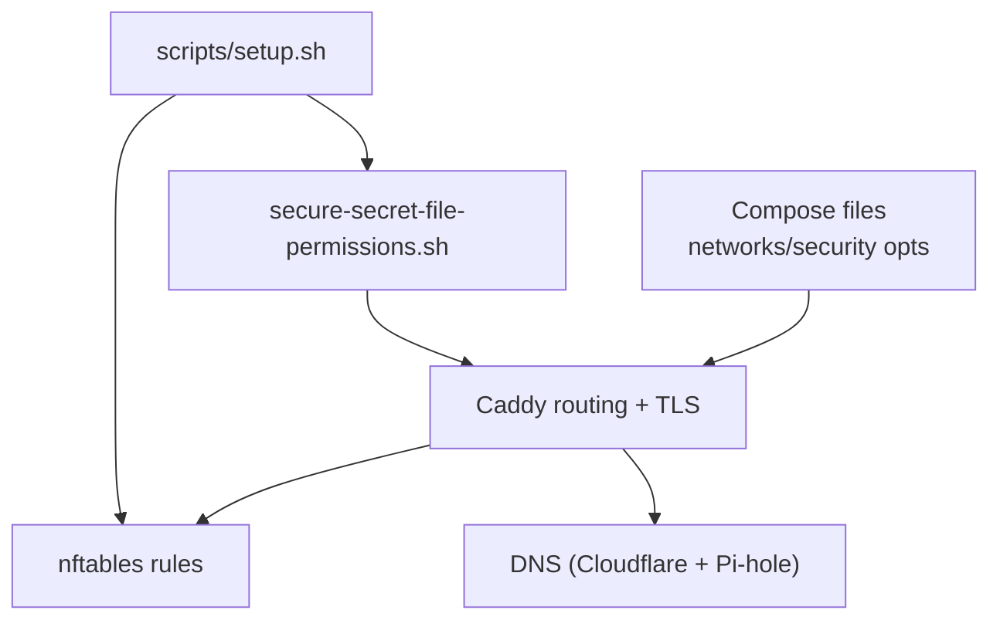

# Security and Hardening

<cite>
**Referenced Files in This Document**
- [nftables-arr-stack.nft](file://scripts/hardening/nftables-arr-stack.nft)
- [secure-secret-file-permissions.sh](file://scripts/hardening/secure-secret-file-permissions.sh)
- [SECURITY_AUDIT.md](file://scripts/hardening/SECURITY_AUDIT.md)
- [dns-split-horizon.sh](file://scripts/dns-split-horizon.sh)
- [docker-compose.network.yml](file://compose/docker-compose.network.yml)
- [docker-compose.media.yml](file://compose/docker-compose.media.yml)
- [docker-compose.llm.yml](file://compose/docker-compose.llm.yml)
- [test_network_definitions.sh](file://tests/compose/test_network_definitions.sh)
- [network-access.md](file://docs/network-access.md)
- [caddy-guide.md](file://docs/caddy-guide.md)
- [setup.sh](file://scripts/setup.sh)
- [README.md](file://README.md)
</cite>

## Table of Contents
1. [Introduction](#introduction)
2. [Project Structure](#project-structure)
3. [Core Components](#core-components)
4. [Architecture Overview](#architecture-overview)
5. [Detailed Component Analysis](#detailed-component-analysis)
6. [Dependency Analysis](#dependency-analysis)
7. [Performance Considerations](#performance-considerations)
8. [Troubleshooting Guide](#troubleshooting-guide)
9. [Conclusion](#conclusion)

## Introduction
This document details the multi-layered security approach implemented in the homelab infrastructure. It explains how network segmentation isolates services, how container hardening reduces privileges and capabilities, and how host-level controls (firewall and file permissions) limit exposure. It also documents the HSTS enforcement and split-horizon DNS strategy, providing both beginner-friendly explanations and technical specifics for advanced readers. Practical procedures, threat modeling considerations, and incident response guidance are included to help operators maintain a robust security posture.

## Project Structure
The security posture is implemented across:
- Host firewall rules (nftables) that restrict management ingress to trusted networks
- Container hardening via capability dropping, privilege restrictions, and user namespaces
- Centralized TLS termination and routing through Caddy with strict transport policies
- Secret file protection via targeted permission hardening
- DNS strategy to minimize exposure of internal IP addresses

**Diagram sources**
- [nftables-arr-stack.nft:1-37](file://scripts/hardening/nftables-arr-stack.nft#L1-L37)
- [secure-secret-file-permissions.sh:1-38](file://scripts/hardening/secure-secret-file-permissions.sh#L1-L38)
- [docker-compose.network.yml:1-122](file://compose/docker-compose.network.yml#L1-L122)
- [docker-compose.media.yml:1-317](file://compose/docker-compose.media.yml#L1-L317)
- [docker-compose.llm.yml:1-169](file://compose/docker-compose.llm.yml#L1-L169)
- [caddy-guide.md:1-133](file://docs/caddy-guide.md#L1-L133)
- [dns-split-horizon.sh:1-110](file://scripts/dns-split-horizon.sh#L1-L110)

**Section sources**
- [README.md:389-401](file://README.md#L389-L401)
- [network-access.md:1-20](file://docs/network-access.md#L1-L20)

## Core Components
- Network segmentation using a dedicated Docker bridge network for internal service communication, with host-mode exceptions only where required for protocol behavior.
- Centralized ingress via Caddy with strict routing, HSTS enforcement, and TLS managed by DNS-01 challenges.
- Host firewall rules that restrict management ports to RFC 1918 and Tailscale CGNAT ranges.
- Container hardening with capability dropping, no-new-privileges, and user-specific identities where applicable.
- Secret file protection via targeted permission tightening and controlled access for tunnel credentials.
- DNS split-horizon to avoid leaking internal IPs in public DNS.

**Section sources**
- [docker-compose.network.yml:1-122](file://compose/docker-compose.network.yml#L1-L122)
- [docker-compose.media.yml:1-317](file://compose/docker-compose.media.yml#L1-L317)
- [docker-compose.llm.yml:1-169](file://compose/docker-compose.llm.yml#L1-L169)
- [nftables-arr-stack.nft:1-37](file://scripts/hardening/nftables-arr-stack.nft#L1-L37)
- [secure-secret-file-permissions.sh:1-38](file://scripts/hardening/secure-secret-file-permissions.sh#L1-L38)
- [caddy-guide.md:77-83](file://docs/caddy-guide.md#L77-L83)
- [dns-split-horizon.sh:1-110](file://scripts/dns-split-horizon.sh#L1-L110)

## Architecture Overview
The security architecture layers controls across the network, container, and host boundaries. Services communicate internally on a shared bridge network, while Caddy handles all external traffic with enforced TLS and HSTS. Host-level firewall rules further constrain management ingress. Secrets are protected at rest, and DNS is configured to avoid exposing internal infrastructure to the public Internet.

**Diagram sources**
- [caddy-guide.md:12-72](file://docs/caddy-guide.md#L12-L72)
- [docker-compose.network.yml:7-122](file://compose/docker-compose.network.yml#L7-L122)
- [docker-compose.media.yml:7-317](file://compose/docker-compose.media.yml#L7-L317)
- [docker-compose.llm.yml:7-169](file://compose/docker-compose.llm.yml#L7-L169)

## Detailed Component Analysis

### Network Segmentation Strategy (homelab_net)
- A dedicated Docker bridge network named and validated by CI tests ensures services communicate only via container DNS names.
- Host-mode exceptions are minimized and justified for services requiring direct host networking (Pi-hole DNS, Plex/Jellyfin discovery, cloudflared tunnel agent).
- The network topology isolates internal services and prevents accidental host port exposure.

**Diagram sources**
- [test_network_definitions.sh:1-68](file://tests/compose/test_network_definitions.sh#L1-L68)

**Section sources**
- [test_network_definitions.sh:1-68](file://tests/compose/test_network_definitions.sh#L1-L68)
- [network-access.md:7-18](file://docs/network-access.md#L7-L18)
- [README.md:389-401](file://README.md#L389-L401)

### Host Firewall: nftables Management Port Controls
The nftables ruleset restricts management ingress to trusted networks:
- Accepts Caddy (80/443), Pi-hole DNS/UI, and optional media/admin listeners only from RFC 1918 + Tailscale CGNAT ranges.
- Drops the same ports from other sources (e.g., WAN).
- Safe to reload; flushes and recreates the table to avoid duplicates.

**Diagram sources**
- [nftables-arr-stack.nft:16-36](file://scripts/hardening/nftables-arr-stack.nft#L16-L36)

**Section sources**
- [nftables-arr-stack.nft:1-37](file://scripts/hardening/nftables-arr-stack.nft#L1-L37)
- [SECURITY_AUDIT.md:69-79](file://scripts/hardening/SECURITY_AUDIT.md#L69-L79)

### Container Hardening: Capability Dropping and Privilege Restrictions
- Most bridge-mode services declare `cap_drop: [ALL]` and `security_opt: ["no-new-privileges:true"]`.
- Exceptions include services that require specific capabilities (e.g., Pi-hole and Tailscale host networking), with recommendations to tighten where possible.
- Some containers run as root; recommendations include adding a dedicated non-root user or using unprivileged base images.

**Diagram sources**
- [docker-compose.network.yml:8-122](file://compose/docker-compose.network.yml#L8-L122)
- [docker-compose.media.yml:8-317](file://compose/docker-compose.media.yml#L8-L317)
- [docker-compose.llm.yml:10-169](file://compose/docker-compose.llm.yml#L10-L169)

**Section sources**
- [docker-compose.network.yml:8-122](file://compose/docker-compose.network.yml#L8-L122)
- [docker-compose.media.yml:8-317](file://compose/docker-compose.media.yml#L8-L317)
- [docker-compose.llm.yml:10-169](file://compose/docker-compose.llm.yml#L10-L169)
- [SECURITY_AUDIT.md:194-270](file://scripts/hardening/SECURITY_AUDIT.md#L194-L270)

### Host-Level File Permission Management
The secure-secret-file-permissions script tightens file modes for secret-bearing files:
- Applies restrictive modes to environment and configuration files.
- Ensures cloudflared tunnel credentials are readable by the container user while maintaining safe directory permissions.

**Diagram sources**
- [secure-secret-file-permissions.sh:17-37](file://scripts/hardening/secure-secret-file-permissions.sh#L17-L37)

**Section sources**
- [secure-secret-file-permissions.sh:1-38](file://scripts/hardening/secure-secret-file-permissions.sh#L1-L38)

### TLS and Transport Security: HSTS Enforcement
- Caddy enforces TLS with DNS-01 challenges and sends HSTS headers globally.
- The audit identifies the absence of HSTS as a medium-severity finding and recommends adding HSTS via global or per-site headers.

**Diagram sources**
- [caddy-guide.md:77-83](file://docs/caddy-guide.md#L77-L83)
- [SECURITY_AUDIT.md:440-447](file://scripts/hardening/SECURITY_AUDIT.md#L440-L447)

**Section sources**
- [caddy-guide.md:77-83](file://docs/caddy-guide.md#L77-L83)
- [SECURITY_AUDIT.md:440-447](file://scripts/hardening/SECURITY_AUDIT.md#L440-L447)

### DNS Strategy: Split-Horizon to Minimize Exposure
The split-horizon script removes LAN-resolving A records from Cloudflare and adds them as Pi-hole local DNS entries, reducing the public exposure of internal IP addresses.

**Diagram sources**
- [dns-split-horizon.sh:49-107](file://scripts/dns-split-horizon.sh#L49-L107)

**Section sources**
- [dns-split-horizon.sh:1-110](file://scripts/dns-split-horizon.sh#L1-L110)
- [SECURITY_AUDIT.md:166-191](file://scripts/hardening/SECURITY_AUDIT.md#L166-L191)

### Operational Hardening Procedures
- The setup script supports an automated hardening pass that applies file permission tightening and loads nftables rules.
- Recommendations include adding a global auth layer (forward_auth) on Caddy, pinning image tags, and adding healthchecks and resource limits.

**Diagram sources**
- [setup.sh:185-207](file://scripts/setup.sh#L185-L207)
- [secure-secret-file-permissions.sh:1-38](file://scripts/hardening/secure-secret-file-permissions.sh#L1-L38)
- [nftables-arr-stack.nft:1-37](file://scripts/hardening/nftables-arr-stack.nft#L1-L37)

**Section sources**
- [setup.sh:185-207](file://scripts/setup.sh#L185-L207)
- [SECURITY_AUDIT.md:550-562](file://scripts/hardening/SECURITY_AUDIT.md#L550-L562)

## Dependency Analysis
The security posture depends on coordinated configuration across Docker Compose, Caddy, nftables, and DNS. Misalignment in any layer can weaken the overall defense.

**Diagram sources**
- [docker-compose.network.yml:1-122](file://compose/docker-compose.network.yml#L1-L122)
- [docker-compose.media.yml:1-317](file://compose/docker-compose.media.yml#L1-L317)
- [docker-compose.llm.yml:1-169](file://compose/docker-compose.llm.yml#L1-L169)
- [caddy-guide.md:1-133](file://docs/caddy-guide.md#L1-L133)
- [nftables-arr-stack.nft:1-37](file://scripts/hardening/nftables-arr-stack.nft#L1-L37)
- [dns-split-horizon.sh:1-110](file://scripts/dns-split-horizon.sh#L1-L110)
- [secure-secret-file-permissions.sh:1-38](file://scripts/hardening/secure-secret-file-permissions.sh#L1-L38)
- [setup.sh:185-207](file://scripts/setup.sh#L185-L207)

**Section sources**
- [docker-compose.network.yml:1-122](file://compose/docker-compose.network.yml#L1-L122)
- [docker-compose.media.yml:1-317](file://compose/docker-compose.media.yml#L1-L317)
- [docker-compose.llm.yml:1-169](file://compose/docker-compose.llm.yml#L1-L169)
- [caddy-guide.md:1-133](file://docs/caddy-guide.md#L1-L133)
- [SECURITY_AUDIT.md:457-499](file://scripts/hardening/SECURITY_AUDIT.md#L457-L499)

## Performance Considerations
- Centralized TLS termination via Caddy reduces per-service CPU overhead and simplifies certificate management.
- Limiting management ingress with nftables reduces scanning and potential attack surface without impacting normal operations.
- Restricting container capabilities and enforcing no-new-privileges minimizes the blast radius of potential container escapes.

## Troubleshooting Guide
Common issues and remediation steps:
- Management UIs not reachable from WAN: Confirm port 443 is not forwarded at the router; Caddy-served admin UIs are intentionally LAN/Tailscale-only.
- Pi-hole admin UI reachable from LAN without Caddy TLS: Bind to loopback or rely on Caddy subdomain routing.
- Ollama API fully exposed without authentication: Remove the Caddy label or add basic_auth/forward_auth middleware.
- Cloudflare tunnel media streaming: Consider removing tunnel routes for media to avoid ToS risks.
- Missing HSTS header: Add HSTS via a global Caddy snippet or per-site header directive.
- Weak qBittorrent password: Rotate to a strong random password and update both .env and WebUI settings.
- Missing no-new-privileges on Pi-hole/Tailscale: Add security_opt to both services.
- No cap_drop baseline: Add cap_drop: [ALL] to all bridge-mode services and grant only required capabilities.
- No user namespace remapping: Enable userns-remap in Docker daemon configuration (requires compatibility testing).

**Section sources**
- [SECURITY_AUDIT.md:32-79](file://scripts/hardening/SECURITY_AUDIT.md#L32-L79)
- [SECURITY_AUDIT.md:80-191](file://scripts/hardening/SECURITY_AUDIT.md#L80-L191)
- [SECURITY_AUDIT.md:440-447](file://scripts/hardening/SECURITY_AUDIT.md#L440-L447)
- [SECURITY_AUDIT.md:550-562](file://scripts/hardening/SECURITY_AUDIT.md#L550-L562)

## Conclusion
The homelab employs a layered security model: network segmentation via Docker bridge networks, centralized ingress with strict TLS and HSTS, host-level firewall controls, and hardened container configurations. Operational hardening scripts streamline deployment of these controls. While the current setup is reasonably secure, the audit highlights areas for improvement, including global authentication, image pinning, and stricter container privileges. Addressing these recommendations will further strengthen the security posture against evolving threats.