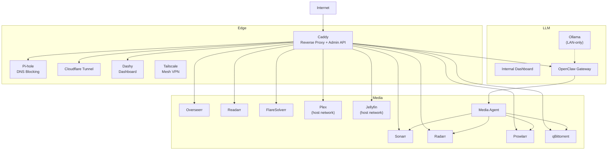
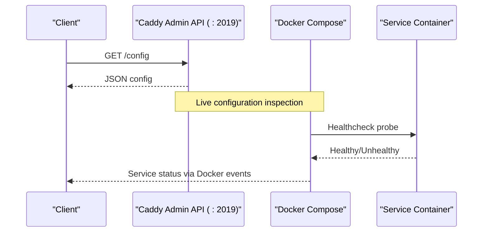
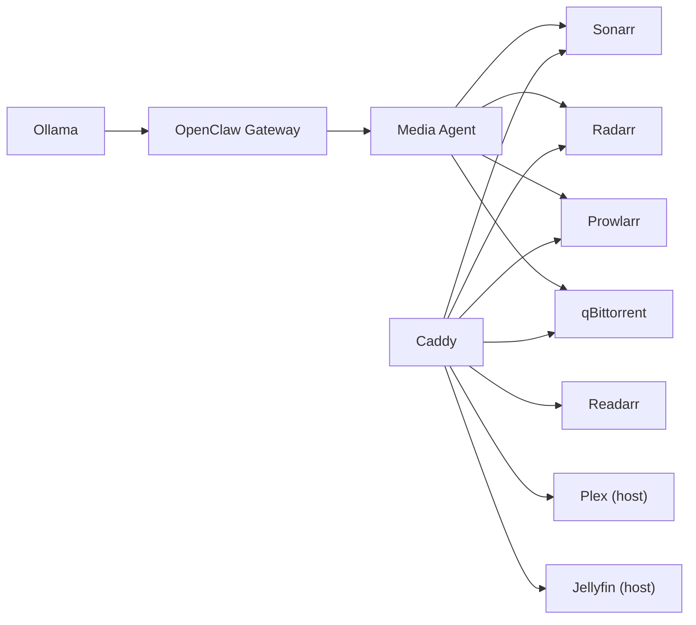

# Troubleshooting and Monitoring

<cite>
**Referenced Files in This Document**
- [README.md](file://README.md)
- [compose/docker-compose.network.yml](file://compose/docker-compose.network.yml)
- [compose/docker-compose.media.yml](file://compose/docker-compose.media.yml)
- [compose/docker-compose.llm.yml](file://compose/docker-compose.llm.yml)
- [docs/service-troubleshooting.md](file://docs/service-troubleshooting.md)
- [docs/caddy-guide.md](file://docs/caddy-guide.md)
- [docs/network-access.md](file://docs/network-access.md)
- [docs/prowlarr-caddy-routing.md](file://docs/prowlarr-caddy-routing.md)
- [media-agent/app/logging.py](file://media-agent/app/logging.py)
- [media-agent/app/main.py](file://media-agent/app/main.py)
- [scripts/backup-data.sh](file://scripts/backup-data.sh)
- [scripts/setup.sh](file://scripts/setup.sh)
</cite>

## Table of Contents
1. [Introduction](#introduction)
2. [Project Structure](#project-structure)
3. [Core Components](#core-components)
4. [Architecture Overview](#architecture-overview)
5. [Detailed Component Analysis](#detailed-component-analysis)
6. [Dependency Analysis](#dependency-analysis)
7. [Performance Considerations](#performance-considerations)
8. [Troubleshooting Guide](#troubleshooting-guide)
9. [Conclusion](#conclusion)
10. [Appendices](#appendices)

## Introduction
This document provides a comprehensive Troubleshooting and Monitoring guide for the homelab infrastructure. It explains how health checks are implemented across services, outlines logging strategies, and describes monitoring approaches for tracking system status. It covers common issues such as service startup failures, network connectivity problems, performance bottlenecks, and configuration errors. Both conceptual guidance for beginners and technical details for experienced developers are included, with terminology aligned to the codebase and practical workflows for diagnostics and resolution.

## Project Structure
The homelab is orchestrated with Docker Compose across three primary stacks:
- Edge and ingress: Caddy, Pi-hole, Cloudflare Tunnel, Dashy, and Tailscale
- Media pipeline: Arr stack (Overseerr, Sonarr, Radarr, Readarr, Prowlarr), qBittorrent, Plex, Jellyfin, and the media-agent
- LLM and AI tools: Ollama, internal-dashboard, and OpenClaw gateway

Health checks are defined per service in the compose files, while Caddy exposes an admin API endpoint for live configuration inspection. Logging is standardized via JSON-file driver with rotation, and backups are automated for persistent state.

**Diagram sources**
- [compose/docker-compose.network.yml:7-122](file://compose/docker-compose.network.yml#L7-L122)
- [compose/docker-compose.media.yml:7-317](file://compose/docker-compose.media.yml#L7-L317)
- [compose/docker-compose.llm.yml:7-169](file://compose/docker-compose.llm.yml#L7-L169)

**Section sources**
- [README.md:168-176](file://README.md#L168-L176)
- [compose/docker-compose.network.yml:7-122](file://compose/docker-compose.network.yml#L7-L122)
- [compose/docker-compose.media.yml:7-317](file://compose/docker-compose.media.yml#L7-L317)
- [compose/docker-compose.llm.yml:7-169](file://compose/docker-compose.llm.yml#L7-L169)

## Core Components
- Caddy reverse proxy with health endpoint and admin API for live configuration inspection
- Edge services: Pi-hole, Cloudflare Tunnel, Dashy, Tailscale
- Media stack: Arr apps, qBittorrent, Plex, Jellyfin, FlareSolverr, and media-agent
- LLM stack: Ollama, internal-dashboard, OpenClaw gateway
- Logging: JSON-file driver with rotation; configurable log level in media-agent
- Backups: Automated snapshot of ./data/ with retention pruning

Key monitoring touchpoints:
- Service-level health checks defined in compose files
- Caddy admin API at port 2019 for live config inspection
- JSON-formatted logs rotated via Docker logging driver

**Section sources**
- [compose/docker-compose.network.yml:27-33](file://compose/docker-compose.network.yml#L27-L33)
- [docs/caddy-guide.md:18-133](file://docs/caddy-guide.md#L18-L133)
- [media-agent/app/logging.py:9-19](file://media-agent/app/logging.py#L9-L19)
- [scripts/backup-data.sh:1-50](file://scripts/backup-data.sh#L1-L50)

## Architecture Overview
The ingress layer (Caddy) terminates TLS and routes traffic to internal services. Host-network services (Plex, Jellyfin, Pi-hole) are proxied via host.docker.internal. The media-agent integrates with Arr apps and qBittorrent to automate acquisition workflows. Health checks are embedded in compose files and validated by Docker.

**Diagram sources**
- [docs/caddy-guide.md:102-106](file://docs/caddy-guide.md#L102-L106)
- [compose/docker-compose.network.yml:27-33](file://compose/docker-compose.network.yml#L27-L33)

**Section sources**
- [docs/caddy-guide.md:10-133](file://docs/caddy-guide.md#L10-L133)
- [compose/docker-compose.network.yml:27-33](file://compose/docker-compose.network.yml#L27-L33)

## Detailed Component Analysis

### Caddy Health and Admin API
- Health check probes the admin API endpoint for configuration readiness
- Admin API at :2019 enables live configuration inspection and validation
- Useful for confirming routing correctness and detecting misconfiguration

Diagnostic commands:
- Validate Caddyfile syntax
- Inspect live config via admin API
- Reload configuration after changes

**Section sources**
- [compose/docker-compose.network.yml:27-33](file://compose/docker-compose.network.yml#L27-L33)
- [docs/caddy-guide.md:96-117](file://docs/caddy-guide.md#L96-L117)
- [docs/caddy-guide.md:102-106](file://docs/caddy-guide.md#L102-L106)

### Edge Services Health Checks
- Pi-hole: healthcheck targets the admin UI port
- Dashy: healthcheck probes the HTTP server
- Cloudflared: healthcheck uses the native CLI with metrics port binding
- Tailscale: runs without explicit healthcheck in this stack

Common pitfalls:
- Cloudflared requires a metrics port binding for readiness probing
- Alpine-based images (Dashy) may resolve localhost to IPv6; use 127.0.0.1 explicitly

**Section sources**
- [compose/docker-compose.network.yml:50-61](file://compose/docker-compose.network.yml#L50-L61)
- [compose/docker-compose.network.yml:76-83](file://compose/docker-compose.network.yml#L76-L83)
- [compose/docker-compose.network.yml:94-101](file://compose/docker-compose.network.yml#L94-L101)
- [docs/service-troubleshooting.md:9-20](file://docs/service-troubleshooting.md#L9-L20)
- [docs/service-troubleshooting.md:31-40](file://docs/service-troubleshooting.md#L31-L40)

### Media Stack Health Checks
- FlareSolverr: probes root endpoint
- Prowlarr, Sonarr, Radarr, Readarr: use service-specific ping endpoints
- Overseerr: probes public settings endpoint
- Plex, Jellyfin: health endpoints via host-network proxy
- qBittorrent: uses root path due to authenticated API endpoints
- media-agent: validates bearer token presence and internal health endpoint

Operational notes:
- Ensure UrlBase alignment for path-preserving routes
- Use handle vs handle_path consistently with service UrlBase settings
- For host-network services, verify firewall rules allow Docker bridge subnet to host ports

**Section sources**
- [compose/docker-compose.media.yml:18-25](file://compose/docker-compose.media.yml#L18-L25)
- [compose/docker-compose.media.yml:47-55](file://compose/docker-compose.media.yml#L47-L55)
- [compose/docker-compose.media.yml:77-85](file://compose/docker-compose.media.yml#L77-L85)
- [compose/docker-compose.media.yml:107-115](file://compose/docker-compose.media.yml#L107-L115)
- [compose/docker-compose.media.yml:137-145](file://compose/docker-compose.media.yml#L137-L145)
- [compose/docker-compose.media.yml:162-170](file://compose/docker-compose.media.yml#L162-L170)
- [compose/docker-compose.media.yml:195-201](file://compose/docker-compose.media.yml#L195-L201)
- [compose/docker-compose.media.yml:229-237](file://compose/docker-compose.media.yml#L229-L237)
- [compose/docker-compose.media.yml:266-274](file://compose/docker-compose.media.yml#L266-L274)
- [compose/docker-compose.media.yml:305-316](file://compose/docker-compose.media.yml#L305-L316)
- [docs/prowlarr-caddy-routing.md:24-53](file://docs/prowlarr-caddy-routing.md#L24-L53)
- [docs/network-access.md:73-91](file://docs/network-access.md#L73-L91)

### LLM Stack Health Checks
- Ollama: LAN-only endpoint; healthcheck uses TCP socket availability
- Internal dashboard: probes root endpoint
- OpenClaw gateway: healthcheck uses internal health endpoint

Notes:
- Ollama binds to loopback; reachable via Docker network hostname
- OpenClaw depends on Ollama; ensure dependency conditions are met

**Section sources**
- [compose/docker-compose.llm.yml:26-34](file://compose/docker-compose.llm.yml#L26-L34)
- [compose/docker-compose.llm.yml:47-54](file://compose/docker-compose.llm.yml#L47-L54)
- [compose/docker-compose.llm.yml:118-130](file://compose/docker-compose.llm.yml#L118-L130)
- [docs/service-troubleshooting.md:21-30](file://docs/service-troubleshooting.md#L21-L30)

### Logging Strategies
- Standardized JSON logging with rotation (max-size, max-file) across services
- media-agent initializes logging at process start with configurable log level
- Logs are persisted under ./data/<service> and can be reviewed for diagnosing issues

Best practices:
- Increase log verbosity temporarily for targeted investigations
- Filter logs by service and timeframe to isolate incidents
- Monitor log sizes to prevent disk pressure

**Section sources**
- [compose/docker-compose.network.yml:1-6](file://compose/docker-compose.network.yml#L1-L6)
- [compose/docker-compose.media.yml:1-6](file://compose/docker-compose.media.yml#L1-L6)
- [compose/docker-compose.llm.yml:1-6](file://compose/docker-compose.llm.yml#L1-L6)
- [media-agent/app/logging.py:9-19](file://media-agent/app/logging.py#L9-L19)
- [media-agent/app/main.py:13-18](file://media-agent/app/main.py#L13-L18)

### Monitoring Approaches
- Docker Compose healthchecks provide basic up/down status
- Caddy admin API enables live configuration inspection
- JSON logs with rotation support external log aggregation pipelines
- Nightly backup script ensures recoverability for incident response

Integration ideas:
- Forward Docker JSON logs to a log collector (e.g., vector, filebeat, Loki)
- Use Caddy admin API for lightweight health dashboards
- Correlate service logs around incident timestamps

**Section sources**
- [compose/docker-compose.network.yml:27-33](file://compose/docker-compose.network.yml#L27-L33)
- [docs/caddy-guide.md:102-106](file://docs/caddy-guide.md#L102-L106)
- [scripts/backup-data.sh:34-47](file://scripts/backup-data.sh#L34-L47)

## Dependency Analysis
Service dependencies and routing:
- OpenClaw gateway depends on Ollama
- media-agent integrates with Sonarr, Radarr, Prowlarr, and qBittorrent
- Host-network services depend on host firewall allowing Docker bridge subnet

**Diagram sources**
- [compose/docker-compose.llm.yml:65-67](file://compose/docker-compose.llm.yml#L65-L67)
- [compose/docker-compose.media.yml:299-303](file://compose/docker-compose.media.yml#L299-L303)
- [docs/network-access.md:75-91](file://docs/network-access.md#L75-L91)

**Section sources**
- [compose/docker-compose.llm.yml:65-67](file://compose/docker-compose.llm.yml#L65-L67)
- [compose/docker-compose.media.yml:299-303](file://compose/docker-compose.media.yml#L299-L303)
- [docs/network-access.md:75-91](file://docs/network-access.md#L75-L91)

## Performance Considerations
- Memory and PID limits are set per service to constrain resource usage
- GPU acceleration is enabled by default for media and LLM workloads
- Health check intervals and timeouts balance responsiveness with overhead
- Logging rotation prevents excessive disk usage

Recommendations:
- Adjust memory limits based on observed usage trends
- Tune healthcheck intervals for services with slower startup times
- Monitor GPU utilization and adjust concurrency where applicable

[No sources needed since this section provides general guidance]

## Troubleshooting Guide

### Service Startup Problems
Symptoms and resolutions:
- Cloudflared readiness probe fails
  - Cause: missing metrics port binding in tunnel command
  - Fix: pin metrics port for the readiness probe
- Ollama healthcheck fails
  - Cause: absence of curl/wget in the image
  - Fix: use TCP socket availability check
- Alpine-based images resolve localhost to IPv6
  - Cause: wget default resolution behavior
  - Fix: use 127.0.0.1 explicitly in healthcheck
- qBittorrent returns 403
  - Cause: authenticated API endpoints
  - Fix: probe root path which serves login page without auth

Validation tips:
- Confirm compose validation passes before deployment
- Use Docker events to observe restart loops
- Review JSON logs for early-boot errors

**Section sources**
- [docs/service-troubleshooting.md:9-20](file://docs/service-troubleshooting.md#L9-L20)
- [docs/service-troubleshooting.md:21-30](file://docs/service-troubleshooting.md#L21-L30)
- [docs/service-troubleshooting.md:31-40](file://docs/service-troubleshooting.md#L31-L40)
- [docs/service-troubleshooting.md:41-50](file://docs/service-troubleshooting.md#L41-L50)
- [scripts/setup.sh:152-175](file://scripts/setup.sh#L152-L175)

### Network Connectivity Issues
Symptoms and resolutions:
- Host-network services unreachable from Caddy
  - Cause: host firewall blocking Docker bridge subnet
  - Fix: allow 172.16.0.0/12 to the service port
- Incorrect URL base causing 404s or asset failures
  - Cause: mismatch between Caddy directive and service UrlBase
  - Fix: align directive with UrlBase (use handle for UrlBase services)
- qBittorrent API authentication failures
  - Cause: missing or incorrect credentials in download client config
  - Fix: set credentials in each app’s UI, not only in .env

Verification:
- Validate Caddyfile syntax and reload configuration
- Check live config via admin API
- Confirm firewall rules allow required traffic

**Section sources**
- [docs/caddy-guide.md:108-117](file://docs/caddy-guide.md#L108-L117)
- [docs/network-access.md:73-91](file://docs/network-access.md#L73-L91)
- [docs/prowlarr-caddy-routing.md:24-53](file://docs/prowlarr-caddy-routing.md#L24-L53)
- [docs/network-access.md:144-151](file://docs/network-access.md#L144-L151)

### Performance Troubleshooting
Guidance:
- Inspect service logs around peak usage times
- Compare healthcheck durations to identify slow startups
- Review memory and GPU utilization trends
- Temporarily increase log level for deeper insights

**Section sources**
- [media-agent/app/logging.py:16-18](file://media-agent/app/logging.py#L16-L18)

### Configuration Errors
Common pitfalls and fixes:
- Prowlarr UrlBase misalignment
  - Cause: handle_path stripping prefix while UrlBase expects it
  - Fix: switch to handle and set UrlBase accordingly
- Missing API keys or incorrect base paths
  - Cause: API base path does not include UrlBase
  - Fix: include UrlBase in API endpoints
- Remote path mappings requiring trailing slashes
  - Cause: path strings without trailing slash
  - Fix: ensure all remote path mappings end with a trailing slash

**Section sources**
- [docs/prowlarr-caddy-routing.md:40-53](file://docs/prowlarr-caddy-routing.md#L40-L53)
- [docs/network-access.md:125-151](file://docs/network-access.md#L125-L151)

### Log Analysis Workflow
Steps:
- Identify failing service from Docker events or healthchecks
- Tail JSON logs for the service with rotation-aware filtering
- Correlate timestamps with system events (e.g., restarts, deploys)
- Increase log level temporarily for targeted investigation
- Revert log level after diagnosis

**Section sources**
- [media-agent/app/logging.py:16-18](file://media-agent/app/logging.py#L16-L18)

### Backup and Recovery for Incident Response
- Nightly backup script archives ./data/ excluding heavy model blobs
- Retention pruning removes archives older than 14 days
- Use backups to restore state after failed deployments or configuration drift

**Section sources**
- [scripts/backup-data.sh:1-50](file://scripts/backup-data.sh#L1-L50)

## Conclusion
The homelab leverages explicit health checks, a centralized reverse proxy with admin API, and structured logging to provide robust observability. By aligning routing directives with service UrlBase settings, validating configurations, and monitoring logs and backups, most issues can be diagnosed and resolved efficiently. The provided workflows and references offer both beginner-friendly guidance and developer-focused techniques for reliable operations.

[No sources needed since this section summarizes without analyzing specific files]

## Appendices

### Quick Reference: Healthcheck Commands
- Caddy admin config: wget spider on :2019/config
- Arr services: curl to /ping endpoints
- Prowlarr: curl to /prowlarr/ping
- qBittorrent: curl to root path
- Dashy: wget to 127.0.0.1:8082
- Ollama: TCP socket availability check
- cloudflared: native readiness probe with metrics port

**Section sources**
- [docs/service-troubleshooting.md:124-137](file://docs/service-troubleshooting.md#L124-L137)
- [compose/docker-compose.network.yml:27-33](file://compose/docker-compose.network.yml#L27-L33)
- [compose/docker-compose.media.yml:47-55](file://compose/docker-compose.media.yml#L47-L55)
- [compose/docker-compose.media.yml:107-115](file://compose/docker-compose.media.yml#L107-L115)
- [compose/docker-compose.media.yml:266-274](file://compose/docker-compose.media.yml#L266-L274)
- [compose/docker-compose.llm.yml:26-34](file://compose/docker-compose.llm.yml#L26-L34)
- [compose/docker-compose.network.yml:94-101](file://compose/docker-compose.network.yml#L94-L101)