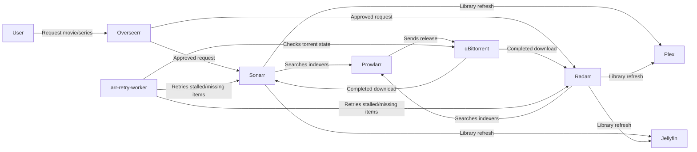

# Homelab Docker Template

Practical Docker Compose homelab with path-based ingress, media automation, and optional local LLM tooling.


## Architecture Diagram

```mermaid
flowchart TB
    user[User Devices]

    subgraph host["Host Network Services (intentional exceptions)"]
        pihole[Pi-hole\nDNS on :53]
        tailscale[Tailscale\nprivate remote access]
        cloudflared[cloudflared\nCloudflare Tunnel agent]
        plex[Plex\nLAN discovery + casting]
        jellyfin[Jellyfin\nLAN discovery + casting]
    end

    subgraph homelab["homelab_net bridge (shared service mesh)"]
        caddy[caddy-docker-proxy\ningress on :80/:443]
        dashy[Dashy]
        overseerr[Overseerr]
        mediaagent[media-agent]
        ollama[Ollama]
        openclaw[openclaw-gateway]
        dashboard[internal-dashboard]
    end

    subgraph media["media_internal group (logical; implemented on homelab_net)"]
        sonarr[Sonarr]
        radarr[Radarr]
        readarr[Readarr]
        prowlarr[Prowlarr]
        jackett[Jackett]
        qb[qBittorrent]
        flaresolverr[FlareSolverr]
        arrretry[arr-retry-worker]
        thui[torrent-health-ui]
    end

    subgraph storage["Host Storage Mounts"]
        data[(./data/* runtime state)]
        mediahdd[${MEDIA_HDD_PATH}]
        medianvme[${MEDIA_NVME_PATH}]
        plexdata[${PLEX_DATA_PATH}]
    end

    user -->|HTTPS| caddy
    user -->|DNS queries| pihole
    user -->|Private mesh access| tailscale
    cloudflared -->|Tunnel ingress| caddy
    caddy -->|Path routing labels| dashy
    caddy -->|/overseerr| overseerr
    caddy -->|/sonarr /radarr /readarr| sonarr
    caddy -->|/qbittorrent| qb
    caddy -->|openclaw.<domain>| openclaw
    caddy -->|/ollama| ollama
    arrretry -->|API retries| sonarr
    arrretry -->|API retries| radarr
    arrretry -->|Torrent health checks| qb
    sonarr -->|Indexer queries| prowlarr
    radarr -->|Indexer queries| prowlarr
    readarr -->|Indexer queries| prowlarr
    prowlarr -->|Bypass anti-bot flows| flaresolverr
    mediaagent -->|Reads Arr metadata| sonarr
    mediaagent -->|Reads Arr metadata| radarr
    openclaw -->|Tooling calls| mediaagent

    dashy --- data
    sonarr --- data
    radarr --- data
    readarr --- data
    prowlarr --- data
    qb --- data
    ollama --- data
    cloudflared --- data
    plex --- mediahdd
    plex --- medianvme
    plex --- plexdata
    jellyfin --- mediahdd
    jellyfin --- medianvme
```

## Features

- Split stack model: `docker-compose.network.yml`, `docker-compose.media.yml`, and `docker-compose.llm.yml`.
- First-run bootstrap with `scripts/setup.sh` for `.env`, templates, Docker network, and compose validation.
- Label-driven ingress with `lucaslorentz/caddy-docker-proxy` (routing stays next to each service).
- Intentional host networking only for DNS, tunnel/VPN, and media discovery workloads.
- Optional NVIDIA GPU overlay (`docker-compose.gpu.yml`) generated from `config/gpu/docker-compose.gpu.yml`.
- Python workers use `src/homelab_workers` as source-of-truth; `scripts/workers` contains compatibility wrappers only.

## Quick Start

### Prerequisites

- Docker and Docker Compose v2+
- Linux host (Ubuntu 22.04+ recommended)
- Optional: NVIDIA GPU with NVIDIA drivers and `nvidia-smi`

### Setup

```bash
git clone <repo-url> ~/homelab
cd ~/homelab
./scripts/setup.sh
```

`scripts/setup.sh` creates `.env` from `.env.example` when missing, prompts for host path values, copies config templates, creates the shared external Docker network `homelab_net` if needed, validates compose files, and conditionally creates `docker-compose.gpu.yml`.

### Start Services

```bash
docker compose -f docker-compose.network.yml up -d
docker compose -f docker-compose.media.yml up -d
docker compose -f docker-compose.llm.yml up -d  # optional
```

If GPU overlay is enabled:

```bash
docker compose -f docker-compose.media.yml -f docker-compose.gpu.yml up -d
docker compose -f docker-compose.llm.yml -f docker-compose.gpu.yml up -d
```

## Repository Structure

```text
.
├── docker-compose.network.yml        # Edge services (Caddy, DNS, remote access)
├── docker-compose.media.yml          # Arr stack, Plex/Jellyfin, qBittorrent, workers, media-agent
├── docker-compose.llm.yml            # Ollama, internal dashboard, OpenClaw gateway
├── .env.example                      # Baseline environment contract
├── config/
│   ├── cloudflared/config.yml.example
│   ├── dashy/conf.yml.example
│   └── gpu/docker-compose.gpu.yml    # Source template for runtime GPU overlay
├── scripts/
│   ├── setup.sh
│   ├── README.md
│   ├── workers/
│   └── tests/
├── src/homelab_workers/
│   ├── pyproject.toml
│   └── src/homelab_workers/
├── hardening/
└── data/                             # Runtime state (gitignored)
```

## Configuration

Compose reads variables from `.env`. `scripts/setup.sh` only updates `.env`; it does not rewrite compose files.

The compose files all attach bridge-mode services to an explicitly named external Docker network, `homelab_net`. Setup owns creating that network once with `docker network create homelab_net`; Compose then reuses it across the split stack files. This avoids per-project network names and keeps commands like `docker compose run` working against an already-running homelab.

### Core environment contract (`.env.example`)

| Variable | Required | Purpose | Default |
|---|---|---|---|
| `PUID` | Yes | UID used by LinuxServer containers | `1000` |
| `PGID` | Yes | GID used by LinuxServer containers | `1000` |
| `TZ` | Yes | Time zone for containers | `UTC` |
| `BASE_DOMAIN` | Yes | Domain root used by Caddy labels | `home.ashorkqueen.xyz` |
| `CADDY_IMAGE` | Yes | Caddy image tag to run | `local/caddy-cf:latest` |
| `CADDY_INGRESS_NETWORKS` | Yes | Docker network(s) Caddy watches for labels | `homelab_net` |
| `PIHOLE_WEB_PORT` | Yes | Pi-hole web admin port on host | `8083` |
| `DASHY_CONFIG_PATH` | Yes | Runtime Dashy config location | `./data/dashy/conf.yml` |
| `DASHY_CONFIG_TEMPLATE` | Yes | Dashy template source path | `./config/dashy/conf.yml.example` |
| `CLOUDFLARED_CONFIG_PATH` | Yes | Runtime cloudflared config location | `./data/cloudflared/config.yml` |
| `CLOUDFLARED_CONFIG_TEMPLATE` | Yes | cloudflared template source path | `./config/cloudflared/config.yml.example` |
| `MEDIA_HDD_PATH` | Yes | Main media library mount | `/mnt/media-hdd` |
| `MEDIA_NVME_PATH` | Yes | Fast download/transcode mount | `/mnt/media-nvme` |
| `PLEX_DATA_PATH` | Yes | Plex metadata/config storage path | `/srv/plex` |
| `CLOUDFLARE_TOKEN` | No (recommended for public TLS + tunnel) | Cloudflare API token used by Caddy DNS challenge and tunnel auth | empty |

### Additional compose variables

Media, worker, and LLM services also read optional values (for example: Arr API keys, qBittorrent credentials, OpenClaw tokens, and media-agent token). Leave them blank in `.env` until you enable those features.

### Path customization

Set `MEDIA_HDD_PATH`, `MEDIA_NVME_PATH`, and `PLEX_DATA_PATH` to real host mount points before first start. This is required for stable imports and consistent path mapping between Arr apps, download clients, and media servers.

### Caddy label and path routing model

This stack uses `caddy-docker-proxy`: labels define the route contract, and Caddy regenerates config when containers change.

| Label | What it does | Example |
|---|---|---|
| `caddy` | Selects host/domain matcher | `caddy: "${BASE_DOMAIN}"` |
| `caddy.handle_path` | Matches and strips a path prefix | `caddy.handle_path: "/overseerr*"` |
| `caddy.handle_path.0_reverse_proxy` | Proxies stripped request to container port | `caddy.handle_path.0_reverse_proxy: "{{upstreams 5055}}"` |
| `caddy.reverse_proxy` | Direct host-level proxy (used for host-mode services) | `caddy.reverse_proxy: "host.docker.internal:32400"` |

Why this model: you keep ingress definitions next to each service, avoid static proxy drift, and make stack modules easier to reuse.

## Adding New Services

Add the service to the right compose file, attach it to `homelab_net`, then define Caddy labels. Keep host port publishing off unless you have a protocol requirement.

```yaml
services:
  bazarr:
    image: lscr.io/linuxserver/bazarr:latest
    container_name: bazarr
    networks:
      - homelab_net
    environment:
      - PUID=${PUID}
      - PGID=${PGID}
      - TZ=${TZ}
    volumes:
      - ./data/bazarr:/config
      - ${MEDIA_HDD_PATH:-/mnt/media-hdd}:/media
    labels:
      caddy: "${BASE_DOMAIN}"
      caddy.handle_path: "/bazarr*"
      caddy.handle_path.0_reverse_proxy: "{{upstreams 6767}}"
    restart: unless-stopped
```

Validate before starting:

```bash
docker compose -f docker-compose.media.yml config --quiet
docker compose -f docker-compose.media.yml up -d
```

## GPU Acceleration

GPU support is overlay-based so CPU-only hosts can run the same base compose files. The source overlay lives at `config/gpu/docker-compose.gpu.yml`.

During setup, `scripts/setup.sh` checks `nvidia-smi`, asks for confirmation, and copies the overlay to `docker-compose.gpu.yml` only when you enable it. If detection fails or you decline, the runtime overlay file is removed to keep compose commands reproducible.

## Network Architecture

Bridge networking is the default because it limits exposure and keeps service-to-service DNS stable. The bridge itself is the setup-created external network `homelab_net`, shared by the network, media, and LLM compose files. Host mode is used only where protocol behavior requires it.

| Service | Network mode | Why this mode is used | Security trade-off |
|---|---|---|---|
| `pihole` | `host` | Needs direct DNS bind on `53/tcp` and `53/udp` | Broader host surface; harden host and admin auth |
| `tailscale` | `host` | Needs `/dev/net/tun` and low-level networking | Elevated capabilities (`NET_ADMIN`, `NET_RAW`) |
| `cloudflared` | `host` | Tunnel agent sits on host ingress/egress boundary | Treat as edge component; protect tokens |
| `plex` | `host` | Improves LAN discovery and client compatibility | Media service directly reachable on host |
| `jellyfin` | `host` | Improves LAN discovery and client compatibility | Media service directly reachable on host |
| Most others (`caddy`, Arr apps, workers, LLM services, media-agent) | `bridge` on `homelab_net` | Internal-only mesh with Caddy ingress | Smaller attack surface and centralized routing |

## Data Flow Diagram



## Python Workers

The source of truth for packaged workers is `src/homelab_workers` (`pyproject.toml`, package code, tests). It ships two CLI entry points: `arr-retry` and `torrent-health-ui`.

In containers, the current runtime entry commands still use mounted scripts under `scripts/workers` (`PYTHONPATH=/workspace/scripts/workers`). Keep this in mind when changing worker behavior so package and runtime paths stay aligned.

Install for local development:

```bash
cd src/homelab_workers
python3 -m pip install -e ".[dev]"
```

## Extend Media-Agent Capabilities

To make capability changes predictable, `media-agent` now uses one action catalog and a staged router pipeline.

### Where to add things

- `media-agent/app/core/action_catalog.py`
  - Canonical action registry: action names, payload models, categories, descriptions, and router visibility.
- `media-agent/app/core/models.py`
  - Add/update action payload model(s) in the strict dispatch layer.
- `media-agent/app/actions/action_service.py`
  - Add deterministic execution for the validated action. Both routes and router orchestration call this service.
- `media-agent/app/router/parser.py`
  - Update parser behavior only when the LLM should emit the action.
- `media-agent/app/router/formatting.py`
  - Update user-facing response text.
- `media-agent/app/integrations/`
  - Put external API clients/helpers here (`qBittorrent`, `Sonarr`, `Radarr`, `Prowlarr`).
- `media-agent/app/router/router_orchestrator.py`
  - Decide when the router should call the action (`plan_actions` / focused execution helpers).

### Fast extension checklist

1. Add action metadata in `core/action_catalog.py`.
2. Add Pydantic model in `core/models.py` and include it in `ACTION_CALL_ADAPTER`.
3. Add deterministic handler call in `actions/action_service.py`.
4. If router should use it, update parser/formatting and planning rules.
5. Add tests in `media-agent/tests/test_api_*`.
6. Run:

```bash
src/homelab_workers/.venv/bin/python -m pytest -q media-agent/tests
src/homelab_workers/.venv/bin/ruff check media-agent/app media-agent/tests
```

## Security

Security relies on network segmentation, explicit ingress labels, and low-privilege container defaults (`no-new-privileges` is set broadly). You should expose services through Caddy/Tailscale/Cloudflare intentionally, not by opening extra host ports.

Use `hardening/secure-secret-file-permissions.sh` after restoring configs or secrets, and apply `hardening/nftables-arr-stack.nft` if you want host firewall policy for media traffic.

## License

MIT License. See `LICENSE`.
