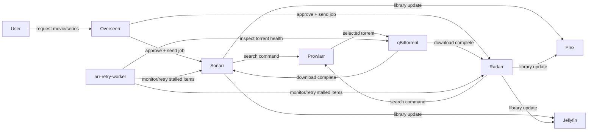

# Homelab Docker Template

Practical, reusable Docker Compose homelab stack with secure defaults, label-based reverse proxying, and optional GPU acceleration.


## Architecture Diagram

```mermaid
flowchart TB
    user[User Devices]

    subgraph host["Host Network (justified host mode services)"]
        pihole[Pi-hole\nDNS on :53]
        tailscale[Tailscale\nprivate remote access]
        cloudflared[cloudflared\nCloudflare Tunnel agent]
        plex[Plex\nclient discovery compatibility]
        jellyfin[Jellyfin\nclient discovery compatibility]
    end

    subgraph homelab_net["homelab_net bridge (reverse proxy + app ingress)"]
        caddy[caddy-docker-proxy\nports 80/443]
        dashy[Dashy]
        overseerr[Overseerr]
        internaldash[internal-dashboard]
    end

    subgraph media_internal["media_internal bridge group (implemented on homelab_net)"]
        sonarr[Sonarr]
        radarr[Radarr]
        prowlarr[Prowlarr]
        qb[qBittorrent]
        flaresolverr[FlareSolverr]
        arrworker[arr-retry-worker]
        thui[torrent-health-ui]
    end

    subgraph llm["LLM stack"]
        ollama[Ollama]
    end

    subgraph storage["Host Storage Mounts"]
        data[(./data/* app state)]
        mediahdd[${MEDIA_HDD_PATH}]
        medianvme[${MEDIA_NVME_PATH}]
        plexdata[${PLEX_DATA_PATH}]
    end

    user -->|HTTPS| caddy
    user -->|DNS queries| pihole
    user -->|mesh VPN| tailscale
    cloudflared -->|tunnel ingress| caddy
    caddy -->|label-based routes| dashy
    caddy -->|/overseerr| overseerr
    caddy -->|/sonarr /radarr /qbittorrent| sonarr
    caddy -->|proxy to host services| plex
    caddy -->|proxy to host services| jellyfin
    arrworker -->|API calls| sonarr
    arrworker -->|API calls| radarr
    arrworker -->|Web API| qb
    sonarr -->|indexers| prowlarr
    radarr -->|indexers| prowlarr
    prowlarr -->|anti-bot assist| flaresolverr
    ollama -->|local API| caddy

    sonarr --- data
    radarr --- data
    prowlarr --- data
    qb --- data
    dashy --- data
    cloudflared --- data
    ollama --- data
    plex --- mediahdd
    plex --- medianvme
    plex --- plexdata
    jellyfin --- mediahdd
    jellyfin --- medianvme
```

## Features

- Three compose stacks: network edge, media automation, and optional LLM services.
- `scripts/setup.sh` bootstrap flow for first-run setup, validation, and network creation.
- `caddy-docker-proxy` label model for automatic routing (no static `Caddyfile` workflow).
- Host networking only where it is operationally required (DNS, tunnel/VPN, media discovery).
- Optional GPU overlay via `docker-compose.gpu.yml`, enabled only after NVIDIA detection and confirmation.
- Python worker package (`homelab-workers`) for retry automation and torrent health tooling.
- Open project layout with reusable templates under `config/` and runtime state under `data/`.

## Quick Start

### Prerequisites

- Docker and Docker Compose v2+
- Linux host (Ubuntu 22.04+ recommended)
- Optional: NVIDIA GPU with drivers

### Setup

```bash
git clone <repo-url> ~/homelab
cd ~/homelab
./scripts/setup.sh
```

The setup script copies `.env.example` to `.env` when needed, prompts you for path overrides, creates required `data/` directories, ensures the `homelab_net` Docker network exists, and validates compose files. It does not mutate compose definitions.

### Start Services

```bash
docker compose -f docker-compose.network.yml up -d
docker compose -f docker-compose.media.yml up -d
docker compose -f docker-compose.llm.yml up -d  # optional
```

If setup enables GPU support, start media and LLM with the overlay file:

```bash
docker compose -f docker-compose.media.yml -f docker-compose.gpu.yml up -d
docker compose -f docker-compose.llm.yml -f docker-compose.gpu.yml up -d
```

## Repository Structure

```text
.
├── docker-compose.network.yml        # Edge, DNS, ingress, and remote access services
├── docker-compose.media.yml          # Media apps, indexers, download client, and workers
├── docker-compose.llm.yml            # Ollama and local internal dashboard
├── .env.example                      # Environment variable template
├── config/
│   ├── cloudflared/config.yml.example
│   ├── dashy/conf.yml.example
│   └── gpu/docker-compose.gpu.yml
├── scripts/
│   ├── setup.sh                      # First-run setup and compose validation
│   └── workers/                      # Runtime worker scripts mounted in containers
├── src/homelab_workers/
│   ├── pyproject.toml
│   └── src/homelab_workers/          # Packaged worker code
├── hardening/
│   ├── secure-secret-file-permissions.sh
│   └── nftables-arr-stack.nft
└── data/                             # Runtime state (gitignored except examples)
```

## Configuration

The stack is configured through `.env` values loaded by Compose and worker containers. Copy `.env.example` to `.env` and update only what your host requires.

| Variable | Required | Purpose | Default |
|---|---|---|---|
| `PUID` | Yes | Linux UID for LinuxServer containers | `1000` |
| `PGID` | Yes | Linux GID for LinuxServer containers | `1000` |
| `TZ` | Yes | Service timezone | `America/New_York` |
| `BASE_DOMAIN` | Yes | Base domain for Caddy labels | `homelab.local` |
| `MEDIA_HDD_PATH` | Yes | Large media library mount root | `/mnt/media-hdd` |
| `MEDIA_NVME_PATH` | Yes | Fast download/transcode mount root | `/mnt/media-nvme` |
| `PLEX_DATA_PATH` | Yes | Plex host data path | `/srv/plex` |
| `NVIDIA_VISIBLE_DEVICES` | Optional | NVIDIA device visibility when GPU overlay is enabled | `all` |
| `PIHOLE_WEBPASSWORD` | Recommended | Pi-hole admin password | empty |
| `PIHOLE_DNS_` | Optional | Upstream DNS servers (semicolon-separated) | `1.1.1.1;1.0.0.1` |
| `PIHOLE_WEB_PORT` | Optional | Pi-hole web UI host port | `8083` |
| `SONARR_API_KEY` | Optional | Sonarr API auth for workers/UI | empty |
| `RADARR_API_KEY` | Optional | Radarr API auth for workers/UI | empty |
| `SONARR_INTERNAL_URL` | Optional | Internal Sonarr URL for containers | `http://sonarr:8989/sonarr` |
| `RADARR_INTERNAL_URL` | Optional | Internal Radarr URL for containers | `http://radarr:7878/radarr` |
| `QBITTORRENT_USERNAME` | Optional | qBittorrent username for worker actions | empty |
| `QBITTORRENT_PASSWORD` | Optional | qBittorrent password for worker actions | empty |
| `QBITTORRENT_INTERNAL_URL` | Optional | Internal qBittorrent URL for containers | `http://qbittorrent:8080` |
| `ARR_HEALTH_STATE_FILE` | Optional | Worker state file path | `/workspace/data/arr-retry/health_state.json` |
| `ARR_HEALTH_LOG_FILE` | Optional | Worker log file path | `/workspace/data/arr-retry/health-last-run.log` |
| `ARR_RETRY_QBT_ORPHAN_STALLS` | Optional | Retry stalled orphan torrents | `true` |
| `SONARR_QBT_CATEGORY` | Optional | Sonarr category watched in qBittorrent | `tv-sonarr` |
| `ARR_RETRY_MAX_QB_ORPHANS` | Optional | Max orphan actions per run | `10` |
| `ARR_RETRY_QBT_ORPHAN_MIN_AGE_SECONDS` | Optional | Minimum age before orphan handling | `3600` |
| `ARR_RETRY_MISSING_EMPTY_RELEASE_SEARCH` | Optional | Trigger search for monitored missing items | `true` |

### Path customization

You should point `MEDIA_HDD_PATH`, `MEDIA_NVME_PATH`, and `PLEX_DATA_PATH` at real host mount points before starting services. `scripts/setup.sh` prompts for these values and writes them into `.env` without rewriting compose files.

### Caddy label routing model

This project uses `lucaslorentz/caddy-docker-proxy`, which watches Docker metadata and generates Caddy config from labels. You define route intent on each service (`caddy`, `caddy.handle_path`, `caddy.reverse_proxy`) and Caddy updates automatically.

Why this matters: you avoid manual Caddyfile drift, keep routing definitions near each service, and make stack modules portable across hosts.

## Adding New Services

To add a bridge-mode service, connect it to `homelab_net` and attach Caddy labels. This keeps exposure centralized at Caddy instead of publishing new host ports.

```yaml
services:
  bazarr:
    image: lscr.io/linuxserver/bazarr:latest
    container_name: bazarr
    networks:
      - homelab_net
    environment:
      - PUID=${PUID}
      - PGID=${PGID}
      - TZ=${TZ}
    volumes:
      - ./data/bazarr:/config
      - ${MEDIA_HDD_PATH:-/mnt/media-hdd}:/media
    labels:
      caddy: "${BASE_DOMAIN:-homelab.local}"
      caddy.handle_path: "/bazarr*"
      caddy.handle_path.0_reverse_proxy: "{{upstreams 6767}}"
    restart: unless-stopped

networks:
  homelab_net:
    external: true
```

After adding a service, validate and start:

```bash
docker compose -f docker-compose.media.yml config --quiet
docker compose -f docker-compose.media.yml up -d
```

## GPU Acceleration

GPU support is handled as an overlay, not by mutating base compose files. The base stacks stay portable on CPU-only hosts.

`scripts/setup.sh` runs `nvidia-smi` detection, asks for explicit confirmation, and then copies `config/gpu/docker-compose.gpu.yml` to `docker-compose.gpu.yml` only when enabled. If no GPU is detected (or you decline), the overlay file is removed so standard compose commands continue to work.

## Network Architecture

Most services run on bridge networking for isolation and consistent service-to-service DNS. Host mode is reserved for workloads that require direct host network behavior.

| Service | Network mode | Why host mode is used (or not) | Security trade-off |
|---|---|---|---|
| `pihole` | `host` | Must reliably bind DNS on port `53` (TCP/UDP) | Broader network surface; protect host and admin port |
| `tailscale` | `host` | Needs low-level networking and `/dev/net/tun` access | Elevated capabilities (`NET_ADMIN`, `NET_RAW`) |
| `cloudflared` | `host` | Tunnel agent connects host-level ingress/egress paths | Treat as ingress boundary; protect credentials |
| `plex` | `host` | Better LAN discovery/casting compatibility | Directly reachable media port(s) |
| `jellyfin` | `host` | Better LAN discovery/casting compatibility | Directly reachable media port(s) |
| `caddy`, Arr apps, qBittorrent, workers, Ollama | `bridge` (`homelab_net`) | Default model: internal service mesh with proxy ingress | Reduced direct exposure; route intentionally through Caddy |

## Data Flow Diagram



## Python Workers

The worker package lives in `src/homelab_workers` and is published as `homelab-workers` in `pyproject.toml`. It provides two CLI entry points: `arr-retry` (automated retry logic for stalled/missing Arr items) and `torrent-health-ui` (manual health inspection and release-grab helper).

For development, install in editable mode:

```bash
cd src/homelab_workers
python3 -m pip install -e ".[dev]"
```

Run the packaged CLI locally:

```bash
arr-retry --help
torrent-health-ui
```

## Local CI Gate

Run full local matrix before opening or updating PR:

```bash
./scripts/ci-local.sh
```

Matrix includes:

- compose shell checks under `tests/compose/`
- compose render validation for network/media/llm and GPU overlay
- worker tests/lint under `scripts/`
- packaged worker tests/lint under `src/homelab_workers/`
- bash syntax checks for setup/test runner scripts
- README mermaid presence sanity check

Script creates `src/homelab_workers/.venv` automatically if missing.

## GitHub Actions (Cloud + Local Docker)

PRs to `main` run `.github/workflows/ci.yml` and execute the same matrix through `./scripts/ci-local.sh`.

Run same workflow locally in Docker with `act`:

```bash
./scripts/gh-actions-local.sh
```

Run specific event/job:

```bash
./scripts/gh-actions-local.sh pull_request verify
```

This wrapper sets `DOCKER_HOST` from your Docker context when available, matching practical local setup advice for `act` usage in Docker-backed environments.

## Security

This stack is designed around minimal exposure and explicit routing. You should keep management UIs behind Caddy/Tailscale where possible, avoid publishing unnecessary host ports, and never commit runtime secrets from `.env` or `data/`.

Use `hardening/secure-secret-file-permissions.sh` after restoring backups or copying credentials, and apply `hardening/nftables-arr-stack.nft` if you want host firewall controls. For public access, expose only intentionally selected endpoints through Cloudflare Tunnel.

## License

This project is licensed under the MIT License. See `LICENSE`.
