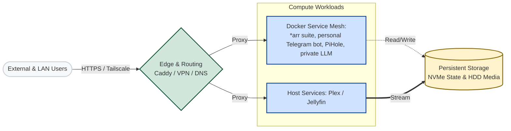
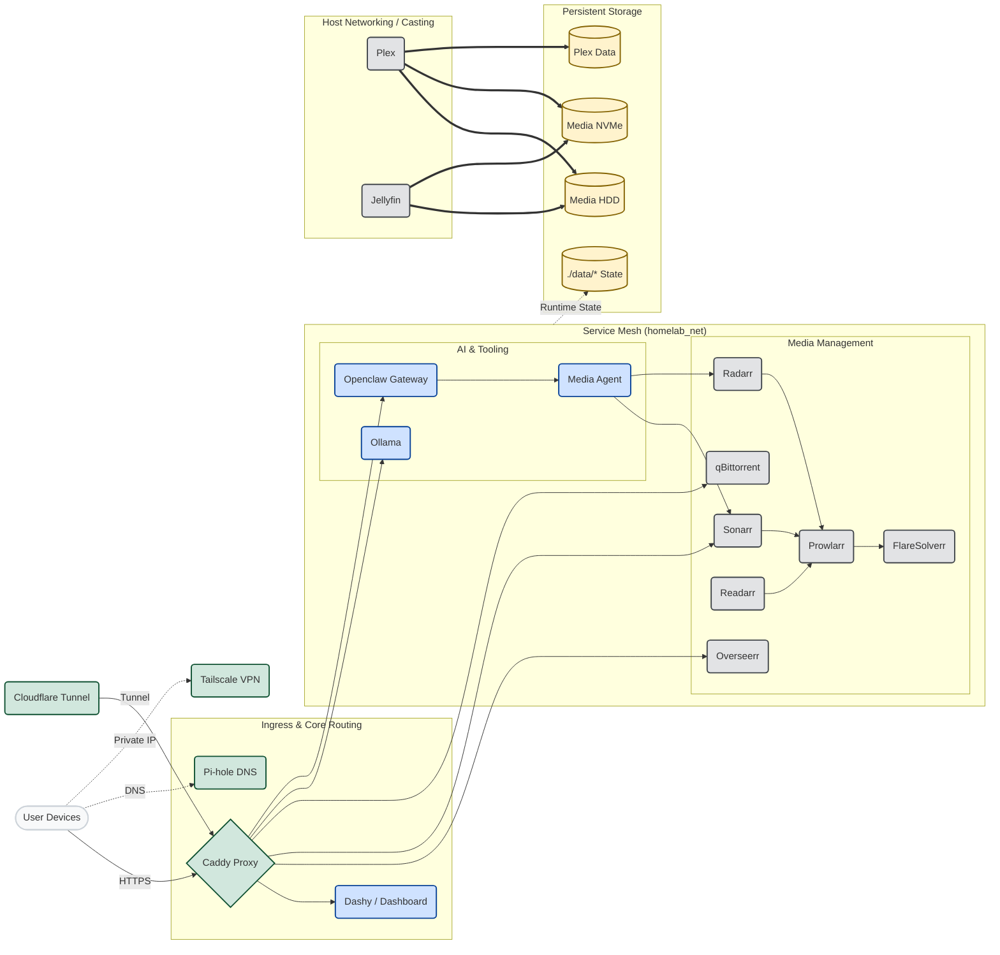
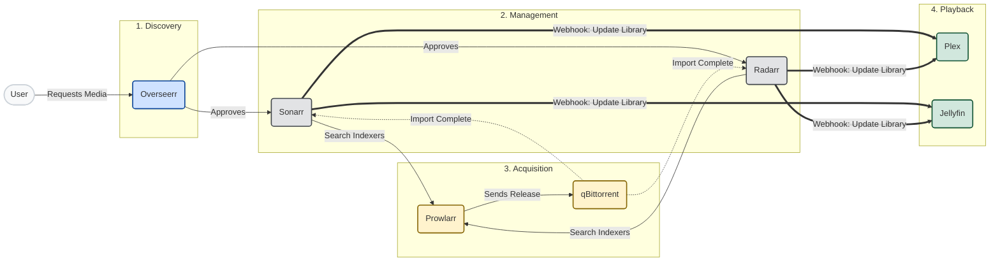

# Homelab Docker Template

This is my home lab setup that I use for downloading only open source/public domain media from legitimate sources. DO NOT USE THIS FOR ILLEGAL FILESHARING. 

This setup definitely isn't plug and play, but I hope it gives some people some inspiration on how to set up their own home lab, and maybe learn a bit about systems design and CI/CD workflows in the process. 

### Services

| Media | Notes |
|-------|--------|
| **Arr stack** | Seerr (Overseerr), Sonarr, Radarr, Prowlarr, qBittorrent |
| **Playback** | Plex + Jellyfin — both; Jellyfin’s Apple TV client still isn’t mature enough to drop Plex |

| App | Notes |
|------------------|--------|
| **Pi-hole** | LAN DNS / blocking |
| **Cloudflare** | Tunneling (no open inbound ports for public names) |
| **Caddy** | HTTPS + path routing on one hostname (e.g. qBittorrent at `https://home.com/qbittorrent/` instead of `192.168.x.x:8080`) |
| **Dashy** | Central dashboard |
| **Tailscale** | Remote mesh VPN |
| **Telegram bot** | Gemini Flash + Gemma 31b (4-bit quantized) for torrent search — yes, alongside Seerr; the GPU is there, so why not |

### Server

| Component | Spec |
|-----------|------|
| CPU | AMD Ryzen 9 7950X3D |
| RAM | DDR5 — 96GB 6200 MT/s |
| GPU | NVIDIA GeForce RTX 3090 |
| Board | ASUS PRIME X670E-PRO WIFI |
| OS | Ubuntu Server 24.04 LTS |

| Storage | Role |
|---------|------|
| 1 TB NVMe | EFI, boot, OS |
| 4 TB NVMe | Hot / frequently used media |
| ~16 TB HDD | Long-term library + backups |


## Architecture Diagram

High-level traffic and storage view. Expand the section below for the full per-service diagram.



<details>
<summary>diagram source (overview)</summary>



</details>

<details>
<summary>▶ Full architecture (all services)</summary>



<details>

<summary>diagram source</summary>



</details>

</details>

## Features

- Root orchestration: `docker-compose.yml` uses Compose **`include`** to load `docker-compose.homelab-net.yml` (shared external `homelab_net`), `docker-compose.network.yml`, and `docker-compose.media.yml`. Uncomment the LLM line there (or add `-f docker-compose.llm.yml`) when you want the LLM stack.
- First-run bootstrap with `scripts/setup.sh` for `.env`, templates, Docker network, and compose validation.
- Label-driven ingress with `lucaslorentz/caddy-docker-proxy` (routing stays next to each service).
- Intentional host networking only for DNS, tunnel/VPN, and media discovery workloads.
- NVIDIA GPU acceleration is enabled by default (Plex/Jellyfin/Ollama assume NVIDIA Container Toolkit).
- Python workers ship from the [`src/homelab_workers`](src/homelab_workers/) package, mounted directly into the worker containers.

## Quick Start

### Prerequisites

- Docker and Docker Compose v2+
- Linux host (Ubuntu 22.04+ recommended)
- Optional: NVIDIA GPU with NVIDIA drivers and `nvidia-smi`

### Setup

```bash
git clone <repo-url> ~/homelab
cd ~/homelab
./scripts/setup.sh
```

`scripts/setup.sh` creates `.env` from `.env.example` when missing, prompts for host path values, copies config templates, creates `homelab_net` if needed, and validates compose files.

### Start Services

From the repo root, bring up **edge + media** (everything in the root `docker-compose.yml` `include` list):

```bash
docker compose up -d
```

That reads **`docker-compose.yml`**, which bundles the stack via **`include`** (no long `-f` chain for the default set).

LLM services (Ollama, OpenClaw, internal dashboard) are included by default in `docker-compose.yml`.

## Repository Structure

```text
.
├── docker-compose.yml                # Root bundle (Compose `include` for default stack)
├── docker-compose.homelab-net.yml  # Declares external `homelab_net` once (avoids include merge dupes)
├── docker-compose.network.yml        # Edge services (Caddy, DNS, remote access)
├── docker-compose.media.yml          # Arr stack, Plex/Jellyfin, qBittorrent, torrent-health-ui, media-agent
├── docker-compose.llm.yml            # Ollama, internal dashboard, OpenClaw gateway
├── .env.example                      # Baseline environment contract
├── config/
│   ├── cloudflared/config.yml.example
│   ├── dashy/conf.yml.example
│   └── gpu/docker-compose.gpu.yml    # Reference GPU settings (now baked into the default stack)
├── scripts/
│   ├── setup.sh
│   ├── README.md
│   ├── workers/
│   └── tests/
├── src/homelab_workers/
│   ├── pyproject.toml
│   └── src/homelab_workers/
├── hardening/
└── data/                             # Runtime state (gitignored)
```

## CI/CD

All development happens on the `dev` branch. Production runs from `main`.

```mermaid
flowchart LR
    %% -- Theme & Styling --
    classDef trigger fill:#f8f9fa,stroke:#ced4da,stroke-width:2px;
    classDef human fill:#cfe2ff,stroke:#084298,stroke-width:2px,stroke-dasharray: 5 5;
    classDef auto fill:#e2e3e5,stroke:#41464b,stroke-width:2px;
    classDef pass fill:#d1e7dd,stroke:#0f5132,stroke-width:2px;
    classDef fail fill:#f8d7da,stroke:#842029,stroke-width:2px;
    classDef storage fill:#fff3cd,stroke:#856404,stroke-width:2px;

    %% -- Triggers --
    Commit([Push to dev branch]):::trigger
    Cron([Nightly 2AM Schedule]):::trigger

    %% -- Stage 1: Validation --
    subgraph CI ["Stage 1: CI Validation"]
        direction TB
        Lint[Ruff Linter]:::auto
        Build[Docker Build]:::auto
        Test[Pytest Workers]:::auto

        Lint & Build & Test --> CIPass{CI Status}:::auto
    end

    %% -- Stage 2: Deployment --
    subgraph CD ["Stage 2: Continuous Deployment"]
        direction TB
        Backup[(Snapshot ./data/)]:::storage
        Deploy[Docker Compose Up]:::auto
        E2E[Run E2E Tests]:::auto

        Backup --> Deploy --> E2E
    end

    %% -- Outcomes --
    subgraph State ["End State"]
        direction TB
        Live([Production Live]):::pass
        Alert([GitHub Issue Cut]):::fail
        Restore[(Restore Snapshot)]:::storage
    end

    %% -- The Human Element --
    Merge{{Human: Squash & Merge}}:::human

    %% -- Routing Logic --
    Commit --> Lint & Build & Test
    CIPass -- Pass --> Merge
    CIPass -. Fail .-> Alert

    Merge --> Backup
    Cron -. Triggered on main .-> Backup

    E2E -- Pass --> Live
    E2E -- Fail --> Restore
    Restore --> Alert
```



<details>
<summary>diagram source</summary>



</details>

**Validate** (every push to `dev` and every PR):
- Compose config validation
- `docker compose build` for all local images
- pytest + ruff for workers and media-agent
- Bash syntax checks and README structure

**Nightly deploy** (2 AM CEST, or manual via workflow dispatch):
1. Skips if `dev` has no new commits or if the latest validate is failing.
2. Fast-forward merges `dev` into `main` and pushes.
3. Runs `scripts/backup-data.sh`: compresses `./data/` to a timestamped `.tar.gz` under `${MEDIA_HDD_PATH}/backups/homelab-data/`, prunes archives older than 14 days. If this step fails, deploy does not run.
4. Pulls images and runs `docker compose up -d --build` on the server.
5. Waits for all healthchecks (up to 5 minutes).
6. Runs E2E integration tests against the live stack.
7. On failure: reverts the merge, redeploys the previous version, and creates a GitHub issue.

To trigger a deploy without waiting for the nightly schedule:

```bash
gh workflow run "Nightly Deploy"
```

## Configuration

Compose reads variables from `.env`. `scripts/setup.sh` only updates `.env`; it does not rewrite compose files.

### Core environment contract (`.env.example`)

| Variable | Required | Purpose | Default |
|---|---|---|---|
| `PUID` | Yes | UID used by LinuxServer containers | `1000` |
| `PGID` | Yes | GID used by LinuxServer containers | `1000` |
| `TZ` | Yes | Time zone for containers | `UTC` |
| `BASE_DOMAIN` | Yes | Domain root used by Caddy labels | `home.ashorkqueen.xyz` |
| `CADDY_IMAGE` | Yes | Caddy image tag to run | `local/caddy-cf:latest` |
| `CADDY_INGRESS_NETWORKS` | Yes | Docker network(s) Caddy watches for labels | `homelab_net` |
| `PIHOLE_WEB_PORT` | Yes | Pi-hole web admin port on host | `8083` |
| `DASHY_CONFIG_PATH` | Yes | Runtime Dashy config location | `./data/dashy/conf.yml` |
| `DASHY_CONFIG_TEMPLATE` | Yes | Dashy template source path | `./config/dashy/conf.yml.example` |
| `CLOUDFLARED_CONFIG_PATH` | Yes | Runtime cloudflared config location | `./data/cloudflared/config.yml` |
| `CLOUDFLARED_CONFIG_TEMPLATE` | Yes | cloudflared template source path | `./config/cloudflared/config.yml.example` |
| `MEDIA_HDD_PATH` | Yes | Main media library mount | `/mnt/media-hdd` |
| `MEDIA_NVME_PATH` | Yes | Fast download/transcode mount | `/mnt/media-nvme` |
| `PLEX_DATA_PATH` | Yes | Plex metadata/config storage path | `/srv/plex` |
| `CLOUDFLARE_TOKEN` | No (recommended for public TLS + tunnel) | Cloudflare API token used by Caddy DNS challenge and tunnel auth | empty |

### Additional compose variables

Media, worker, and LLM services also read optional values (for example: Arr API keys, qBittorrent credentials, OpenClaw tokens, and media-agent token). Leave them blank in `.env` until you enable those features.

### Path customization

Set `MEDIA_HDD_PATH`, `MEDIA_NVME_PATH`, and `PLEX_DATA_PATH` to real host mount points before first start. This is required for stable imports and consistent path mapping between Arr apps, download clients, and media servers.

### Caddy label and path routing model

This stack uses `caddy-docker-proxy`: labels define the route contract, and Caddy regenerates config when containers change.

| Label | What it does | Example |
|---|---|---|
| `caddy` | Selects host/domain matcher | `caddy: "${BASE_DOMAIN}"` |
| `caddy.handle_path` | Matches and strips a path prefix | `caddy.handle_path: "/overseerr*"` |
| `caddy.handle_path.0_reverse_proxy` | Proxies stripped request to container port | `caddy.handle_path.0_reverse_proxy: "{{upstreams 5055}}"` |
| `caddy.reverse_proxy` | Direct host-level proxy (used for host-mode services) | `caddy.reverse_proxy: "host.docker.internal:32400"` |

Why this model: you keep ingress definitions next to each service, avoid static proxy drift, and make stack modules easier to reuse.

## Adding New Services

Add the service to the right compose file, attach it to `homelab_net`, then define Caddy labels. Keep host port publishing off unless you have a protocol requirement.

```yaml
services:
  bazarr:
    image: lscr.io/linuxserver/bazarr:latest
    container_name: bazarr
    networks:
      - homelab_net
    environment:
      - PUID=${PUID}
      - PGID=${PGID}
      - TZ=${TZ}
    volumes:
      - ./data/bazarr:/config
      - ${MEDIA_HDD_PATH:-/mnt/media-hdd}:/media
    labels:
      caddy: "${BASE_DOMAIN}"
      caddy.handle_path: "/bazarr*"
      caddy.handle_path.0_reverse_proxy: "{{upstreams 6767}}"
    restart: unless-stopped
```

Validate before starting:

```bash
docker compose -f docker-compose.yml config --quiet
docker compose up -d
```

## GPU Acceleration

GPU support is enabled by default (see `gpus: all` on Plex/Jellyfin and Ollama). This expects NVIDIA Container Toolkit on the host.

## Network Architecture

Bridge networking is the default because it limits exposure and keeps service-to-service DNS stable. Host mode is used only where protocol behavior requires it.

| Service | Network mode | Why this mode is used | Security trade-off |
|---|---|---|---|
| `pihole` | `host` | Needs direct DNS bind on `53/tcp` and `53/udp` | Broader host surface; harden host and admin auth |
| `tailscale` | `host` | Needs `/dev/net/tun` and low-level networking | Elevated capabilities (`NET_ADMIN`, `NET_RAW`) |
| `cloudflared` | `host` | Tunnel agent sits on host ingress/egress boundary | Treat as edge component; protect tokens |
| `plex` | `host` | Improves LAN discovery and client compatibility | Media service directly reachable on host |
| `jellyfin` | `host` | Improves LAN discovery and client compatibility | Media service directly reachable on host |
| Most others (`caddy`, Arr apps, `torrent-health-ui`, LLM services, media-agent) | `bridge` on `homelab_net` | Internal-only mesh with Caddy ingress | Smaller attack surface and centralized routing |

## Data Flow Diagram



<details>
<summary>diagram source</summary>



</details>

## Python Workers

The source of truth for packaged workers is `src/homelab_workers` (`pyproject.toml`, package code, tests). **Retries and cleanup are handled by Sonarr/Radarr “Failed Download Handling”** (no dedicated worker container).

The **`torrent-health-ui`** service mounts `./src/homelab_workers/src` and runs the package with `PYTHONPATH=/workspace/src/homelab_workers/src` (see [docker-compose.media.yml](docker-compose.media.yml)).

Install for local development:

```bash
cd src/homelab_workers
python3 -m pip install -e ".[dev]"
```

## Extend Media-Agent Capabilities

Each agent-callable capability is a small **action handler** under `media-agent/app/actions/`. The LLM parser (`app/router/parser.py`) and the strict `/action` payload union (`app/models/actions.py`) are driven from the same registry, so a new action is one coherent unit of work.

### Where to add things

- `media-agent/app/actions/<name>.py`
  - One module per action: Pydantic args model, `@register_action` handler with `run()` (and, if the router needs it, `run_for_router()`), `format_response`, and `selection_to_grab` for option lists.
- `media-agent/app/actions/__init__.py`
  - Import the new module so the registry is populated at startup.
- `media-agent/app/models/actions.py`
  - Add the action’s payload class and add it to the `ActionCall` union / discriminator.
- `media-agent/app/router/parser.py` / `app/router/intent.py`
  - Usually no edits: the router schema and allowed-field map are built from `registry.all_handlers()`. Touch these only for special parsing or intent rules.
- `media-agent/app/integrations/`
  - Low-level HTTP to Sonarr, Radarr, Prowlarr, qBittorrent, Ollama. Keep I/O here; business flow stays in `app/actions` or `app/services/`.
- `media-agent/app/services/`
  - Reusable non-route helpers (release ranking, torrent-name matching, qB file selection).

### Fast extension checklist

1. Add a Pydantic model in `app/models/actions.py` and include it in `ActionCall`.
2. Create `app/actions/<your_action>.py` with `register_action`, `run`, and any router overrides. Import it from `app/actions/__init__.py`.
3. Add tests under `media-agent/tests/api/` or `media-agent/tests/unit/`.
4. Run:

```bash
cd media-agent && python -m pytest -q
cd media-agent && ruff check app tests
```

## Security

Security relies on network segmentation, explicit ingress labels, and low-privilege container defaults. The stack applies `no-new-privileges` and `cap_drop: [ALL]` broadly, and services are exposed through Caddy/Tailscale/Cloudflare intentionally rather than through extra host ports.

### Hardening scripts

Run `scripts/setup.sh --harden` to apply file-permission lockdown and host firewall rules in one step. You can also run the scripts individually:

| Script | What it does |
|---|---|
| `hardening/secure-secret-file-permissions.sh` | `chmod 600` on `.env`, Arr config XMLs, qBittorrent config, and other secret-bearing files. Run after restoring configs or secrets. |
| `hardening/nftables-arr-stack.nft` | Host INPUT filter that restricts management ports (Caddy, DNS, media UIs) to RFC 1918 + Tailscale CGNAT ranges. Safe to reload (deduplicates automatically). |

```bash
# Apply both at once
./scripts/setup.sh --harden

# Or individually
bash hardening/secure-secret-file-permissions.sh
sudo nft -f hardening/nftables-arr-stack.nft
```

### qBittorrent VPN routing

qBittorrent runs behind a gluetun VPN sidecar (`network_mode: "service:gluetun"`). All torrent traffic exits through the WireGuard tunnel. Fill `VPN_SERVICE_PROVIDER`, `WIREGUARD_PRIVATE_KEY`, `WIREGUARD_ADDRESSES`, and `SERVER_COUNTRIES` in `.env` before starting the media stack. Without valid VPN credentials, qBittorrent has no network connectivity.

### Cloudflare Tunnel and ToS

The Cloudflare Tunnel agent (`cloudflared`) provides public HTTPS ingress for Overseerr and select services. Large media streaming through the tunnel may conflict with Cloudflare's Terms of Service. Caching is disabled for media paths; Plex and Jellyfin are accessed directly on the LAN or via Tailscale, not through the tunnel.

### Ollama LAN-only restriction

Ollama binds to `127.0.0.1:11434` on the host (loopback only) and is reachable by other containers via `homelab_net` internal DNS. There is no Caddy ingress label for Ollama, so it is not exposed to the public internet.

### Split-horizon DNS

Public Cloudflare DNS should not contain A records pointing to LAN IPs. The LAN A records for `home.ashorkqueen.xyz` have been removed from Cloudflare. Pi-hole resolves these hostnames locally via `data/pihole/etc-dnsmasq.d/05-homelab-local.conf` (dnsmasq `address=` directive). This keeps all `*.home.ashorkqueen.xyz` subdomains resolvable on the LAN without leaking the private IP publicly.

### Host firewall posture

The nftables ruleset (`hardening/nftables-arr-stack.nft`) filters the host INPUT chain:

- BitTorrent peer ports (`51423`) are open to all sources (required for seeding).
- Management ports (DNS `:53`, HTTP `:80/:443`, Overseerr `:5055`, Pi-hole `:8083`, Jellyfin `:8096`, Plex `:32400`) are restricted to RFC 1918 + Tailscale CGNAT (`100.64.0.0/10`) sources.
- All other traffic to those management ports is dropped.

UFW, if enabled, should be configured to not conflict with Docker's nftables/iptables rules. See [Docker and iptables](https://docs.docker.com/network/iptables/) for details.

### Docker socket proxy

Caddy does not mount `/var/run/docker.sock` directly. Instead, a `docker-socket-proxy` (tecnativa/docker-socket-proxy) exposes a restricted read-only Docker API (containers and networks only, no exec/post) over TCP on `homelab_net`. This limits the blast radius if Caddy is compromised.

### HSTS

All TLS-enabled Caddy sites set `Strict-Transport-Security: max-age=31536000; includeSubDomains` via label. This instructs browsers to only connect over HTTPS for one year.

### Authentication (planned)

Management UIs (Sonarr, Radarr, Prowlarr, qBittorrent, Readarr) are currently protected only by their built-in auth and LAN-only Caddy routing. A forward-auth middleware (Authelia or Caddy `basic_auth`) is planned but not yet deployed.

### User namespace remapping (advanced)

For additional container isolation, Docker supports user namespace remapping. Add to `/etc/docker/daemon.json`:

```json
{ "userns-remap": "default" }
```

This maps container root to an unprivileged host UID range. **Test thoroughly** before enabling — it can break volume ownership for containers that run as specific UIDs (Plex, Arr apps with `PUID`/`PGID`). This is a host-level change and is not applied automatically by the setup script.

## License

MIT License. See `LICENSE`.
