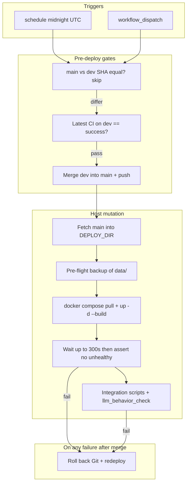

# Nightly deploy failures: root-cause analysis

This document explains why the **Nightly Deploy** workflow (`.github/workflows/nightly-deploy.yml`) has been failing on the self-hosted runner, why **Docker healthchecks** report many services as unhealthy after `docker compose up`, and which **Git / GitHub** behaviors interact badly with branch protection and merge strategies. It is intended as a handoff for follow-up work (healthcheck fixes, rollback hardening, and optional workflow policy changes).

---

## Executive summary

| Layer | What is going wrong |
|--------|----------------------|
| **Deploy gate** | After merge and `docker compose up -d --build`, the job waits up to **300s** for every container with a health definition to leave `starting`/`unhealthy`. Several checks are **incorrect or brittle** for the images and commands in use, so the gate fails even when the stack may eventually stabilize. |
| **Rollback** | Earlier rollbacks used **`git reset` + force-push** or **`git revert HEAD`**, which conflict with **protected `main`** (no force-push) or with **merge topology** (reverting the wrong commit). A follow-up fix uses **`git revert -m 1 <merge_sha>`**, but that still **fails when the merge introduces no tree change** (e.g. empty commit on `dev`): Git reports *nothing to commit*. |
| **Workflow source** | `workflow_dispatch` uses the workflow definition from the **selected branch** (often `dev`). If `dev` lags `main` on workflow changes, the runner executes an **older rollback** than you expect. |
| **Backup** | `tar` over `./data` hit **permission denied** on root-owned paths (Caddy PKI, Pi-hole, etc.). Mitigated with **`tar --ignore-failed-read`** in `scripts/backup-data.sh` so the archive step completes. |

---

## How the nightly pipeline is supposed to work



Important details:

- **`DEPLOY_DIR`** is fixed to `/home/jon/homelab` on the self-hosted runner (same machine as production Compose).
- **Merge runs in the Actions workspace checkout**, not only in `DEPLOY_DIR`; `main` on GitHub moves **before** backup / compose / health / E2E.
- **`steps.merge.conclusion == 'success'`** gates deploy steps; if merge fails, the job stops and production is unchanged.

---

## Why services fail the healthcheck step

The **Wait for healthchecks** step lists every Compose container, treats Docker health status **`healthy`** or **`none`** as pass, and fails on **`unhealthy`**. Log excerpts from a failing run (2026-04-26) show these patterns.

### 1. `cloudflared`: invalid `tunnel info` invocation

**Symptom:** `homelab-cloudflared-1` stays **unhealthy**; health log shows exit **255** and:

```text
"cloudflared tunnel info" accepts exactly one argument, the ID or name of the tunnel to get info about.
```

**Cause:** In `compose/docker-compose.network.yml`, the healthcheck is:

```yaml
test: ["CMD", "cloudflared", "tunnel", "info", "--output", "json"]
```

Current `cloudflared` CLI expects **`tunnel info <tunnel-id-or-name>`**. The tunnel identity is normally taken from **`/etc/cloudflared/config.yml`** when running `tunnel run`, but **`tunnel info` does not read that implicitly** for this invocation.

**Fix direction:** Pass the tunnel UUID/name (e.g. from env or from the credentials filename under the mounted credentials directory), or use a different probe that matches your image (e.g. metrics endpoint, or a documented no-arg readiness subcommand if available for your version).

---

### 2. `ollama`: healthcheck uses `curl` but the image has no `curl`

**Symptom:** `homelab-ollama-1` **unhealthy**; log shows:

```text
/bin/sh: 1: curl: not found
```

**Cause:** In `compose/docker-compose.llm.yml`:

```yaml
healthcheck:
  test: ["CMD-SHELL", "curl -sf http://localhost:11434/ || exit 1"]
```

The **Ollama** image is minimal and does not ship **`curl`** in the container filesystem used for health checks.

**Fix direction:** Use `wget`, a tiny static binary, or **`curl` installed in a custom image**—or hit the API with **`/bin/sh` + `/dev/tcp`** if appropriate for the shell available.

---

### 3. `dashy`: connection refused on `localhost:8082`

**Symptom:** `homelab-dashy-1` **unhealthy**; `wget: can't connect to remote host: Connection refused`.

**Cause:** Healthcheck targets **`http://localhost:8082/`** inside the container. Refused usually means the **Node process is not listening yet** (slow start, crash loop, or wrong bind). Dashy is configured with `HOST=0.0.0.0` and `PORT=8082` in compose; if the app binds late or fails config validation, the probe fails until retries exhaust.

**Fix direction:** Increase **`start_period`** and/or align the probe path with the app’s real listen path; verify mounted `conf.yml` is valid on the runner.

---

### 4. `gluetun` and the torrent / *arr cascade

**Symptom:** `homelab-gluetun-1` **unhealthy**; `qbittorrent`, `prowlarr`, `radarr`, `sonarr`, `readarr` often **unhealthy** with **empty** health log output.

**Cause:**

- **Gluetun** exposes the qBittorrent Web UI on **port 8080** inside the gluetun network namespace (`wget` healthcheck in `compose/docker-compose.media.yml`). If WireGuard env (`VPN_SERVICE_PROVIDER`, `WIREGUARD_PRIVATE_KEY`, etc.) is missing or the VPN handshake fails, gluetun never reaches a state where **8080** answers.
- **qBittorrent** uses **`network_mode: "service:gluetun"`** and depends on gluetun for DNS and routing; its healthcheck hits **`http://localhost:8080/api/v2/app/version`**. If gluetun is down, qBittorrent fails.
- ***arr** services use healthchecks that assume the app is up; during a full **`compose up`** storm, order and VPN readiness amplify failures within the **300s** window.

**Fix direction:** Treat VPN as optional in CI vs prod, or lengthen **`start_period`** for gluetun/qBittorrent, or make nightly health gate **scoped** to services required for E2E (heavier change).

---

### 5. `openclaw-gateway`: health check timeout

**Symptom:** **unhealthy** with *Health check exceeded timeout (5s)*.

**Cause:** Healthcheck runs **`node -e "fetch('http://127.0.0.1:18789/healthz')..."`** with **5s** timeout. Cold start, disk I/O, or blocked event loop can exceed 5s intermittently.

**Fix direction:** Increase **`timeout`** / **`start_period`**, or simplify the probe.

---

### 6. `torrent-health-ui`

**Symptom:** Marked **unhealthy** with **FailingStreak: 0** and empty log in some snapshots (timing / race with inspect).

**Cause:** Investigate the service’s Dockerfile **`HEALTHCHECK`** (if any) vs Compose overrides; ensure the Python UI binds and responds on the expected port before the global 300s loop ends.

---

### 7. Interaction: `docker compose up` recreates key containers

Deploy logs show **`Recreate`** for `media-agent` and **`torrent-health-ui`** while others stay **Running**. Any **recreate** resets health state; the fixed **300s** window must absorb **VPN + *arr + rebuilt images** concurrently. That is a tight budget for a full stack.

---

## Git and GitHub process flaws

### A. Protected `main` vs rollback that requires force-push

**What happened:** Rollback used:

```bash
git reset --hard "${PREV_SHA}"
git push origin main --force-with-lease
```

GitHub returned:

```text
GH006: Protected branch update failed for refs/heads/main
Cannot force-push to this branch
```

**Effect:** **Remote `main` stayed on the failed merge** while the job believed it was “rolling back.” Production `DEPLOY_DIR` could be reset locally in the step, but **GitHub’s `main` did not move back**, desynchronizing policy, tags, and “what GitHub thinks is released.”

**Lesson:** Rollback must use only operations allowed for the bot on **`main`**: typically **a new commit** (revert or restore-tree), not history rewrite.

---

### B. `git revert HEAD` after a fast-forward merge reverts the wrong commit

When `main` was **fast-forwarded** to `dev`, **`HEAD`** on the post-merge branch was not necessarily “the deploy”; **`git revert HEAD`** reverted an **arbitrary tip commit** (e.g. a docs commit), not “undo this deploy.”

**Lesson:** Rollback must target a **known SHA** recorded during the merge step (`merged_sha`, `prev_sha`), not assume **`HEAD`** semantics.

---

### C. `git revert -m 1 <merge>` when the merge changes no files

If `dev` only adds an **empty commit** (or any merge where the **resulting tree equals `main`’s first parent**), **`git revert -m 1`** can complete the replay with **no diff** and Git exits with **nothing to commit** — the revert cannot create a commit.

**Lesson:** For protected branches, a robust rollback is **`git commit-tree`** with **`-p HEAD`** and **tree = `prev^{tree}`**, producing a **forward-only** “restore tree” commit without force-push. (Document this for implementers; optional follow-up in the workflow.)

---

### D. Which workflow file runs

For **`workflow_dispatch`**, the workflow executed is taken from the **branch you dispatch on** (commonly **`dev`**). If workflow fixes land only on **`main`**, a manual nightly run from **`dev`** can still execute an **older** rollback/merge logic until **`dev` is updated**.

**Lesson:** After changing **`.github/workflows/nightly-deploy.yml`**, merge or cherry-pick those commits onto **`dev`** so the next dispatch matches expectations.

---

### E. CI gate race (`gh run list` “latest” on `dev`)

The step:

```bash
RESULT=$(gh run list --branch dev --workflow ci.yml --limit 1 --json conclusion --jq '.[0].conclusion')
```

uses the **most recently created** CI run. If nightly is triggered **immediately after a push to `dev`**, the newest run can still be **`in_progress`**, so **`conclusion` is empty** and the deploy aborts. (When the push and dispatch are staggered, you may see **success** from the *previous* run — also a race, though less visible.)

**Lesson:** Poll until the run for the current **`dev`** SHA completes, or key off **`workflow_run`** completion, or add an explicit **wait-for-CI** job.

---

## Backup step (historical)

`tar` without **`--ignore-failed-read`** exited non-zero when the runner user could not read **root-owned** paths under `./data` (Caddy PKI, Pi-hole files, etc.). That aborted the deploy **before** healthchecks and triggered rollback.

**Mitigation (in repo):** `scripts/backup-data.sh` adds **`--ignore-failed-read`** so unreadable paths are skipped and the archive still completes, with warnings in logs.

---

## E2E never runs if healthchecks fail

Integration tests (`tests/integration/*.sh`, `llm_behavior_check.py`) run **only after** the healthcheck step succeeds. So **router-smoke**, **media pipeline**, and **LLM** checks do not execute on a red health gate — they are not the first failing step in the logs you shared.

---

## Recommended remediation checklist

### Short term (stability)

| Priority | Action |
|----------|--------|
| P0 | Fix **cloudflared** healthcheck to pass tunnel id/name or use a supported probe. |
| P0 | Fix **Ollama** healthcheck to avoid **`curl`** if not in the image. |
| P0 | Ensure **rollback never relies on force-push** on protected `main`; use **revert** or **`commit-tree`** restore as appropriate; handle **no-diff merge** case. |
| P1 | Increase **`start_period` / `timeout`** for **openclaw**, **gluetun**, **dashy** if logs show slow start. |
| P1 | Align **CI wait** logic so nightly does not read **`in_progress`** as the latest conclusion. |

### Long term (design)

| Topic | Action |
|-------|--------|
| Gate scope | Consider a **smaller health surface** for nightly (services required for E2E + ingress) vs “every container.” |
| VPN | Document **required env** for gluetun on the deploy host; optional **profile** to skip VPN-dependent services in automation. |
| Branches | Keep **`dev`** workflow YAML **in sync** with **`main`** after any deploy/rollback fix. |

---

## Key file references

| Topic | Path |
|-------|------|
| Nightly workflow | `.github/workflows/nightly-deploy.yml` |
| PR / push CI | `.github/workflows/ci.yml` |
| Data backup | `scripts/backup-data.sh` |
| cloudflared, dashy | `compose/docker-compose.network.yml` |
| gluetun, qBittorrent, *arr, torrent-health-ui | `compose/docker-compose.media.yml` |
| ollama, openclaw | `compose/docker-compose.llm.yml` |
| Integration tests | `tests/integration/` |

---

## Appendix: example log signatures (for grep)

- **cloudflared:** `tunnel info" accepts exactly one argument`
- **ollama:** `curl: not found`
- **dashy:** `Connection refused` on `8082`
- **GitHub:** `GH006: Protected branch update failed` / `Cannot force-push`
- **tar:** `Cannot open: Permission denied` (mitigated with `--ignore-failed-read`)

---

*Document version: written for handoff (2026-04-26). Update this file when workflow or compose health definitions change materially.*
